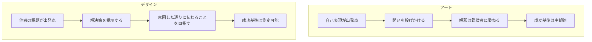
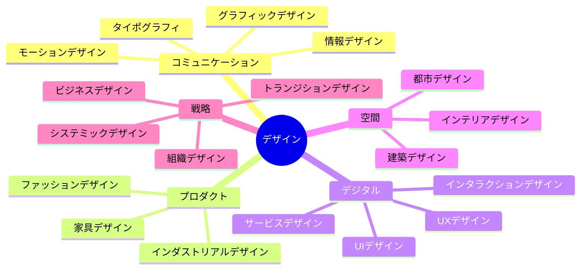
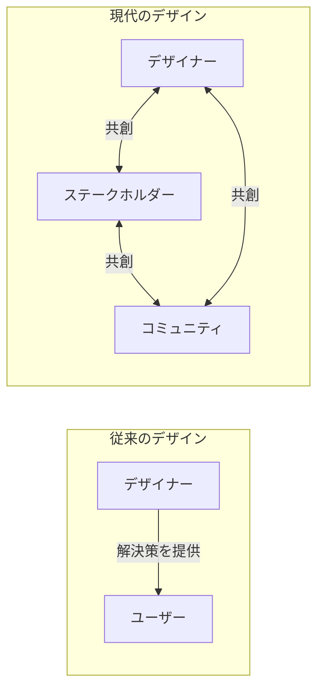

# 第1章 デザインとは何か

## はじめに

「デザイン」という言葉を聞いたとき、何を思い浮かべるだろうか。美しいポスター、洗練されたプロダクト、あるいはスマートフォンのアプリ画面だろうか。これらはすべてデザインの成果物だが、デザインの本質はそこにはない。本章では、デザインの定義がどのように進化してきたかを辿り、2026年の現在において「デザインする」とは何を意味するのかを探る。

## 1.1 デザインの定義の変遷

デザインという概念は、時代ごとに大きく姿を変えてきた。以下の表は、各時代におけるデザインの主要な定義を整理したものである。

| 時代 | 主な定義 | 代表的な論者 |
|------|----------|------------|
| 産業革命期（19世紀） | 工業製品に美的価値を付与する行為 | ウィリアム・モリス |
| モダニズム期（20世紀前半） | 形態は機能に従う――合理的な問題解決 | ル・コルビュジエ、バウハウス |
| 情報化時代（20世紀後半） | ユーザーとシステムの間のインタラクション設計 | ドナルド・ノーマン |
| 複雑性の時代（21世紀初頭） | 複雑な社会課題に対する創造的アプローチ | ティム・ブラウン |
| システム再構築の時代（2020年代） | 既存のシステムを問い直し、再設計する行為 | エツィオ・マンズィーニ |

ハーバート・サイモンは1969年の著書『システムの科学』において、デザインを「現在の状態をより好ましい状態に変えることを目指す行為」と定義した。この定義は半世紀以上を経た今でも有効だが、「より好ましい状態」の意味するところは大きく変化している。

!!! note "サイモンの定義の重要性"
    サイモンの定義が画期的だったのは、デザインを特定の職業や分野に限定せず、あらゆる「改善を志向する知的活動」として捉えた点にある。これにより、デザインは芸術の一分野から、学際的な方法論へと拡張された。

## 1.2 問題解決としてのデザインとアートの違い

デザインとアートはしばしば混同されるが、その本質は異なる。両者の違いを理解することは、デザイナーとしてのアイデンティティを確立する上で重要である。

| 観点 | デザイン | アート |
|------|---------|-------|
| **動機** | 他者の問題を解決する | 自己の内面を表現する |
| **成功の基準** | 機能性・有用性・使いやすさ | 独創性・美的価値・批評的評価 |
| **対象** | ユーザー・利用者 | 鑑賞者・自分自身 |
| **制約** | 制約の中で最適解を見つける | 制約を超越することが価値となる |
| **評価方法** | ユーザビリティテスト、KPI | 批評、展覧会、市場価値 |

ただし、この二項対立は絶対的なものではない。クリティカルデザインやスペキュラティブデザインのように、アートとデザインの境界を意図的に横断する実践も存在する。重要なのは、自分が今どちらの立場で制作しているかを自覚することである。

!!! warning "よくある誤解"
    「デザイン＝見た目を美しくすること」という認識は根強いが、これはデザインのごく一部に過ぎない。視覚的な美しさは手段であり目的ではない。情報が正しく伝わること、操作が直感的であること、システムが持続可能であること――これらすべてがデザインの射程に含まれる。

## 1.3 デザイン分野の全体像

現代のデザインは、多様な専門分野に分化している。それぞれの分野は独自の方法論を持ちながらも、根底にある「人間のためにより良い状態を設計する」という思想を共有している。

注目すべきは、デザインの射程が「モノ」から「コト」へ、そして「システム」へと拡大してきたことである。グラフィックやプロダクトといった有形の成果物を扱う分野から、体験や仕組みといった無形の対象を扱う分野が急速に成長している。

## 1.4 2026年のコンテキスト：システム再構築としてのデザイン

2026年の現在、デザインは新たな転換点を迎えている。AIの急速な進化、気候変動の深刻化、社会的分断の拡大――これらの課題に対して、個別のプロダクトやサービスを設計するだけでは不十分であることが明白になった。

現代のデザイナーに求められているのは、**既存のシステムそのものを問い直し、再構築する力**である。

!!! example "システム再構築の具体例"
    食品ロスを減らすアプリを設計することは「プロダクトデザイン」だが、食品の生産・流通・消費・廃棄のシステム全体を見直し、ロスが構造的に発生しにくい仕組みをデザインすることは「システミックデザイン」である。後者こそが、2026年のデザイナーに期待される役割である。

この変化を駆動している要因は以下の通りである。

**AIとの協働の常態化** — 生成AIの普及により、ビジュアル制作やコーディングといったスキルの価値が相対的に低下した。デザイナーの付加価値は「何をつくるか」ではなく「なぜつくるか」「何をつくるべきか」という問いの設定にシフトしている。

**複合的危機への対応** — 気候変動、パンデミック、地政学リスクが同時進行する中、単一の課題を解決するデザインではなく、複数の課題を横断的に扱えるシステム思考が求められている。

**当事者参加型デザインの拡大** — 「デザイナーが解決策を提供する」という一方向的なモデルから、「影響を受ける人々と共に設計する」という参加型モデルへの転換が加速している。

## 1.5 デザイナーのマインドセット

分野や時代を超えて、優れたデザイナーに共通するマインドセットがある。

1. **曖昧さへの耐性** — 明確な答えがない状況でも前に進む力。デザインプロセスの初期段階では、問題の定義すら曖昧であることが多い。
2. **共感と観察** — 自分の仮説ではなく、人々の実際の行動や感情に基づいて判断する姿勢。
3. **反復と実験** — 最初から完璧を目指すのではなく、プロトタイプを通じて学び、改善を繰り返すアプローチ。
4. **統合的思考** — 矛盾する要素を二者択一で処理するのではなく、より高い次元で統合する能力。
5. **批判的楽観主義** — 現状を批判的に分析しながらも、より良い未来を構想できるという信念を持つこと。

!!! tip "実践のヒント"
    マインドセットは一朝一夕で身につくものではない。日常の中で「なぜこのデザインはこうなっているのか」と問い続けることから始めてほしい。通勤途中の看板、使っているアプリのUI、オフィスの動線――すべてが学びの材料になる。

## 本章のまとめ

- デザインの定義は「装飾」から「問題解決」を経て「システム再構築」へと進化した
- デザインとアートは目的・評価基準・対象において本質的に異なる
- 現代のデザイン分野は「モノ」から「コト」そして「システム」へと射程を拡大している
- 2026年のデザイナーには、AIとの協働、複合的危機への対応、参加型アプローチが求められる

---

## 演習問題

### 演習1：デザインの再定義（個人ワーク・30分）

自分自身の言葉で「デザインとは何か」を200字以内で定義せよ。その定義が本章で紹介したどの時代の考え方に最も近いかを分析し、なぜそう考えるかを説明せよ。

### 演習2：デザインとアートの境界（グループディスカッション・45分）

以下の事例について、「デザイン」と「アート」のどちらに分類されるかをグループで議論せよ。分類が困難なものについては、なぜ困難なのかを考察せよ。

- スマートフォンのホーム画面
- 駅の案内サイン
- インスタレーション作品
- 環境問題を訴えるポスター
- AIが生成した画像

### 演習3：身近なシステムの分析（個人ワーク・60分）

自分が日常的に利用しているシステム（例：大学の履修登録、スーパーの買い物体験、通勤経路）を一つ選び、以下を分析せよ。

1. そのシステムに関わるステークホルダーをすべて列挙する
2. 現在のシステムの課題を3つ以上特定する
3. 「プロダクトレベル」と「システムレベル」の改善案をそれぞれ1つずつ提案する
