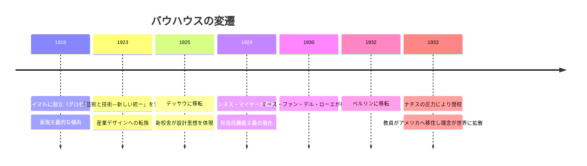
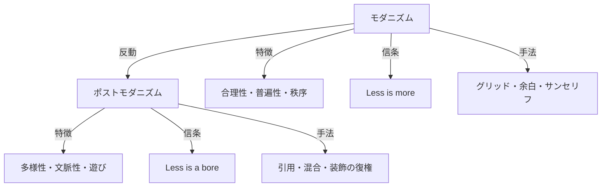

# 第2章 デザインの歴史と進化

## はじめに

デザインの歴史を学ぶことは、単なる教養ではない。過去のデザイナーたちがどのような社会的文脈の中で何を問い、何を生み出してきたかを知ることで、現在の自分たちの実践を相対化し、未来を構想する力を養うことができる。本章では、近代デザインの起源からシステミックデザインの台頭まで、約150年の歴史を概観する。

## 2.1 近代デザインの夜明け：アーツ・アンド・クラフツ運動

19世紀後半、産業革命による大量生産は生活を便利にする一方で、粗悪な製品を大量に生み出した。この状況に異を唱えたのがウィリアム・モリスである。モリスは手仕事の価値を再評価し、「生活の中の美」を追求するアーツ・アンド・クラフツ運動を牽引した。

この運動は、工業と芸術の関係という問いを初めて明確に提起した点で、近代デザインの起点といえる。しかし、手工芸への回帰は大量生産社会の現実とは相容れず、美しい製品は富裕層のものにとどまるという矛盾を抱えていた。

!!! note "日本への影響"
    アーツ・アンド・クラフツ運動は日本の民藝運動にも影響を与えた。柳宗悦が提唱した「用の美」——日常の道具に宿る美——は、モリスの理念と深く共鳴するものである。

## 2.2 バウハウス：デザイン教育の原型

1919年、ヴァルター・グロピウスがドイツのヴァイマルに設立したバウハウスは、デザイン教育の原型を築いた。バウハウスの革新は以下の点にある。

| 革新 | 内容 |
|------|------|
| **芸術と技術の統合** | 絵画・彫刻・建築・工芸を横断的に学ぶカリキュラム |
| **基礎教育の体系化** | ヨハネス・イッテンの予備課程（形態・色彩・素材の基礎） |
| **産業との連携** | 大量生産に適した美しい製品を目指す姿勢 |
| **学際的アプローチ** | カンディンスキー、クレー、モホイ＝ナジなど多分野の教授陣 |

バウハウスは14年間で閉校を余儀なくされたが、その教員たちがアメリカをはじめ世界各地に散り、デザイン教育と実践に決定的な影響を与えた。モホイ＝ナジのシカゴ・インスティテュート・オブ・デザイン、ミースのイリノイ工科大学は、バウハウスの理念を直接受け継いだ教育機関である。

## 2.3 モダニズム：「良いデザイン」の追求

20世紀中盤、モダニズムデザインは「形態は機能に従う（Form follows function）」を信条に、装飾を排した合理的なデザインを推進した。

**主要な特徴：**

- グリッドシステムによる秩序ある構成
- サンセリフ書体（ヘルベチカ、ユニバースなど）の普及
- 余白の積極的な活用
- 国際的に通用する視覚言語の追求（国際タイポグラフィ様式）

!!! example "モダニズムの代表例"
    ディーター・ラムスがブラウン社でデザインした製品群は、モダニズムの理想を体現している。ラムスの「良いデザインの10原則」は、半世紀以上を経た今でもデザイナーの指針として参照される。その第一原則「良いデザインは革新的である」は、装飾ではなく本質的な価値の創造を求めるものだ。

モダニズムは「普遍的な良いデザイン」の存在を信じた。しかし、その普遍性の主張は、実際には西洋・男性・中産階級の価値観を暗黙の前提としており、多様な文化や立場を見落としているという批判を受けることになる。

## 2.4 ポストモダニズム：多様性と批判

1960年代から、モダニズムの合理主義と普遍主義に対する反動が生まれた。ロバート・ヴェンチューリは『ラスベガス』（1972年）で、大衆文化の視覚表現を肯定的に分析し、エリート主義的なモダニズムに異議を唱えた。

**ポストモダニズムの主要な貢献：**

1. **文脈の重要性** — デザインは文化的・社会的文脈から切り離せないという認識
2. **多元主義** — 唯一の「正しいデザイン」は存在しないという立場
3. **意味の複層性** — デザインが機能だけでなく、象徴的な意味を伝えることの再評価
4. **参加と民主化** — デザインの決定権をデザイナーだけが持つことへの疑問

メンフィス・グループ（エットレ・ソットサス）やクランブルック・アカデミーの実験は、デザインの表現の幅を大きく拡張した。ただし、ポストモダニズムには「何でもあり」に陥り、デザインの社会的責任を曖昧にするリスクもあった。

## 2.5 デジタル革命とインタラクションデザイン

1980年代以降のパーソナルコンピュータの普及、そして1990年代のインターネットの登場は、デザインの領域を根本的に変えた。

| 時期 | 出来事 | デザインへの影響 |
|------|--------|--------------|
| 1984 | Macintosh発売 | GUIデザインの始まり、DTPの誕生 |
| 1990年代 | World Wide Webの普及 | Webデザインという新分野の誕生 |
| 2007 | iPhone発売 | モバイルファースト、タッチインタラクション |
| 2010年代 | UXデザインの確立 | 体験全体を設計対象とする思想の主流化 |
| 2020年代 | AI・生成モデルの普及 | デザインプロセス自体の変容 |

デジタル革命がデザインにもたらした最大の変化は、**デザインの対象が「完成品」から「プロセス」に移行した**ことである。印刷物や製品はリリース後に変更できないが、デジタルプロダクトは継続的に改善できる。この特性が、アジャイル開発やリーンUXといった反復的デザインプロセスを生み出した。

!!! tip "デジタルデザインの転換点"
    ドナルド・ノーマンの『誰のためのデザイン？』（1988年）は、認知科学の知見をデザインに適用し、「ユーザーが間違えるのはユーザーのせいではなく、デザインのせいである」という考え方を広めた。この発想の転換は、ユーザー中心設計（UCD）の基盤となった。

## 2.6 現在の潮流：システミックデザインへ

2020年代、デザインの歴史は新たな章を迎えている。個別のプロダクトやサービスではなく、社会システム全体を対象とするアプローチが台頭している。

**トランジションデザイン** — カーネギーメロン大学のテリー・アーウィンらが提唱する、持続可能な社会への長期的な移行を支援するデザインアプローチ。過去のデザインの知恵と未来のビジョンを統合することを目指す。

**プルーラリバースデザイン** — 多元的な世界観の共存を前提とし、単一の解決策ではなく、多様な可能性を開くデザイン。オードリー・タンらが実践するデジタル民主主義もこの文脈に位置づけられる。

**リジェネラティブデザイン** — 「害を減らす」を超えて「自然と社会を積極的に再生する」ことを目指すデザイン。サステナビリティの次のステージとして注目される。

## 2.7 歴史から学ぶこと

デザイン史を振り返って見えてくるのは、以下のパターンである。

1. **テーゼとアンチテーゼの繰り返し** — モダニズムの合理主義がポストモダニズムの多元主義を生み、その反省がさらに新たな統合を生む。
2. **技術と社会の共進化** — 新しい技術（印刷、写真、コンピュータ、AI）は常にデザインの可能性と問いを更新してきた。
3. **射程の拡大** — デザインの対象は一貫して拡大し続けている。モノからコト、コトからシステムへ。
4. **民主化の進展** — デザインの担い手と受益者が段階的に広がってきている。

!!! warning "歴史の偏り"
    ここで述べたデザイン史は主に西洋の系譜である。アジア、アフリカ、南米のデザイン伝統はそれぞれ固有の豊かな歴史を持つ。グローバルなデザイナーとして、西洋中心の歴史観を相対化する視点が不可欠である。

## 本章のまとめ

- アーツ・アンド・クラフツ運動が工業と芸術の関係を初めて問題化した
- バウハウスは学際的デザイン教育の原型を築き、その影響は今日まで続く
- モダニズムは合理的で普遍的なデザインを追求したが、ポストモダニズムはその限界を指摘した
- デジタル革命はデザインの対象を「完成品」から「継続的なプロセス」に転換した
- 現在のデザインはシステム全体の再構築と長期的な社会移行を視野に入れている

---

## 演習問題

### 演習1：デザイン年表の作成（個人ワーク・60分）

本章で扱った出来事に加え、自分が重要だと考えるデザイン史の出来事を5つ以上追加し、オリジナルの年表を作成せよ。各項目について「なぜ重要か」を一文で添えること。

### 演習2：モダニズム vs ポストモダニズムの分析（グループワーク・45分）

身の回りのデザイン事例を5つ集め、それぞれがモダニズム的かポストモダニズム的かを分析せよ。両方の特徴を併せ持つものについては、どの要素がどちらに属するかを具体的に指摘すること。

### 演習3：非西洋デザイン史のリサーチ（個人ワーク・90分）

日本、中国、インド、アフリカ、南米のいずれかの地域を選び、その地域固有のデザイン伝統について調査せよ。以下の点を含めること。

1. その地域の代表的なデザイン運動または伝統（最低2つ）
2. 西洋のデザイン史との類似点と相違点
3. 現代のデザインに対する示唆

### 演習4：未来の歴史を書く（個人ワーク・45分）

2026年から2050年までのデザイン史を「未来の教科書」として書いてみよ。本章で学んだ歴史のパターン（テーゼとアンチテーゼ、技術との共進化、射程の拡大、民主化）を踏まえ、今後のデザインがどのような方向に進むかを予測すること。
