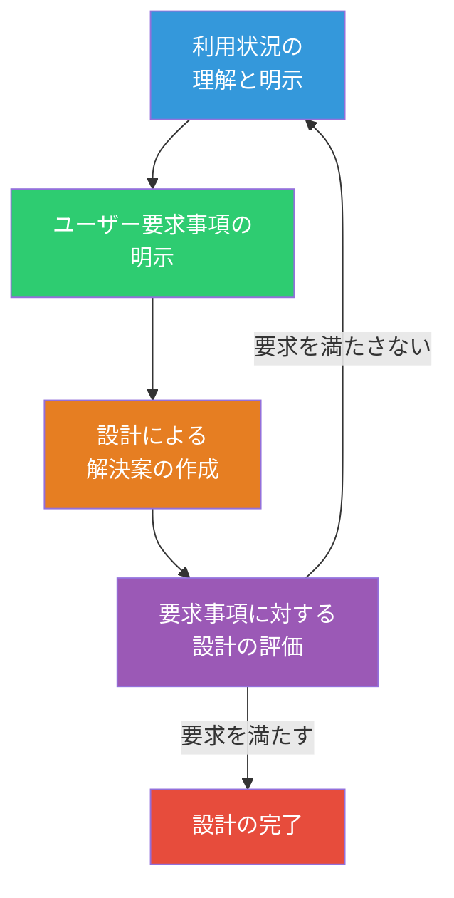
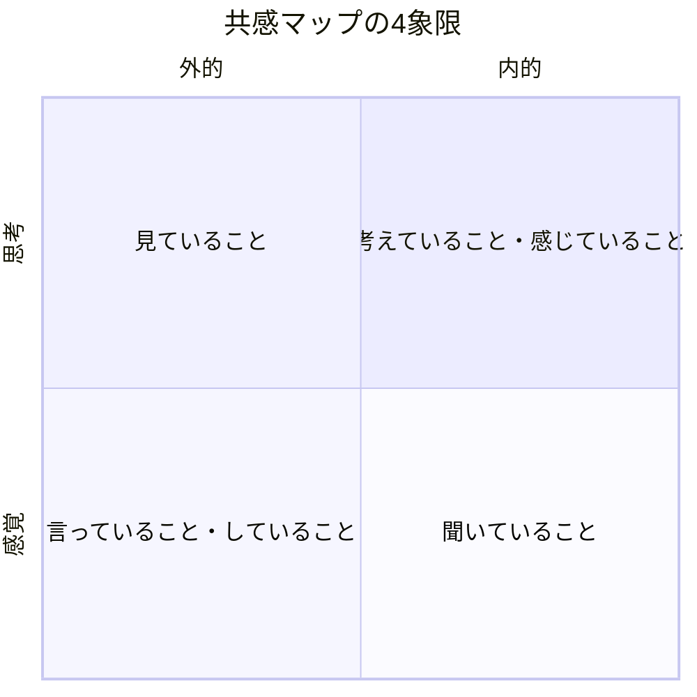
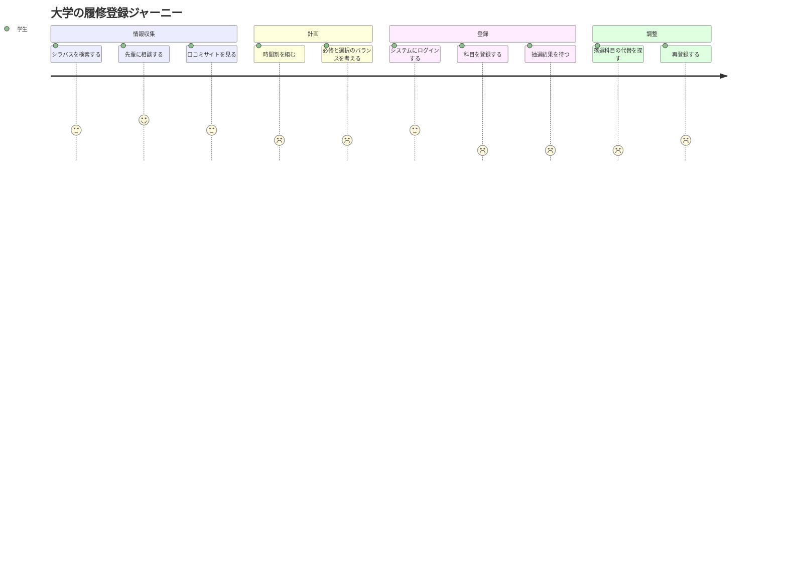
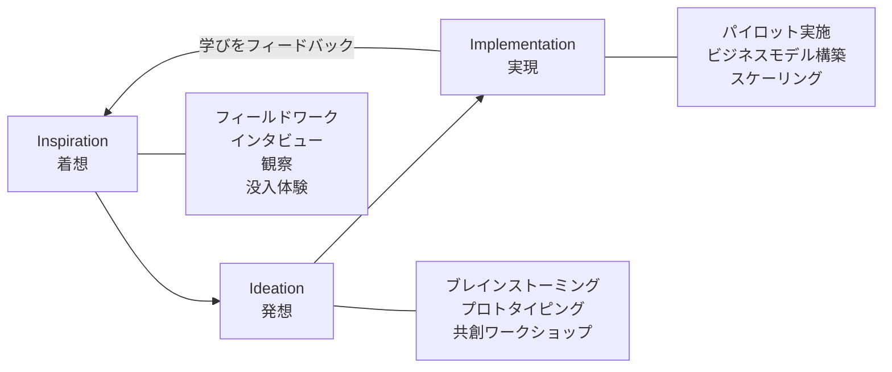

# 第3章 人間中心設計

## はじめに

人間中心設計（Human-Centered Design、以下HCD）は、デザインプロセスのあらゆる段階において、人間のニーズ、行動、限界を中心に据えるアプローチである。「技術的に可能だから」「ビジネス的に有利だから」ではなく、「人にとって本当に意味があるか」を起点に考える。本章では、HCDの原則と主要な手法を体系的に学ぶ。

## 3.1 人間中心設計の原則

ISO 9241-210は、HCDの国際規格として以下の原則を定めている。

1. **利用状況の明確な理解に基づく設計** — ユーザーが誰で、どのような状況で使うかを把握する
2. **設計と開発全体へのユーザーの積極的関与** — ユーザーを情報源としてだけでなく、設計の参加者として巻き込む
3. **ユーザー中心の評価による設計の推進と洗練** — デザイナーの直感ではなく、ユーザーからのフィードバックで設計を改善する
4. **プロセスの反復** — 一度で完璧を目指すのではなく、繰り返し改善する
5. **ユーザー体験全体への配慮** — 使用前・使用中・使用後の体験全体を設計対象とする
6. **学際的なチーム構成** — 多様な専門性を持つメンバーで取り組む

!!! note "HCDとUCDの違い"
    ユーザー中心設計（UCD）はデジタルプロダクトの文脈で使われることが多いのに対し、HCDはより広範な社会課題やサービス設計にも適用される。本書では、両者を包括する概念としてHCDを用いる。

## 3.2 共感マッピング

共感マップ（Empathy Map）は、ユーザーの内面世界を構造化して理解するためのツールである。ユーザーインタビューや観察の結果を整理し、チーム内で共有するために用いる。

共感マップの4つの象限に加え、以下の2つの要素を追加することが推奨される。

| 要素 | 記入内容 |
|------|---------|
| **見ていること（See）** | ユーザーの環境、周囲の人々の行動、市場の情報 |
| **聞いていること（Hear）** | 友人・同僚・メディアからの影響 |
| **考え・感じていること（Think & Feel）** | 本当の関心事、不安、喜び |
| **言い・行動していること（Say & Do）** | 公の場での態度、外に表れる行動 |
| **ペインポイント（Pains）** | フラストレーション、恐れ、障害 |
| **ゲイン（Gains）** | 望んでいること、成功の基準、ニーズ |

!!! tip "共感マップ作成のコツ"
    共感マップは推測で埋めるものではない。必ず実際のユーザーリサーチ（インタビュー、観察）のデータに基づいて作成すること。「〇〇だろう」という推測と「インタビューで〇〇と言っていた」という事実を明確に区別すること。

## 3.3 ユーザーリサーチの基本手法

HCDにおけるリサーチは、ユーザーを深く理解するための活動である。主要な手法を以下に整理する。

### インタビュー

半構造化インタビューが最も汎用的な手法である。質問リストを用意しつつ、会話の流れに応じて柔軟に深掘りする。

**効果的なインタビューの原則：**

- **オープンクエスチョン**を使う（「はい/いいえ」で終わらない質問）
- **「なぜ」を5回繰り返す**ことで表面的な回答の背後にある動機を探る
- **沈黙を恐れない** — 相手が考える時間を与える
- **誘導しない** — 「使いにくいと思いませんか？」ではなく「使ってみてどうでしたか？」

### 観察（シャドウイング）

ユーザーの実際の行動を観察する手法。言語化されないニーズ（潜在ニーズ）を発見するのに有効である。

### ダイアリースタディ

一定期間、ユーザーに日記をつけてもらう手法。時間の経過に伴う体験の変化を捉えることができる。

| 手法 | 所要時間 | 対象人数 | 発見できるもの |
|------|---------|---------|--------------|
| インタビュー | 1-2時間/人 | 5-15人 | 動機・価値観・感情 |
| シャドウイング | 2-8時間/人 | 3-8人 | 実際の行動・潜在ニーズ |
| ダイアリースタディ | 1-4週間 | 10-30人 | 時間経過に伴う変化 |
| サーベイ | 設計に数日 | 100人以上 | 傾向・分布・優先度 |

## 3.4 ペルソナの作成

ペルソナは、リサーチデータを基に作成する架空のユーザー像である。チーム全員が同じユーザー像を共有するためのコミュニケーションツールとして機能する。

### ペルソナに含める要素

1. **基本情報** — 名前、年齢、職業、家族構成（リアリティを持たせるための最小限の情報）
2. **目標（Goals）** — そのプロダクト/サービスを通じて達成したいこと
3. **フラストレーション** — 現在の課題や不満
4. **行動パターン** — 典型的な一日の過ごし方、情報収集の方法
5. **引用文** — その人物が実際に言いそうな一言（リサーチデータからの引用が理想）
6. **テクノロジーとの関係** — デジタルリテラシー、利用しているツール

!!! warning "ペルソナのアンチパターン"
    ペルソナは以下の場合に形骸化する。

    - **リサーチなしに作成する** — チームの思い込みを強化するだけになる
    - **ステレオタイプに依存する** — 年齢・性別による先入観を固定化してしまう
    - **作って終わり** — 壁に貼るだけで意思決定に活用しない
    - **多すぎる** — 3〜5人に絞ることで焦点を保つ

## 3.5 カスタマージャーニーマッピング

カスタマージャーニーマップ（CJM）は、ユーザーがサービスやプロダクトと関わる一連の体験を時系列で可視化するツールである。

CJMの構成要素は以下の通りである。

| 要素 | 説明 |
|------|------|
| **フェーズ** | 体験の大きな区分（認知→検討→利用→継続など） |
| **行動** | 各フェーズでユーザーが行うこと |
| **思考・感情** | 各時点でのユーザーの考えや気持ち |
| **タッチポイント** | ユーザーとサービスの接点（Web、店舗、電話など） |
| **ペインポイント** | ユーザーが困難や不満を感じる瞬間 |
| **機会** | 改善の可能性がある箇所 |

## 3.6 IDEOのHCDフレームワーク

デザインファームIDEOは、HCDを3つのフェーズで実践するフレームワークを提唱している。

**着想（Inspiration）** — 人々の生活に入り込み、深い理解を得る段階。エンドユーザーだけでなく、エクストリームユーザー（極端な利用者）にも注目する。

**発想（Ideation）** — 得られた洞察を基に、大量のアイデアを生成し、プロトタイプで検証する段階。「量が質を生む」がこの段階の信条である。

**実現（Implementation）** — アイデアを現実のプロダクトやサービスとして社会に届ける段階。ビジネスモデルの構築と持続可能な運営体制の設計を含む。

!!! example "IDEOの実践例"
    IDEOがショッピングカートの再設計に取り組んだプロジェクト（ABCナイトライン、1999年放映）は、HCDプロセスの古典的な事例である。わずか5日間で、ユーザー観察から始まり、プロトタイプの製作と検証を経て、革新的なカートのデザインに至った。このプロジェクトは、HCDが「時間がかかる」という誤解を覆すものでもあった。

## 3.7 HCDの限界と拡張

HCDは強力なアプローチだが、万能ではない。以下の限界を認識しておく必要がある。

1. **現在のユーザーに偏る** — 既存ユーザーの声に基づくため、まだ存在しない市場やラディカルなイノベーションには向かない場合がある
2. **個人に焦点化しすぎる** — 社会構造やシステムの問題を個人の問題に矮小化するリスク
3. **権力の非対称性** — 「デザイナーがユーザーのために設計する」という構図自体が権力関係を含む
4. **スケールの問題** — 深いリサーチは時間とコストがかかるため、すべてのプロジェクトで実施できるわけではない

これらの限界を克服するために、参加型デザイン（Participatory Design）やコミュニティ主導型デザインといった発展的アプローチが模索されている。

## 本章のまとめ

- HCDはISO規格として体系化された、人間を中心に据えた設計アプローチである
- 共感マップはユーザーの内面を構造的に理解するツールである
- ペルソナはリサーチデータに基づいて作成し、チームのコミュニケーションツールとして活用する
- カスタマージャーニーマップはユーザー体験の全体像を時系列で可視化する
- IDEOのフレームワーク（着想→発想→実現）は、HCDの実践的なプロセスモデルである
- HCDには限界があり、参加型デザインなどの拡張が進んでいる

---

## 演習問題

### 演習1：共感マップの作成（ペアワーク・60分）

パートナーに「最近困っていること」をテーマに15分間のインタビューを行い、その結果を共感マップにまとめよ。推測と事実を色分けして記入すること。

### 演習2：ペルソナの作成（グループワーク・90分）

大学の食堂を利用する学生について、グループメンバー全員にインタビュー（各10分）を行い、その結果を基に2つのペルソナを作成せよ。作成後、そのペルソナにとっての食堂の理想的な体験を議論すること。

### 演習3：ジャーニーマップの作成（個人ワーク・60分）

自分が日常的に利用しているサービス（例：コンビニ、図書館、配車アプリ）について、利用開始から終了までのジャーニーマップを作成せよ。各タッチポイントにおける感情の変化を5段階で評価し、最もペインポイントが大きい箇所に対する改善案を3つ提案すること。

### 演習4：HCDの限界を考える（グループディスカッション・30分）

「人間中心設計は人間以外（動物、環境、未来世代）を軽視するのではないか」というテーゼについてグループで議論せよ。HCDの枠組みを維持しながら、この批判に応えるにはどうすればよいかを提案すること。
