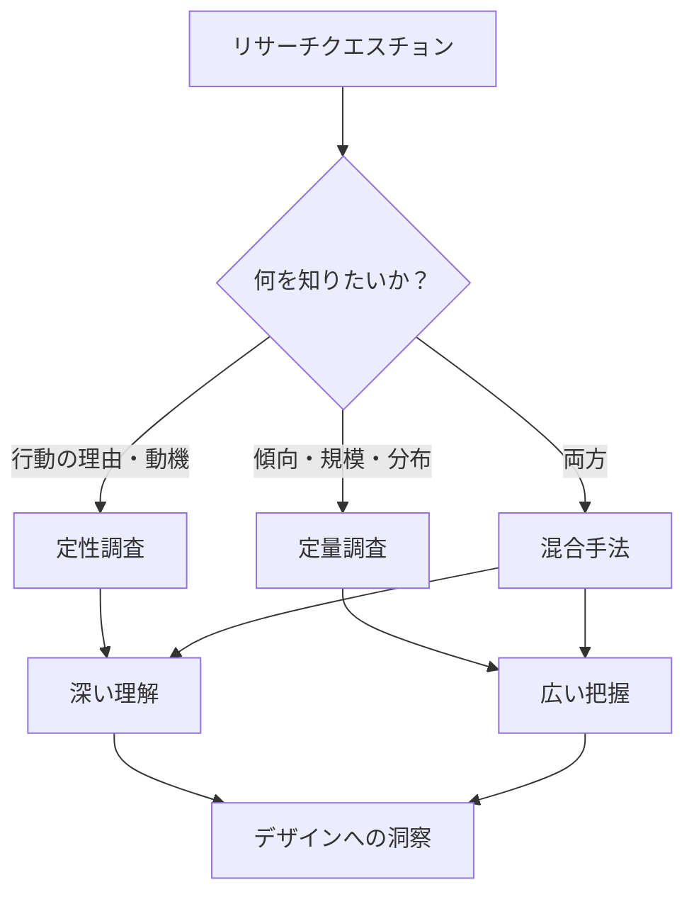
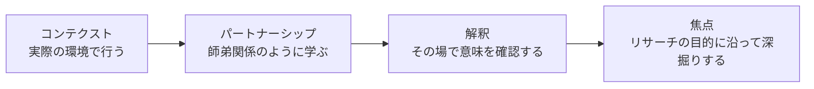

# 第4章 デザインリサーチ手法

## はじめに

優れたデザインは優れたリサーチから生まれる。デザインリサーチとは、デザインの意思決定に必要な知識を体系的に獲得する活動である。前章で学んだHCDの原則を実践するための具体的な手法を、本章では深く掘り下げる。「何を調べるべきか」を見極める力と、「どう調べるか」の引き出しを増やすことが本章の目標である。

## 4.1 定性調査と定量調査

デザインリサーチの手法は、大きく定性調査と定量調査に分類される。両者は対立するものではなく、補完的に用いるものである。

| 観点 | 定性調査 | 定量調査 |
|------|---------|---------|
| **目的** | 「なぜ」「どのように」を理解する | 「どのくらい」「何が」を測定する |
| **データ** | 言葉、行動、文脈 | 数値、統計 |
| **対象人数** | 少数（5〜30人） | 多数（100人以上） |
| **分析方法** | テーマ分析、親和図法 | 統計分析、クロス集計 |
| **強み** | 深い洞察、予想外の発見 | 一般化可能性、客観性 |
| **弱み** | 一般化が困難 | 文脈や動機の理解が浅い |
| **活用場面** | 探索的段階、問題の発見 | 検証的段階、意思決定の裏付け |

!!! tip "「5人でユーザビリティ問題の85%が見つかる」"
    ヤコブ・ニールセンの有名な知見によれば、ユーザビリティテストでは5人のテスト参加者で問題の約85%を発見できる。定性調査は少人数でも十分な成果を得られる場合が多い。ただし、これはユーザビリティテストに限定した知見であり、すべての定性調査に当てはまるわけではない。

## 4.2 エスノグラフィ

エスノグラフィ（民族誌的調査）は、人類学に起源を持つ調査手法であり、人々の生活世界に入り込み、その文化や行動を深く理解することを目指す。デザインリサーチに応用されたエスノグラフィは、従来のインタビューでは見えてこない潜在的なニーズや文化的な文脈を明らかにする。

### デザインエスノグラフィの特徴

**長期的な関与** — 単発のインタビューではなく、数日から数週間にわたってフィールドに入る。ただし、デザインプロジェクトの制約内では「ラピッドエスノグラフィ」として3〜5日間の集中的なフィールドワークを行うことも多い。

**参与観察** — 対象者の活動に実際に参加しながら観察する。食事のデザインリサーチであれば、対象者と一緒に買い物をし、料理をし、食卓を囲む。

**厚い記述** — クリフォード・ギアツの概念を借りれば、行動の表面だけでなく、その背後にある意味や文脈まで記述する。

!!! example "エスノグラフィの実践例"
    インテルのリサーチチームは、発展途上国の家庭にエスノグラファーを派遣し、テクノロジーが日常生活にどう組み込まれているかを調査した。その結果、「電力供給が不安定な環境」「複数世代が一台のデバイスを共有する状況」など、シリコンバレーのオフィスからは想像もつかない利用文脈が明らかになり、製品設計に決定的な影響を与えた。

### フィールドノートの書き方

フィールドノートはエスノグラフィの基本ツールである。以下の区分を意識して記録する。

| 区分 | 内容 | 例 |
|------|------|-----|
| **観察メモ** | 見たこと・聞いたことの事実記述 | 「母親は冷蔵庫を開ける前にスマホのメモを確認した」 |
| **方法メモ** | 調査方法に関する振り返り | 「子どもがいると会話が中断されやすい。次回は別室で」 |
| **理論メモ** | 浮かんだ解釈・仮説 | 「買い物リストのデジタル化は管理の問題ではなく家族間コミュニケーションの問題かもしれない」 |

## 4.3 コンテクスチュアル・インクワイアリー

コンテクスチュアル・インクワイアリー（CI）は、ヒュー・ベイヤーとカレン・ホルツブラットが開発した手法で、ユーザーの実際の作業環境で行うインタビューと観察を組み合わせたものである。

### CIの4つの原則

1. **コンテクスト（Context）** — 会議室ではなく、ユーザーの実際の作業環境で調査する。環境そのものが重要な情報源である。
2. **パートナーシップ（Partnership）** — 調査者とユーザーは師弟関係のようになる。ユーザーが「師」で、調査者が「弟子」として教わる姿勢をとる。
3. **解釈（Interpretation）** — 観察した行動について、その場で意味を確認する。「今、〇〇しましたが、それはなぜですか？」と即座に問う。
4. **焦点（Focus）** — リサーチクエスチョンに関連する行動に焦点を当てる。すべてを記録しようとせず、目的に沿って深掘りする。

### CIセッションの流れ

| フェーズ | 時間 | 内容 |
|---------|------|------|
| 導入 | 10分 | 調査の目的説明、同意の取得 |
| 概要の聞き取り | 15分 | 全体的な作業の流れを聞く |
| 観察と対話 | 60-90分 | 実際の作業を見ながら質問する |
| まとめ | 15分 | 重要な発見を共有し確認する |

!!! warning "CIの注意点"
    CIは個人の作業を深く理解するのに優れるが、組織やシステム全体のダイナミクスを捉えるには複数のセッションと統合的な分析が必要である。また、観察されていることで行動が変わる「ホーソン効果」に注意すること。

## 4.4 共創ワークショップ（Co-Design）

共創ワークショップは、ユーザーやステークホルダーをデザインプロセスに直接参加させ、共にアイデアを生み出す手法である。北欧の参加型デザインの伝統に根差している。

### ワークショップ設計の要素

**参加者の構成** — 多様な立場の人を5〜8名集める。エンドユーザー、サービス提供者、管理者、技術者など、異なる視点を持つ人が含まれることが重要。

**ジェネレーティブツール** — 参加者がアイデアを表現するための道具。以下のようなものを用意する。

- **コラージュキット** — 雑誌の切り抜き、シール、カラーペンなど
- **レゴ・シリアスプレイ** — ブロックを使ってメタファーとして考えを表現
- **カードソーティング** — 情報の分類や優先順位付けをカードで行う
- **ストーリーボーディング** — 理想の体験を漫画形式で描く

```mermaid
gantt
    title 共創ワークショップのタイムライン（3時間）
    dateFormat HH:mm
    axisFormat %H:%M
    section 準備
        アイスブレイク           :a1, 09:00, 15m
        目的と課題の共有         :a2, after a1, 15m
    section 発散
        個人ワーク（理想の体験を描く）  :b1, after a2, 30m
        グループ共有              :b2, after b1, 20m
    section 休憩
        休憩                     :c1, after b2, 10m
    section 統合
        テーマの抽出              :d1, after c1, 20m
        プロトタイプ制作           :d2, after d1, 40m
    section 共有
        発表とフィードバック       :e1, after d2, 25m
        振り返り                 :e2, after e1, 15m
```

!!! tip "ファシリテーションの鍵"
    共創ワークショップの成否はファシリテーションにかかっている。最も重要なのは「心理的安全性」の確保である。参加者全員が自由に発言できる雰囲気を作るために、以下を意識する。

    - 「正解はない」と冒頭で明言する
    - 発言量が偏らないよう、付箋を使った個人ワークを先に行う
    - 批判を禁止するルールを設定する（アイデア出しの段階では）
    - 専門用語を避け、平易な言葉を使う

## 4.5 データ分析：リサーチからインサイトへ

収集したデータは、分析して初めてデザインに活かせる。デザインリサーチにおける分析の目的は、統計的な厳密さよりも、デザインの方向性を示す「インサイト（洞察）」を得ることにある。

### 親和図法（KJ法）

川喜田二郎が開発した親和図法（KJ法）は、デザインリサーチのデータ分析において最も広く使われる手法の一つである。

**手順：**

1. **データの断片化** — インタビューの発言や観察メモを個別の付箋に書き出す（1付箋1情報）
2. **グルーピング** — 意味的に近い付箋をグループにまとめる（ボトムアップで分類）
3. **ラベリング** — 各グループに見出しをつける
4. **構造化** — グループ間の関係（因果、対立、補完など）を図示する
5. **インサイトの抽出** — 構造から読み取れる洞察を言語化する

### インサイトの書き方

良いインサイトは以下の特徴を持つ。

| 特徴 | 悪い例 | 良い例 |
|------|--------|--------|
| **具体的** | 「ユーザーは不満を感じている」 | 「ユーザーは登録手続きの3画面目で離脱する」 |
| **行動に結びつく** | 「若者はSNSをよく使う」 | 「若者は商品購入前にSNSで実際の使用感を確認し、公式情報より信頼している」 |
| **意外性がある** | 「安い商品が好まれる」 | 「ユーザーは価格より"選ぶ手間の少なさ"を重視している」 |

!!! note "分析の落とし穴"
    確証バイアス（自分の仮説を裏付ける情報だけを拾う傾向）に注意すること。意図的に「自分の仮説と矛盾するデータ」を探す姿勢が重要である。また、少数の印象的なエピソードに引きずられて全体像を見失わないよう、データの量と質のバランスを意識すること。

## 4.6 リサーチ計画の立て方

デザインリサーチは、計画なしに始めても成果を得にくい。以下のフレームワークでリサーチ計画を立てることを推奨する。

| 項目 | 内容 |
|------|------|
| **リサーチクエスチョン** | 何を明らかにしたいか（最大3つに絞る） |
| **手法の選択** | どの手法が最も適切か（複数の組み合わせも検討） |
| **参加者のリクルーティング** | 誰に協力してもらうか、何人必要か |
| **スケジュール** | いつ、どのくらいの期間で行うか |
| **倫理的配慮** | 同意の取得、個人情報の保護、謝礼 |
| **成果物** | リサーチの結果をどのような形式でまとめるか |

## 本章のまとめ

- 定性調査と定量調査は補完的に用い、プロジェクトの段階に応じて使い分ける
- エスノグラフィは潜在ニーズの発見に強力な手法であり、参与観察と厚い記述が特徴である
- コンテクスチュアル・インクワイアリーはユーザーの実環境で行う観察とインタビューの統合手法である
- 共創ワークショップは多様なステークホルダーをデザインプロセスに巻き込む参加型アプローチである
- データ分析の目的はインサイト（洞察）の抽出であり、親和図法はその代表的な手法である

---

## 演習問題

### 演習1：リサーチ計画の策定（個人ワーク・45分）

「大学生のオンライン学習体験を改善する」というテーマで、デザインリサーチの計画を策定せよ。リサーチクエスチョン、手法の選択とその理由、対象者、スケジュール、倫理的配慮を含めること。

### 演習2：ミニ・コンテクスチュアル・インクワイアリー（ペアワーク・60分）

パートナーの「スマートフォンでの情報検索」を対象に、15分間のコンテクスチュアル・インクワイアリーを実施せよ。CIの4原則を意識し、実施後にフィールドノートをまとめること。

### 演習3：親和図法によるデータ分析（グループワーク・90分）

「大学キャンパスでの食事体験」について、グループメンバー全員にインタビュー（各10分）を実施する。収集したデータを付箋に書き出し、親和図法でグルーピングし、3つ以上のインサイトを抽出せよ。

### 演習4：共創ワークショップの設計（個人ワーク・60分）

「地域の高齢者が楽しく運動を続けられるサービス」をテーマに、2時間の共創ワークショップを設計せよ。参加者の構成、タイムライン、使用するジェネレーティブツール、ファシリテーションの注意点を含めること。
