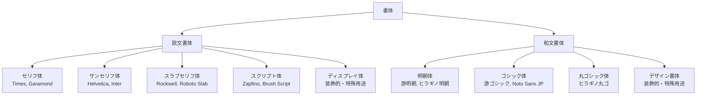
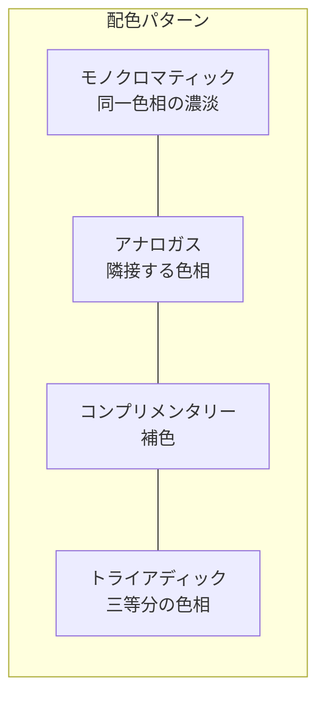
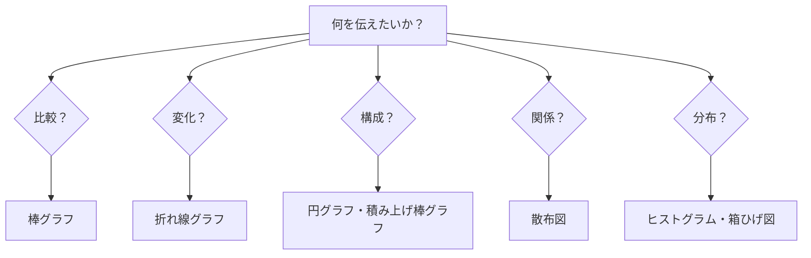

# 第5章 ビジュアルコミュニケーション

## はじめに

視覚は人間の情報処理において最も強力なチャンネルである。脳に伝達される情報の約80%は視覚を通じて得られるとされ、テキストだけの情報と比較して、視覚的に構成された情報は理解速度と記憶定着率の両方で優れている。本章では、デザイナーが視覚的に情報を伝えるための基礎——タイポグラフィ、色彩理論、レイアウト原則、情報デザイン、データビジュアライゼーション——を学ぶ。

## 5.1 タイポグラフィ

タイポグラフィとは、文字を通じて情報を効果的に伝達する技術と芸術である。デジタルメディアが主流となった現在でも、タイポグラフィはあらゆるデザインの基盤をなす。

### 書体の分類

| 分類 | 特徴 | 適した用途 |
|------|------|----------|
| **セリフ体/明朝体** | 文字の端にセリフ（うろこ）がある。可読性が高い | 長文の本文、格式のある文書 |
| **サンセリフ体/ゴシック体** | セリフがない。画面上での視認性が高い | UI、見出し、プレゼンテーション |
| **スラブセリフ体** | 太く均一なセリフ。力強い印象 | 見出し、ポスター |
| **スクリプト体** | 手書き風。親しみや優雅さ | 招待状、ロゴ（本文には不向き） |

### タイポグラフィの基本原則

**可読性（Readability）** — 文章がストレスなく読めるか。本文のフォントサイズは16px以上（Web）、行間は文字サイズの1.5〜1.8倍を推奨する。

**視認性（Legibility）** — 個々の文字が判別しやすいか。特に「l（エル）」「1（いち）」「I（アイ）」の区別や、日本語の漢字の潰れに注意する。

**階層（Hierarchy）** — サイズ、太さ、色で情報の優先順位を表現する。一般に、見出しは本文の1.5〜2倍のサイズとする。

!!! tip "書体選びの実践ルール"
    1つのデザインで使う書体は2〜3種類に抑える。和文と欧文でそれぞれ1書体ずつ選び、見出し用に1書体を追加するのが安全な組み合わせである。書体の雰囲気（モダン/クラシック、温かみ/冷たさ）がコンテンツの性格と合っているかを常に確認すること。

## 5.2 色彩理論

色は感情に直接的に作用し、情報を整理し、ブランドの印象を形成する。デザイナーにとって色彩理論は不可欠な基礎知識である。

### 色の三属性

| 属性 | 説明 | デザインでの活用 |
|------|------|----------------|
| **色相（Hue）** | 赤・青・緑といった色味 | 分類・区別の表現 |
| **明度（Value）** | 明るさの度合い | 階層・奥行きの表現 |
| **彩度（Saturation）** | 鮮やかさの度合い | 強調・注意の誘導 |

### 配色の基本パターン

**モノクロマティック** — 1つの色相の明度と彩度を変化させる。統一感があり、失敗しにくい。

**アナロガス（類似色）** — 色相環で隣接する2〜3色を組み合わせる。自然で調和的な印象。

**コンプリメンタリー（補色）** — 色相環で向かい合う色の組み合わせ。コントラストが強く、注意を引く。

**トライアディック** — 色相環を三等分する位置の3色。バランスが良くダイナミック。

### アクセシビリティと色

!!! warning "色だけに頼らない"
    色覚多様性を持つ人は日本の男性の約5%、女性の約0.2%に見られる。情報を色だけで伝えることは避け、形状、パターン、ラベルなど複数の視覚的手がかりを併用すること。WCAG 2.1では、テキストと背景のコントラスト比は最低4.5:1（大きな文字は3:1）が求められる。

| レベル | コントラスト比 | 適用 |
|--------|-------------|------|
| AA（通常テキスト） | 4.5:1以上 | 本文テキスト |
| AA（大きなテキスト） | 3:1以上 | 18px以上の見出し |
| AAA（通常テキスト） | 7:1以上 | より高いアクセシビリティ |

## 5.3 レイアウト原則

レイアウトは情報を空間的に組織化し、読み手の視線を誘導する技術である。

### グリッドシステム

グリッドシステムは、ページを規則的な格子状に分割し、要素の配置に秩序をもたらす。ヨゼフ・ミューラー＝ブロックマンが体系化したこの手法は、Web・アプリ・印刷物を問わずレイアウトの基盤となっている。

**一般的なグリッド構成：**

- **4カラム** — モバイル画面に適する
- **8カラム** — タブレットに適する
- **12カラム** — デスクトップ画面に最適（Bootstrap等のフレームワークの標準）

### ゲシュタルト原則

人間の視覚認知の法則であるゲシュタルト原則は、レイアウト設計の理論的基盤である。

| 原則 | 説明 | デザインへの応用 |
|------|------|----------------|
| **近接** | 近くにある要素はグループとして認識される | 関連情報をまとめて配置する |
| **類同** | 似た要素はグループとして認識される | 同じ種類の情報に同じスタイルを適用する |
| **閉合** | 不完全な形でも補完して全体として認識する | アイコンやロゴのデザインに活用 |
| **連続** | 視線は滑らかな連続線に沿って流れる | 視線の誘導に曲線や直線を活用 |
| **図と地** | 要素は前景（図）と背景（地）に分離して認識される | コントラストで重要な要素を際立たせる |

!!! example "近接の原則の実践"
    フォームデザインにおいて、ラベルと入力フィールドの距離が重要である。ラベルが上の入力フィールドと下の入力フィールドの中間にあると、どちらに属するのか曖昧になる。ラベルは対応するフィールドに近づけ、他のフィールドからは離す。この単純な原則だけで、フォームの使いやすさは劇的に改善される。

### 余白（ホワイトスペース）

余白は「何もない空間」ではなく、情報を整理し、視線を誘導し、洗練された印象を与える積極的なデザイン要素である。

- **マクロ余白** — セクション間の大きな余白。情報のまとまりを区分する
- **ミクロ余白** — 行間、文字間、要素間の小さな余白。可読性に直結する

## 5.4 情報デザイン

情報デザインは、複雑な情報を理解しやすく、使いやすい形に構造化する分野である。リチャード・ソール・ワーマンが「情報アーキテクチャ」の概念を提唱して以来、情報の爆発的増加とともにその重要性は増している。

### LATCH分類法

ワーマンが提唱した情報の5つの整理原則。

| 分類基準 | 英語 | 例 |
|---------|------|-----|
| **位置** | Location | 地図、フロアガイド |
| **アルファベット/五十音** | Alphabet | 辞書、索引 |
| **時間** | Time | 年表、スケジュール |
| **カテゴリー** | Category | 商品分類、部門別 |
| **階層** | Hierarchy | ランキング、組織図 |

!!! note "情報整理の第一歩"
    どんな情報も、この5つの基準のいずれか（または組み合わせ）で整理できる。情報デザインに取り組む際、まず「この情報をLATCHのどれで整理するのが最適か」を考えることから始めるとよい。

## 5.5 データビジュアライゼーションの基礎

データビジュアライゼーションは、数値データを視覚的に表現し、パターンや関係性を直感的に理解できるようにする手法である。

### チャートの選び方

| 目的 | 推奨チャート | 避けるべきチャート |
|------|------------|-----------------|
| 項目間の比較 | 棒グラフ | 円グラフ（比較が困難） |
| 時系列の変化 | 折れ線グラフ | 円グラフ |
| 全体に対する割合 | 積み上げ棒グラフ、ツリーマップ | 3Dグラフ |
| 2変数の関係 | 散布図 | 棒グラフ |
| 分布の把握 | ヒストグラム | 折れ線グラフ |

### エドワード・タフティの原則

情報デザインの巨匠エドワード・タフティは、データビジュアライゼーションにおける以下の原則を提唱した。

**データインク比の最大化** — チャート内のインク（ピクセル）のうち、データを表現する部分の比率を最大化する。装飾的なグリッド線、不要な枠線、3D効果などは排除する。

**チャートジャンクの排除** — データの理解に寄与しない視覚的要素（グラデーション、イラスト、過度な色使い）を取り除く。

**小さな倍数（Small Multiples）** — 同じ形式のチャートを並べて比較する。1つの複雑なチャートより、シンプルなチャートの繰り返しの方が理解しやすい場合が多い。

!!! warning "円グラフの落とし穴"
    円グラフは直感的に見えるが、人間の視覚は角度の比較が苦手であるため、正確な比較には向かない。特に3つ以上のカテゴリーがある場合や、値が近い項目がある場合は、棒グラフの方が正確に伝わる。円グラフを使うのは、2〜3カテゴリーで割合の大小が明確な場合に限定すること。

## 本章のまとめ

- タイポグラフィでは可読性・視認性・階層の3原則を意識し、書体は2〜3種類に抑える
- 色彩設計ではアクセシビリティを必ず考慮し、色だけに頼らない情報伝達を心がける
- レイアウトはグリッドシステムとゲシュタルト原則に基づき、余白を積極的に活用する
- 情報デザインではLATCH分類法を出発点として、情報の最適な構造化を探る
- データビジュアライゼーションでは目的に適したチャートを選び、装飾を排して明快に伝える

---

## 演習問題

### 演習1：タイポグラフィの分析（個人ワーク・45分）

普段利用しているWebサイトまたはアプリを3つ選び、以下を分析せよ。

1. 使用されている書体の種類と数
2. 文字サイズの階層構造（見出し・本文・キャプション等）
3. 行間と文字間の設定
4. 改善すべき点があれば提案する

### 演習2：配色の実践（個人ワーク・60分）

「地域の子ども食堂」のWebサイトのための配色を3パターン提案せよ。各パターンについて、メインカラー、アクセントカラー、背景色、テキスト色を指定し、なぜその配色を選んだかを説明すること。少なくとも1パターンはWCAG AA基準を満たすことを確認すること。

### 演習3：レイアウトの再設計（個人ワーク・90分）

以下の情報を含む1ページのイベント告知チラシをデザインせよ（手描きのワイヤーフレームで可）。グリッドシステムを用い、ゲシュタルト原則を意識して要素を配置すること。

- イベント名、日時、場所、参加費、定員
- イベントの概要（100字程度）
- タイムテーブル（3つのセッション）
- 登壇者情報（3名、各50字程度）
- 申し込み方法（QRコードを想定）

### 演習4：データビジュアライゼーション（個人ワーク・60分）

以下のデータについて、最も適切なチャートの種類を選び、手描きまたはツールで作成せよ。チャートの種類を選んだ理由も説明すること。

1. 過去5年間の大学生のSNS利用率の推移
2. 学部別の在籍学生数
3. 学生の1日の時間の使い方（授業、自習、アルバイト、睡眠、その他）
4. 通学時間と成績の関係
