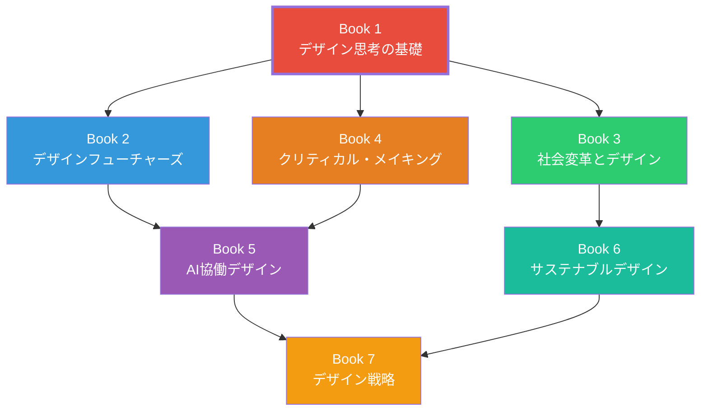

# Book 1: デザイン思考の基礎

**Foundations of Design Thinking**

## 本書について

デザインとは何か。その問いに対する答えは、時代とともに大きく変化してきた。かつては「美しいものをつくること」と同義であったデザインは、今日では「複雑な問題を人間の視点から解きほぐし、システムそのものを再構築する行為」へと進化している。

本書『デザイン思考の基礎』は、デザイナーカリキュラム全7巻の第1巻として、デザインの本質的な考え方と方法論の土台を築くものである。初学者はもちろん、実務経験のあるデザイナーが自身の実践を理論的に振り返るためにも活用できる内容を目指した。

## 学習目標

本書を通じて、読者は以下の能力を獲得する。

| 目標 | 内容 | 対応章 |
|------|------|--------|
| **デザインの本質理解** | デザインの定義の変遷を理解し、現代における意味を説明できる | 第1章 |
| **歴史的文脈の把握** | バウハウスから現代に至るデザイン史の流れを俯瞰できる | 第2章 |
| **人間中心設計の実践** | HCDのプロセスを理解し、基本的な手法を実行できる | 第3章 |
| **リサーチ能力の基礎** | 適切なリサーチ手法を選択し、設計に活かすデータを収集できる | 第4章 |
| **視覚伝達の基礎** | タイポグラフィ、色彩、レイアウトの原則を理解し適用できる | 第5章 |

## 対象読者

- デザインを体系的に学びたい大学生・大学院生
- キャリアチェンジでデザイン分野に参入する社会人
- 実務経験を理論で裏付けたい若手デザイナー（実務経験1〜3年）
- デザイン的思考をビジネスに取り入れたい企画・開発職の方

!!! note "前提知識"
    本書に特別な前提知識は不要である。ただし、日常的にデザインされたもの（Webサイト、アプリ、製品、空間）に意識的に触れる習慣があると、学びがより深くなる。

## 章構成

### [第1章 デザインとは何か](ch01-what-is-design.md)

デザインの定義がどのように変遷してきたかを追い、問題解決としてのデザインとアートとの違いを明確にする。2026年現在の文脈において、デザインが「システムの再構築」という意味を持つに至った背景を解説する。

### [第2章 デザインの歴史と進化](ch02-history-of-design.md)

バウハウスからモダニズム、ポストモダニズム、デジタル革命を経て、現在のシステミックデザインに至る流れを概観する。各時代の主要人物と運動を紹介し、歴史的文脈の中に現代のデザインを位置づける。

### [第3章 人間中心設計](ch03-human-centered-design.md)

人間中心設計（HCD）の原則と具体的な手法を学ぶ。共感マッピング、ユーザーリサーチ、ペルソナ作成、ジャーニーマッピングなど、IDEOのフレームワークを中心に実践的な方法論を習得する。

### [第4章 デザインリサーチ手法](ch04-design-research.md)

定性調査と定量調査の違いを理解し、エスノグラフィ、コンテクスチュアル・インクワイアリー、共創ワークショップなどの具体的手法を学ぶ。収集したデータをデザインに活かす分析手法も扱う。

### [第5章 ビジュアルコミュニケーション](ch05-visual-communication.md)

タイポグラフィ、色彩理論、レイアウト原則、情報デザイン、データビジュアライゼーションの基礎を学ぶ。視覚的に情報を伝達するための基本スキルを身につける。

## 学習の進め方

!!! tip "推奨学習ペース"
    各章に1〜2週間をかけ、約2ヶ月で本書全体を修了することを推奨する。各章末の演習に必ず取り組み、可能であれば学習仲間とディスカッションの機会を設けてほしい。

1. **通読** — まず各章を最初から最後まで読み通す
2. **図解の再現** — 本文中の図表やダイアグラムを自分の手で描き直す
3. **演習の実施** — 章末の演習に取り組む（実際のプロジェクトに適用することが望ましい）
4. **振り返り** — 学んだ概念を自分の言葉で説明してみる

## 本書と他巻との関係

本書で築いた基礎は、カリキュラム全体を通じて繰り返し参照される。特に第3章の人間中心設計と第4章のリサーチ手法は、後続の全巻において前提知識となる。
