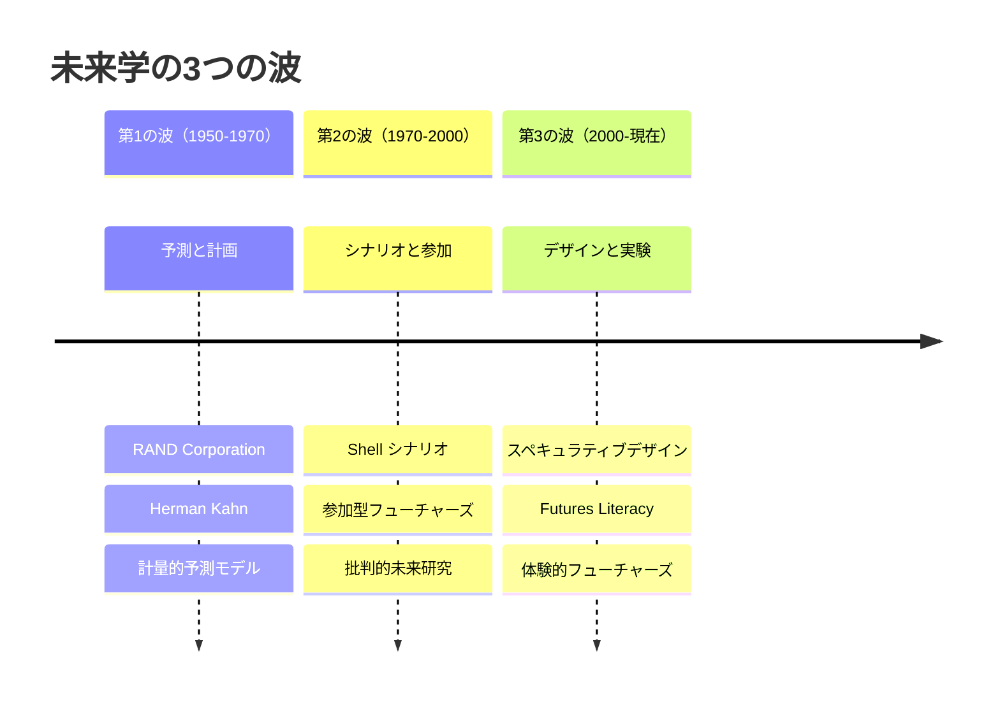
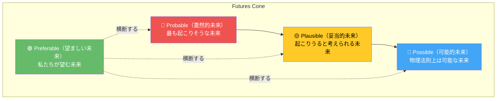

# 第1章: 未来学入門

## はじめに -- なぜデザイナーが未来を学ぶのか

デザインとは本質的に未来志向の行為である。すべてのデザインは「まだ存在しないもの」を構想し、世界に送り出す営みだ。しかし、多くのデザイナーは目の前の課題解決に集中するあまり、5年先、10年先、50年先の世界がどうなるかについて体系的に考える訓練を受けていない。

未来学（Futures Studies）は、1950年代以降に発展してきた学際的な学問領域であり、デザイナーに「長期的な視座」と「複数の未来を想像する力」を与える。本章では、この分野の歴史的発展を辿り、その中核概念である Futures Cone（未来の円錐）を理解し、Futures Literacy（未来リテラシー）の重要性を考察する。

---

## 1.1 未来学の歴史

### 起源: 冷戦期の戦略的思考

未来学の起源は第二次世界大戦後の冷戦期にある。1946年、米国の **RAND Corporation** が設立され、軍事戦略の長期予測研究が始まった。Herman Kahn は核戦争のシナリオ分析を行い、「考えられないことを考える（Thinking about the Unthinkable）」という未来研究の基本姿勢を確立した。

### ヨーロッパにおける展開

1960年代から70年代にかけて、未来学はヨーロッパで独自の発展を遂げた。

| 年代 | 出来事 | 意義 |
|------|--------|------|
| 1968 | ローマクラブ設立 | グローバルな課題のシステム的分析 |
| 1972 | 『成長の限界』出版 | コンピュータモデルによる未来予測 |
| 1973 | Shell 社がシナリオプランニング導入 | 企業戦略への未来学の応用 |
| 1990s | RCA でスペキュラティブデザイン誕生 | デザインと未来学の融合 |
| 2012 | UNESCO が Futures Literacy 提唱 | 未来リテラシーの民主化 |

### 3つの波

未来学の発展は大きく3つの波に分けられる。

**第1の波** は定量的な予測を中心とし、専門家が未来を「当てる」ことを目指した。**第2の波** は複数のシナリオを構築し、多様なステークホルダーが参加するプロセスを重視した。そして **第3の波** では、デザインの方法論を取り入れ、未来を「体験可能な形」にすることで、より広い人々が未来について考え、議論できるようになった。

---

## 1.2 Futures Cone（未来の円錐）

未来学の最も重要な概念的ツールが **Futures Cone** である。Joseph Voros が体系化したこのモデルは、現在から未来に向かって広がる円錐形で、未来の可能性を4つの層に分類する。

### 4つの未来

**Probable（蓋然的未来）** は、現在のトレンドがそのまま続いた場合に到達する未来である。統計的外挿や専門家の予測に基づく。多くのビジネス戦略や政策立案がこの範囲にとどまっている。

**Plausible（妥当的未来）** は、現在の知識に基づけば「あり得る」と判断できる未来である。probable よりも広い範囲を持ち、技術革新や社会変動を考慮に入れる。シナリオプランニングが主に扱う領域である。

**Possible（可能的未来）** は、物理法則に反しない限りすべて含まれる最も広い未来の空間である。SF が扱う領域であり、ワープ航法は除外されるが、量子コンピュータの普及や宇宙移住は含まれる。

**Preferable（望ましい未来）** は、他の3層とは異なり、価値判断を含む概念である。「誰にとって望ましいのか」という問いを常に伴う。この層こそがデザイナーの主戦場であり、未来を単に予測するのではなく、積極的に形づくる姿勢の基盤となる。

!!! warning "「予測」と「構想」の違い"
    未来学は未来を「当てる」学問ではない。それは天気予報や株価予測とは根本的に異なる。未来学の目的は、複数の未来の可能性を体系的に探索することで、現在の意思決定の質を向上させることにある。

---

## 1.3 Futures Literacy（未来リテラシー）

2012年、UNESCO は **Futures Literacy（未来リテラシー）** という概念を提唱した。これは「未来を利用する能力」と定義される。読み書き能力（リテラシー）が文字を使いこなす力であるように、未来リテラシーは未来という概念を使いこなす力である。

### 未来リテラシーの3つのレベル

| レベル | 説明 | デザインでの応用 |
|--------|------|------------------|
| Level 1: 受動的 | 未来を与えられたものとして受け入れる | トレンドに従うデザイン |
| Level 2: 能動的 | 未来を計画・予測しようとする | ユーザーニーズの先読み |
| Level 3: 創造的 | 未来を構想し、現在を変える手段として活用する | スペキュラティブデザイン |

デザイナーにとって最も重要なのは Level 3 の創造的未来リテラシーである。これは「もし〜だったら（What if...?）」という問いを繰り返し、既存の前提を疑い、代替的な未来像を具体的な形にする能力だ。

!!! tip "What if の力"
    デザイン・フューチャーズの実践では、すべてが「What if...?」から始まる。「もしすべての食品が3Dプリントされたら？」「もしAIが法律を制定したら？」「もし死者と会話できたら？」--突飛に見える問いこそが、深い洞察への入口となる。

---

## 1.4 なぜデザイナーに未来思考が必要か

デザイナーが未来学を学ぶべき理由は、大きく4つある。

**第一に、デザインの影響は長期にわたる。** 建築は100年以上、都市計画は数世紀にわたって人々の生活を規定する。UIデザインですら、一度定着したインタラクションパターンは何十年も持続する。長期的な影響を考慮しないデザインは、無責任なデザインである。

**第二に、不確実性への対処能力が求められている。** VUCA（Volatility, Uncertainty, Complexity, Ambiguity）の時代において、単一の未来像に賭けるデザイン戦略はリスクが高い。複数のシナリオを想定し、いずれの未来でも価値を提供できるデザインが必要だ。

**第三に、デザイナーは未来を「見える化」する特殊な能力を持つ。** 未来学者が言葉やデータで記述する未来を、デザイナーはプロトタイプ、映像、体験として具現化できる。この能力は、未来についての民主的な議論を可能にする。

**第四に、倫理的責任がある。** テクノロジーの進化が加速する中、デザイナーは自らが送り出すプロダクトやサービスの長期的帰結について考える義務がある。フューチャーズ・シンキングは、その倫理的想像力を鍛える。

!!! example "RCA の事例: Auger-Loizeau"
    RCA 出身の James Auger と Jimmy Loizeau は、「Afterlife」プロジェクトで、人体の分解エネルギーを電池に変換する装置をデザインした。これは実用的な製品提案ではなく、死とテクノロジーの関係について人々に考えさせる「問い」としてのデザインである。

---

## 実践演習

### 演習 1: 個人の Futures Cone を描く

1. A3用紙の左端に「現在」の点を打ち、右に向かって扇形を描く
2. 自分の専門分野（例: モビリティ、食、教育）を1つ選ぶ
3. 10年後の未来について、4つの層それぞれに3つ以上の具体的な未来像を書き込む
4. 「望ましい未来」を1つ選び、それを実現するために今日始められることを3つ挙げる

### 演習 2: What if ワークショップ

1. 3-5名のグループを作る
2. 各自が「What if...?」で始まる問いを10個書く（5分間）
3. すべての問いを壁に貼り、投票で最も刺激的な問いを3つ選ぶ
4. 各問いについて、20年後の日常生活がどう変わるかを議論する（各10分）
5. 最も興味深いシナリオを1つ選び、1枚のスケッチにまとめる

### 演習 3: 未来年表の作成

1. 2026年から2076年までの50年間の年表を作成する
2. 技術、社会、環境、政治の4領域について、各10年ごとに起こりうる変化を記入する
3. 年表の中で「転換点（Tipping Point）」になりそうな出来事を3つ特定し、赤で囲む
4. その転換点がデザインにどのような影響を与えるかを考察する
