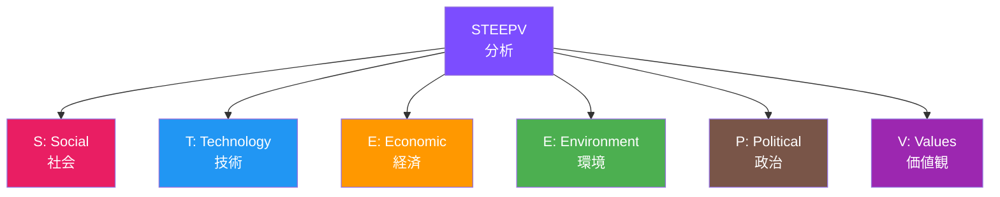
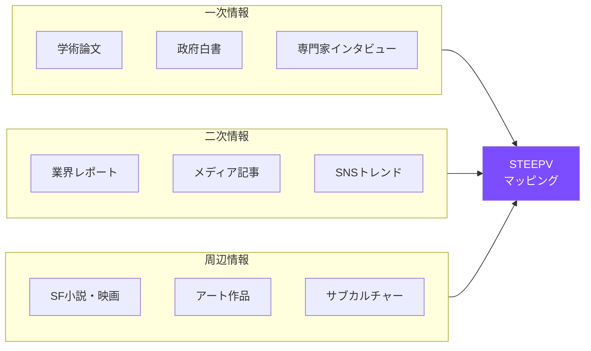
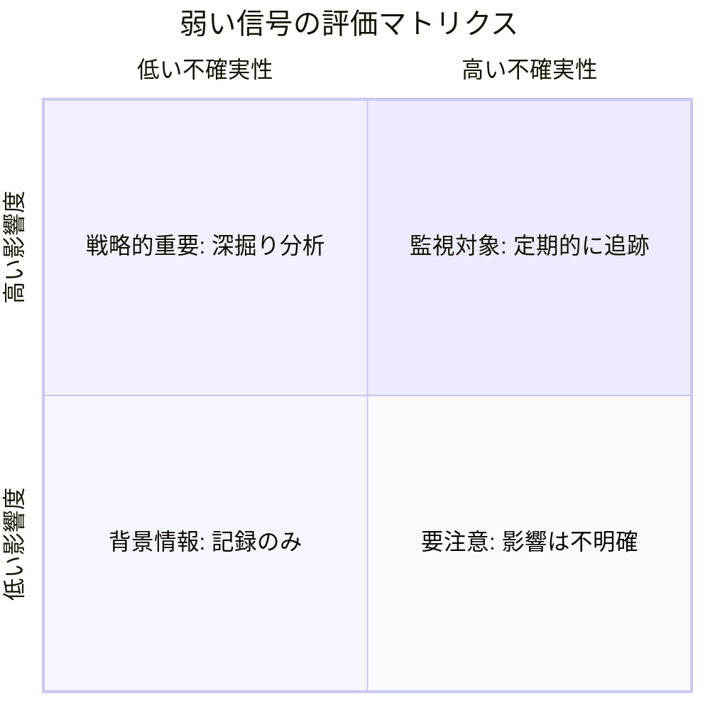

# 第2章: STEEPV分析

## はじめに -- マクロ環境を読み解くフレームワーク

デザイナーが未来を構想するためには、まず現在の世界で何が起きているのかを体系的に把握する必要がある。個別のニュースや技術トレンドに振り回されるのではなく、社会全体の変化を構造的に理解する枠組みが必要だ。

**STEEPV分析** は、マクロ環境を6つの領域に分けて分析するフレームワークである。従来のPEST分析（Political, Economic, Social, Technological）を拡張し、Environment（環境）とValues（価値観）を加えた、より包括的な分析手法だ。未来学者やフューチャリストが標準的に使用するこのフレームワークは、デザイナーにとっても強力な「レンズ」となる。

---

## 2.1 STEEPV の6つの領域

### S -- Social（社会）

人口動態、都市化、教育、健康、ライフスタイル、労働形態、家族構造、移民、格差など、社会構造に関わる変化を分析する。

具体的な分析対象:

- 少子高齢化と人口構成の変化
- リモートワークの定着と働き方の多様化
- 孤独・孤立の社会問題化
- ジェンダー意識の変容
- 教育のオンライン化とリスキリング需要

### T -- Technology（技術）

新技術の発展、技術の普及率、インフラ変化、デジタル化、研究開発の方向性など、技術領域の変化を分析する。

具体的な分析対象:

- 生成AI・AGI の進展
- 量子コンピューティングの実用化
- バイオテクノロジーと合成生物学
- 再生可能エネルギー技術の進化
- 6G通信と空間コンピューティング

### E -- Economic（経済）

経済成長、雇用構造、産業構造、金融システム、消費行動、グローバル経済の変動を分析する。

具体的な分析対象:

- サーキュラーエコノミーの拡大
- プラットフォーム経済と ギグワーカー
- 暗号資産と分散型金融（DeFi）
- グローバルサプライチェーンの再編
- 経験経済からトランスフォーメーション経済への移行

### E -- Environment（環境）

気候変動、生態系、資源枯渇、汚染、生物多様性、自然災害など、環境に関わる変化を分析する。

具体的な分析対象:

- 気候変動と異常気象の増加
- 海洋プラスチック汚染
- 生物多様性の喪失
- 水資源の枯渇
- カーボンニュートラルへの移行

### P -- Political（政治）

政策動向、規制、国際関係、ガバナンス、法制度の変化を分析する。

具体的な分析対象:

- AI規制の国際的枠組み
- データプライバシー法の強化
- 地政学的リスクの変化
- 市民参加型民主主義の拡大
- 都市自治と地方分権の進展

### V -- Values（価値観）

世界観、倫理観、文化的価値、精神的志向、アイデンティティの変化を分析する。STEEPV の「V」は、他の5領域すべてに影響を及ぼす横断的な要素である。

具体的な分析対象:

- ウェルビーイング志向の高まり
- ポスト物質主義的価値観
- デジタルネイティブ世代の価値観
- 多文化共生とアイデンティティの多元化
- 人間と非人間の関係性の再定義

!!! note "なぜ Values が重要か"
    従来の STEEP（PEST）分析には Values が含まれなかった。しかし、価値観の変化は他のすべての領域の変化を駆動する根本的な力である。例えば、環境意識の高まり（V）は、再生可能エネルギー政策（P）、サーキュラーエコノミー（E）、クリーンテック（T）すべてに影響する。デザイナーにとって、価値観の変化を読み解くことは特に重要だ。

---

## 2.2 STEEPV分析の実施方法

### ステップ1: スコーピング

分析の対象範囲（スコープ）を明確にする。

| 要素 | 定義すべき内容 | 例 |
|------|---------------|-----|
| テーマ | 分析対象の領域 | 「2035年の高齢者向けモビリティ」 |
| 地域 | 地理的範囲 | 日本の都市部 |
| 時間軸 | 対象とする未来の期間 | 2026年〜2035年（10年間） |
| ステークホルダー | 関係する主体 | 高齢者、自治体、交通事業者 |

### ステップ2: 情報収集（スキャニング）

6つの領域それぞれについて、変化の兆候を収集する。情報源は多様であるべきだ。

!!! tip "周辺情報の価値"
    SF小説やアート作品は「非公式な未来学」として機能する。William Gibson の「未来はすでにここにある。ただ均等に配分されていないだけだ」という言葉のとおり、文化的表現の中に未来の兆候が現れることが多い。

### ステップ3: トレンドの分類と評価

収集した情報を、以下の3つのカテゴリに分類する。

**メガトレンド（Megatrends）**: 広範囲に長期間影響を及ぼす大きな変化の流れ。高齢化、都市化、デジタル化などが該当する。方向性は比較的確実だが、速度や影響の程度は不確実である。

**トレンド（Trends）**: メガトレンドの中で観察される具体的な変化の方向。リモートワークの普及、EVの普及率上昇など。データで裏付けられる中期的な変化である。

**弱い信号（Weak Signals）**: まだ主流ではないが、将来大きな変化を引き起こす可能性のある微かな兆候。ニッチなコミュニティでの実践、先端研究の成果、異端的なビジネスモデルなどに現れる。

### ステップ4: クロスインパクト分析

6つの領域は独立しておらず、相互に影響し合う。領域間の相互作用を分析することで、より深い洞察が得られる。

| 影響元 → 影響先 | S | T | E(経) | E(環) | P | V |
|-----------------|---|---|-------|-------|---|---|
| **S（社会）** | - | ○ | ○ | △ | ○ | ◎ |
| **T（技術）** | ◎ | - | ◎ | ○ | ○ | ◎ |
| **E（経済）** | ◎ | ○ | - | ○ | ◎ | ○ |
| **E（環境）** | ○ | △ | ◎ | - | ◎ | ◎ |
| **P（政治）** | ◎ | ○ | ◎ | ○ | - | ○ |
| **V（価値観）** | ◎ | ○ | ○ | ◎ | ◎ | - |

*◎ = 強い影響 / ○ = 中程度の影響 / △ = 弱い影響*

---

## 2.3 弱い信号（Weak Signals）の検出

弱い信号は STEEPV 分析の中で最も価値が高く、最も見逃しやすい要素である。Igor Ansoff が 1975 年に提唱したこの概念は、大きな変化が本格化する前に現れる微かな兆候を意味する。

### 弱い信号の特徴

- **曖昧さ**: 意味が明確でなく、解釈が分かれる
- **新奇性**: 既存の枠組みでは説明しにくい
- **周辺性**: 主流メディアや主流市場では注目されていない
- **不連続性**: 現在のトレンドの延長線上にない

### 弱い信号を見つける場所

!!! example "弱い信号の情報源"
    - スタートアップのピッチデッキ（特に失敗したもの）
    - 学術論文のプレプリント
    - ニッチなオンラインコミュニティ（Reddit のサブフォーラムなど）
    - 異文化圏のローカルニュース
    - アートフェスティバルの出展作品
    - 若者のサブカルチャー
    - 特許出願データ
    - クラウドファンディングのプロジェクト

### 弱い信号の評価マトリクス

検出した弱い信号を、**影響度** と **不確実性** の2軸で評価する。

---

## 2.4 実践事例: 2035年の食のデザイン

STEEPV 分析を「2035年の食のデザイン」というテーマに適用した場合の具体例を示す。

| 領域 | メガトレンド | トレンド | 弱い信号 |
|------|------------|---------|----------|
| S | 単身世帯の増加 | パーソナライズ食の需要増 | 孤食を前提とした食文化の肯定 |
| T | バイオテクノロジーの進化 | 培養肉の商業化 | 微生物による食品合成 |
| E | 食料価格の上昇 | フードテック投資の拡大 | 食の完全サブスクリプション化 |
| E | 気候変動 | 代替タンパク源の普及 | 昆虫食の高級化 |
| P | 食品安全規制の強化 | 培養肉の認可制度 | 食の自給権を巡る政治運動 |
| V | 健康意識の高まり | プラントベースの浸透 | 食と精神性の再結合 |

この分析をもとに、デザイナーは2035年の食体験をどのようにデザインすべきかの方向性を導き出せる。

---

## 実践演習

### 演習 1: STEEPV マッピング

1. 自分の関心領域（例: 教育、医療、住宅）を1つ選定する
2. A1サイズの用紙を6つのエリアに分割し、各領域のラベルを書く
3. 30分間で各領域につき最低5つの変化要因を付箋に書いて貼る
4. 領域間の関連性を矢印で結ぶ
5. 最も影響力が大きいと思われる変化要因を3つ選び、赤い印をつける

### 演習 2: 弱い信号ハンティング

1. 1週間にわたり、普段読まないメディアを3つ以上チェックする（例: 海外のニッチなブログ、異分野の学術誌、ローカルコミュニティのSNS）
2. 「これは何かの始まりかもしれない」と感じた情報を10件以上収集する
3. 各情報を STEEPV の6領域に分類する
4. 評価マトリクスにプロットし、最も注目すべき弱い信号を3つ選定する
5. 選定した弱い信号が10年後にメガトレンドになったシナリオを短文で記述する

### 演習 3: クロスインパクト・ストーリーテリング

1. STEEPV の6領域から各1つずつ、合計6つのトレンドを選ぶ
2. 6つのトレンドが同時に進行した場合の10年後の「ある1日」を、800字程度の物語として書く
3. 物語を読んだグループメンバーが、物語の中の「デザインの機会」を3つ以上特定する
