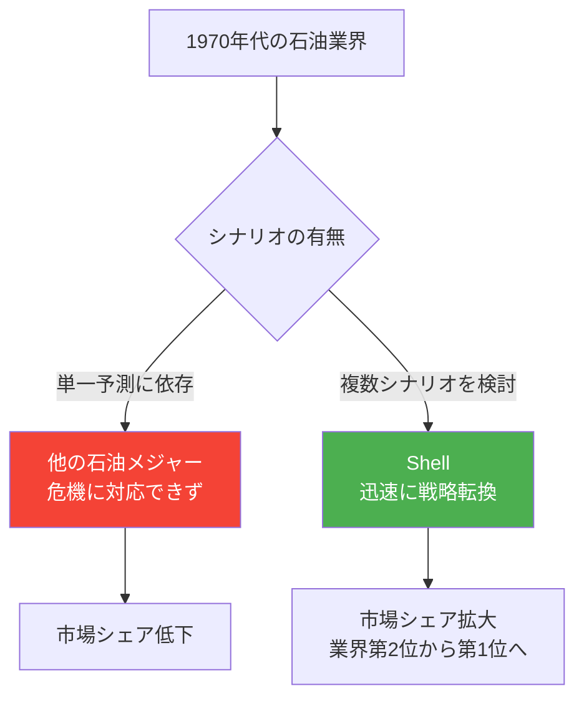
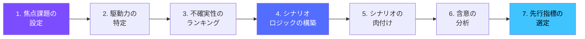
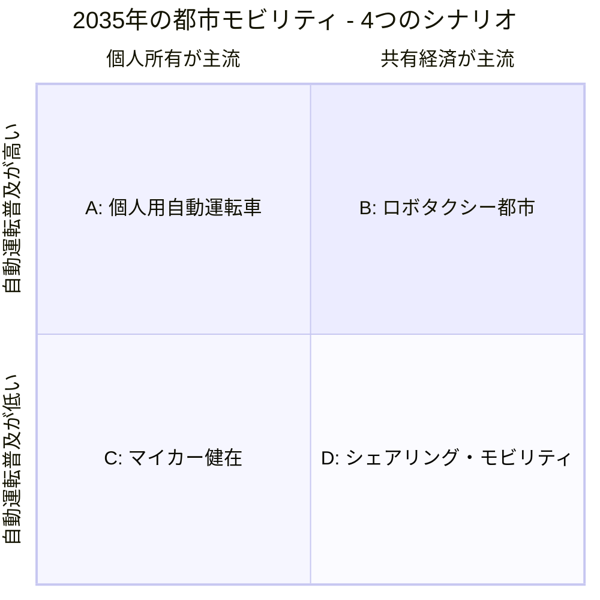
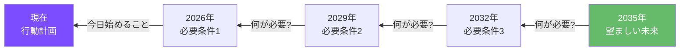

# 第3章: シナリオプランニング

## はじめに -- 未来は一つではない

未来を「予測」することは不可能である。しかし、未来に対する「備え」は可能だ。シナリオプランニングは、複数の異なる未来像（シナリオ）を体系的に構築し、それぞれのシナリオにおいて有効な戦略を検討する方法論である。

1970年代にロイヤル・ダッチ・シェル社（Shell）で体系化されたこの手法は、石油危機を乗り越える原動力となり、以来半世紀にわたって企業戦略、公共政策、軍事計画など多様な領域で活用されてきた。本章では、シナリオプランニングの方法論を段階的に学び、デザイン実践への応用を探る。

---

## 3.1 Shell シナリオプランニングの遺産

### Pierre Wack と「精神の風景」

Shell のシナリオプランニングの父とされる **Pierre Wack** は、1960年代後半にこの手法の基盤を築いた。彼の独自性は、シナリオを単なる分析ツールではなく、意思決定者の **精神的モデル（Mental Model）** を変容させる手段として位置づけた点にある。

Wack は「シナリオの目的は、正確な未来像を描くことではなく、意思決定者が未来について考える方法を変えることだ」と述べた。

### Shell が石油危機を生き延びた理由

1973年の石油危機以前、Shell のシナリオチームは石油価格の高騰シナリオを作成していた。他の石油メジャーが「石油価格は安定し続ける」という単一の前提で経営していた中、Shell の経営陣は複数のシナリオを検討していたため、危機に迅速に対応できた。

!!! note "シナリオの価値は「当たるかどうか」ではない"
    Shell のシナリオが他社より優れていたのは、石油危機を正確に予測したからではない。「石油価格が高騰する世界」と「安定する世界」の両方に対する準備ができていたことが重要だった。シナリオプランニングの価値は予測の精度ではなく、準備の幅広さにある。

---

## 3.2 シナリオプランニングの方法論

### 基本プロセス

#### ステップ1: 焦点課題の設定

シナリオプランニングは、具体的な **焦点課題（Focal Question）** から始まる。「我々は今後10年間でどのような戦略をとるべきか」といった漠然とした問いではなく、「2035年に日本の高齢者モビリティはどのような形態になっているか」のように、具体的かつオープンな問いを設定する。

良い焦点課題の条件:

- 具体的だが、答えが一つに定まらない
- 意思決定に直結する
- 時間軸が明確（通常5〜20年先）
- ステークホルダーにとって切実である

#### ステップ2: 駆動力の特定

焦点課題に影響を与える **駆動力（Driving Forces）** を洗い出す。前章で学んだ STEEPV 分析がここで活きる。通常、ブレインストーミングで50〜100の駆動力を列挙し、それらを集約していく。

#### ステップ3: 不確実性のランキング

駆動力を **影響度** と **不確実性** の2軸で評価する。シナリオ構築で最も重要なのは、「影響度が高く、かつ不確実性が高い」駆動力である。これを **Critical Uncertainties（決定的不確実性）** と呼ぶ。

| 分類 | 特徴 | シナリオでの扱い |
|------|------|------------------|
| 決定的不確実性 | 影響大・不確実性高 | シナリオの軸にする |
| 重要トレンド | 影響大・不確実性低 | すべてのシナリオに含める |
| 監視対象 | 影響小・不確実性高 | 弱い信号として追跡 |
| 背景要因 | 影響小・不確実性低 | 前提条件として固定 |

---

## 3.3 2x2 シナリオマトリクス

シナリオプランニングで最も広く使われるのが **2x2 マトリクス** である。2つの決定的不確実性を直交する2軸とし、4つの象限を4つの異なるシナリオとして展開する。

### 構築例: 2035年の都市モビリティ

決定的不確実性として以下の2つを選定する。

- **軸1**: 自動運転技術の普及（低い ←→ 高い）
- **軸2**: 個人所有 vs 共有経済（所有 ←→ 共有）

**シナリオA「個人用自動運転車」**: 自動運転技術が普及するが、所有文化が維持される。各家庭が自動運転車を所有し、駐車場問題は解消されないが、高齢者の移動の自由は大幅に拡大する。

**シナリオB「ロボタクシー都市」**: 自動運転と共有経済が両立する。Waymo型のロボタクシーが都市交通の中核となり、駐車場はなくなり、都市空間が劇的に変化する。

**シナリオC「マイカー健在」**: 自動運転も共有経済も限定的。規制の壁と消費者心理により、従来型の自動車所有が継続する。

**シナリオD「シェアリング・モビリティ」**: 自動運転は普及しないが、共有経済が進展。カーシェア、ライドシェア、マイクロモビリティが組み合わさった MaaS（Mobility as a Service）が主流となる。

!!! warning "4つのシナリオの落とし穴"
    4つのシナリオのうち1つを「最も望ましい」と決めてしまいがちだが、それはシナリオプランニングの趣旨に反する。すべてのシナリオを等しく検討し、いずれの世界でも有効な戦略を見出すことが目的である。

---

## 3.4 バックキャスティング

バックキャスティングは、「望ましい未来」を先に描き、そこから現在に向かって逆算するアプローチである。通常のフォアキャスティング（現在から未来を予測する）とは方向が逆だ。

バックキャスティングの手順:

1. 望ましい未来の状態を具体的に記述する
2. その状態を実現するために必要な条件を列挙する
3. 各条件の前提条件を遡って特定する
4. 現在から最初のステップを導き出す

!!! tip "デザイナーとバックキャスティング"
    バックキャスティングはデザイナーにとって直感的な手法である。なぜなら、デザインプロセス自体が「望ましい状態」を構想し、そこに至る道筋を設計する行為だからだ。プロダクトデザインにおけるユーザー体験のビジョンプロトタイプも、一種のバックキャスティングと言える。

---

## 3.5 ウィンドトンネリング

**ウィンドトンネリング（Wind-tunneling）** は、策定した戦略やデザインコンセプトを、各シナリオに「通す」ことで、その堅牢性（ロバストネス）を検証する手法である。航空機の設計で風洞実験を行うように、アイデアを異なる未来の「風」にさらすのだ。

### ウィンドトンネリングの評価表

| 戦略/コンセプト | シナリオA | シナリオB | シナリオC | シナリオD | ロバストネス |
|----------------|-----------|-----------|-----------|-----------|-------------|
| コンセプトX | ◎ | ○ | × | ○ | 中 |
| コンセプトY | ○ | ○ | ○ | ○ | 高 |
| コンセプトZ | ◎ | ◎ | × | × | 低 |

*◎ = 非常に有効 / ○ = 有効 / △ = 限定的 / × = 無効*

コンセプトYのように、すべてのシナリオで一定の有効性を持つ戦略を **ロバスト戦略** と呼ぶ。一方、コンセプトZのように特定のシナリオでのみ有効な戦略は、そのシナリオが実現した場合に大きな成果を生むが、リスクも高い。

---

## 3.6 ワークショップの設計

シナリオプランニングは個人作業ではなく、多様なステークホルダーが参加するワークショップとして実施されることが多い。以下に、1日間のワークショップフォーマットを示す。

| 時間 | セッション | 内容 | 手法 |
|------|-----------|------|------|
| 9:00-9:30 | 導入 | 焦点課題の共有、シナリオプランニングの説明 | レクチャー |
| 9:30-10:30 | 駆動力の特定 | STEEPV フレームワークで駆動力をブレインストーミング | 付箋ワーク |
| 10:45-11:45 | 不確実性の評価 | 影響度/不確実性マトリクスへのプロット | グループ討議 |
| 11:45-12:30 | シナリオロジック | 2x2マトリクスの軸を決定 | 全体議論 |
| 13:30-15:00 | シナリオ構築 | 4グループに分かれ、各シナリオを肉付け | グループワーク |
| 15:15-16:15 | シナリオ発表 | 各グループがシナリオを発表、質疑応答 | プレゼンテーション |
| 16:15-17:00 | ウィンドトンネリング | 既存のコンセプトを4シナリオで検証 | 全体ワーク |

!!! example "シナリオの「名前」の力"
    Shell のシナリオチームは、各シナリオに印象的な名前をつけることを重視した。「Mountains」と「Oceans」、「Prism」と「Blueprint」のように、シナリオの性格を一言で表す名前は、組織内での共有と記憶を促進する。数字やアルファベットではなく、物語性のある名前をつけよう。

---

## 実践演習

### 演習 1: ミニ・シナリオプランニング

1. 焦点課題を設定する（例:「2035年の日本の教育はどのような形になっているか」）
2. STEEPV の各領域から駆動力を3つずつ、計18個列挙する
3. 18個を影響度/不確実性で評価し、上位2つの決定的不確実性を選ぶ
4. 2x2 マトリクスを作成し、4つのシナリオの概要を各200字で記述する
5. 各シナリオに物語性のある名前をつける

### 演習 2: バックキャスティング演習

1. 演習1で作成した4つのシナリオのうち、最も望ましいものを1つ選ぶ
2. その未来から現在まで、3年刻みで必要な変化を逆算する
3. 現在から最初の1年で着手すべきアクションを5つ列挙する
4. デザイナーとしてそのアクションにどう貢献できるかを考察する

### 演習 3: ウィンドトンネリング実践

1. 自分が現在取り組んでいる（または構想している）デザインプロジェクトを1つ選ぶ
2. 演習1で作成した4つのシナリオそれぞれにおいて、そのプロジェクトの有効性を評価する
3. すべてのシナリオで有効であるための修正点を特定する
4. 修正後のコンセプトをA4用紙1枚にまとめる
