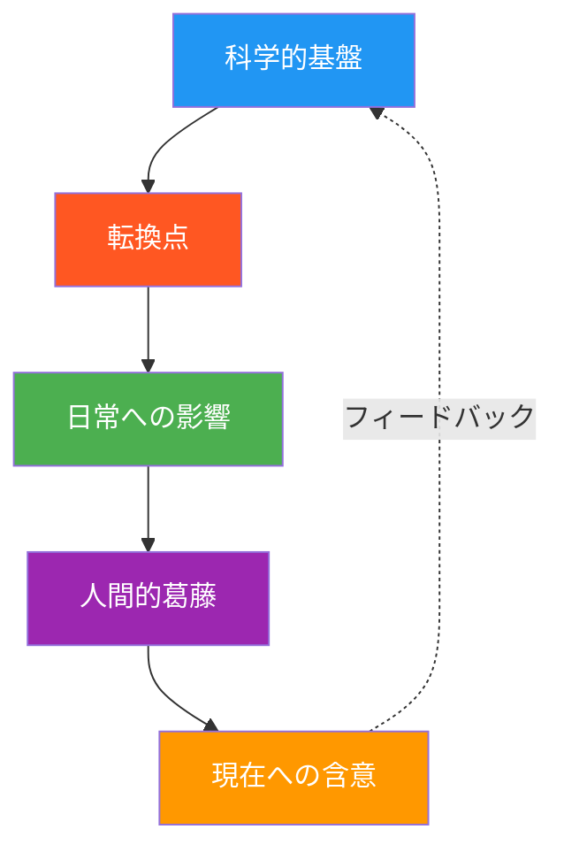
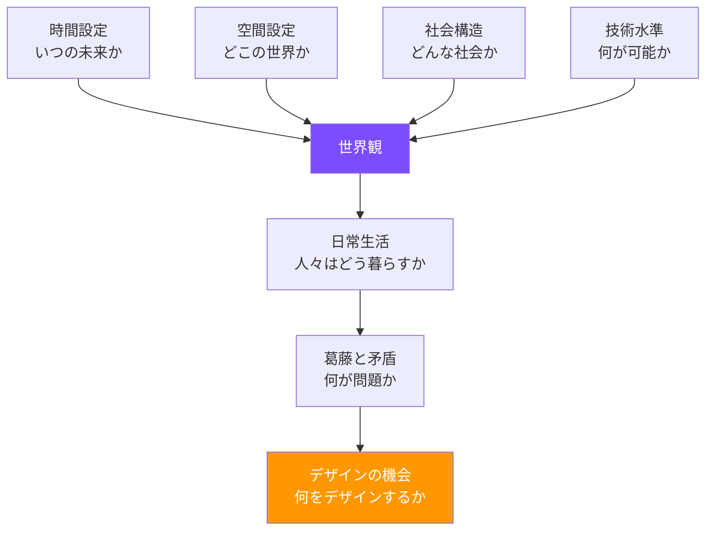

# 第4章: デザインフィクション

## はじめに -- 未来を「つくる」ことで考える

デザインフィクションは、未来の製品やサービス、システムの **プロトタイプ** を制作することで、その未来について批評的に考える手法である。SF作家 Bruce Sterling と、デザインリサーチャー Julian Bleecker が2000年代後半に体系化したこの領域は、サイエンスフィクションの想像力とデザインの物質性を融合させる。

従来の未来学がテキストやデータで未来を記述するのに対し、デザインフィクションは **触れられる未来** を制作する。それは未来予測でも、SFエンターテインメントでもない。「もしこの未来が実現したら、日常生活はどう変わるか」を具体的に問う、デザイン的な行為である。

---

## 4.1 SFプロトタイピング

### SFプロトタイピングとは何か

SFプロトタイピング（Science Fiction Prototyping）は、Intel の未来学者 Brian David Johnson が提唱した手法で、短編SF小説を書くことで技術の未来像を探索するアプローチである。

通常のプロトタイピングが既存の技術で実現可能な範囲に留まるのに対し、SFプロトタイピングは「まだ存在しない技術」を前提とした未来世界を描くことが許される。ただし、完全な空想ではなく、科学的根拠に基づいた「ありうる技術」を起点とする。

### SFプロトタイプの構成要素

| 要素 | 説明 | 例 |
|------|------|-----|
| 科学的基盤 | 物語の基盤となる科学技術 | 汎用量子コンピュータ |
| 転換（Inflection Point） | 技術が社会を変える瞬間 | すべての暗号が解読可能に |
| 日常への影響 | 技術が一般市民の生活をどう変えるか | プライバシーの概念が消失 |
| 人間的葛藤 | 変化がもたらす倫理的・感情的対立 | 透明な社会は幸福か |
| ランプ（含意） | 物語が現在に投げかける問い | 今のセキュリティは十分か |

!!! tip "SFプロトタイプを書くコツ"
    優れたSFプロトタイプは、技術そのものではなく、技術が人間関係に及ぼす影響に焦点を当てる。「AIが完成した」という設定ではなく、「AIが完成した世界で、母親は子どもの宿題をどう手伝うか」という具体的な日常を描くことが重要だ。

---

## 4.2 ダイエジェティック・プロトタイプ

### 物語世界内のプロトタイプ

**ダイエジェティック・プロトタイプ（Diegetic Prototype）** は、David Kirby が映画研究の文脈で提唱した概念であり、フィクションの物語世界内で「当たり前のもの」として存在する未来の人工物を指す。

「ダイエジェティック」とは映画用語で「物語世界内の」を意味する。例えば、映画の登場人物が聞いている音楽は「ダイエジェティック・サウンド」であり、BGMは「ノン・ダイエジェティック・サウンド」である。

同様に、ダイエジェティック・プロトタイプとは、未来の物語世界の中で登場人物が日常的に使用している製品やサービスのことだ。これらは「説明」されるのではなく、「使用されている」ところが描かれる。

### 映画における事例

| 映画 | ダイエジェティック・プロトタイプ | 後の実現 |
|------|-------------------------------|----------|
| 2001年宇宙の旅（1968） | タブレット型端末 | iPad（2010） |
| マイノリティ・リポート（2002） | ジェスチャーインターフェース | Kinect（2010） |
| Her（2013） | 音声AI アシスタント | Siri, Alexa の進化 |
| ブラック・ミラー各話 | ソーシャルスコアリング | 中国の社会信用システム |

!!! note "実現が目的ではない"
    ダイエジェティック・プロトタイプの価値は、それが実際に実現するかどうかではない。未来の技術を「使用する人間」の姿を描くことで、その技術の社会的影響について視聴者が想像するきっかけを提供することに意義がある。

---

## 4.3 ワールドビルディング

### デザイナーのためのワールドビルディング

ワールドビルディング（世界構築）は、SFやファンタジーの創作技法として発展してきたが、デザインフィクションにおいても中核的な手法である。Alex McDowell（映画『マイノリティ・リポート』のプロダクションデザイナー）は、ワールドビルディングをデザインの方法論として再定義し、USC の World Building Institute を設立した。

デザイナーのためのワールドビルディングは、以下の要素で構成される。

### ワールドビルディング・キャンバス

世界観を体系的に構築するために、以下のキャンバスを用いる。

| 要素 | 問い | 記述の観点 |
|------|------|-----------|
| 時間 | この世界はいつか？ | 年代、季節、時間の流れ方 |
| 地理 | この世界はどこか？ | 都市/農村、気候、地形 |
| 政治 | 誰が権力を持っているか？ | 統治形態、法律、権力構造 |
| 経済 | 何が価値を持つか？ | 通貨、労働、資源配分 |
| 技術 | 何が可能で何が不可能か？ | 日常技術、禁止技術、技術格差 |
| 文化 | 人々は何を信じ、何を楽しむか？ | 宗教、芸術、娯楽、食 |
| 環境 | 自然はどうなっているか？ | 生態系、天候、人間と自然の関係 |
| 日常 | 朝起きてから寝るまでの1日 | 通勤、食事、コミュニケーション |

---

## 4.4 ブラック・ミラーをケーススタディとして

Charlie Brooker のテレビシリーズ『ブラック・ミラー』は、デザインフィクションのケーススタディとして極めて有効である。各エピソードが1つのテクノロジーの社会的帰結を徹底的に描いているからだ。

### 分析フレームワーク

デザイナーの視点で『ブラック・ミラー』を分析する際のフレームワークを示す。

**エピソード例: 「Nosedive」（シーズン3、第1話）**

| 分析軸 | 内容 |
|--------|------|
| **核となる技術** | 相互評価による社会スコアリングシステム |
| **What if の問い** | もし人間関係がすべて5段階評価されたら？ |
| **ダイエジェティック・プロトタイプ** | スマートコンタクトレンズ、評価表示UI、スコア連動サービス |
| **拡張された現実** | SNSの「いいね」文化 → 生活全体のスコアリング |
| **人間的代償** | 真正性の喪失、感情労働の極限化 |
| **デザインの倫理** | UXデザインは人間の行動をどこまで方向づけてよいか |

!!! warning "ディストピアの罠"
    デザインフィクションはディストピア（暗黒郷）に傾きがちである。『ブラック・ミラー』のような作品は警告として有効だが、デザインフィクションの実践では、ディストピアとユートピアの間のニュアンスのある未来を描くことが重要だ。暗い未来ばかり提示しても、人々は行動を起こすモチベーションを失う。

---

## 4.5 デザインフィクション・アーティファクトの制作

デザインフィクションの核心は、未来の世界に存在する **アーティファクト（人工物）** を実際に制作することにある。これは概念図やレンダリングではなく、物理的な「もの」として存在するプロトタイプである。

### アーティファクトの類型

| 類型 | 説明 | 例 |
|------|------|-----|
| **未来の日用品** | 未来世界で当たり前に使われる製品 | 空気浄化マスク（デザイン済み商品として） |
| **未来のメディア** | 未来世界の新聞、ウェブサイト、広告 | 2040年の新聞の一面 |
| **未来の書類** | 未来世界の公的文書、契約書 | AI市民権証明書 |
| **未来のパッケージ** | 未来世界の商品パッケージ | 培養肉のスーパーのパッケージ |
| **未来の映像** | 未来世界のCM、ニュース映像 | 自動運転車のテレビCM |

### Near Future Laboratory のアプローチ

Julian Bleecker が率いる **Near Future Laboratory** は、「TBD Catalog」という架空の未来のイケアカタログを制作した。一見すると普通の商品カタログだが、掲載されている商品はすべて「もう少し未来」の製品である。ドローン配達用の受け取りボックス、AIパーソナルスタイリスト、3Dプリンテッド・スニーカーなどが、何の説明もなく「当たり前の商品」として掲載されている。

この「当たり前さ」こそがデザインフィクション・アーティファクトの本質である。驚きや説明を排し、未来を「日常」として提示することで、観る者は自然とその未来に没入し、そこでの生活を想像し始める。

!!! example "アーティファクトの制作のポイント"
    最も効果的なデザインフィクション・アーティファクトは、90%が「見慣れたもの」で、10%が「違和感」である。完全に異質なものは理解されず、完全に馴染むものは議論を生まない。見慣れた形式（新聞記事、商品パッケージ、取扱説明書）の中に、未来の要素を自然に忍び込ませるのがコツだ。

---

## 実践演習

### 演習 1: SFプロトタイプの執筆

1. 現在研究されている科学技術を1つ選ぶ（例: 脳-コンピュータインターフェース、CRISPR遺伝子編集、核融合発電）
2. その技術が完全に実用化された15年後の世界を設定する
3. その世界で暮らす1人の人物の「ある1日」を、2000字の短編として書く
4. 物語の中に、最低3つのダイエジェティック・プロトタイプを含める
5. 物語の末尾に、現在の我々への問いかけを1つ書く

### 演習 2: 架空のカタログ制作

1. 2040年の未来世界を設定する（ワールドビルディング・キャンバスを使用）
2. その世界に存在する商品カタログの見開き2ページをデザインする
3. 掲載する商品は3-5点。各商品に名前、価格、簡単な説明文をつける
4. 商品の写真は、既存の素材を加工して制作する（または手描きスケッチ）
5. 説明文では商品を「驚くべきもの」としてではなく、「当たり前のもの」として記述する

### 演習 3: ブラック・ミラー分析

1. 『ブラック・ミラー』のエピソードを1つ視聴する
2. 本章の分析フレームワークを用いて、エピソードを分析する
3. エピソードに登場するダイエジェティック・プロトタイプのうち1つを選び、その製品の「ユーザーマニュアル」の1ページ目をデザインする
4. そのプロトタイプが現実世界に存在した場合の倫理的問題を3つ列挙する
