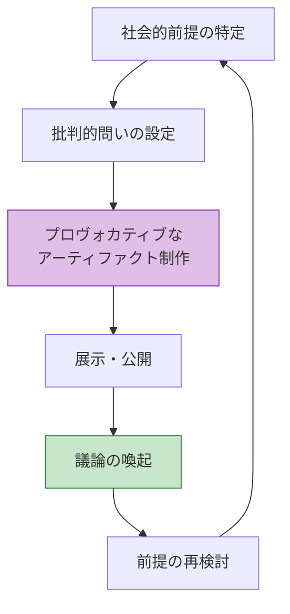
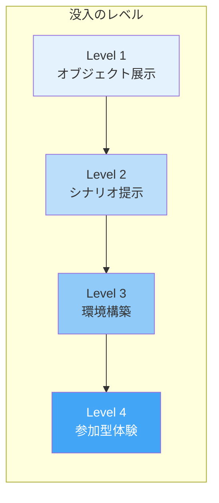
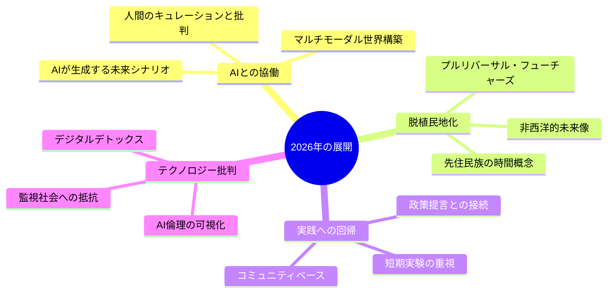

# 第5章 スペキュラティブデザイン

Book 2: デザイン・フューチャーズ ｜ 最終章

## はじめに

スペキュラティブデザイン（Speculative Design）は、商業的な問題解決を目的とせず、**「ありうる未来の可能性を物質化し、社会的議論を触発する」**ことを目的としたデザイン実践です。本章では、この分野の理論的基盤、代表的なプロジェクト、そして2026年における展開を学びます。

## Dunne & Rabyの遺産

スペキュラティブデザインの理論的基盤は、Anthony DunneとFiona Rabyがロイヤル・カレッジ・オブ・アート（RCA）で築きました。

### A/Bマニフェスト

Dunne & Rabyは、従来のデザイン（A）とスペキュラティブデザイン（B）を対比するマニフェストを提示しました。

| デザインA（従来） | デザインB（スペキュラティブ） |
|---|---|
| 肯定的（Affirmative） | 批判的（Critical） |
| 問題解決 | 問題発見 |
| イノベーションのためのデザイン | 議論のためのデザイン |
| 消費者のため | 市民のため |
| 科学的 | 科学小説的 |
| 未来を予測する | 未来を提案する |
| 「ありそうな」に限定 | 「ありうる」を探求 |
| 現実主義 | 理想主義 |

!!! note "重要な文脈"
    このマニフェストは二項対立ではなく、スペクトラムとして理解すべきです。実際のデザイン実践は、AとBの間を流動的に行き来します。

### 主要著作

- **Design Noir**（2001）：日常的な電子機器が孕む不安やパラノイアを探求
- **Speculative Everything**（2013）：スペキュラティブデザインの包括的な理論書。フューチャーズ・コーンの概念を体系化

## クリティカルデザイン

クリティカルデザインは、スペキュラティブデザインの中核的な方法論であり、**デザインの成果物を用いて社会の前提や価値観を問い直す**実践です。

### クリティカルデザインの5原則

1. **機能ではなく意味を設計する** — 使いやすさより、考えさせる力を優先
2. **ユーザーではなく観衆を想定する** — 消費ではなく、解釈と対話を誘発
3. **解決ではなく問いを提示する** — 答えを出さず、議論の場を開く
4. **馴染みの中に異質を挿入する** — 日常的なモノに微妙な違和感を加える
5. **未来の考古学** — 架空の未来から「出土」したかのようなモノを作る

## デザインプローブ

デザインプローブ（Design Probes）は、ユーザーの潜在的な欲求や価値観を探るために設計された、**意図的に曖昧で挑発的なアーティファクト**です。

### プローブの設計手法

| 種類 | 説明 | 例 |
|------|------|-----|
| **カルチュラルプローブ** | 日記、カメラ、地図などを含むキットをユーザーに渡し、自己記録を促す | Gaver et al.の高齢者向けプローブキット |
| **テクノロジープローブ** | 機能を極限まで絞った技術プロトタイプを生活環境に設置 | 家庭内のセンサーを用いた行動記録 |
| **スペキュラティブプローブ** | 架空の未来の製品を手渡し、反応と対話を記録 | 「AIが感情を読む装置」のモックアップ |

!!! tip "プローブ活用のコツ"
    プローブの目的は「正解」を集めることではなく、予想外の反応を引き出すことです。曖昧さと余白を意図的に設計してください。

## 展示としてのメディウム

スペキュラティブデザインにおいて、**展示空間そのものがメディウム（媒体）**として機能します。ギャラリーや美術館は、日常から切り離された文脈を提供し、観客が「もし〜だったら」という思考モードに入りやすくなります。

### 展示デザインの戦略

- **Level 1**: 架空の製品を展示ケースに並べ、キャプションで文脈を説明
- **Level 2**: 製品が使われるシナリオを映像・写真・テキストで提示
- **Level 3**: 架空の未来世界全体を空間として再現（インスタレーション）
- **Level 4**: 来場者が架空世界の中で選択・行動する体験型展示

!!! example "代表的な展示プロジェクト"
    **Superflux「Mitigation of Shock」（2017）**：気候変動で食料危機に陥った近未来のリビングルームを再現。来場者は実際にその空間に入り、棚に並ぶ「昆虫食」や「LED栽培の野菜」を手に取ることで、抽象的な気候データを身体的に経験する。

## 投機の倫理

スペキュラティブデザインは強力な思考ツールですが、**無批判に実践すれば、特権的な知的遊戯に堕するリスク**があります。

### 批判的に認識すべき問題

| 批判 | 内容 |
|------|------|
| **エリート主義** | 高等教育機関やギャラリーの文脈に閉じこもり、社会の周縁にいる人々に届かない |
| **実効性の欠如** | 「議論を触発する」と言いつつ、実際の社会変革につながらない |
| **西洋中心主義** | 未来のビジョンが西洋の価値観に偏りがち |
| **感情的搾取** | ディストピア的なシナリオが不安を煽るだけに終わる |
| **代表性の問題** | 誰の未来を、誰がデザインしているのか |

!!! warning "2026年の課題"
    スペキュラティブデザインが制度的に認められるほど、その批判的な刃が鈍る「馴化（domestication）」のリスクが高まっています。常に「誰のための投機か」を問い続ける必要があります。

### 倫理的スペキュレーションの指針

1. **参加の公平性** — 影響を受ける当事者がデザインプロセスに参加できるか
2. **多様な未来** — 単一の未来ビジョンではなく、複数の可能性を提示しているか
3. **権力の可視化** — 誰が未来を定義する権力を持っているかを明示しているか
4. **応答可能性** — 観客が反論・修正・拡張できる余地があるか
5. **ケアの倫理** — 描かれる未来の中で、最も脆弱な存在への配慮があるか

## 代表的プロジェクト事例

### 1. Dunne & Raby「United Micro Kingdoms」

英国が4つの異なる政治哲学に基づく「超小国」に分裂した未来を提案。各国の乗り物をデザインすることで、政治とデザインの関係を可視化。

### 2. Superflux「Drone Aviary」

ドローンが日常化した近未来を、5種類のドローン（配送用、監視用、広告用、自警団用、ハッカー用）のプロトタイプを通じて探求。プライバシーと自律性の問題を提起。

### 3. Ai Hasegawa「I Wanna Deliver a Dolphin...」

人間がイルカを代理出産するという極端なシナリオを通じて、生殖技術、種の保存、母性の本質について問いを投げかける日本発のスペキュラティブデザイン。

### 4. Extrapolation Factory「99 Cent Futures」

ニューヨークの99セントショップに架空の未来の製品を紛れ込ませ、買い物客との対話を生み出す。ギャラリー外での公共的なスペキュレーション。

## 2026年のスペキュラティブデザイン

2026年のスペキュラティブデザインは、以下の方向に進化しています：

- **AIとの共著**: 生成AIがシナリオの初期草案を作り、デザイナーが批判的にキュレーションする協働モデル
- **脱植民地的転回**: 西洋中心の未来像を脱し、多元的な未来（Pluriversal Futures）を探求する動き
- **実践への再接続**: ギャラリーに閉じず、政策立案やコミュニティ活動に直接接続する実践的スペキュレーション
- **テクノロジー批判の深化**: AIの普及に伴い、技術楽観主義への批判的検討がさらに重要に

## まとめ

スペキュラティブデザインは、デザインの可能性を「商業的問題解決」から「社会的想像力の拡張」へと広げる実践です。しかし、その力は**常に倫理的な問いと批判的な自己省察**と共にあってこそ発揮されます。

本書（Book 2: デザイン・フューチャーズ）全体を通じて学んだ未来学、STEEPV分析、シナリオプランニング、デザインフィクション、そしてスペキュラティブデザインは、いずれも**「デフォルトの未来を拒否し、望ましい未来を能動的に構想する」**ためのツールキットです。

---

## 実践演習

!!! example "演習1：A/Bスペクトラム分析"
    自分が過去に取り組んだ、あるいは見たことのあるデザインプロジェクトを3つ選び、Dunne & RabyのA/Bマニフェストのスペクトラム上にマッピングしてください。それぞれのプロジェクトがAとBのどちら寄りか、そしてなぜそう判断したかを記述してください。

!!! example "演習2：クリティカルデザインの実践"
    「2030年、AIが人間の感情を完全に読み取れるようになった社会」という前提で、日常的なプロダクト（例：マグカップ、ドアノブ、名刺）を1つ再デザインしてください。そのプロダクトを通じて、どのような社会的問いを提起したいかを明文化してください。

!!! example "演習3：倫理的チェックリストの適用"
    本章で紹介した「倫理的スペキュレーションの5指針」を、既存のスペキュラティブデザインプロジェクト（本章の事例、またはオンラインで見つけたもの）に適用し、各指針について5段階で評価してください。最も評価が低かった指針について、改善案を提案してください。

!!! example "演習4：統合プロジェクト — Book 2の総括"
    Book 2全体の学びを統合する最終演習です。以下のステップで、チームまたは個人で取り組んでください：

    1. STEEPV分析で「2035年の教育」に関するトレンドと弱い信号を収集（第2章）
    2. 2x2シナリオマトリクスで4つの未来シナリオを構築（第3章）
    3. 最も挑発的なシナリオを選び、デザインフィクションのアーティファクトを1つ制作（第4章）
    4. そのアーティファクトを用いたミニ展示を企画し、5人以上から反応を収集（第5章）
    5. 収集した反応を分析し、プロジェクトの倫理的評価を含む報告書を作成
