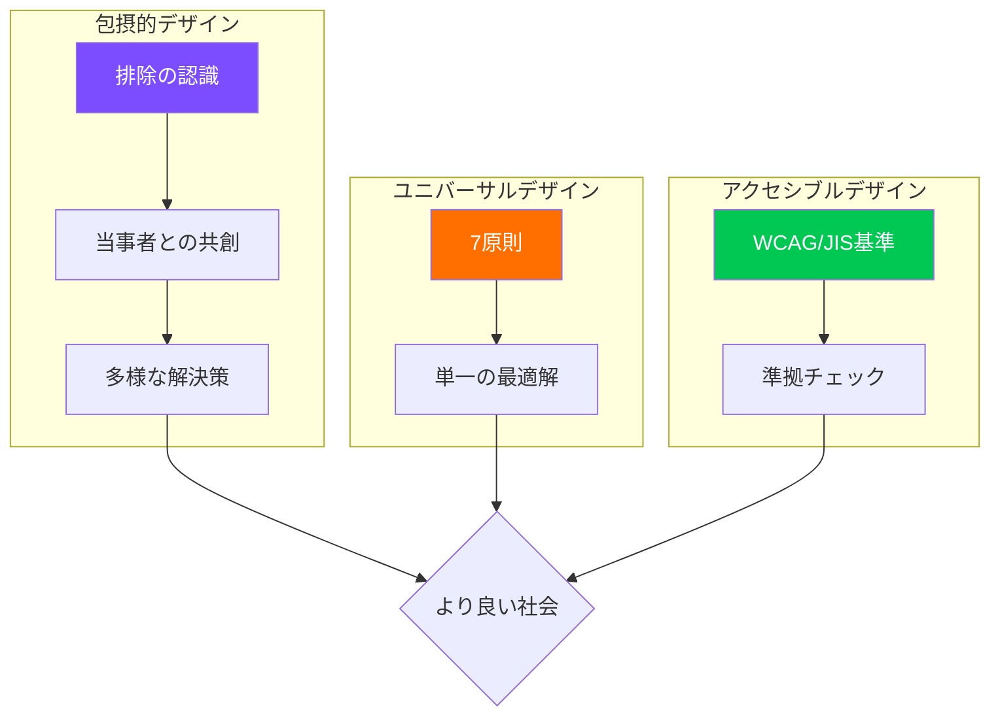
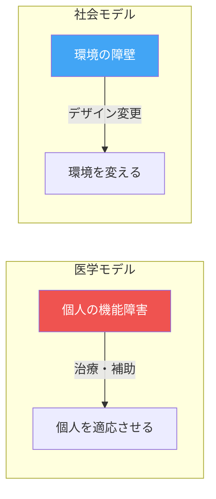
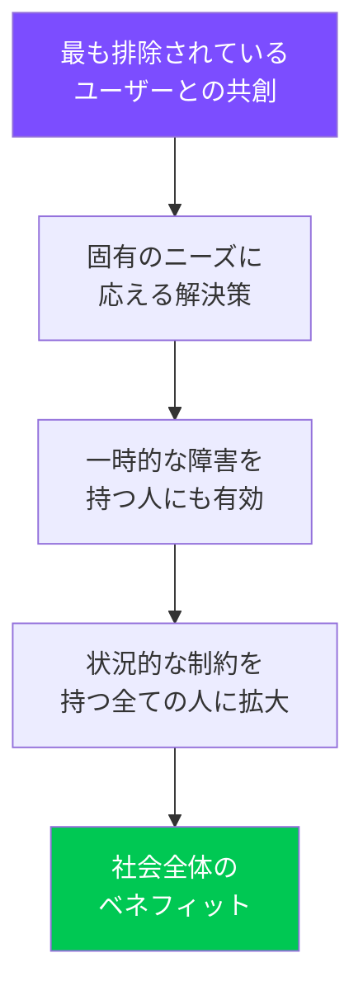

# 第1章：包摂的デザイン

**Inclusive Design — 排除のない世界をデザインする**

---

## 1.1 なぜ「包摂」が問われるのか

デザインは長らく「平均的なユーザー」を想定してきた。しかし、1940年代にアメリカ空軍が発見したように、「平均的な体型のパイロット」は実在しなかった。4,063人のパイロットの身体測定データを分析した結果、10項目すべてで平均値の範囲に収まる人間は一人もいなかったのである。「平均」に合わせたデザインは、実は誰にも合わないデザインだった。

この教訓は、現代のデジタルプロダクト、都市空間、サービスデザインにもそのまま当てはまる。私たちが「普通のユーザー」を想定するとき、無意識のうちに膨大な数の人々を排除している。包摂的デザイン（インクルーシブデザイン）は、この排除の構造を可視化し、解体するための方法論である。

!!! note "パーソンズにおける包摂的デザイン"
    パーソンズ美術大学では、包摂的デザインを単なるアクセシビリティの技術的対応ではなく、社会正義の実践として位置づけている。デザインが生み出す排除の構造を批判的に分析し、コミュニティとの協働を通じて変革する姿勢が求められる。

---

## 1.2 三つのデザインアプローチの整理

包摂的デザイン、ユニバーサルデザイン、アクセシブルデザインは混同されやすいが、それぞれ異なる哲学と方法論を持つ。

| 観点 | インクルーシブデザイン | ユニバーサルデザイン | アクセシブルデザイン |
|---|---|---|---|
| **起源** | 英国・北欧（2000年代〜） | 米国（1990年代〜） | 法規制・技術標準 |
| **目的** | 排除されてきた人々との共創 | すべての人に使えるひとつの解 | 障害のある人への対応 |
| **アプローチ** | プロセス重視・参加型 | 原則ベース・設計指針 | 基準準拠・チェックリスト |
| **対象範囲** | 排除の構造全体 | 製品・環境の物理設計 | 主にデジタル（WCAG等） |
| **限界** | スケーラビリティの課題 | 「すべての人」の理想主義 | 最低基準にとどまりがち |

!!! tip "実務での使い分け"
    これら三つは対立するものではなく、補完的に活用すべきである。アクセシブルデザインで最低基準を満たし、ユニバーサルデザインの原則で設計の質を高め、インクルーシブデザインのプロセスでコミュニティの声を反映させる。

---

## 1.3 障害の二つのモデル

包摂的デザインを理解するうえで、障害（disability）の捉え方の転換は決定的に重要である。

### 医学モデル（Medical Model）

医学モデルは、障害を個人の身体的・精神的な「欠損」として捉える。この視点では、問題は個人にあり、解決策は治療やリハビリテーションである。デザインにおいては、「障害者向けの特別な対応」として補助的な機能を追加するアプローチにつながる。

### 社会モデル（Social Model）

社会モデルは、障害を社会環境がつくり出すものとして捉える。車いすユーザーが建物に入れないのは、その人の身体が「欠損」しているからではなく、建物が階段しか用意していないからである。この視点では、問題はデザインや社会構造にあり、変えるべきは環境の側である。

!!! warning "言葉の持つ力"
    「障害者にも使えるようにする」という表現は、医学モデルに基づいている。包摂的デザインでは「障壁を取り除く」「排除をなくす」という表現を用いる。言葉の選び方自体が、デザイナーの姿勢を表す。

---

## 1.4 インターセクショナリティとデザイン

法学者キンバリー・クレンショーが1989年に提唱したインターセクショナリティ（交差性）の概念は、包摂的デザインに不可欠な視座を提供する。

人は単一のアイデンティティで生きているわけではない。人種、ジェンダー、障害、年齢、経済状況、言語、文化的背景など、複数の属性が交差する場所に、固有の排除が生まれる。

例えば、音声認識システムは以下のような交差的排除を生む場合がある。

- 標準語以外の方言を話す高齢者
- 非母語話者かつ聴覚障害のある移民
- トランスジェンダーの人々（声の特性と登録情報の不一致）

!!! example "交差的排除の事例"
    ある都市の公共交通アプリが、視覚障害者向けのスクリーンリーダーに対応していたとしても、そのアプリが英語のみで提供されていれば、日本語話者の視覚障害者は依然として排除される。アクセシビリティと多言語対応という二つの軸が交差する地点に、見えにくい排除が存在する。

デザイナーは、単一の属性だけでなく、属性の交差点に生まれる排除を想像し、調査する能力を養わなければならない。

---

## 1.5 Microsoftインクルーシブデザインツールキット

Microsoftが公開しているインクルーシブデザインツールキットは、実践的なフレームワークとして世界的に活用されている。その中核概念は以下の三つである。

### 排除の認識（Recognize Exclusion）

デザインの決定が誰を排除しているかを意識的に発見する。

### ペルソナスペクトラム（Persona Spectrum）

障害を「永続的・一時的・状況的」の三段階で捉え直す。

| 感覚 | 永続的 | 一時的 | 状況的 |
|---|---|---|---|
| **視覚** | 全盲 | 白内障手術後 | 運転中 |
| **聴覚** | ろう者 | 耳の感染症 | 騒がしいバー |
| **運動** | 片腕切断 | 腕の骨折 | 赤ちゃんを抱いている親 |
| **認知** | 学習障害 | 脳震盪後 | 極度の疲労・ストレス |

このスペクトラムの概念は重要である。片腕の人のために設計した解決策は、腕を骨折した人にも、赤ちゃんを抱えた親にも役立つ。**エッジケースのためのデザインは、すべての人のためのデザインになる。**

### 一人から学び、多くに届ける（Solve for One, Extend to Many）

最も排除されている人々と共にデザインすることで、より多くの人に恩恵をもたらす解決策が生まれる。

---

## 1.6 エッジケースのためのデザイン

従来の設計思想では、エッジケース（極端な利用条件や少数派のユーザー）は後回しにされるか、無視されてきた。しかし包摂的デザインは、エッジケースこそが革新の源泉であると主張する。

歴史的にも、エッジケースから生まれた革新は数多い。

- **カーブカット（歩道の段差解消）**：車いすユーザーのために設計され、ベビーカー、キャリーバッグ、自転車など多くの人に恩恵をもたらした
- **テキストメッセージ（SMS）**：聴覚障害者のコミュニケーション支援から、世界で最も使われるコミュニケーション手段へ
- **電子書籍リーダーの文字サイズ変更**：弱視者のニーズから、あらゆる読者の快適さへ

!!! tip "カーブカット効果"
    エッジケースのために生み出された解決策が、社会全体に広く恩恵をもたらす現象を「カーブカット効果」と呼ぶ。包摂的デザインの最も強力な論拠のひとつである。

---

## 1.7 包摂的デザインプロセスの実践

包摂的デザインは、既存のデザインプロセスに「付け加える」ものではなく、プロセス全体を再構成するものである。

1. **チームの多様性を確保する**：当事者をデザインチームに招く
2. **排除マッピングを行う**：既存のプロダクト・サービスが誰を排除しているかを系統的に調査する
3. **ペルソナスペクトラムを作成する**：永続的・一時的・状況的な障壁を可視化する
4. **エッジケースから設計する**：最も困難な条件を出発点とする
5. **当事者とともにテストする**：代理テストではなく、当事者による評価を行う
6. **継続的に改善する**：包摂性は到達点ではなく、継続的なプロセスである

---

## 演習問題

!!! example "演習1：排除マッピング"
    自分が日常的に使用しているデジタルサービス（SNS、交通アプリ、ECサイトなど）を一つ選び、以下の観点で排除マッピングを行いなさい。

    1. 視覚・聴覚・運動・認知の各次元で、どのような排除が存在するか
    2. 言語・文化・経済状況の観点から、誰がアクセスできないか
    3. インターセクショナリティの視点で、交差的排除が発生する場面を特定せよ
    4. 発見した排除に対する改善案を、ペルソナスペクトラムを用いて提案せよ

!!! example "演習2：カーブカット効果の探索"
    身の回りのプロダクトやサービスの中から、「特定の少数派のニーズから生まれ、広く社会に恩恵をもたらしたデザイン」の事例を3つ以上発見し、それぞれについて以下を分析せよ。

    - 元々のターゲットユーザーは誰だったか
    - どのような経緯で広く普及したか
    - 現在、どのようなユーザー群に恩恵をもたらしているか

!!! example "演習3：インクルーシブ再設計"
    大学キャンパス内の特定の空間（図書館、食堂、教室など）を選び、包摂的デザインの観点から再設計を提案せよ。医学モデルではなく社会モデルに基づき、物理的・感覚的・認知的・社会的な障壁を特定し、それぞれの解消策を具体的に示すこと。

---

## 参考文献

- Holmes, K. (2018). *Mismatch: How Inclusion Shapes Design*. MIT Press.
- Microsoft. (2016). *Inclusive Design Toolkit*. microsoft.com/design/inclusive
- Hamraie, A. (2017). *Building Access: Universal Design and the Politics of Disability*. University of Minnesota Press.
- Crenshaw, K. (1989). Demarginalizing the Intersection of Race and Sex. *University of Chicago Legal Forum*, 1989(1), 139-167.
