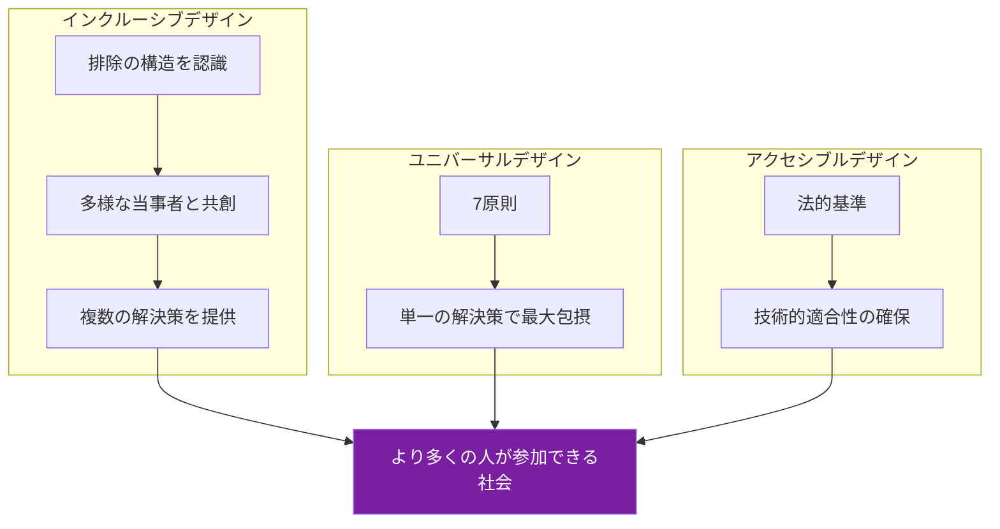
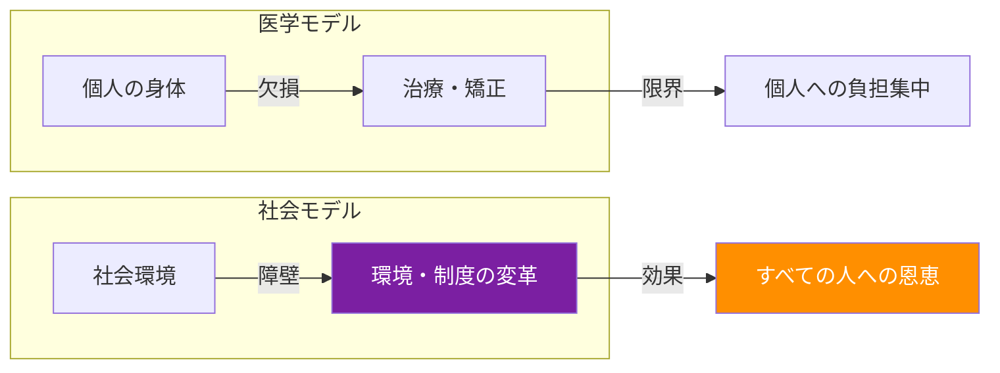
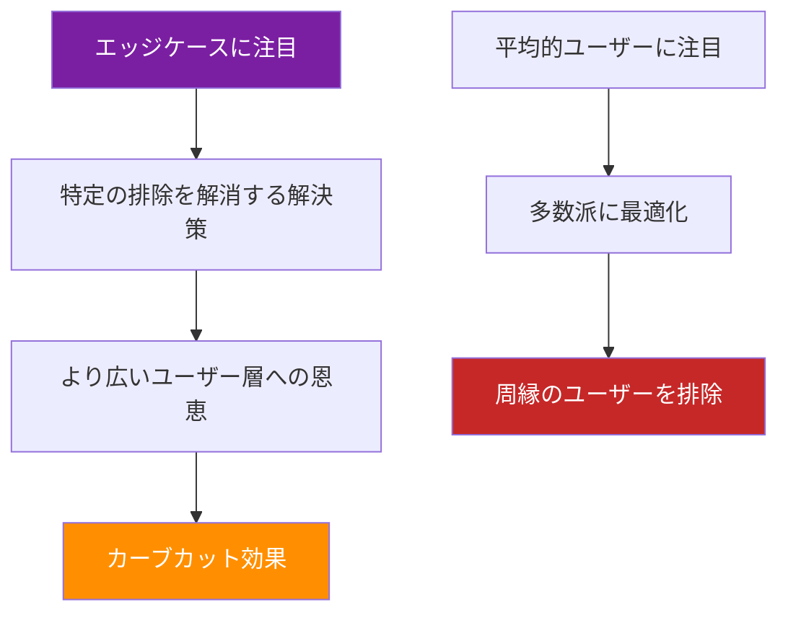
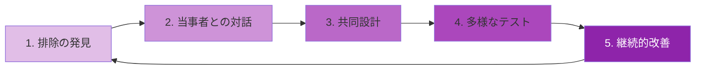

# 第1章：包摂的デザイン

## はじめに：排除はデザインされている

私たちが日常的に使う製品、サービス、空間の多くは、特定の身体的・認知的・社会的特性を持つ人々を「標準」として設計されている。階段しかない建物は車椅子ユーザーを排除し、色のみで情報を伝えるインターフェースは色覚多様性のある人々を排除する。こうした排除は偶然ではなく、デザインプロセスにおける意思決定の結果——つまり、排除は「デザインされている」のである。

包摂的デザイン（Inclusive Design）は、この構造的排除を認識し、可能な限り多くの人々が参加・利用できるデザインを目指す方法論である。本章では、その理論的基盤と実践的手法を学ぶ。

---

## 1.1 三つの概念の整理：インクルーシブ・ユニバーサル・アクセシブル

デザインにおける包摂性を議論する際、しばしば混同される三つの概念を整理する。

| 概念 | 起源 | 焦点 | アプローチ |
|------|------|------|-----------|
| **ユニバーサルデザイン** | 1980年代・米国（ロナルド・メイス） | すべての人が使える単一の解決策 | 7原則に基づく設計 |
| **アクセシブルデザイン** | 法規制（ADA、WCAG等） | 障害のある人々の利用保障 | 技術的基準への適合 |
| **インクルーシブデザイン** | 2000年代・英国/カナダ | 排除のメカニズムの理解と解消 | 多様な参加者との共創プロセス |

!!! tip "三者の関係"
    アクセシブルデザインは法的最低基準の充足、ユニバーサルデザインは単一解での最大包摂、インクルーシブデザインは排除の構造自体を問い直すプロセスである。三者は対立するものではなく、補完的に機能する。

---

## 1.2 障害の二つのモデル

包摂的デザインを理解するうえで、障害（disability）をどう捉えるかは根本的に重要である。

### 医学モデル（Medical Model）

障害を個人の身体的・精神的な「欠損」として捉える。この見方では、問題は個人の側にあり、治療やリハビリによって「正常」に近づけることが解決策となる。

### 社会モデル（Social Model）

障害を社会環境が生み出す「障壁」として捉える。この見方では、問題は社会の側にあり、環境・制度・態度を変えることが解決策となる。車椅子ユーザーが建物に入れないのは、その人の身体が問題なのではなく、階段しかない建物のデザインが問題なのである。

!!! warning "デザイナーへの警告"
    医学モデルに基づくデザインは、しばしば「障害者のための特別な製品」を生み出し、結果としてスティグマ（社会的烙印）を強化する。社会モデルに立脚することで、デザイナーは環境と制度の側を変える力を持つ。

近年は、両モデルを統合した**相互作用モデル**（ICF：国際生活機能分類）も重要視されている。個人の心身機能と環境要因の相互作用として障害を捉える視点である。

---

## 1.3 インターセクショナリティとデザイン

インターセクショナリティ（交差性）は、法学者キンバリー・クレンショーが1989年に提唱した概念で、人種、ジェンダー、階級、障害、年齢、性的指向などの社会的カテゴリーが交差することで、固有の排除経験が生まれることを指す。

デザインにおけるインターセクショナリティの視点は、「ペルソナ」の限界を超えるために不可欠である。

!!! example "交差する排除の例"
    - **高齢×低所得×地方在住**：デジタルヘルスケアアプリの恩恵を受けにくい
    - **女性×障害×非英語話者**：多くのアクセシビリティツールが英語中心に設計されている
    - **トランスジェンダー×有色人種**：行政手続きのフォームで性別二元論と人種カテゴリーの両方に排除される

デザイナーは、単一のアイデンティティ軸だけでなく、複数の軸が交差する地点に注目する必要がある。

---

## 1.4 Microsoft Inclusive Design Toolkit

マイクロソフトのインクルーシブデザインツールキットは、理論を実践に橋渡しする代表的なフレームワークである。以下の三原則で構成される。

### 原則1：排除を認識する（Recognize Exclusion）

デザイナー自身のバイアスを自覚し、誰が排除されているかを意識的に探す。

### 原則2：多様性から学ぶ（Learn from Diversity）

排除されてきた人々をデザインプロセスの専門家として招き入れる。

### 原則3：一人のために解決し、多くに拡張する（Solve for One, Extend to Many）

特定の状況にある一人のために最適化された解決策が、結果としてより多くの人に恩恵をもたらす。

!!! note "ペルソナ・スペクトラム"
    マイクロソフトは、障害を「永続的（permanent）」「一時的（temporary）」「状況的（situational）」の三段階で捉える**ペルソナ・スペクトラム**を提案している。

| 状態 | 片腕の例 | 視覚の例 | 聴覚の例 |
|------|---------|---------|---------|
| 永続的 | 片腕切断 | 視覚障害 | 聴覚障害 |
| 一時的 | 腕の骨折 | 白内障手術後 | 耳の感染症 |
| 状況的 | 赤ちゃんを抱えている | 強い日差し | 騒がしいバー |

この枠組みにより、「障害者のための設計」から「すべての人が一時的に経験しうる排除への対応」へと視点が転換される。

---

## 1.5 エッジケースからのデザイン

従来のデザインプロセスでは、「平均的なユーザー」を中心に設計し、「エッジケース」は後回しにされがちであった。しかし、包摂的デザインはこの優先順位を逆転させる。

!!! tip "カーブカット効果"
    歩道の縁石を切り下げたカーブカット（curb cut）は、元々車椅子ユーザーのために設計された。しかし、ベビーカーを押す親、スーツケースを引く旅行者、自転車利用者など、はるかに多くの人々が恩恵を受けている。エッジケースのためのデザインが、主流に波及する現象を「カーブカット効果」と呼ぶ。

エッジケースからデザインすることの利点は以下の通りである。

1. **イノベーションの源泉**：制約が大きい状況は、創造的な解決策を生む
2. **堅牢性の向上**：極端な条件でも機能するデザインは、通常条件での信頼性も高い
3. **市場の拡大**：排除されていた人々が新たなユーザーとなる
4. **倫理的正当性**：社会的公正に貢献する

---

## 1.6 包摂的デザインの実践プロセス

包摂的デザインを実践するための5段階プロセスを以下に示す。

**1. 排除の発見**：誰が、どのような状況で排除されているかを体系的に調査する。ペルソナ・スペクトラムを活用し、永続的・一時的・状況的な排除を洗い出す。

**2. 当事者との対話**：排除を経験している人々と直接対話し、彼らの専門知識から学ぶ。「代弁」ではなく「傾聴」の姿勢が重要である。

**3. 共同設計**：当事者をデザインプロセスの共創者として位置づけ、共にアイデアを生成し、プロトタイプを作成する。

**4. 多様なテスト**：多様な身体的特性、認知的特性、社会的背景を持つ人々によるユーザーテストを実施する。

**5. 継続的改善**：デザインは完成しない。フィードバックを受け続け、排除の新たな形態に対応し続ける。

---

## 実践演習

!!! example "演習1：排除マッピング（個人ワーク・30分）"
    自分が日常的に使う製品・サービス・空間を一つ選び、以下を分析せよ。

    1. その製品は誰を「標準的ユーザー」として想定しているか
    2. ペルソナ・スペクトラムを用いて、永続的・一時的・状況的に排除される人々を列挙せよ
    3. インターセクショナリティの観点から、複数のアイデンティティが交差する排除を最低2つ特定せよ
    4. 排除を解消するためのデザイン改善案を3つ提案せよ

!!! example "演習2：カーブカット効果の発見（グループワーク・60分）"
    チームで街に出て、以下のフィールドワークを行え。

    1. 街中でカーブカット効果が観察できる事例を5つ以上見つけ、写真を撮影せよ
    2. 各事例について、元々誰のために設計されたか、実際に誰が恩恵を受けているかを分析せよ
    3. 逆に、特定の人々を排除しているデザインを3つ以上発見し、改善案を提案せよ
    4. 発見をチームでまとめ、5分間のプレゼンテーションを行え

!!! example "演習3：インクルーシブ・リデザイン（グループワーク・90分）"
    大学内の施設やサービスを一つ選び、包摂的デザインの5段階プロセスに沿ってリデザインせよ。

    1. 施設/サービスの現状における排除を調査する
    2. 可能であれば排除を経験している当事者にインタビューする
    3. 改善案のプロトタイプを作成する（紙、デジタル、いずれでも可）
    4. 多様なユーザーにテストしてもらい、フィードバックを得る
    5. 最終提案をまとめ、施設管理者に提出できる形式で文書化する
