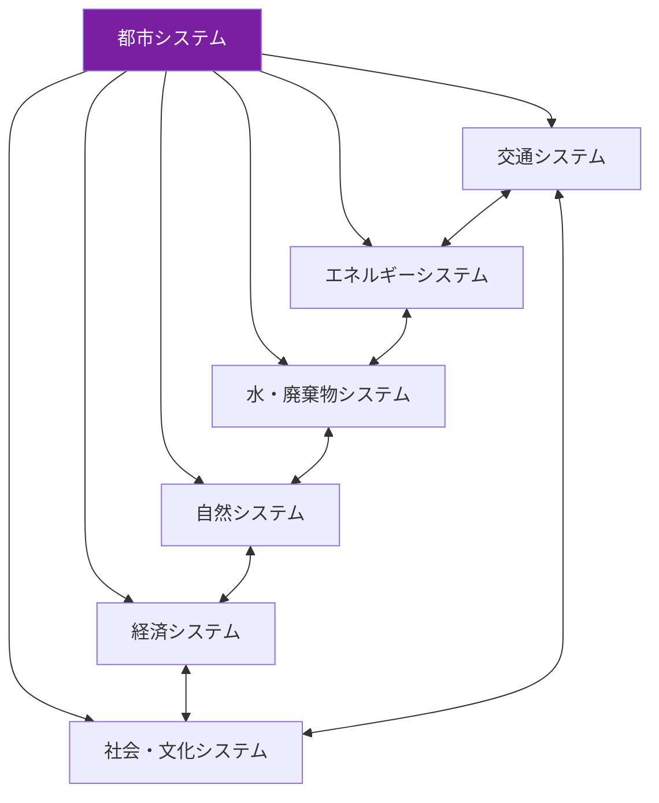
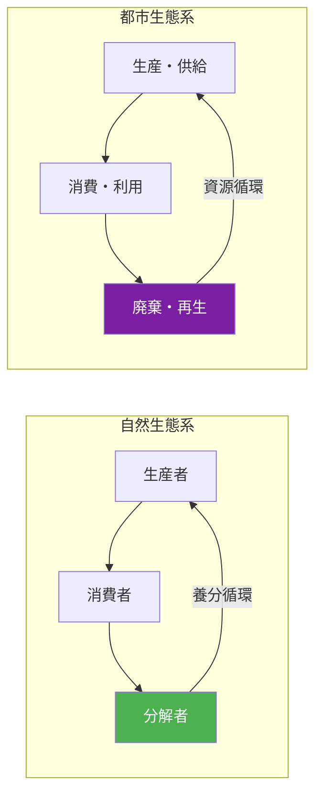
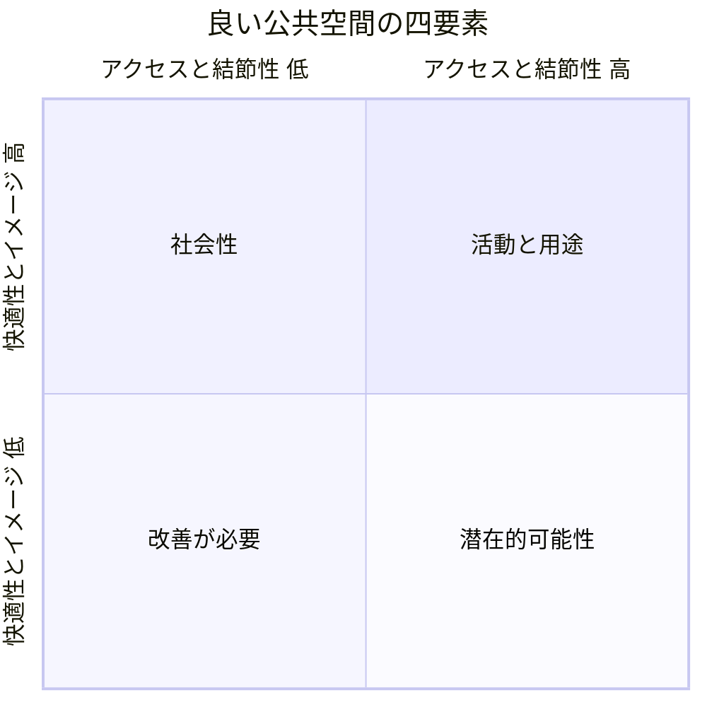
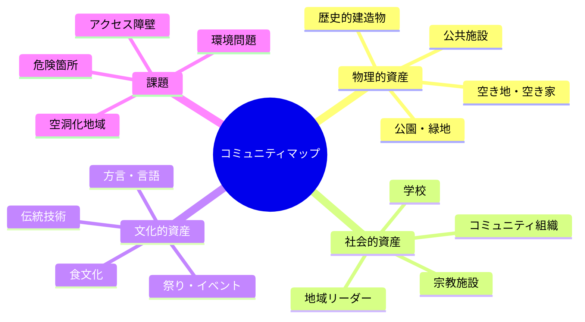

# 第2章：都市生態学

## はじめに：都市は生きている

世界人口の56%が都市に暮らし、2050年にはその割合が68%に達すると予測されている。都市は人類文明の最も複雑な人工物であり、建築、インフラ、制度、文化、自然環境が絡み合う動的なシステムである。本章では、都市を一つの「生態系」として捉え、デザイナーが都市に介入するための理論と手法を学ぶ。

パーソンズ美術大学は、ニューヨークという巨大都市に立地する利点を活かし、「Urban Ecologies」プログラムを通じて、都市の複雑性に向き合うデザイン教育を実践してきた。

---

## 2.1 都市システム思考：都市をシステムとして見る

都市は、個別の建物や道路の集合体ではなく、相互に依存し合う複数のサブシステムから成る複合システムである。

!!! note "ジェイン・ジェイコブズの洞察"
    都市計画家ジェイン・ジェイコブズは『アメリカ大都市の死と生』（1961年）で、都市を「組織化された複雑性の問題」として捉えた。都市の活力は、トップダウンの計画ではなく、多様な要素の自己組織化から生まれると主張した。この視点は、現代の都市生態学の基盤となっている。

都市システム思考の核心は、以下の認識にある。

| 特性 | 説明 | デザインへの示唆 |
|------|------|----------------|
| **相互依存性** | 一つのシステムの変化が他に波及する | 単一領域の最適化ではなく全体最適を考える |
| **創発性** | 部分の総和以上の特性が出現する | 結果を完全に予測できないことを前提とする |
| **フィードバック** | 結果が原因に影響を与える循環構造 | 介入後のモニタリングと適応が不可欠 |
| **レジリエンス** | 撹乱に対する復元力 | 冗長性と多様性を設計に組み込む |
| **適応性** | 環境変化に応じた自己変容 | 固定的でなく進化可能なデザインを目指す |

---

## 2.2 都市をエコシステムとして捉える

生態学（エコロジー）の概念を都市に適用することで、新たな設計視点が開かれる。

都市を生態系として見ると、以下の分析視点が得られる。

**物質代謝（Urban Metabolism）**：都市に流入するエネルギー、水、食料、材料と、流出する廃棄物、排水、排気の収支を分析する。持続可能な都市は、この代謝を循環型に転換する。

**生息地としての都市（Urban Habitat）**：都市は人間だけでなく、多様な動植物の生息地でもある。生物多様性を考慮した都市デザインは、ヒートアイランド現象の緩和、雨水管理、精神的健康の向上など、多面的な恩恵をもたらす。

**社会的生態系（Social Ecosystem）**：人々の関係性、コミュニティのネットワーク、文化的多様性もまた、都市の「生態系」の一部である。ジェントリフィケーション（高級化）は、この社会的生態系を破壊する現象として理解できる。

!!! warning "都市のモノカルチャーに注意"
    農業におけるモノカルチャー（単一栽培）が生態系を脆弱にするように、都市の機能的・社会的・文化的均質化もレジリエンスを低下させる。用途が混在し、多様な人々が共存する地区ほど、都市としての健全性が高い。

---

## 2.3 プレイスメイキング

プレイスメイキング（Placemaking）は、コミュニティの参加を通じて、公共空間を人々にとって意味のある「場所」に変容させるアプローチである。

!!! tip "スペース（空間）とプレイス（場所）の違い"
    地理学者イーフー・トゥアンは、空間（space）が人間の経験と意味によって満たされたとき、場所（place）になると論じた。プレイスメイキングとは、抽象的な空間を、人々が愛着を持つ場所へと変容させる行為である。

プレイスメイキングの四つの柱（Project for Public Spacesによる）：

1. **アクセスと結節性**：歩いて到達でき、周辺環境と視覚的・物理的につながっているか
2. **快適性とイメージ**：安全で、清潔で、座る場所があり、魅力的な景観があるか
3. **活動と用途**：人々が実際に行う活動があるか、時間帯を通じて活用されているか
4. **社会性**：人々が出会い、交流し、コミュニティの一員であると感じられるか

---

## 2.4 タクティカル・アーバニズム

タクティカル・アーバニズム（Tactical Urbanism）は、小規模で短期的な介入を通じて、長期的な都市変革を触発するアプローチである。

| 特性 | 従来の都市計画 | タクティカル・アーバニズム |
|------|-------------|----------------------|
| 規模 | 大規模 | 小規模 |
| 期間 | 長期（数年〜数十年） | 短期（数日〜数ヶ月） |
| コスト | 高額 | 低コスト |
| 主体 | 行政・専門家 | 市民・コミュニティ |
| リスク | 失敗の影響大 | 失敗しても修正可能 |
| 許可 | 公式な承認が必要 | 非公式に開始可能 |

!!! example "タクティカル・アーバニズムの代表的手法"
    - **パークレット**：路上駐車スペースを一時的な小公園に変える
    - **オープンストリート**：車道を歩行者・自転車に一時開放する
    - **ポップアップショップ**：空き店舗を短期的に活用する
    - **ゲリラガーデニング**：放置された土地に植栽する
    - **ストリートペインティング**：路面にアートを施し、交通行動を変える

---

## 2.5 コミュニティマッピング

コミュニティマッピングは、地域の資産（アセット）、課題、関係性を住民の視点から可視化する手法である。専門家が作成する地図とは異なり、住民の知識と経験に基づく「カウンターマッピング」として機能する。

マッピングの手法には、紙地図へのシール貼り、デジタルGISツール、写真による「フォトボイス」、歩行型の「トランセクトウォーク」などがある。重要なのは、誰がマッピングの主体となるかであり、住民自身が地域の専門家として参加することが不可欠である。

---

## 2.6 レジリエント・シティ

レジリエンス（回復力・適応力）は、気候変動、パンデミック、経済危機など、予測困難な撹乱に対する都市の対応能力を指す概念である。

!!! note "ロックフェラー財団の100レジリエント・シティ"
    2013年に開始されたこのプログラムは、世界100都市にチーフ・レジリエンス・オフィサー（CRO）を配置し、都市レジリエンス戦略の策定を支援した。デザイナーはレジリエンス戦略の策定において重要な役割を果たしている。

レジリエントな都市の設計原則：

1. **冗長性**：重要機能を複数のシステムで担保する
2. **多様性**：経済、社会、生態の多様性を確保する
3. **モジュール性**：一部の障害が全体に波及しない構造
4. **適応的ガバナンス**：状況変化に応じた柔軟な意思決定
5. **社会的結束**：コミュニティの信頼と協力のネットワーク

---

## 2.7 パーソンズ「Urban Ecologies」のアプローチ

パーソンズ美術大学のUrban Ecologiesプログラムは、以下の点で特徴的なデザイン教育を実践している。

**場所に根ざした学び**：学生はスタジオの中だけでなく、ニューヨーク市の特定のコミュニティに入り込み、その場所の歴史、文化、社会関係、物理的環境を深く理解することから始める。

**学際的アプローチ**：デザイン、建築、社会学、生態学、公共政策、アートの領域を横断し、都市の複雑性に多角的に対応する。

**介入と省察の循環**：小規模な介入を実施し、その効果と影響を批判的に省察し、次の介入に活かすという反復的プロセスを重視する。

**非人間への配慮**：人間中心設計を超えて、動植物、土壌、水系、大気など、都市に共存する非人間的存在への配慮を設計に組み込む。

---

## 実践演習

!!! example "演習1：都市代謝マッピング（個人ワーク・45分）"
    自分が住む地域の半径500m以内を対象に、以下の「都市代謝マップ」を作成せよ。

    1. **流入**：エネルギー（電力、ガス）、水、食料、物資がどこから来ているか
    2. **変換**：地域内でどのような生産・消費活動が行われているか
    3. **流出**：廃棄物、排水、排気がどこへ行くか
    4. **循環**：リサイクル、再利用、シェアリングなど、資源が循環している箇所はあるか
    5. マップに基づき、代謝の循環性を高めるデザイン提案を3つ行え

!!! example "演習2：タクティカル・アーバニズム提案（グループワーク・120分）"
    キャンパス周辺の公共空間を一つ選び、タクティカル・アーバニズムの手法で介入提案を行え。

    1. 対象空間の現状を観察・記録する（写真、スケッチ、利用者カウント）
    2. コミュニティマッピングの手法で、周辺住民の視点を取り入れる
    3. 低コスト・短期間で実施可能な介入案を3つ以上発想する
    4. 1つの案を選び、簡易プロトタイプ（1:50模型またはデジタルモックアップ）を作成する
    5. 介入の効果をどのように測定するか、評価計画を立案する

!!! example "演習3：レジリエンス・シナリオ（グループワーク・90分）"
    自分の住む都市が以下のいずれかの撹乱に直面したと仮定し、デザインによるレジリエンス強化策を提案せよ。

    - シナリオA：大規模水害（河川氾濫、内水氾濫）
    - シナリオB：パンデミックによる都市封鎖
    - シナリオC：主要産業の衰退による人口流出

    1. 撹乱が都市の各サブシステムに与える影響を因果関係図で示せ
    2. レジリエンスの5原則に基づき、短期（1ヶ月）・中期（1年）・長期（10年）の対応策を提案せよ
    3. コミュニティの社会的結束を強化するデザイン介入を具体的に3つ提案せよ
