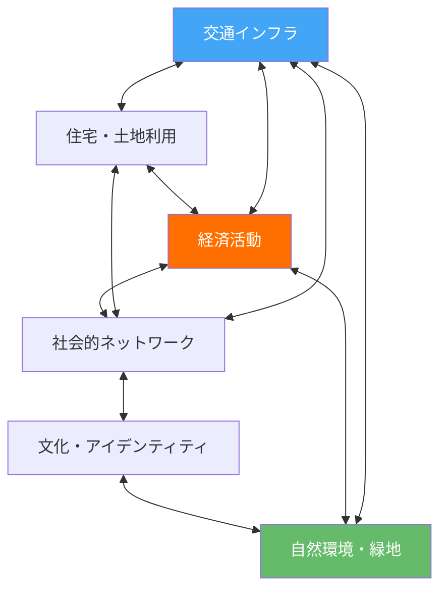
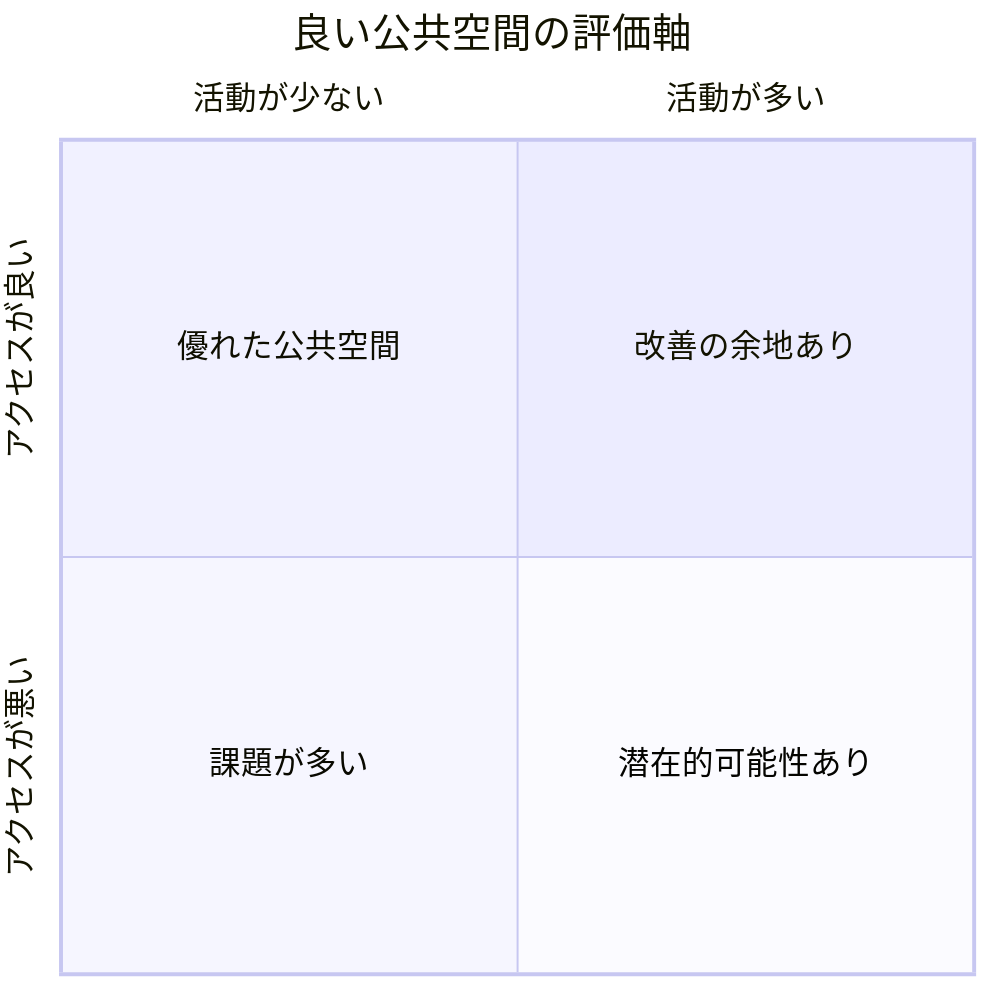
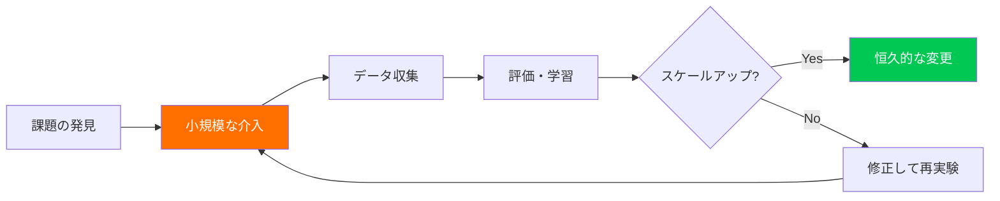

# 第2章：都市生態学

**Urban Ecologies — 都市をエコシステムとして読み解く**

---

## 2.1 都市生態学とは何か

都市は単なる建築物の集合体ではない。人々、制度、インフラ、自然環境、経済活動、文化が複雑に絡み合う「生態系（エコシステム）」である。都市生態学（Urban Ecologies）は、この複雑な相互作用を理解し、そこにデザインで介入するための知的枠組みである。

パーソンズ美術大学の Design and Urban Ecologies（デザインと都市生態学）プログラムは、この分野の先駆的な教育プログラムとして知られる。同プログラムは、デザイナーを都市の観察者・分析者・介入者として訓練し、社会的・環境的・政治的な文脈の中でデザインを実践する力を養う。

!!! note "パーソンズの都市生態学アプローチ"
    パーソンズの Urban Ecologies プログラムは、建築やアーバンデザインの伝統的なアプローチとは一線を画す。物理的な空間の設計だけでなく、都市における権力関係、社会的公正、環境正義を批判的に分析し、コミュニティとの協働を通じて変革を実践する。

---

## 2.2 都市システム思考

都市を理解するためには、個別の要素ではなく、要素間の関係性に着目するシステム思考が不可欠である。

都市の各要素は独立して存在するのではなく、相互に依存し、フィードバックループを形成している。例えば、交通インフラの変化は土地利用パターンを変え、それが経済活動を変え、社会的ネットワークに影響を与え、最終的に文化やアイデンティティにまで波及する。

### 都市を読む四つのレイヤー

| レイヤー | 要素 | 分析の視点 |
|---|---|---|
| **物理的** | 建築、道路、インフラ、地形 | 空間構造、アクセシビリティ、物質的フロー |
| **社会的** | コミュニティ、制度、権力関係 | 社会的結束、排除と包摂、ガバナンス |
| **経済的** | 産業、雇用、不動産、消費 | 価値の生産・分配、ジェントリフィケーション |
| **生態的** | 緑地、水系、気候、生物多様性 | 環境負荷、レジリエンス、生態系サービス |

---

## 2.3 都市をエコシステムとして捉える

生態学の概念を都市に適用することで、従来見えなかったパターンが浮かび上がる。

**物質代謝（Urban Metabolism）**：都市はエネルギー、水、食料、資材を取り込み、廃棄物、排水、CO2を排出する。この「都市の代謝」を可視化することで、サステナビリティの課題が明確になる。

**ニッチと多様性**：生態系と同様に、都市にも多様な「ニッチ」が存在する。商店街の小さな個人商店は、大型チェーン店とは異なるニッチを占めている。この多様性の喪失は、都市全体のレジリエンスを低下させる。

**遷移（Succession）**：生態系が時間とともに変化するように、都市の地域も遷移する。工業地帯からアートディストリクトへ、さらにジェントリフィケーションによる高級住宅地への変遷は、生態学的遷移に類似している。

!!! warning "ジェントリフィケーションへの批判的視座"
    都市の「再生」や「活性化」という言葉は、しばしば既存のコミュニティの排除を覆い隠す。デザイナーが都市に介入する際は、自らの活動がジェントリフィケーションを加速させていないかを常に批判的に検証する必要がある。

---

## 2.4 プレイスメイキング

プレイスメイキング（Placemaking）は、コミュニティが主体となって公共空間を意味のある「場所（place）」に変換するプロセスである。都市計画家のフレッド・ケントが設立したProject for Public Spaces（PPS）によって体系化された。

### 良い公共空間の四要素

PPSが提唱する四つの要素は以下の通りである。

1. **アクセスとリンケージ（Access & Linkages）**：物理的にも視覚的にもアクセスしやすく、周辺地域と接続されているか
2. **快適さとイメージ（Comfort & Image）**：安全で清潔、座れる場所があり、魅力的な外観を持つか
3. **活動と用途（Uses & Activities）**：人々が実際に行いたい活動が可能で、多様な用途に対応しているか
4. **社交性（Sociability）**：人々が出会い、交流し、コミュニティの一体感を感じられるか

!!! example "プレイスメイキングの成功事例"
    ニューヨークのタイムズスクエア歩行者天国化は、プレイスメイキングの代表的成功事例である。2009年に自動車を排除し歩行者空間を拡大した結果、歩行者の怪我が35%減少し、地域の商業売上も増加した。さらに、市民の満足度も大幅に向上した。

---

## 2.5 タクティカル・アーバニズム

タクティカル・アーバニズム（Tactical Urbanism）は、低コスト・短期間・小規模の介入によって、都市空間の可能性を実験的に検証する手法である。マイク・ライドンとアンソニー・ガルシアによって理論化された。

### タクティカル・アーバニズムの原則

| 原則 | 説明 |
|---|---|
| **段階的アプローチ** | 小さく始めて、成功を積み重ねる |
| **低コスト** | 大規模投資の前に仮説を検証する |
| **一時的** | 恒久的な変更の前にテストする |
| **コミュニティ主導** | 住民が主体的に参加する |
| **データ駆動** | 介入の効果を測定・検証する |

具体的な手法としては以下がある。

- **パークレット**：路上駐車スペースを一時的な公園に転換する
- **ゲリラガーデニング**：放置された都市空間を緑化する
- **ポップアップストア**：空き店舗を一時的に活用する
- **ペイントによる交差点改善**：ペイントで交差点を再設計し、安全性を検証する
- **オープンストリート**：特定の日時に道路を歩行者に開放する

---

## 2.6 コミュニティマッピング

コミュニティマッピング（Community Mapping）は、地域住民自身が主体となって、自分たちの地域の資源、課題、物語を地図上に可視化する手法である。専門家による「上から」の分析ではなく、住民の視点から都市を読み解く。

### マッピングの種類

- **アセットマッピング**：地域の強み・資源を可視化する（公園、コミュニティセンター、地域のキーパーソンなど）
- **課題マッピング**：危険な場所、不便な場所、排除が生まれる場所を特定する
- **感覚マッピング**：音、匂い、温度、光など感覚的な経験を記録する
- **記憶マッピング**：住民の記憶や物語を地図上に重ねる
- **フローマッピング**：人、物、情報の流れを追跡する

!!! tip "デジタルツールの活用"
    現代のコミュニティマッピングでは、OpenStreetMap、Mapbox、Googleマイマップなどのデジタルツールを活用できる。ただし、デジタルデバイドに注意し、紙の地図やフィジカルなワークショップも併用すること。

---

## 2.7 レジリエントシティ

レジリエントシティ（Resilient City）とは、気候変動、パンデミック、経済危機、社会的分断などの衝撃や長期的ストレスに対して、適応し回復する能力を持つ都市である。

レジリエンスは単なる「元に戻る力」ではなく、危機を通じて学習し、より良い状態へと変容する力（transformative resilience）を含む。

### 都市レジリエンスの七つの資質

1. **冗長性**：機能のバックアップが複数存在する
2. **多様性**：異なる要素が多様に存在する
3. **モジュール性**：障害が全体に波及しない構造
4. **連結性**：情報と資源が円滑に流れる
5. **包摂性**：すべての住民が意思決定に参加できる
6. **統合性**：異なるシステム間が協調する
7. **適応性**：変化する状況に柔軟に対応できる

!!! note "100 Resilient Citiesの遺産"
    ロックフェラー財団が支援した100 Resilient Cities プログラム（2013-2019）は、世界各地の都市にChief Resilience Officer（レジリエンス最高責任者）を配置し、レジリエンス戦略の策定を支援した。プログラム終了後も、そのフレームワークは多くの都市で活用されている。

---

## 2.8 デザイナーの都市への介入

パーソンズの都市生態学アプローチは、デザイナーが都市に介入する際の倫理的指針を示す。

1. **観察者として**：先入観を排し、都市の複雑な現実を丁寧に読み解く
2. **翻訳者として**：異なるステークホルダー間の対話を促進する
3. **触媒として**：コミュニティの潜在的な力を引き出す
4. **批判者として**：権力構造やジェントリフィケーションに対して批判的視座を維持する
5. **共創者として**：住民とともにデザインし、専門家としての特権を自覚する

---

## 演習問題

!!! example "演習1：都市のエコシステム分析"
    自分が住む地域の半径500m以内を対象に、都市の四つのレイヤー（物理的・社会的・経済的・生態的）を分析せよ。各レイヤー間の相互作用を図示し、システムの脆弱性とレジリエンスを評価すること。

!!! example "演習2：タクティカル・アーバニズムの提案"
    キャンパス周辺または自宅周辺で、改善の余地がある公共空間を一つ特定し、タクティカル・アーバニズムの手法を用いた介入を提案せよ。以下を含むこと。

    - 現状分析（写真・観察記録）
    - 介入のデザイン案（スケッチまたはデジタルモックアップ）
    - 必要な資材と予算の見積もり
    - 効果測定の方法
    - ステークホルダーとの合意形成プラン

!!! example "演習3：感覚マッピング"
    特定の地域を30分間歩き、五感で捉えた情報を地図上に記録せよ。視覚だけでなく、音の風景（サウンドスケープ）、匂い、触感、温度なども記録すること。通常の地図では見えないパターンや課題を発見し、レポートにまとめよ。

---

## 参考文献

- Lydon, M., & Garcia, A. (2015). *Tactical Urbanism: Short-term Action for Long-term Change*. Island Press.
- Parsons School of Design. (n.d.). *Design and Urban Ecologies MS Program*.
- Project for Public Spaces. (2018). *Placemaking: What If We Built Our Cities Around Places?*
- Meerow, S., Newell, J. P., & Stults, M. (2016). Defining urban resilience. *Landscape and Urban Planning*, 147, 38-49.
- Corner, J. (1999). The Agency of Mapping. In D. Cosgrove (Ed.), *Mappings*. Reaktion Books.
