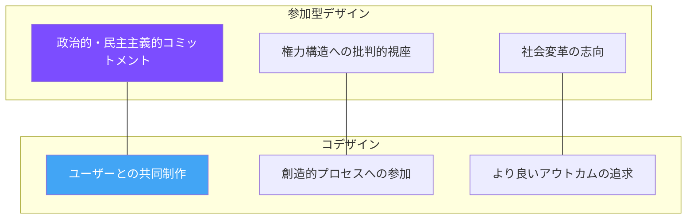
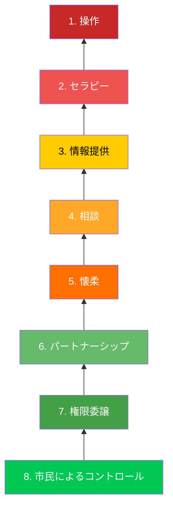
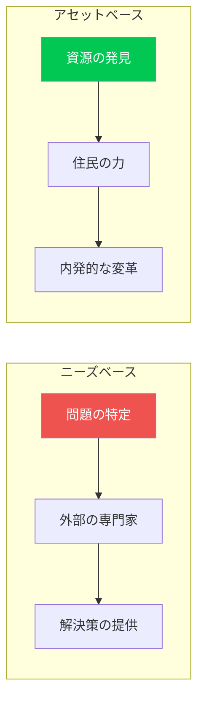
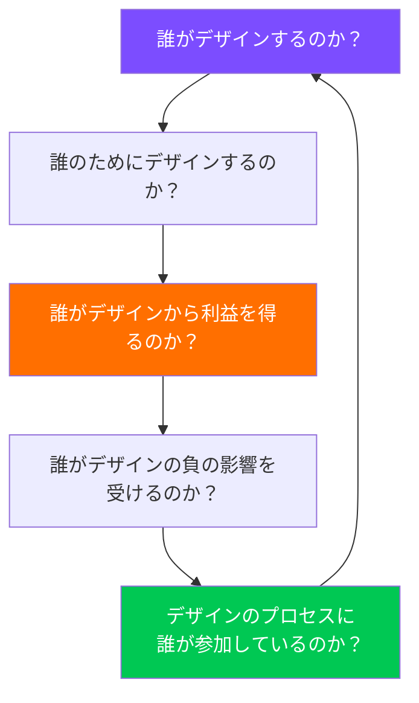

# 第3章：参加型デザイン

**Participatory Design — コミュニティとともにデザインする**

---

## 3.1 参加型デザインの起源

参加型デザイン（Participatory Design, PD）は、1970年代の北欧、特にスカンジナビア諸国の労働運動の中で誕生した。当時、コンピュータシステムが職場に導入される過程で、労働者がその設計プロセスから排除され、自分たちの仕事の条件を他者に決定されるという問題が生じていた。

スウェーデンの UTOPIA プロジェクト（1981-1985）は、新聞の組版・印刷に従事する労働者とデザイナー・研究者が協働し、労働者自身がテクノロジーの設計に参加するプロセスを開拓した。この取り組みの根底にあったのは、「自分の生活や仕事に影響を与える決定に、本人が参加する権利がある」という民主主義の原則である。

!!! note "北欧の民主主義的伝統"
    参加型デザインが北欧で生まれたのは偶然ではない。労使協調、社会民主主義、フラットな組織文化という北欧の伝統が、デザインプロセスにおける民主的参加という思想を育んだ。この文脈を理解することは、参加型デザインを他の文化圏に適用する際に極めて重要である。

---

## 3.2 コデザインと参加型デザインの違い

コデザイン（Co-design）と参加型デザイン（Participatory Design）は重なる部分が多いが、重要な違いがある。

| 観点 | 参加型デザイン | コデザイン |
|---|---|---|
| **起源** | 北欧の労働運動・民主主義 | サービスデザイン・イノベーション |
| **動機** | 民主的権利の行使 | より良い成果の実現 |
| **権力** | 権力の再分配を明確に志向 | 権力関係を必ずしも問わない |
| **政治性** | 政治的立場を明示する | 政治的中立を装うことがある |
| **参加者** | 影響を受けるすべての人 | 主にエンドユーザー |
| **目的** | 社会変革 | プロダクト・サービスの改善 |

!!! warning "「参加」の形骸化に注意"
    参加型デザインの手法が普及するにつれ、実質的な権力移譲を伴わない「参加の形骸化」が増えている。ワークショップに住民を招くだけで、最終的な意思決定はデザイナーや組織が行うのであれば、それは真の参加ではなく、正当性の調達（legitimation）にすぎない。

---

## 3.3 権力のはしご：参加の質を問う

シェリー・アーンスタインが1969年に提唱した「市民参加のはしご（A Ladder of Citizen Participation）」は、参加の質を8段階で評価するフレームワークとして今なお有効である。

| 段階 | 区分 | 説明 |
|---|---|---|
| 8. 市民によるコントロール | 市民の権力 | 市民が計画・政策・運営を完全にコントロールする |
| 7. 権限委譲 | 市民の権力 | 意思決定権が市民に委譲される |
| 6. パートナーシップ | 市民の権力 | 権力が市民と行政の間で共有される |
| 5. 懐柔 | 形式的参加 | 市民の代表を委員会に入れるが、多数決で覆される |
| 4. 相談 | 形式的参加 | 意見を聞くが、反映する義務はない |
| 3. 情報提供 | 形式的参加 | 一方向の情報伝達のみ |
| 2. セラピー | 非参加 | 問題は市民側にあるとして「教育」する |
| 1. 操作 | 非参加 | 参加の見せかけで既定方針を正当化する |

デザイナーは、自分のプロジェクトがこのはしごのどの段階にあるかを常に自覚し、より上位の段階を目指す必要がある。

---

## 3.4 コミュニティ・エンゲージメントの手法

参加型デザインでは、コミュニティと関わるための多様な手法が開発されてきた。

### 対話的手法

- **フューチャーワークショップ**：批判→ユートピア→実現の三段階で、コミュニティの未来像を共創する
- **ワールドカフェ**：カフェ的な雰囲気の中で、少人数グループの対話をリレー方式で展開する
- **フォトボイス**：参加者が自分の生活を写真で記録し、それをもとに対話する
- **ストーリーテリングサークル**：当事者の語りを中心に据えた対話の場

### 制作的手法

- **コデザインワークショップ**：参加者とともにプロトタイプを制作する
- **デザインゲーム**：ゲーム的要素を取り入れたワークショップ
- **文化プローブ**：参加者に日記、カメラ、地図などのキットを渡し、日常を記録してもらう
- **ボディストーミング**：身体を使って空間やサービスの体験をシミュレーションする

!!! tip "手法選択のポイント"
    手法の選択は、参加者のリテラシー、文化的背景、時間的制約、権力関係などを考慮して行う。言語に依存しない手法（写真、制作、身体活動）は、多様な参加者を包摂するうえで有効である。

---

## 3.5 アセットベース・コミュニティ開発（ABCD）

従来のコミュニティ開発は「ニーズベース」、つまり地域の欠点や問題に焦点を当てるアプローチが主流だった。これに対し、ジョン・マクナイトとジョディ・クレッツマンが提唱したアセットベース・コミュニティ開発（ABCD: Asset-Based Community Development）は、地域の強みと資源に着目する。

### ABCDの五つのアセット

1. **個人のスキルと才能**：住民一人ひとりが持つ能力
2. **市民団体・組織**：地域で活動するNPO、クラブ、宗教団体など
3. **制度的資源**：学校、図書館、病院、行政機関
4. **物理的資源**：土地、建物、インフラ、自然環境
5. **経済的資源**：地域の企業、市場、経済的つながり

!!! example "ABCDの実践例"
    シカゴのサウスサイド地域では、ABCDアプローチにより、空き地を問題（犯罪の温床）ではなく資源（コミュニティガーデンの可能性）として捉え直した。住民主導のガーデンプロジェクトは、食料安全保障、社会的結束、精神的健康の向上を同時に実現した。

---

## 3.6 デザイン・ジャスティスの原則

サーシャ・コスタンザ＝チョックが著書『Design Justice』（2020）で体系化したデザイン・ジャスティスの原則は、参加型デザインの現代的な発展形である。Design Justice Network が掲げる10の原則の中核を以下に示す。

1. **デザインの影響を最も受ける人々がデザインプロセスの中心にいるべきである**
2. **デザインは、構造的不平等を再生産するのではなく、挑戦すべきである**
3. **デザインプロセスにおける「専門性」の概念を拡張し、生活経験を専門知識として認める**
4. **デザインの恩恵と負担を公正に分配する**
5. **コミュニティが自らのデザインプロセスをコントロールする権利を尊重する**

!!! warning "デザイナーの特権を自覚する"
    デザインの専門教育を受け、デザインツールを使いこなせること自体が一種の特権である。参加型デザインに取り組むデザイナーは、自分の持つ特権（教育、経済、人種、ジェンダーなど）を自覚し、その特権がコミュニティとの関係にどう影響するかを継続的に省察しなければならない。

---

## 3.7 参加型デザインの課題と批判

参加型デザインは万能ではない。以下のような課題と批判が存在する。

**時間とコストの問題**：真の参加には膨大な時間と資源が必要であり、多くのプロジェクトの予算・スケジュールと矛盾する。

**代表性の問題**：ワークショップに参加できる人は、時間的・経済的余裕のある層に偏りがちである。最も声を必要とする人々が、最も参加しにくい構造的障壁に直面している。

**抽出主義（Extractivism）の危険**：コミュニティの知識や体験を「データ」として抽出し、デザイナーのキャリアや組織の利益のために利用する危険性がある。

**文化的文脈の問題**：北欧で生まれた手法が、権力構造や文化的規範が異なる社会でそのまま機能するとは限らない。

これらの課題に対して、デザイナーは誠実に向き合い、完璧な解を求めるのではなく、継続的な学習と改善のプロセスを実践する姿勢が求められる。

---

## 演習問題

!!! example "演習1：参加のはしご分析"
    自分が過去に参加した（または見聞きした）市民参加のプロセス（まちづくりワークショップ、住民説明会、パブリックコメントなど）を一つ選び、アーンスタインの「参加のはしご」のどの段階に該当するかを分析せよ。そのうえで、より上位の段階に引き上げるための具体的な改善策を提案すること。

!!! example "演習2：コミュニティ・エンゲージメントの設計"
    大学周辺の地域コミュニティが抱える課題を一つ特定し、参加型デザインのプロセスを設計せよ。以下を含むこと。

    - ステークホルダーマッピング（誰が影響を受け、誰が意思決定権を持つか）
    - 参加の手法の選択と根拠
    - 権力の非対称性への対処策
    - ABCDの観点からの地域資源の特定
    - タイムラインと成果物の定義

!!! example "演習3：デザイン・ジャスティス監査"
    既存のデザインプロジェクト（公共施設、アプリ、サービスなど）を一つ選び、デザイン・ジャスティスの原則に基づいた「監査」を行え。以下の問いに答えること。

    - このデザインの恩恵を受けているのは誰か、負の影響を受けているのは誰か
    - デザインプロセスに誰が参加し、誰が排除されたか
    - このデザインが再生産している構造的不平等は何か
    - デザイン・ジャスティスの観点から再設計するとしたら、何を変えるか

---

## 参考文献

- Costanza-Chock, S. (2020). *Design Justice: Community-Led Practices to Build the Worlds We Need*. MIT Press.
- Simonsen, J., & Robertson, T. (Eds.). (2013). *Routledge International Handbook of Participatory Design*. Routledge.
- Arnstein, S. R. (1969). A Ladder of Citizen Participation. *Journal of the American Institute of Planners*, 35(4), 216-224.
- Kretzmann, J., & McKnight, J. P. (1993). *Building Communities from the Inside Out*. ACTA Publications.
- Sanders, E. B.-N., & Stappers, P. J. (2008). Co-creation and the new landscapes of design. *CoDesign*, 4(1), 5-18.
