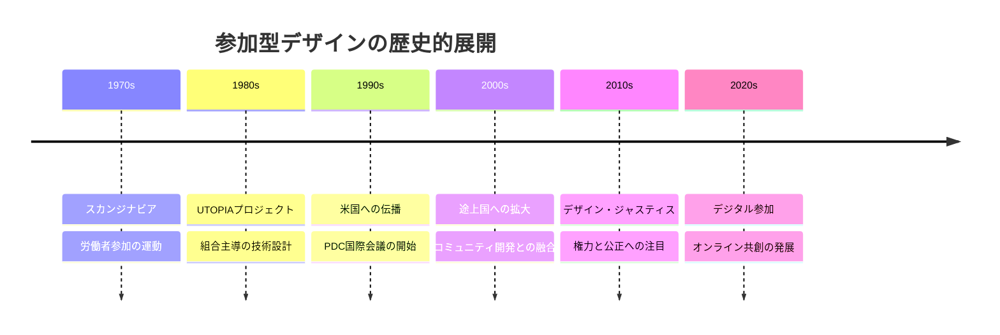
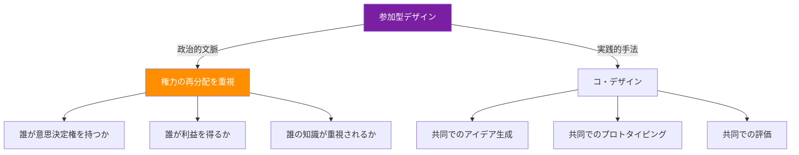
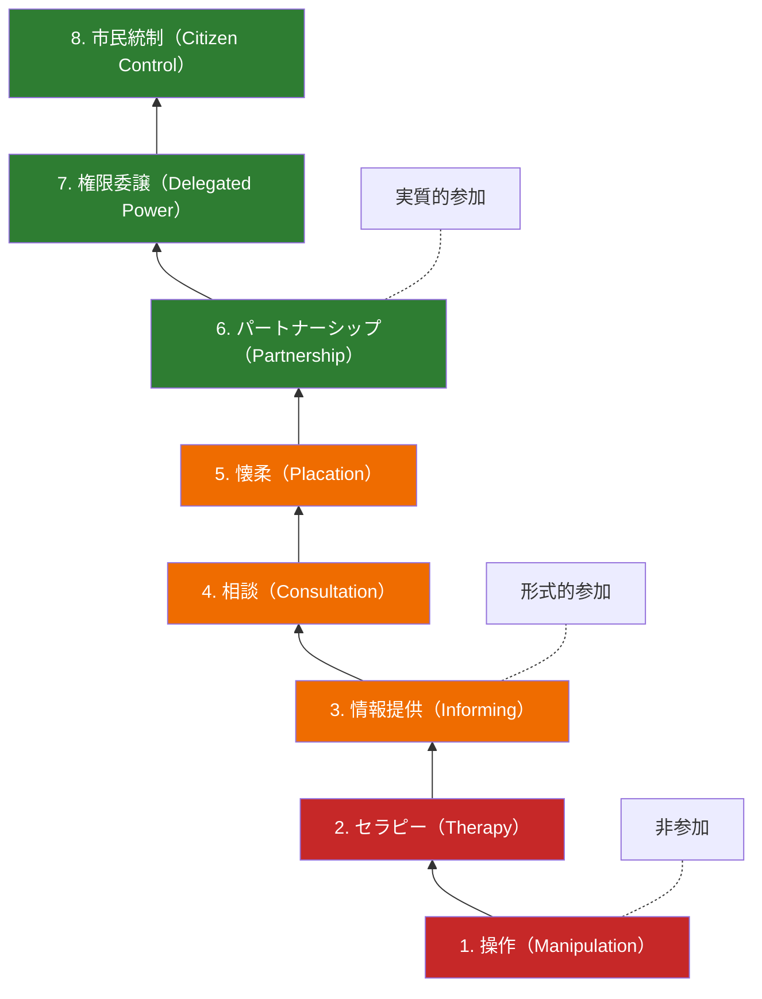
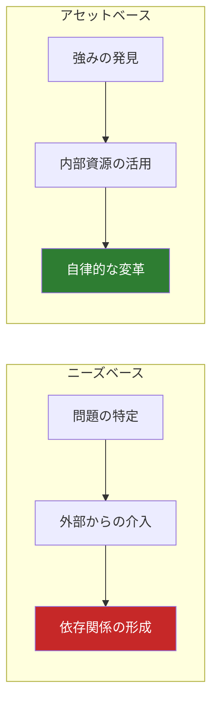

# 第3章：参加型デザイン

## はじめに：「誰のための」から「誰と共に」へ

参加型デザイン（Participatory Design）は、デザインの対象となる人々をデザインプロセスの能動的な参加者として位置づけるアプローチである。デザイナーが専門知識を独占し、ユーザーを「調査対象」として観察する従来のモデルを根本から問い直す。

本章では、参加型デザインの歴史的起源から現代的展開までを学び、コミュニティと真に協働するための理論と実践を探る。

---

## 3.1 スカンジナビアの起源：労働者の権利としてのデザイン

参加型デザインの起源は、1970年代の北欧、特にスカンジナビア諸国にある。当時、工場へのコンピュータ導入が進む中で、労働者が自らの作業環境と道具の設計に参加する権利を求める運動が生まれた。

!!! note "UTOPIAプロジェクト（1981-1985）"
    スウェーデンとデンマークの研究者が、印刷業界の労働者と共にコンピュータシステムを設計したプロジェクト。技術的な効率性だけでなく、労働者のスキルと自律性を尊重するシステム設計を目指した。参加型デザインの古典的事例として知られる。

スカンジナビア型参加型デザインの特徴：

| 特徴 | 内容 |
|------|------|
| **民主主義の実践** | デザインを民主的な意思決定プロセスとして捉える |
| **労働者の専門性の尊重** | 現場の知識を設計に不可欠なものとして位置づける |
| **相互学習** | デザイナーと参加者が互いの知識を交換する |
| **ハンズオンの道具** | 抽象的な議論ではなく、具体的なモックアップや試作品を用いる |
| **政治的意識** | 技術導入が労働環境と権力関係に与える影響を意識する |

---

## 3.2 コ・デザインと参加型デザインの関係

「コ・デザイン（Co-Design）」と「参加型デザイン（Participatory Design）」は、しばしば互換的に使われるが、その強調点には違いがある。

| 観点 | 参加型デザイン | コ・デザイン |
|------|-------------|-----------|
| 起源 | 北欧の労働運動 | デザインリサーチの発展 |
| 重点 | 権力関係の変革 | 創造的協働のプロセス |
| 参加者の位置づけ | 権利を持つ市民 | 創造的パートナー |
| 政治的意識 | 明示的 | 暗黙的な場合もある |
| 目的 | 民主化・エンパワメント | より良いデザイン成果 |

!!! warning "コ・デザインの落とし穴"
    コ・デザインが「参加」の形式だけを取り入れ、実質的な意思決定権を参加者に委ねない場合、「参加の搾取」（participatory exploitation）に陥る危険がある。ワークショップに住民を招きながら、最終的な設計判断をすべてデザイナーが行うケースは、その典型である。

---

## 3.3 権力のダイナミクス

参加型デザインにおいて最も重要かつ困難な課題は、権力（パワー）の問題である。

シェリー・アーンスタインの「市民参加のはしご」（1969年）は、参加の度合いを8段階で示した古典的フレームワークである。

デザインプロジェクトにおける権力の非対称性は、以下の場面で顕在化する。

1. **アジェンダ設定**：何を問題として定義するか、誰が決めるのか
2. **知識の序列**：専門知識と生活知のどちらが重視されるか
3. **言語と表現**：専門用語や視覚表現の読解力に格差はないか
4. **時間と場所**：参加の機会が特定の人々に偏っていないか
5. **成果の帰属**：プロジェクトの成果は誰のものになるか

!!! tip "ポジショナリティの自覚"
    デザイナーは、自身の社会的位置（人種、ジェンダー、学歴、経済的地位など）がデザインプロセスにおける権力関係にどう影響するかを常に省察する必要がある。特に、特権的な立場からマイノリティのコミュニティに「入る」場合、その権力勾配に意識的であることが求められる。

---

## 3.4 コミュニティ・エンゲージメントの手法

参加型デザインで用いられる代表的なエンゲージメント手法を以下に整理する。

### ジェネラティブ・ツール

参加者自身が何かを「作る」ことを通じて、言語化しにくいニーズや価値観を表現する手法。

- **コラージュ・マッピング**：写真や雑誌の切り抜きで理想の状態を表現する
- **プロトタイピング・ゲーム**：LEGOやカードを使って空間や仕組みを模型化する
- **フォトボイス**：参加者がカメラを持ち、自分の生活世界を撮影して語る
- **文化的プローブ**：日記、地図、カメラなどのキットを参加者に渡し、日常を記録してもらう

### 対話型手法

- **ワールドカフェ**：少人数テーブルを巡回しながら対話を深める
- **フィッシュボウル**：内側の円で対話、外側の円で観察、役割を交代する
- **デザイン・シャレット**：集中的な短期間ワークショップで解決策を共創する
- **ストーリーサークル**：一人ずつ個人的な物語を共有し、共通のテーマを見出す

### デジタル参加

- **オンラインプラットフォーム**（Miro、Figma等）による遠隔共創
- **市民参加型予算**（Decidim等）のデジタルツール
- **AR/VRを用いた空間体験**の共有と評価

---

## 3.5 アセットベースのコミュニティ開発（ABCD）

従来のコミュニティ開発は、コミュニティの「欠如」や「問題」に焦点を当てる「ニーズベース」のアプローチが主流であった。これに対し、アセットベースのコミュニティ開発（Asset-Based Community Development）は、コミュニティがすでに持っている強み、資源、能力に着目する。

ABCDが重視するコミュニティの資産：

1. **個人の資産**：住民一人ひとりのスキル、知識、経験、情熱
2. **組織の資産**：地域の団体、企業、学校、宗教施設
3. **制度の資産**：行政サービス、法的枠組み、助成金
4. **物理的資産**：土地、建物、インフラ、自然環境
5. **関係性の資産**：人々のつながり、信頼、互酬性のネットワーク

!!! tip "デザイナーの役割転換"
    ABCDアプローチにおけるデザイナーの役割は、「問題を解決する専門家」から「コミュニティの資産を可視化し、つなぐファシリテーター」へと転換する。デザイナーは解答を持ち込むのではなく、コミュニティが自ら解答を見出すプロセスを支援する。

---

## 3.6 デザイン・ジャスティスの原則

デザイン・ジャスティス（Design Justice）は、サーシャ・コスタンツァ=チョックが体系化した枠組みで、デザインのプロセスと成果における社会的公正を追求する。

デザイン・ジャスティス・ネットワークの10原則（要約）：

1. **デザインの影響を最も直接的に受ける人々の声を中心に置く**
2. 交差する構造的不平等に向き合う
3. コミュニティの意思決定力を尊重し、強化する
4. 参加者を搾取するのではなく、エンパワーする
5. デザインの帰属と所有権をコミュニティに残す
6. 持続可能で、コミュニティが自律的に運営できるものを設計する
7. 「影響を受ける人々」を「デザインの専門家」として認める
8. デザインの歴史における不平等を認識する
9. 抑圧のシステムを再生産しないよう意識する
10. デザインの実践を通じて解放を目指す

!!! warning "「善意」の危険性"
    社会的に良いことをしようとする「善意」は、それだけでは十分ではない。善意に基づくデザインであっても、当事者の声を聞かず、権力関係を省察しなければ、既存の不平等を再生産しうる。デザイン・ジャスティスは、善意を超えて構造的公正を追求する枠組みである。

---

## 3.7 参加型デザインにおける倫理

参加型デザインには、固有の倫理的課題が伴う。

| 倫理的課題 | 内容 | 対応指針 |
|-----------|------|---------|
| インフォームド・コンセント | 参加者がプロジェクトの目的と自身の役割を十分理解しているか | 平易な言語での説明、撤回の自由の保障 |
| 期待の管理 | 参加したことで変化が起きるという過度な期待を生んでいないか | 実現可能な範囲の明示、進捗の共有 |
| データの所有 | 参加者から得た情報は誰のものか | データの帰属に関する事前合意 |
| 感情的負担 | 困難な経験を語ることによるトラウマの再活性化 | 専門的サポートの準備、参加の任意性 |
| 成果の還元 | プロジェクトの成果がコミュニティに還元されるか | 成果共有の計画、継続的な関係構築 |

---

## 実践演習

!!! example "演習1：権力マッピング（個人ワーク・30分）"
    自分がこれまでに参加した、または見聞きしたデザインプロジェクトを一つ選び、以下を分析せよ。

    1. アーンスタインの「市民参加のはしご」において、そのプロジェクトはどの段階に位置するか
    2. アジェンダ設定、知識の序列、成果の帰属のそれぞれにおいて、権力がどう分配されていたか
    3. デザイン・ジャスティスの10原則に照らして、改善すべき点を3つ挙げよ

!!! example "演習2：コ・デザイン・ワークショップの設計（グループワーク・90分）"
    キャンパス内の食堂または図書館を対象に、コ・デザイン・ワークショップを設計せよ。

    1. 対象施設の利用者の中で、声が届きにくいグループを特定する
    2. そのグループが参加しやすい時間、場所、形式を検討する
    3. ジェネラティブ・ツールを少なくとも2つ選び、ワークショップの流れを設計する
    4. 権力勾配を意識したファシリテーションの留意点を5つ挙げる
    5. 成果をどのようにコミュニティに還元するか、計画を立てる

!!! example "演習3：アセットマッピング（フィールドワーク・120分）"
    キャンパス周辺の地域を対象に、ABCDアプローチに基づくアセットマッピングを実施せよ。

    1. 徒歩で地域を歩き、5カテゴリー（個人・組織・制度・物理的・関係性）の資産を記録する
    2. 住民や店主に短いインタビューを行い、外部からは見えない資産を発見する
    3. 資産間の潜在的なつながりを図示する
    4. これらの資産を活用して、地域の課題に取り組むデザインプロジェクトの構想を1つ提案する
