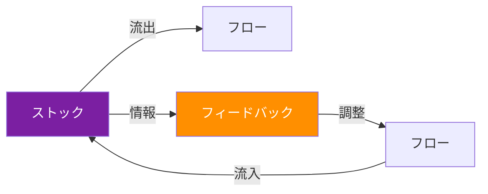
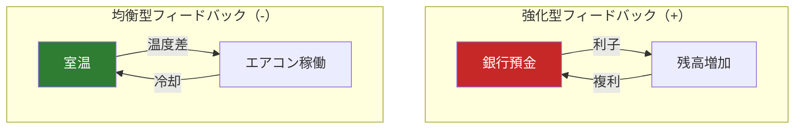
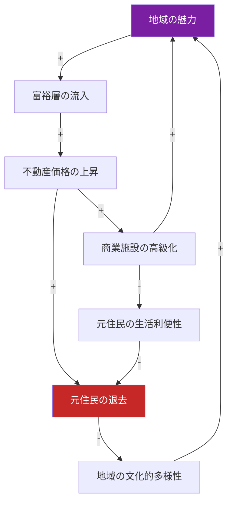
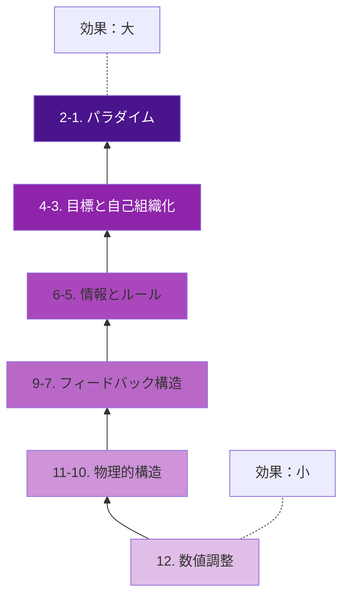
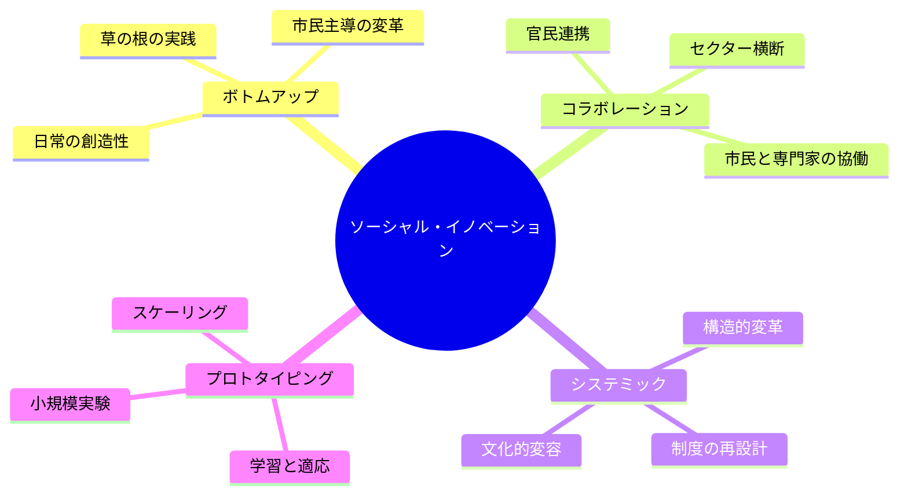
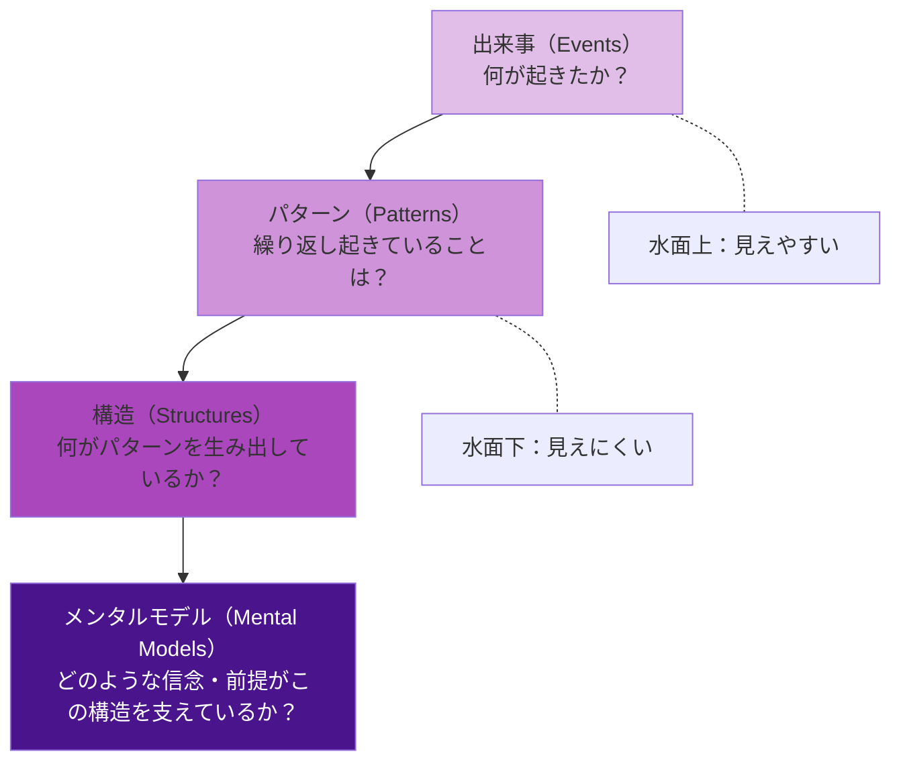

# 第4章：システム思考と社会課題

## はじめに：なぜ善意の介入が裏目に出るのか

貧困削減のために建設された公営住宅が、結果としてコミュニティの分断を深めた。道路渋滞を解消するために拡幅した道路が、さらなる交通量を誘発した。これらは「善意の介入が裏目に出る」典型的な事例であり、その根本原因は複雑なシステムの構造を理解しないまま介入したことにある。

システム思考（Systems Thinking）は、問題を構成要素に分解するのではなく、要素間の関係性とフィードバック構造に着目し、システム全体の振る舞いを理解するアプローチである。社会課題に取り組むデザイナーにとって、システム思考は不可欠なリテラシーである。

---

## 4.1 システムダイナミクスの基礎

システムダイナミクスは、1950年代にMITのジェイ・フォレスターが開発した、複雑なシステムの動的な振る舞いを分析する手法である。

### システムの基本要素

| 概念 | 説明 | 例 |
|------|------|-----|
| **ストック** | ある時点で蓄積されている量 | 人口、水量、信頼の蓄積 |
| **フロー** | ストックを増減させる変化の流れ | 出生/死亡、流入/流出 |
| **フィードバック** | 結果が原因に影響を及ぼす循環構造 | 人口増加→食料不足→死亡率上昇→人口減少 |
| **遅延** | 原因と結果の間の時間差 | 教育投資の効果が現れるまでの20年 |

### 二つのフィードバック

**強化型（Reinforcing）フィードバック**：変化を増幅する。雪だるま式に成長する場合も、悪循環に陥る場合もある。成功がさらなる成功を呼ぶ「マタイ効果」や、貧困が貧困を再生産する「貧困の罠」が該当する。

**均衡型（Balancing）フィードバック**：変化を抑制し、ある目標値に向かわせる。サーモスタット、市場の需給調整、ホメオスタシス（恒常性維持）などが該当する。

!!! tip "システムの直感に反する振る舞い"
    システムダイナミクスの重要な教訓は、システムがしばしば直感に反する振る舞いをすることである。強化型と均衡型のフィードバックが複雑に絡み合い、遅延が存在するとき、短期的に正しく見える介入が長期的には逆効果をもたらすことがある。

---

## 4.2 因果ループ図（CLD）

因果ループ図（Causal Loop Diagram）は、システムのフィードバック構造を可視化する最も基本的なツールである。

### 読み方のルール

- **矢印**：因果関係を示す（AがBに影響を与える）
- **+（同方向）**：Aが増えるとBも増える（Aが減るとBも減る）
- **-（逆方向）**：Aが増えるとBが減る（Aが減るとBが増える）
- **R（Reinforcing）**：強化型ループ
- **B（Balancing）**：均衡型ループ

### 都市のジェントリフィケーションの因果ループ図

!!! note "因果ループ図の力"
    因果ループ図は、問題の「犯人探し」ではなく「構造の理解」を促す。ジェントリフィケーションの例では、悪意ある個人がいるのではなく、フィードバック構造自体が排除を生み出していることが可視化される。

---

## 4.3 レバレッジ・ポイント：ドネラ・メドウズの12の介入点

ドネラ・メドウズ（1941-2001）は、システムに変化を起こすための介入点を、効果の小さい順から大きい順に12段階で整理した。これは社会変革デザインにおいて極めて重要なフレームワークである。

| 順位 | レバレッジ・ポイント | 介入の例 |
|------|-------------------|---------|
| 12（低） | 数値の調整（定数、パラメータ） | 補助金額の変更 |
| 11 | バッファーの大きさ | 備蓄量の増加 |
| 10 | ストックとフローの物理的構造 | インフラの再設計 |
| 9 | フローの調整速度（遅延） | 意思決定プロセスの時間短縮 |
| 8 | 均衡型フィードバックの強化 | 規制・監査の導入 |
| 7 | 強化型フィードバックの駆動力の制御 | 独占の防止 |
| 6 | 情報フローの構造 | 透明性の確保、データ公開 |
| 5 | ルール（インセンティブ、罰則、制約） | 法律・規制の改正 |
| 4 | 自己組織化の力 | 多様性と実験の促進 |
| 3 | システムの目標 | 組織のミッションの転換 |
| 2 | パラダイム（共有されている前提） | 社会の価値観・信念の変容 |
| 1（高） | パラダイムを超越する力 | パラダイムそのものを相対化する能力 |

!!! warning "高レバレッジ・ポイントの逆説"
    メドウズは、効果が大きいレバレッジ・ポイントほど、介入が難しいことを指摘した。パラメータの調整は容易だが効果は限定的。パラダイムの変容は絶大な効果があるが、容易には実現できない。デザイナーは、複数のレバレッジ・ポイントに同時に働きかける戦略を考える必要がある。

---

## 4.4 ウィキッドプロブレム

社会課題の多くは、ホルスト・リッテルとメルヴィン・ウェバーが1973年に定式化した「ウィキッドプロブレム（Wicked Problem）」の特性を持つ。

ウィキッドプロブレムの10の特性：

1. 明確な定義ができない
2. 終わりがない（「解決した」と言える時点がない）
3. 解決策は正解/不正解ではなく、良い/悪いで評価される
4. 解決策を事前にテストする方法がない
5. 試行は一回限りで、取り消せない結果を伴う
6. 解決策の候補を列挙できない
7. すべてのウィキッドプロブレムは本質的に固有である
8. すべてのウィキッドプロブレムは別の問題の症状である
9. 問題の原因の説明方法が複数あり、選択した説明が解決策を決定する
10. 計画者（デザイナー）は介入の結果に対する責任を負う

!!! example "ウィキッドプロブレムの例"
    - 気候変動
    - 貧困と格差
    - 教育の不平等
    - 都市のスプロール化
    - 食料安全保障
    - 公衆衛生危機

従来のデザイン思考の「問題定義→解決策」という線形プロセスは、ウィキッドプロブレムには適用しにくい。代わりに、問題の理解と解決策の探求を同時並行で進める反復的アプローチが求められる。

---

## 4.5 ソーシャル・イノベーション

ソーシャル・イノベーションは、社会的ニーズに応える新しい手法、製品、サービス、組織モデルであり、既存のものより効果的で、持続可能で、公正なものを指す。

パーソンズのDESIS Labが提唱するソーシャル・イノベーションの特徴：

エツィオ・マンズィーニ（パーソンズ客員教授）は、ソーシャル・イノベーションにおけるデザイナーの4つの役割を提示している。

1. **ファシリテーター**：多様なステークホルダーの対話と協働を促進する
2. **ビジョナリー**：望ましい未来の可能性を可視化し、共有する
3. **活動家**：社会的公正のために行動し、声を上げる
4. **文化的プロデューサー**：新しい意味、物語、価値を社会に提示する

---

## 4.6 複雑なシステムをマッピングする

システム思考を実践に移すための代表的なマッピング手法を整理する。

| 手法 | 目的 | 適用場面 |
|------|------|---------|
| **因果ループ図** | フィードバック構造の可視化 | 問題の構造的理解 |
| **ストック&フロー図** | 蓄積と変化の定量的分析 | 数値シミュレーション |
| **ステークホルダーマップ** | 関係者の利害と影響力の整理 | プロジェクト計画 |
| **システムマップ** | システムの全体像の俯瞰 | チーム内の共通理解形成 |
| **アイスバーグモデル** | 表面的事象から深層構造への掘り下げ | 問題の根本原因分析 |

### アイスバーグモデル

!!! tip "アイスバーグモデルの活用"
    報道される「出来事」に反応するだけでなく、その背後にある「パターン」「構造」「メンタルモデル」を掘り下げることで、より効果的な介入点を発見できる。例えば、フードデザート（食料砂漠）という出来事の背後には、都市計画、経済格差、人種差別という構造があり、「貧困は自己責任」というメンタルモデルがそれを支えている。

---

## 実践演習

!!! example "演習1：因果ループ図の作成（個人ワーク・45分）"
    以下のテーマから一つ選び、因果ループ図を作成せよ。

    - 地方都市の人口減少と空き家問題
    - SNSの利用と若者のメンタルヘルス
    - ファストファッションと環境負荷

    1. テーマに関連する主要な変数を10個以上列挙する
    2. 変数間の因果関係を矢印で結び、+/-を記入する
    3. 強化型ループと均衡型ループを特定し、ラベルを付ける
    4. メドウズのレバレッジ・ポイントを参照し、効果的な介入点を3つ特定せよ
    5. 各介入点に対応するデザイン提案を述べよ

!!! example "演習2：アイスバーグモデル分析（グループワーク・60分）"
    最近のニュースから社会課題を一つ選び、アイスバーグモデルで分析せよ。

    1. **出来事**：報道されている具体的な事象を記述する
    2. **パターン**：同様の事象が繰り返されているか、時系列でデータを収集する
    3. **構造**：パターンを生み出す制度、政策、経済構造を特定する
    4. **メンタルモデル**：構造を支えている社会的信念、前提、価値観を掘り下げる
    5. 4つの層のそれぞれに対するデザイン介入を提案する

!!! example "演習3：ソーシャル・イノベーション・プロトタイプ（グループワーク・180分）"
    チームで身近な社会課題を一つ選び、システム思考を活用したソーシャル・イノベーションをプロトタイプせよ。

    1. 因果ループ図とアイスバーグモデルで問題の構造を分析する
    2. レバレッジ・ポイントを特定し、介入戦略を立てる
    3. ステークホルダーマップを作成し、巻き込むべき関係者を特定する
    4. 最小限のプロトタイプ（サービス・仕組み・ツール）を設計・制作する
    5. プロトタイプを3人以上の関係者にテストし、フィードバックを得る
    6. システムへの影響をどのように測定するか、評価指標を設定する
