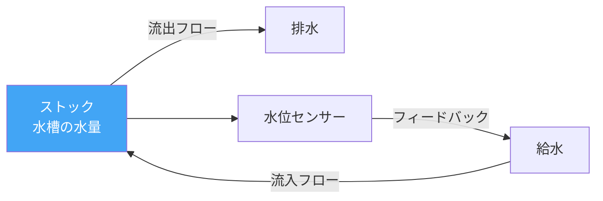
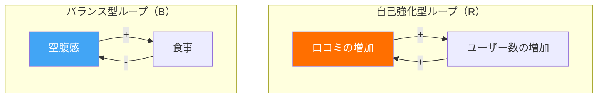
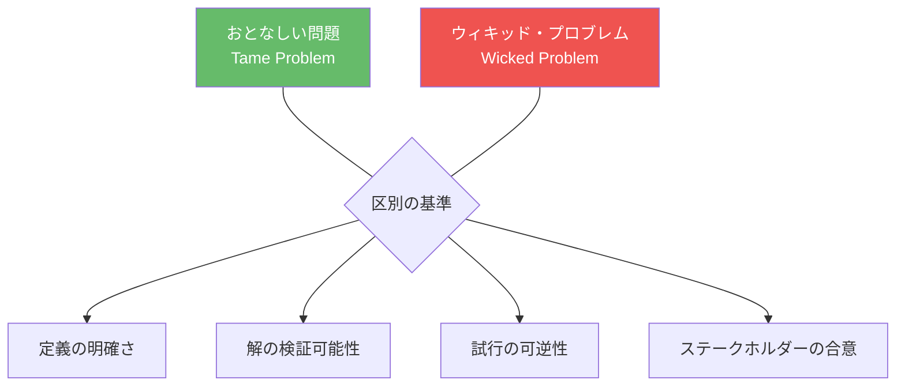
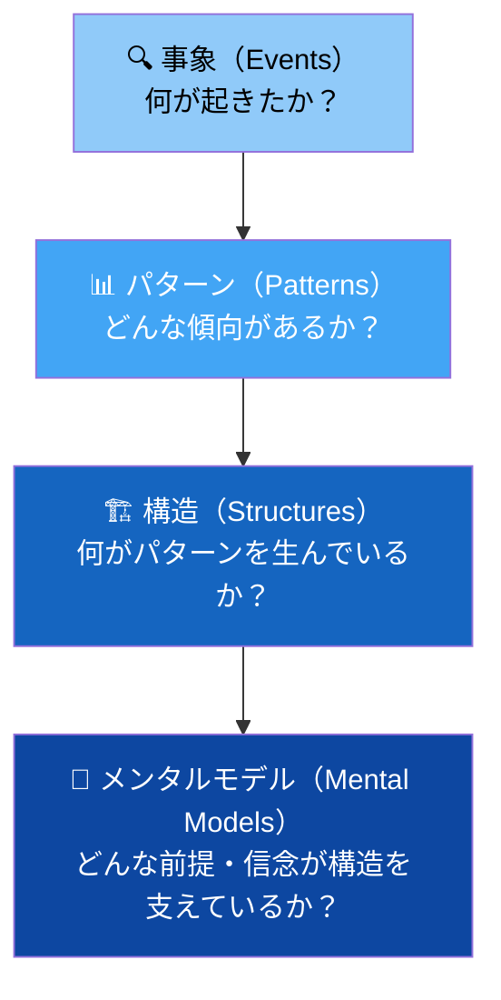

# 第4章：システム思考と社会課題

**Systems Thinking and Social Challenges — 複雑な問題を構造的に捉える**

---

## 4.1 なぜシステム思考が必要なのか

貧困、気候変動、健康格差、教育不平等――これらの社会課題に共通するのは、単一の原因を特定し、単一の解決策を適用することが不可能だということである。問題は複数の要因が複雑に絡み合い、互いに影響し合うシステムの中に埋め込まれている。

システム思考（Systems Thinking）は、個別の要素ではなく要素間の関係性、直線的な因果ではなく循環的なフィードバック、静的なスナップショットではなく動的な変化のパターンに着目する知的枠組みである。デザイナーがシステム思考を身につけることで、表面的な症状への対処ではなく、構造的な変革を志向できるようになる。

!!! note "デザインとシステム思考の接点"
    パーソンズの Transdisciplinary Design プログラムは、システム思考をデザイン教育の中核に据えている。「目に見える問題の背後にあるシステムを理解しなければ、デザインは症状を治療するだけで、病気を治すことはできない」というのが、その基本的な立場である。

---

## 4.2 システム・ダイナミクスの基礎

システム・ダイナミクス（System Dynamics）は、MITのジェイ・フォレスターが1950年代に開発した方法論であり、複雑なシステムの挙動をモデル化し、理解するためのツールを提供する。

### システムの基本要素

| 要素 | 説明 | 例 |
|---|---|---|
| **ストック** | 蓄積されるもの（量） | 人口、貯金、知識、汚染物質 |
| **フロー** | ストックを増減させる流れ | 出生率、収入と支出、学習、排出 |
| **フィードバックループ** | 出力が入力に戻る循環 | 人口増加→食料需要増→農地拡大→環境破壊→食料減少 |
| **遅延** | 原因と結果の間の時間差 | 教育投資の効果は数十年後に現れる |



### フィードバックループの二つの型

**自己強化型ループ（Reinforcing Loop, R）**：変化が同じ方向にさらなる変化を生む。「雪だるま式」とも呼ばれ、指数関数的な成長や崩壊をもたらす。

**バランス型ループ（Balancing Loop, B）**：変化を抑制し、均衡状態に戻そうとする力が働く。サーモスタットが室温を一定に保つのはバランス型ループの典型例である。



---

## 4.3 因果ループ図（CLD）の作成

因果ループ図（Causal Loop Diagram, CLD）は、システムの構造を可視化するための中核的なツールである。変数間の因果関係を矢印で示し、各矢印に「+（同方向の変化）」または「-（逆方向の変化）」を付記する。

### CLDの作成手順

1. **中心となる問題を定義する**（例：都市のホームレス問題）
2. **関連する変数をリストアップする**（家賃、収入、メンタルヘルス、支援サービスなど）
3. **変数間の因果関係を矢印で描く**
4. **各矢印に極性（+/-）を付ける**
5. **フィードバックループを特定し、ラベル（R/B）を付ける**
6. **レバレッジポイント（介入点）を探す**

!!! example "ホームレス問題のCLD例"
    ```mermaid
    graph TD
        A[家賃の上昇] -->|+| B[ホームレス人口]
        B -->|+| C[公共空間の過密]
        C -->|+| D[住民の不満]
        D -->|+| E[排除的政策]
        E -->|-| F[支援サービスの削減]
        F -->|+| B
        B -->|+| G[メンタルヘルスの悪化]
        G -->|-| H[就労能力]
        H -->|-| I[収入]
        I -->|-| B
        style A fill:#ef5350,color:#fff
        style B fill:#ff6f00,color:#fff
        style F fill:#7c4dff,color:#fff
    ```
    このCLDは単純化されたモデルだが、問題の循環的構造を可視化することで、どこに介入すべきかの議論を促進する。

---

## 4.4 レバレッジポイント：ドネラ・メドウズの洞察

環境科学者ドネラ・メドウズ（Donella Meadows）は、1999年の論文「Leverage Points: Places to Intervene in a System」で、システムへの介入が効果を発揮する12のポイントを体系化した。これは社会変革デザインにおける最も重要な理論的枠組みの一つである。

### 12のレバレッジポイント（効果の弱い順→強い順）

| 順位 | レバレッジポイント | 効果 | デザインでの例 |
|---|---|---|---|
| 12 | 数値（パラメータ） | 最弱 | 補助金額を変える |
| 11 | バッファ（ストックの大きさ） | 弱 | 緊急時の備蓄を増やす |
| 10 | 物質的構造（フローの仕組み） | 弱 | 自転車レーンを設置する |
| 9 | 遅延の長さ | 中 | 政策のフィードバック期間を短縮する |
| 8 | バランス型ループの強さ | 中 | 規制の実効性を高める |
| 7 | 自己強化型ループの制御 | 中 | 独占を防ぐ仕組みを導入する |
| 6 | 情報の流れ | 強 | 環境データを市民に公開する |
| 5 | ルール（インセンティブ・罰則） | 強 | 法規制を変える |
| 4 | 自己組織化の力 | 強 | コミュニティが自ら変革する力を育てる |
| 3 | システムの目標 | 最強 | GDPから幸福度指標へ転換する |
| 2 | パラダイム（世界観） | 最強 | 「成長」の定義を問い直す |
| 1 | パラダイムを超越する力 | 最強 | あらゆるパラダイムは仮説であると認識する |

!!! tip "デザイナーへの示唆"
    多くのデザインプロジェクトは、レバレッジポイントの下位（パラメータの調整や物質的構造の変更）にとどまっている。真に変革的なデザインは、情報の流れ、ルール、さらにはシステムの目標やパラダイムに働きかける。

---

## 4.5 ウィキッド・プロブレム

1973年、ホルスト・リッテルとメルヴィン・ウェバーは「ウィキッド・プロブレム（Wicked Problems）」という概念を提唱した。社会的な計画における問題の多くは、自然科学の「おとなしい問題（Tame Problems）」とは根本的に性質が異なるという指摘である。

### ウィキッド・プロブレムの10の特徴

1. 明確な定義がない
2. 終わりがない（「解決した」と言える時点がない）
3. 解は正しい/間違いではなく、良い/悪い
4. 解の有効性を即座に検証できない
5. すべての試みが不可逆的な結果をもたらす
6. 解の候補が無限にある
7. すべてのウィキッド・プロブレムは本質的にユニークである
8. すべてのウィキッド・プロブレムは別の問題の症状でもある
9. 原因の説明は複数可能で、選択は分析者の世界観に依存する
10. 計画者は間違う権利がない（結果に責任を持つ）



!!! warning "ウィキッド・プロブレムへの謙虚さ"
    ウィキッド・プロブレムに「デザイン思考で解決する」という姿勢は危険である。ウィキッド・プロブレムは「解決」されるものではなく、継続的に「取り組まれる」ものである。デザイナーに求められるのは、解決の約束ではなく、問題と誠実に向き合い続ける姿勢である。

---

## 4.6 ソーシャル・イノベーション

ソーシャル・イノベーション（Social Innovation）は、社会課題に対する新しいアプローチであり、従来の方法よりも効果的で、持続可能で、公正な解決策を生み出すことを目指す。

エツィオ・マンズィーニ（Ezio Manzini）は、ソーシャル・イノベーションを「人々が日常生活の中で生み出す創造的な解決策」として捉え、デザイナーの役割を以下のように定義した。

- **促進者（Facilitator）**：コミュニティのイノベーションを支援する
- **誘発者（Trigger）**：新しい可能性を提示し、行動を触発する
- **戦略家（Strategist）**：局所的な実験を、より大きなシステム変革につなげる

### ソーシャル・イノベーションの段階


---

## 4.7 複雑なシステムのマッピング手法

社会課題をシステムとして理解するためのマッピング手法をまとめる。

| 手法 | 目的 | 適したフェーズ |
|---|---|---|
| **因果ループ図（CLD）** | フィードバック構造の可視化 | 分析・構造理解 |
| **ステークホルダーマップ** | 関係者の関係性と影響力の把握 | プロジェクト初期 |
| **システムマップ** | システムの全体像の俯瞰 | 分析・コミュニケーション |
| **アイスバーグモデル** | 事象→パターン→構造→メンタルモデルの階層分析 | 深層構造の理解 |
| **リッチピクチャー** | 複雑な状況の直感的な描写 | 問題把握・チーム対話 |
| **ギガマップ** | 超大型の関係性マップ | 複雑性の全体把握 |

### アイスバーグモデル



アイスバーグモデルは、目に見える事象の背後にある深層構造を分析するために有効なフレームワークである。デザイナーが介入すべきは、水面下の構造やメンタルモデルのレベルであることが多い。

---

## 演習問題

!!! example "演習1：因果ループ図の作成"
    以下の社会課題から一つを選び、因果ループ図（CLD）を作成せよ。最低8つの変数を含み、自己強化型ループとバランス型ループをそれぞれ1つ以上特定すること。

    - 地方都市の人口減少
    - フードデザート（食の砂漠）問題
    - SNSとメンタルヘルス
    - 教育格差の再生産

    作成後、メドウズのレバレッジポイントの枠組みを用いて、最も効果的な介入点を3つ提案し、それぞれの根拠を説明せよ。

!!! example "演習2：アイスバーグモデル分析"
    最近のニュースで報じられた社会問題を一つ取り上げ、アイスバーグモデルの四つの層で分析せよ。

    - **事象**：報道された具体的な出来事
    - **パターン**：類似の出来事の時系列的傾向
    - **構造**：パターンを生み出す制度・仕組み・インセンティブ
    - **メンタルモデル**：構造を支える社会的前提・信念・価値観

    最後に、デザインによる介入が可能なレベルを特定し、具体的な提案を行うこと。

!!! example "演習3：ウィキッド・プロブレムのフレーミング"
    「大学生の孤立・孤独」をウィキッド・プロブレムとして捉え、以下を行え。

    1. リッテルとウェバーの10の特徴のうち、どの特徴が当てはまるかを分析する
    2. この問題に関わるステークホルダーをマッピングする
    3. 少なくとも3つの異なる視点から問題を定義し直す（リフレーミング）
    4. システム思考のツールを一つ以上用いて問題構造を可視化する

---

## 参考文献

- Meadows, D. H. (1999). Leverage Points: Places to Intervene in a System. *The Sustainability Institute*.
- Meadows, D. H. (2008). *Thinking in Systems: A Primer*. Chelsea Green Publishing.
- Rittel, H. W. J., & Webber, M. M. (1973). Dilemmas in a General Theory of Planning. *Policy Sciences*, 4(2), 155-169.
- Manzini, E. (2015). *Design, When Everybody Designs*. MIT Press.
- Sterman, J. D. (2000). *Business Dynamics: Systems Thinking and Modeling for a Complex World*. McGraw-Hill.
