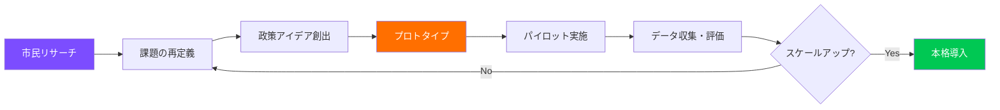
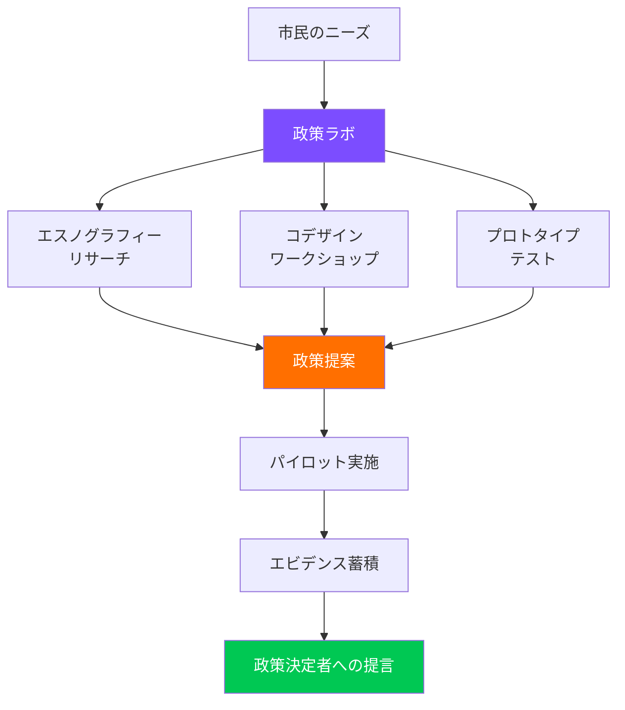
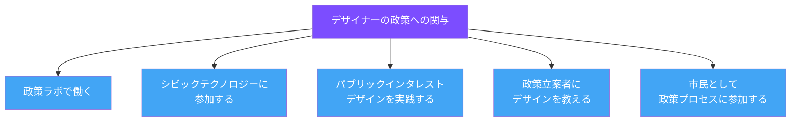

# 第5章：デザインと公共政策

**Design and Public Policy — 政策をデザインする、デザインで政策を変える**

---

## 5.1 デザインと政策の交差点

公共政策はデザインである。法律、規制、制度、公共サービスは、人々の行動、選択、生活の質を形づくる「見えないデザイン」として機能している。しかし長らく、政策立案の現場にデザイナーの視点は不在であった。

2000年代以降、世界各国で「政策ラボ（Policy Lab）」が設立され、デザイン思考やデザインリサーチの手法が政策立案に導入されるようになった。この動きは、従来のトップダウン型政策形成に対する根本的な問い直しである。

!!! note "なぜ政策にデザインが必要なのか"
    従来の政策立案は、統計データと専門家の分析に基づくトップダウンの意思決定が中心だった。しかし、政策の影響を受ける市民の生活実感、行動パターン、文脈的なニーズは、数値だけでは捉えきれない。デザインリサーチの質的手法と、プロトタイピングによる反復的改善のアプローチが、政策の実効性を高める鍵となる。

---

## 5.2 ポリシーデザインの基礎

ポリシーデザイン（Policy Design）は、公共政策の企画・立案・実施・評価のプロセスにデザインの方法論を適用するアプローチである。

### 従来の政策立案 vs デザインアプローチ

| 観点 | 従来の政策立案 | デザインアプローチ |
|---|---|---|
| **出発点** | 統計データ・専門家分析 | 市民の生活文脈・エスノグラフィー |
| **プロセス** | 線形（分析→立案→実施） | 反復的（リサーチ→プロトタイプ→テスト→改善） |
| **参加** | パブリックコメント（形式的） | コデザイン（実質的） |
| **実施** | 大規模一斉導入 | 小規模パイロット→段階的拡大 |
| **評価** | 事後評価（KPI） | 継続的フィードバックと適応 |
| **失敗** | 避けるべきもの | 学習の機会 |

---

## 5.3 行動ナッジ（Behavioral Nudges）

リチャード・セイラーとキャス・サンスティーンが2008年に提唱した「ナッジ理論」は、人々の選択の自由を維持しつつ、望ましい方向に行動を誘導する政策手法である。行動経済学の知見に基づき、人間の認知バイアスを活用する。

### 代表的なナッジの手法

| 手法 | 原理 | 政策への応用例 |
|---|---|---|
| **デフォルト設定** | 人はデフォルトを変えない傾向がある | 臓器提供のオプトアウト方式 |
| **社会的規範** | 他者の行動に同調する傾向 | 「近隣の80%が期限内に納税しています」 |
| **フレーミング** | 情報の提示方法で判断が変わる | 「5年生存率90%」vs「5年死亡率10%」 |
| **タイミング** | 意思決定のタイミングが結果を左右する | 入学時に学資ローン返済計画を提示 |
| **簡素化** | 手続きが複雑だと行動しない | 行政手続きのワンストップ化 |
| **フィードバック** | 行動の結果を見えるようにする | リアルタイム電力消費表示 |

!!! warning "ナッジの倫理的課題"
    ナッジは「リバタリアン・パターナリズム（自由主義的温情主義）」と呼ばれるが、批判も多い。誰が「望ましい行動」を定義するのか？ナッジは市民を自律的な意思決定者ではなく操作対象として扱っていないか？透明性のないナッジは民主主義を侵食しないか？デザイナーはこれらの問いに真摯に向き合う必要がある。

---

## 5.4 政府におけるデザイン：政策ラボの世界

2010年代以降、世界各国で政策ラボ（Policy Lab / Innovation Lab）が設立され、デザインの手法を政策立案に導入する実験が進んでいる。

### 主要な政策ラボ

| 政策ラボ | 国 | 設立年 | 特徴 |
|---|---|---|---|
| **UK Policy Lab** | 英国 | 2014 | 内閣府内に設置。エスノグラフィー、システムマッピング、プロトタイピングを政策に適用 |
| **MindLab** → **Disruption Task Force** | デンマーク | 2002 | 世界初の政府デザインラボ。省庁横断で活動 |
| **Helsinki Design Lab** | フィンランド | 2009 | 「戦略的デザイン」を政府の中核に据える |
| **Laboratorio de Gobierno** | チリ | 2014 | 南米初の政府イノベーションラボ |
| **OPM Lab（行革ラボ）** | 日本 | 2020 | デジタル庁と連携、行政サービスデザイン |
| **Behavioural Insights Team (BIT)** | 英国 | 2010 | ナッジユニット。行動科学に基づく政策設計 |

!!! example "英国ナッジユニットの成果"
    英国のBehavioural Insights Team（BIT）は、納税督促状の文面を変更する実験を行った。「あなたの地域のほとんどの住民は期限内に納税しています」という一文を加えるだけで、納税率が約5%向上した。この小さなデザイン変更は、英国政府に数千万ポンドの追加歳入をもたらした。

---

## 5.5 シビックテクノロジー

シビックテクノロジー（Civic Technology, CivicTech）は、テクノロジーを活用して市民参加を促進し、政府の透明性を高め、公共サービスを改善する取り組みである。

### シビックテクノロジーの分類

| 分類 | 目的 | 具体例 |
|---|---|---|
| **オープンデータ** | 政府データの公開と活用 | data.go.jp、CKAN |
| **市民報告** | 市民が問題を報告・共有 | FixMyStreet、SeeClickFix |
| **参加型予算** | 市民が予算配分を決定 | Decidim、Consul |
| **デジタル投票・請願** | 民主的意思決定のデジタル化 | vTaiwan、Change.org |
| **公共サービスデザイン** | 行政サービスのUX改善 | GOV.UK、Code for America |
| **監視と説明責任** | 政府の活動を監視 | OpenSecrets、政治資金データベース |

### vTaiwan：デジタル民主主義の最前線

台湾のvTaiwanプラットフォームは、オードリー・タン（唐鳳）が推進したデジタル民主主義の先駆的実験である。Pol.isというAIを活用した意見集約ツールを用い、ライドシェア規制などの政策課題について、数千人の市民の意見をリアルタイムで可視化し、合意形成を促進した。

!!! tip "Code for Japanの活動"
    日本におけるシビックテクノロジーの代表的な組織がCode for Japanである。東京都の新型コロナウイルス対策サイトのオープンソース開発は、シビックテクノロジーの力を広く知らしめた。デザイナーがシビックテクノロジーに関わることで、技術だけでなく市民の体験を中心に据えたソリューションが生まれる。

---

## 5.6 パブリックインタレストデザイン

パブリックインタレストデザイン（Public Interest Design）は、公共の利益のためにデザインの専門知識を活用する運動である。建築分野の「Public Interest Architecture」を源流とし、より広いデザイン分野に拡張された概念である。

### パブリックインタレストデザインの原則

1. **公共善を優先する**：クライアントの利益よりも、影響を受けるコミュニティの福利を重視する
2. **構造的不平等に取り組む**：表面的な問題解決ではなく、根本的な不公正に向き合う
3. **コミュニティとの長期的関係を築く**：一過性のプロジェクトではなく、持続的なパートナーシップを構築する
4. **横断的に協働する**：デザイン領域を超えて、法律、政策、社会福祉、コミュニティ組織と連携する
5. **実践と省察を循環させる**：行動と振り返りを繰り返し、常に学び続ける

!!! note "プロボノとの違い"
    パブリックインタレストデザインは、無償のボランティア活動（プロボノ）とは異なる。公益のためのデザインは、正当な報酬と持続可能なビジネスモデルに支えられるべきである。デザイナーの善意だけに依存するモデルは、構造的に持続不可能である。

---

## 5.7 グローバル政策ラボの事例分析

### 事例1：デンマークMindLab — 失業者支援の再設計

MindLabは、失業者の求職活動支援プログラムを再設計するにあたり、従来の統計分析ではなく、失業者自身のエスノグラフィー調査から始めた。その結果、制度上の手続きの複雑さと、担当者ごとに異なる対応が、失業者のモチベーションを大きく損なっていることが判明した。プロトタイプを通じた反復的改善により、求職者の満足度と就職率の双方が向上した。

### 事例2：チリ Laboratorio de Gobierno — 公共交通の改善

チリの政府イノベーションラボは、サンティアゴの公共交通バスの利用体験を改善するプロジェクトを実施した。市民のジャーニーマッピング、バス停での行動観察、運転手へのインタビューを通じて、情報提供の欠如が最大の不満要因であることを発見。低コストのリアルタイム情報表示システムのプロトタイプを開発し、パイロット実施で効果を検証した。

### 事例3：英国 GOV.UK — 行政サービスのデジタル変革

Government Digital Service（GDS）は、英国政府のウェブサービスを統合し、「政府ではなくユーザーのニーズから始める」という原則のもと、GOV.UKを構築した。明確なデザイン原則（10 Design Principles）、アジャイル開発、ユーザーリサーチの徹底により、年間数十億ポンドのコスト削減を実現した。

---

## 5.8 デザイナーが政策に関わるための道筋

デザイナーが政策に関わるためには、デザインの専門性だけでなく、政策形成のプロセス、政治的文脈、法的制約、公共部門の組織文化への理解が不可欠である。同時に、デザイナーとしての視点――人間中心の発想、プロトタイピング、可視化の力――は、政策立案の現場に大きな価値をもたらす。

---

## 演習問題

!!! example "演習1：ナッジのデザイン"
    大学キャンパス内の以下の課題から一つを選び、ナッジの手法を用いた介入をデザインせよ。

    - 食堂での食品ロス削減
    - 図書館の返却期限遵守率の向上
    - キャンパス内の分別ゴミ回収率の改善
    - 階段利用の促進（エレベーター依存の軽減）

    デザイン案には以下を含むこと：活用する行動原理の説明、具体的なデザイン案（スケッチまたはモックアップ）、効果測定の方法、倫理的配慮。

!!! example "演習2：政策ラボ・シミュレーション"
    3-5人のグループで、地域の具体的な課題（交通、教育、健康、環境など）を一つ選び、政策ラボのプロセスをシミュレーションせよ。

    1. **リサーチフェーズ**：当事者3人以上にインタビューを実施
    2. **定義フェーズ**：課題を再定義し、システムマップを作成
    3. **アイデアフェーズ**：政策アイデアを10個以上創出
    4. **プロトタイプフェーズ**：最も有望なアイデアをプロトタイプ化
    5. **提案フェーズ**：政策立案者に向けたプレゼンテーションを作成

!!! example "演習3：シビックテクノロジーの企画"
    自分が住む地域の行政サービスを一つ取り上げ、シビックテクノロジーの観点から改善提案を行え。以下を含むこと。

    - 現状のサービスのジャーニーマップ（市民の視点から）
    - ペインポイントの特定
    - テクノロジーを活用した改善案のワイヤーフレーム
    - オープンデータの活用可能性
    - 実装に必要なステークホルダーとの合意形成プラン

---

## 参考文献

- Thaler, R. H., & Sunstein, C. R. (2008). *Nudge: Improving Decisions About Health, Wealth, and Happiness*. Yale University Press.
- Bason, C. (2014). *Design for Policy*. Routledge.
- Kimbell, L. (2015). Applying Design Approaches to Policy Making. *University of Brighton*.
- Gov.UK. (n.d.). *Government Design Principles*. gov.uk/guidance/government-design-principles
- Tang, A. (2020). Digital Democracy in Taiwan. *Stanford Social Innovation Review*.
- Code for Japan. (n.d.). *Civic Tech活動*. code4japan.org
