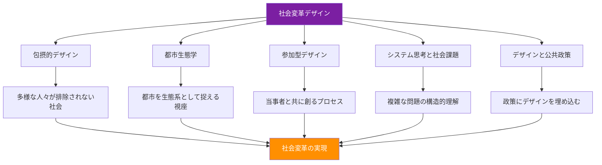

# Book 3: 社会変革デザイン

!!! info "Design for Social Transformation"
    デザインは美的表現にとどまらず、社会を変革する武器である。本書は、ニューヨークのパーソンズ美術大学（Parsons School of Design）が推進する「デザインによる社会変革」のアプローチに基づき、デザイナーが社会課題に正面から取り組むための理論と実践を体系的に学ぶ。

---

## 本書の位置づけ

パーソンズ美術大学は、1896年の創立以来、デザインと社会の関係を常に問い直してきた。特に2010年代以降、同校は「Design for Social Innovation and Sustainability（DESIS）」や「Parsons DESIS Lab」を中心に、デザインを社会変革の手段として位置づける教育を世界に先駆けて展開している。

本書は、パーソンズの哲学を軸に、以下の5つの領域を横断的に学ぶ構成となっている。

---

## 学習目標

本書を通じて、以下の能力を身につけることを目指す。

| # | 学習目標 | 対応する章 |
|---|---------|-----------|
| 1 | 包摂的デザインの原則を理解し、多様なユーザーを前提とした設計ができる | 第1章 |
| 2 | 都市を複雑な生態系として捉え、場所に根ざしたデザイン介入を構想できる | 第2章 |
| 3 | 参加型デザインの手法を用い、コミュニティと協働できる | 第3章 |
| 4 | システム思考を活用し、社会課題の構造を可視化・分析できる | 第4章 |
| 5 | デザインと公共政策の接点を理解し、政策提案にデザインを活かせる | 第5章 |

---

## パーソンズのアプローチ：デザインを社会変革の武器に

!!! tip "パーソンズの核心的問い"
    「デザイナーは誰のためにデザインするのか？」——この問いに真摯に向き合うことが、社会変革デザインの出発点である。

パーソンズが掲げる社会変革デザインの特徴は、以下の4つの原則に集約される。

### 1. 構造的不平等への眼差し

デザインは中立ではない。あらゆるデザインには、誰が含まれ、誰が排除されるかという政治性が内在する。パーソンズは、人種、ジェンダー、階級、障害、地理的条件などの交差する不平等（インターセクショナリティ）を意識したデザイン教育を行う。

### 2. 当事者性の重視

「当事者のために」ではなく「当事者と共に」デザインする。パーソンズのプログラムでは、学生はニューヨーク市内のコミュニティに入り込み、住民と協働するプロジェクトに取り組む。

### 3. システムレベルの介入

個別の製品やサービスだけでなく、社会システム全体に働きかけるデザインを志向する。政策、制度、組織文化、社会規範といった上位構造への介入を視野に入れる。

### 4. 実践と批判の往復

デザインすることと、デザインの社会的影響を批判的に省察することを往復する。作ることと考えることを分離しない。

---

## 各章の概要

### 第1章：包摂的デザイン
障害の医学モデルと社会モデルの違いを理解し、Microsoft Inclusive Design Toolkitなどの実践的フレームワークを学ぶ。「エッジケース」に焦点を当てることで、すべての人にとってより良いデザインが生まれるという逆転の発想を身につける。

### 第2章：都市生態学
都市をひとつの生態系として捉える視点を獲得する。プレイスメイキング、タクティカル・アーバニズム、コミュニティマッピングなどの手法を通じて、場所に根ざしたデザイン介入の方法論を学ぶ。

### 第3章：参加型デザイン
北欧に起源を持つ参加型デザインの歴史と哲学を学び、コ・デザインの実践手法を習得する。権力勾配への意識、デザイン・ジャスティスの原則、アセットベースのコミュニティ開発など、批判的視点を持った協働の方法を探る。

### 第4章：システム思考と社会課題
ドネラ・メドウズのレバレッジ・ポイント理論を中心に、因果ループ図やシステムダイナミクスの手法を学ぶ。社会課題を「ウィキッドプロブレム」として捉え、複雑性に対処するデザインアプローチを探求する。

### 第5章：デザインと公共政策
行動ナッジ、シビックテクノロジー、パブリックインタレストデザインなど、デザインと公共政策が交わる領域を学ぶ。世界各国のポリシーラボの事例を通じて、政策立案にデザインを組み込む方法を探る。

---

## 推奨される学習の進め方

!!! note "学習順序について"
    各章は独立して読むことも可能だが、第1章から順に読み進めることで、個人レベルの包摂性から都市・コミュニティ・システム・政策へとスケールが拡大する構成を体感できる。

各章末には実践演習を設けており、理論を手を動かしながら体得できる構成となっている。演習はグループワークを前提としたものも多く、多様な視点からの議論を重視している。

---

## 前提知識

- Book 1「デザイン思考の基礎」の内容を理解していることが望ましい
- デザインリサーチの基本的な手法（インタビュー、観察、プロトタイピング）に関する知識
- 社会課題への関心と、自身の特権性（ポジショナリティ）を省察する姿勢
