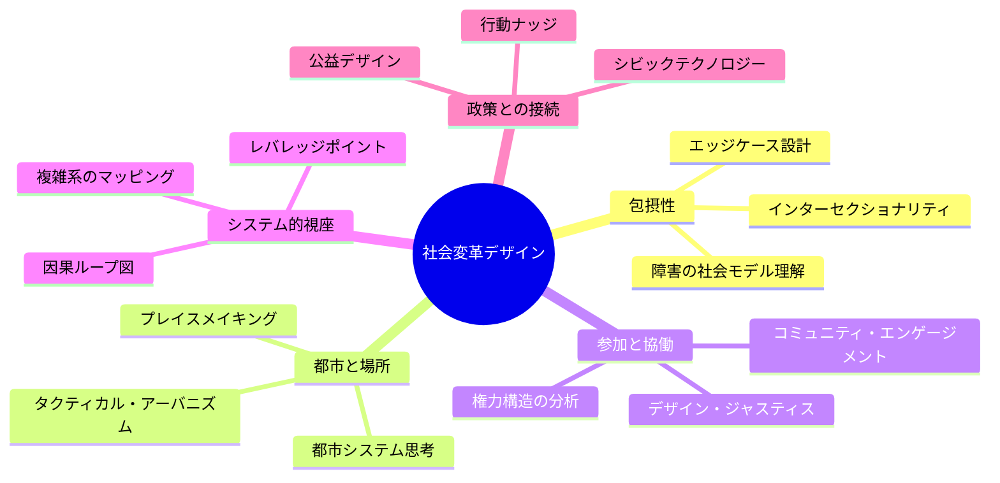

# Book 3: 社会変革デザイン

**Design for Social Transformation — パーソンズ美術大学に学ぶ、社会を変えるデザインの力**

---

## 本書の位置づけ

パーソンズ美術大学（Parsons School of Design）は、ニューヨークを拠点に「デザインは社会変革の武器である」という信念を教育の中核に据えてきた。同校の Transdisciplinary Design（学際的デザイン）プログラムや Design and Urban Ecologies（デザインと都市生態学）プログラムは、デザイナーが美的対象物の制作者にとどまらず、社会正義・都市再生・政策立案に介入するアクティビストであるべきだと主張する。

本書は、パーソンズのこの急進的なデザイン教育哲学を軸に、包摂的デザイン、都市生態学、参加型デザイン、システム思考、そしてデザインと公共政策の5つの領域を体系的に学ぶ。

!!! note "パーソンズの教育理念"
    「デザインとは、世界がどうあるべきかを構想し、その構想を実現するために行動することである。」パーソンズでは、スタジオワークとソーシャルエンゲージメントが不可分のものとして統合されている。

---

## 学習目標

本書を通じて、以下の能力を身につけることを目指す。

### 具体的な到達目標

| 章 | テーマ | 到達目標 |
|---|---|---|
| 第1章 | 包摂的デザイン | 障害の医学モデルと社会モデルの違いを説明し、インクルーシブデザインの原則を実際のプロダクトに適用できる |
| 第2章 | 都市生態学 | 都市をエコシステムとして分析し、プレイスメイキングやタクティカル・アーバニズムの手法を提案できる |
| 第3章 | 参加型デザイン | コミュニティと対等な立場で協働するデザインプロセスを設計・実行できる |
| 第4章 | システム思考と社会課題 | 社会課題を因果ループ図でモデル化し、レバレッジポイントを特定できる |
| 第5章 | デザインと公共政策 | 公共政策にデザイン手法を導入する戦略を立案できる |

---

## 各章の概要

### 第1章：包摂的デザイン（Inclusive Design）

デザインが「普通の人」を想定することで、どれほど多くの人々を排除してきたかを検証する。インクルーシブデザイン、ユニバーサルデザイン、アクセシブルデザインの違いを整理し、障害の医学モデルと社会モデルの対比からデザインの責任を問い直す。Microsoftのインクルーシブデザインツールキットを実践的に活用する方法も学ぶ。

### 第2章：都市生態学（Urban Ecologies）

パーソンズの Design and Urban Ecologies プログラムに着想を得て、都市を複雑な生態系として捉える視座を養う。プレイスメイキング、タクティカル・アーバニズム、コミュニティマッピングなどの手法を通じて、都市空間に介入するデザイナーの役割を探る。

### 第3章：参加型デザイン（Participatory Design）

北欧に起源を持つ参加型デザインの思想と手法を学ぶ。コミュニティとの協働における権力関係の非対称性を直視し、デザイン・ジャスティスの原則に基づいた対等なパートナーシップの構築方法を探る。

### 第4章：システム思考と社会課題（Systems Thinking）

ドネラ・メドウズのレバレッジポイント理論を中心に、社会課題をシステム的に分析する力を養う。因果ループ図の作成、ウィキッド・プロブレム（厄介な問題）の特徴理解、ソーシャル・イノベーションの方法論を学ぶ。

### 第5章：デザインと公共政策（Design and Policy）

デザイン思考が公共政策の領域に浸透する現在、ポリシーデザイン、行動ナッジ、シビックテクノロジーの最前線を学ぶ。世界各国の政策ラボの事例を分析し、デザイナーが公益のために果たすべき役割を考察する。

---

## 前提知識

!!! tip "推奨される事前学習"
    - **Book 1「デザイン思考の基礎」** の内容（特にデザインリサーチ手法）を理解していること
    - 社会課題への関心と、多様な立場の人々と対話する姿勢
    - 基本的なリサーチ・ドキュメンテーション能力

---

## 本書で使用するフレームワーク

本書全体を通じて、上記のサイクルを繰り返し実践する。社会変革のためのデザインは、一度きりのプロジェクトではなく、継続的な関与と学習のプロセスであることを忘れてはならない。

!!! warning "倫理的配慮"
    社会変革デザインに取り組む際は、常に以下を自問すること。「誰のためのデザインか？」「誰がデザインプロセスに参加しているか？」「誰の声が聞かれていないか？」「このデザインが意図せず強化する権力構造はないか？」

---

## 参考文献（本書全体）

- Costanza-Chock, S. (2020). *Design Justice: Community-Led Practices to Build the Worlds We Need*. MIT Press.
- Meadows, D. H. (2008). *Thinking in Systems: A Primer*. Chelsea Green Publishing.
- Manzini, E. (2015). *Design, When Everybody Designs*. MIT Press.
- Holmes, K. (2018). *Mismatch: How Inclusion Shapes Design*. MIT Press.
- Parsons School of Design. (n.d.). *Transdisciplinary Design MFA Program*.
