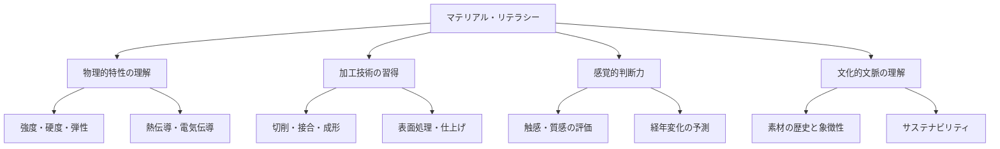
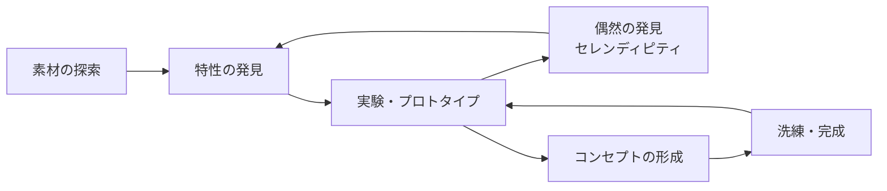

# 第1章：素材とクラフトマンシップ

## はじめに：手で考えるということ

RISDのファウンデーション・イヤー（基礎課程）では、入学した全学生が素材と格闘する1年間を過ごす。絵画、彫刻、ドローイングだけではない。木を削り、金属を叩き、テキスタイルを織り、ガラスを吹く。この一見「古典的」に見える教育が、なぜ2026年においても揺るがない価値を持つのか。

答えは単純である。**素材は嘘をつかない**。コンピュータ上では完璧に見えるデザインが、物質として具現化された瞬間に破綻することは日常的に起こる。木は反り、金属は疲労し、ガラスは想定外の方向に割れる。この「素材の抵抗」と向き合い、対話する能力こそが、クラフトマンシップの核心であり、デジタル時代においてこそ希少かつ決定的な能力となる。

## マテリアル・リテラシーとは

マテリアル・リテラシー（Material Literacy）とは、素材の物理的・化学的・感覚的特性を包括的に理解し、設計プロセスに活かす能力を指す。これは単に「材料力学を知っている」ということではない。素材に触れ、加工し、失敗し、修正する身体的経験を通じて獲得される、暗黙知（Tacit Knowledge）を含む総合的な能力である。

## 主要素材の特性と設計への応用

### 木材（Wood）

木材は人類最古のデザイン素材の一つであり、その温かみと加工性から現在も広く使用される。最大の特徴は**異方性**（方向によって性質が異なる）にある。木目に沿った方向と直角方向では、強度も加工のしやすさも全く異なる。

| 特性 | 詳細 |
|------|------|
| 強度 | 木目方向に高い引張強度、直角方向は弱い |
| 加工性 | 切削・接合・曲げ加工が比較的容易 |
| 経年変化 | 色の深まり、パティナの形成 |
| サステナビリティ | 再生可能資源、カーボンニュートラル（管理された森林から） |
| 設計上の注意 | 含水率による膨張・収縮、反りへの対応 |

!!! example "設計への示唆"
    木材の異方性は「制約」ではなく「設計言語」である。曲木（Steam Bending）技法は、木の繊維方向の特性を活かして有機的な曲線を実現する。Thonetの曲木椅子は、この素材特性を設計原理に昇華させた好例である。

### 金属（Metal）

金属素材は強度と成形性のバランスに優れ、工業デザインの中核を担う。鉄鋼、アルミニウム、銅、チタンなど、それぞれ固有の特性を持つ。

鉄鋼は強度と汎用性に優れるが重く腐食しやすい。アルミニウムは軽量で耐食性があるが、溶接には専門技術を要する。銅は優れた電気伝導性と殺菌作用を持ち、経年で独特の緑青（パティナ）を形成する。

金属加工における重要な概念は**塑性変形**と**弾性変形**の境界である。この境界を理解することで、曲げ加工後のスプリングバック（戻り）を予測し、精密な成形が可能になる。

### ガラス（Glass）

ガラスは固体と液体の中間的性質を持つアモルファス材料であり、その透明性と脆性が設計上の最大の特徴である。

吹きガラス（Glassblowing）はRISDの看板プログラムの一つであり、溶融ガラスとの対話は時間的制約の中での即興的な意思決定を求める。1200度を超える高温で液体状のガラスは、重力と遠心力に従いながら刻一刻と変化する。この「素材に主導権を渡す」経験は、コントロール志向のデジタルデザインとは根本的に異なる制作観を養う。

### 陶磁器（Ceramics）

陶磁器は成形時の柔軟性と焼成後の硬度・耐久性という、相反する特性を持つ。粘土の段階では自由な造形が可能だが、乾燥と焼成の過程で10〜15%収縮し、時に予測不能な変形や割れが生じる。

!!! note "焼成という「手放し」"
    陶芸における焼成は、デザイナーが作品のコントロールを窯に委ねる行為である。特に薪窯や自然釉の技法では、炎の流れと灰の堆積が意図しない（しかし時に意図を超える）効果を生む。この「不確実性を受け入れる設計」は、生成AIとの協働における態度と通底するものがある。

### テキスタイル（Textiles）

テキスタイルは、繊維という微視的な要素が織り・編み・フェルティングなどの構造によって巨視的な特性を発現する、本質的に**マルチスケール**な素材である。

| 構造 | 手法 | 特性 |
|------|------|------|
| 織物 | 経糸と緯糸の交差 | 安定性が高く、伸縮性は織り方に依存 |
| 編物 | ループの連結 | 高い伸縮性、ドレープ性 |
| 不織布 | 繊維の絡み合わせ | 均一性、フィルター特性 |
| フェルト | 繊維の縮絨 | 厚み、断熱性、彫刻的成形が可能 |

テキスタイルは、後述する「スマートテキスタイル」（第5章）において、電子部品との融合の最前線に位置する素材でもある。

## クラフトとしての知：暗黙知の獲得

マイケル・ポランニーが提唱した「暗黙知（Tacit Knowledge）」の概念は、クラフトマンシップの理解に不可欠である。自転車の乗り方を言葉だけで伝えられないように、木の鉋がけの「ちょうどよい力加減」や、ガラスが吹きごろになった瞬間の「感触」は、経験を通じてしか獲得できない。

リチャード・セネットは『クラフツマン』の中で、1万時間の反復練習が専門家的な身体知を形成すると論じた。この身体知は、デジタルツールが高度化する現在、むしろその価値を増している。なぜなら、**素材の挙動を身体的に理解しているデザイナーだけが、デジタルツールの出力の妥当性を判断できる**からである。

## 素材主導のデザインプロセス

従来のデザインプロセスは「コンセプト → スケッチ → 素材選定 → 制作」という線形的な流れが主流であった。しかし素材主導（Material-Led）のデザインプロセスでは、素材の特性や偶然の発見がデザインの方向性を決定する。

!!! tip "RISDファウンデーション・イヤーの教訓"
    RISDの基礎課程では、最初の数週間は「何を作るか」を考えることを禁じられる場合がある。ただ素材に触れ、実験し、観察する。この一見非効率に見えるプロセスが、素材への深い理解と、予期しない創造的跳躍を生む。

## 演習課題

### 演習1：素材日記（2週間）

毎日、身の回りの製品を1つ選び、使用されている素材を特定し、なぜその素材が選ばれたのかを考察する。触感、重量、温度、音、匂いなど五感を使った観察を記録すること。

### 演習2：単一素材チャレンジ

1つの素材（木材、紙、テキスタイルなど身近なもの）だけを使い、「座る」機能を持つ構造体を制作せよ。接着剤やネジなどの異素材は使用不可。素材自身の特性（折り、組み、編みなど）だけで構造を成立させること。

### 演習3：素材の限界テスト

選んだ素材に対して、引張、圧縮、曲げ、ねじりの4つの力を加え、変形と破壊のプロセスを写真と文章で記録せよ。この「壊す」経験から、素材の設計上の限界と可能性を見出すこと。

!!! warning "安全に関する注意"
    素材の加工には適切な保護具（保護メガネ、手袋、マスクなど）を必ず着用すること。特にガラス、金属、化学薬品を扱う際は、必ず経験者の指導のもとで作業を行うこと。
