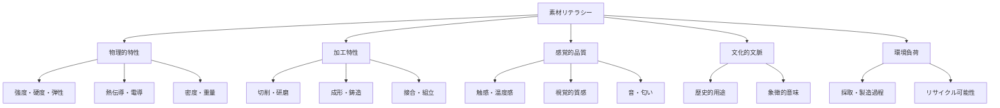
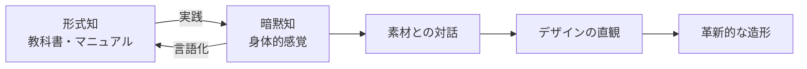
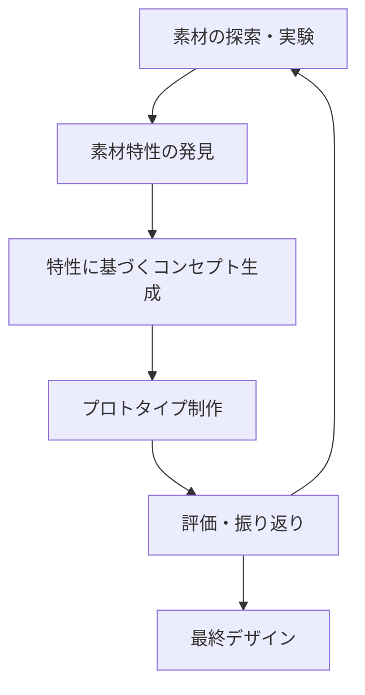

# 第1章: 素材とクラフトマンシップ

## はじめに：素材に触れるということ

デザイナーにとって素材を理解することは、作家にとって言語を理解することに等しい。どれほど優れた構想を持っていても、素材の特性を知らなければ、それを現実世界に具現化することはできない。

RISD（ロードアイランド・スクール・オブ・デザイン）のファウンデーション・イヤーでは、入学した全学生が専攻を問わず、まず素材と向き合うことから教育が始まる。絵画専攻の学生も木工室で木を削り、グラフィックデザイン専攻の学生もガラス工房で炉の前に立つ。これは単なるスキル習得ではない。**素材との対話を通じて「考え方そのもの」を鍛える**という、RISDの教育哲学の根幹である。

本章では、デザイナーが身につけるべき「素材リテラシー（Material Literacy）」の基礎を学ぶ。5つの主要素材群の特性を理解し、素材が持つ知識をデザインプロセスに統合する方法を探る。

---

## 1.1 素材リテラシーとは何か

素材リテラシーとは、素材の物理的特性だけでなく、その加工方法、文化的意味、環境負荷、感覚的品質を**統合的に理解する能力**を指す。

!!! info "RISDの「Material Culture」"
    RISDでは素材を単なる物質ではなく「文化」として捉える。例えば、日本の漆器は「漆」という素材の物性だけでなく、何世紀にもわたる職人の技法、美意識、そして自然観を内包している。素材リテラシーとは、こうした多層的な理解力である。

## 1.2 主要素材の特性

### 木材（Wood）

木材は人類が最も古くから使用してきた素材の一つであり、その温かみと加工性の高さから、現代のデザインにおいても中心的な役割を果たしている。

| 特性 | 説明 |
|------|------|
| **木目（Grain）** | 木の成長方向に沿った繊維構造。強度に異方性を持たせる |
| **含水率** | 乾燥状態で収縮し、吸湿で膨張する。寸法安定性に直結 |
| **硬度** | 広葉樹（オーク、ウォールナット）は硬く、針葉樹（ヒノキ、スギ）は柔らかい |
| **加工性** | 手工具から機械加工まで幅広い加工法に適応。曲げ加工も可能 |
| **感覚的品質** | 暖かな触感、自然な香り、視覚的な豊かさ |

木材の最大の特徴は**異方性**にある。木目に沿った方向と直交する方向では、強度特性が大きく異なる。この性質を理解せずに設計すれば、構造的な破綻を招く。逆に、異方性を活かした設計は木材ならではの美しさを生み出す。

### 金属（Metal）

金属は強度、耐久性、加工精度においてほかの素材を凌駕する。産業革命以降のデザイン史は、金属加工技術の進化と不可分である。

| 素材 | 特徴 | 代表的用途 |
|------|------|------------|
| **鉄・鋼** | 高強度、磁性あり、錆びやすい | 構造材、工具、家具フレーム |
| **アルミニウム** | 軽量、耐食性、加工性良好 | 筐体、建築部材、パッケージ |
| **銅・真鍮** | 導電性、抗菌性、経年変化の美 | 電子部品、装飾、楽器 |
| **ステンレス** | 耐食性、衛生性、高強度 | 医療器具、キッチン、建築 |

金属の加工には**切削、プレス、溶接、鋳造、鍛造**など多様な手法があり、それぞれが異なる形態的可能性を開く。板金の曲げ加工は平面から立体を生み出し、鋳造は有機的な曲面を実現する。

### ガラス（Glass）

ガラスは透明性と脆さという矛盾した性質を併せ持つ、極めて特異な素材である。

ガラスの本質は**非晶質（アモルファス）構造**にある。結晶構造を持たないがゆえに透明であり、同時にその構造的不安定さが脆性の原因となる。RISDのガラス工芸プログラムは世界的に著名であり、ガラスブロウイング（吹きガラス）を通じて学生は「流動する素材との即興的対話」を体験する。

### セラミクス（Ceramics）

セラミクスは土と火の芸術であり、人類文明の最も古い技術の一つである。粘土を成形し、高温で焼成することで、柔らかな素材が硬い器物へと変容する。この**不可逆的な変化**がセラミクスの本質的な特徴である。

焼成温度によって陶器（約800-1100度C）、炻器（約1200-1300度C）、磁器（約1300-1400度C）と分類され、それぞれ異なる質感と強度を持つ。釉薬（ゆうやく）の化学反応は予測困難な美しさを生み出し、「制御された偶然」というデザインの重要な概念を教えてくれる。

### テキスタイル（Textiles）

テキスタイルは人間の身体に最も近い素材である。衣服として、インテリアとして、テキスタイルは常に人間の肌に触れ、生活を包み込む。

| 分類 | 素材例 | 特性 |
|------|--------|------|
| **天然繊維** | 綿、麻、絹、羊毛 | 通気性、吸湿性、生分解性 |
| **合成繊維** | ポリエステル、ナイロン | 強度、均一性、耐久性 |
| **再生繊維** | リヨセル、再生ポリエステル | 環境負荷低減、循環性 |
| **先端繊維** | カーボン、アラミド、導電繊維 | 超高強度、機能性 |

テキスタイルの構造は**織り（Weaving）、編み（Knitting）、不織布（Non-woven）**に大別される。構造の違いは伸縮性、通気性、強度に直接影響し、同じ繊維でも異なる布地を生み出す。

---

## 1.3 クラフトとしての知識

!!! quote "リチャード・セネット『クラフツマン』"
    「クラフトマンシップとは、仕事をうまくやりたいという人間の基本的な衝動である。」

クラフトマンシップにおける知識は、言語化が困難な**暗黙知（Tacit Knowledge）**の割合が極めて高い。木を鉋（かんな）で削る最適な角度、粘土の適切な水分量、ガラスが加工可能な温度帯――これらは書物から学ぶことが困難であり、反復的な実践を通じてのみ体得される。

この暗黙知こそが、AIには（現時点では）代替困難な、人間のデザイナーの固有の価値である。素材を手で触り、その抵抗感を感じ、素材が「何になりたがっているか」を聴く――この身体的プロセスは、クリティカル・メイキングの核心にほかならない。

## 1.4 素材主導のデザインプロセス

従来のデザインプロセスが「構想 → 素材選定 → 製作」という直線的な流れであったのに対し、素材主導のデザインプロセスは**素材の探索から始まる**。

このアプローチでは、素材の予期しない特性や偶然の発見がデザインの方向性を決定する。例えば、和紙の透光性を実験中に発見した学生が照明器具のコンセプトを着想する、といった展開が生まれる。素材が「教師」となり、デザイナーは「学習者」として素材に導かれるのである。

## 1.5 RISDファウンデーション・イヤーの構造

RISDのファウンデーション・イヤーは3つの柱で構成されている。

| 科目 | 内容 | 目的 |
|------|------|------|
| **Drawing** | 観察描画、空間表現、抽象表現 | 視覚的思考力の養成 |
| **Design** | 2D/3D構成、色彩理論、タイポグラフィ | デザインの基礎言語の習得 |
| **Spatial Dynamics** | 立体構成、空間認知、インスタレーション | 3次元的思考の発達 |

この基礎課程全体を貫くのが**素材への没入**である。学生は学期を通じて複数の素材ワークショップに参加し、自分の専攻とは異なる素材世界に触れることで、領域横断的な思考を養う。

!!! tip "素材リテラシーを高めるための日常的実践"
    - 日常で触れるモノの素材を意識的に観察する
    - 同じ機能を持つ製品を異なる素材で比較する
    - 素材サンプルを収集し、自分だけの「マテリアルライブラリー」を構築する

---

## 実践演習

### 演習1-1: 素材カード制作（所要時間: 2-3時間）

5つの異なる素材（木材、金属、ガラスまたはセラミクス、テキスタイル、プラスチック）について、それぞれの「素材カード」を制作する。

**手順:**

1. 各素材の小さなサンプルを入手する
2. 以下の項目について観察・記録する
    - 視覚的特徴（色、光沢、透明度、テクスチャ）
    - 触覚的特徴（温度感、表面粗さ、重量感）
    - 音（叩いたときの音、擦ったときの音）
    - 物理的特性（硬さ、柔軟性、弾性）
3. 各素材が喚起する感情や連想をスケッチと言葉で記録する
4. 5枚のカードを並べて比較し、気づきをまとめる

### 演習1-2: 素材主導デザイン（所要時間: 5-8時間）

1つの素材を選び、その素材の「声を聴く」デザインプロセスを実践する。

**手順:**

1. 選んだ素材で自由に実験する（曲げる、折る、裂く、重ねる、光を当てる等）
2. 実験中に発見した面白い特性を3つ以上記録する
3. その特性を活かしたプロダクトまたはオブジェのコンセプトを3案スケッチする
4. 最も有望な1案をラフなプロトタイプとして制作する
5. プロセス全体を写真と文章で記録する

!!! warning "評価のポイント"
    完成度よりも、素材との対話のプロセスと、そこから得られた発見の質を重視する。「失敗した実験」も重要な学びとして記録すること。
