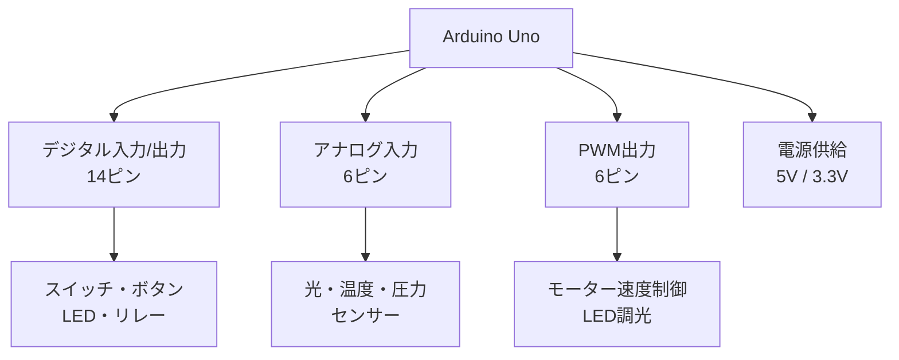
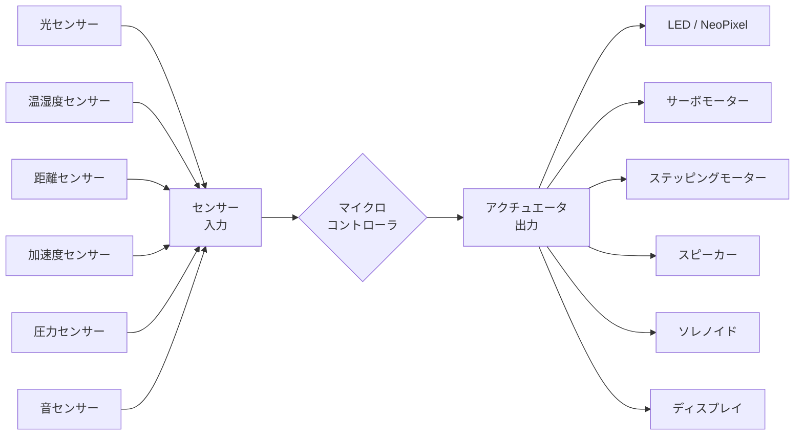
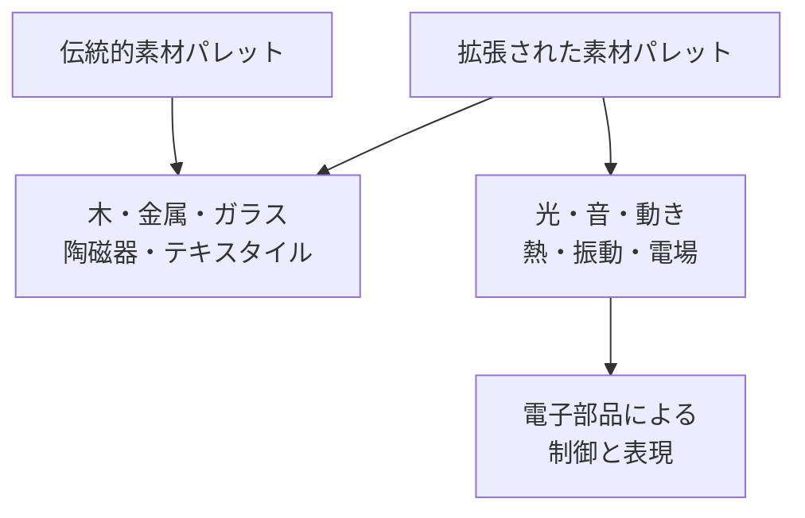

# 第2章：フィジカルコンピューティング

## はじめに：電子を素材として扱う

RISDの教育において、フィジカルコンピューティングは「エンジニアリング」ではなく「素材」として位置づけられる。木を削る感覚で回路を組み、粘土を成形する感覚でコードを書く。この転換が「Design with Electrons（電子を用いたデザイン）」という概念の核心である。

フィジカルコンピューティングとは、マイクロコントローラ、センサー、アクチュエータを用いて、物理世界とデジタル世界を橋渡しする技術領域である。しかし本章では、技術的な知識の習得だけを目的としない。**電子部品やコードを「表現の素材」として捉え、身体性のあるインタラクションをデザインする感覚**を養うことが最大の目標である。

## マイクロコントローラの基礎

### Arduino：デザイナーのための電子素材

Arduinoは、イタリアのインタラクションデザイン教育から生まれたオープンソースのマイクロコントローラプラットフォームである。その設計思想は「非エンジニアがエレクトロニクスを創造的に使えるようにする」ことにあり、まさにクリティカル・メイキングの精神と合致する。

| 比較項目 | Arduino Uno | Raspberry Pi |
|----------|-------------|--------------|
| 性質 | マイクロコントローラ | シングルボードコンピュータ |
| OS | なし（ファームウェア直接実行） | Linux |
| 得意領域 | リアルタイムセンサー制御、低消費電力 | 画像処理、ネットワーク、AI推論 |
| プログラミング | C/C++（Arduino IDE） | Python、JavaScript 等 |
| 起動時間 | 即時 | 数十秒 |
| 適用場面 | センサー読取、モーター制御、LED制御 | カメラ、音声認識、Web連携 |

!!! tip "選択の指針"
    「感じて、動かす」ならArduino。「見て、考えて、つながる」ならRaspberry Pi。多くのインタラクティブ作品では、両者を組み合わせて使用する。

### Raspberry Pi：計算する素材

Raspberry Piは完全なLinuxコンピュータであり、カメラモジュール、マイク、スピーカーなどを接続してより高度な処理が可能である。機械学習モデルのエッジ推論にも対応し、後述する「生成AIと制作」（第4章）との連携に優れる。

## センサーとアクチュエータ

フィジカルコンピューティングにおけるセンサーは「電子的な感覚器官」であり、アクチュエータは「電子的な筋肉」である。この入力と出力の間にマイクロコントローラが位置し、「電子的な脳」として振る舞う。

### 主要センサーの分類

| カテゴリ | センサー例 | 検出対象 | 設計応用例 |
|----------|-----------|---------|-----------|
| 光 | フォトレジスタ、TSL2561 | 明るさ、色 | 環境応答型照明 |
| 距離 | 超音波HC-SR04、ToFセンサー | 人やモノとの距離 | ジェスチャーインタフェース |
| 動き | MPU-6050（加速度+ジャイロ） | 傾き、振動、回転 | ウェアラブル、姿勢検出 |
| 環境 | BME280（温湿度+気圧） | 温度、湿度、気圧 | 環境可視化インスタレーション |
| 接触 | 静電容量式タッチセンサー | 触れたかどうか | タッチ式インタフェース |
| 生体 | 心拍センサー、GSRセンサー | 心拍、皮膚電気抵抗 | 感情応答型作品 |

## インタラクティブ・インスタレーション

インタラクティブ・インスタレーションは、フィジカルコンピューティングの最も表現的な応用形態である。鑑賞者の存在や行動が作品の状態を変化させ、作品と人間の間に双方向的な関係が生まれる。

### 設計の三層構造

優れたインタラクティブ作品は、以下の三層が統合されている。

1. **知覚層（Sensing Layer）**: 人間の存在や行動をどのように検知するか
2. **処理層（Processing Layer）**: 検知した情報をどのように解釈し、応答を決定するか
3. **表現層（Actuation Layer）**: 応答をどのような物理的変化として表出するか

!!! example "事例：呼吸する壁"
    超音波センサーで鑑賞者との距離を測定し、距離に応じて壁面に取り付けられた数百のサーボモーターが有機的に動く。遠くにいるときは壁面は静止し、近づくにつれて「呼吸」するように膨らみと収縮を繰り返す。これは建築空間に「生命的な応答性」を与える試みである。

## 「Design with Electrons」の概念

RISDの「Design with Electrons」は、電子工学をデザイナーの素材パレットに加えるという教育ビジョンである。ここで重要なのは、技術的な正確さよりも**「素材としての電子の感覚的特質」**を探求する姿勢である。

LEDの光は色温度と拡散のしかたによって空間の感情を変える。モーターの回転は速度とトルクによって「力強さ」や「繊細さ」を表現する。スピーカーから発される音は周波数と波形によって身体的な共振を生む。これらはすべて、木の木目や布の手触りと同列の「素材特性」として理解されるべきものである。

## エンボディド・インタラクション

エンボディド・インタラクション（Embodied Interaction）は、人間の身体全体をインタフェースとして捉える設計思想である。マウスとキーボードに限定された従来のHCI（Human-Computer Interaction）を超え、身振り、姿勢、接触、呼吸、視線といった身体的な行為を通じてデジタルシステムと対話する。

ポール・ドゥリッシュが提唱したこの概念は、フィジカルコンピューティングと深く結びつく。身体は最も原始的なインタフェースであり、空間内での身体の動きをセンサーが読み取り、環境が応答するという構図は、人間と環境の関係性の再設計にほかならない。

## タンジブル・インタフェース

MITメディアラボの石井裕が提唱したタンジブル・インタフェース（Tangible User Interface）は、デジタル情報に物理的な形を与え、手で触れて操作可能にする設計パラダイムである。

!!! info "タンジブル・インタフェースの設計原則"
    1. **物理的表現**: デジタル情報を具体的な物体として表現する
    2. **直接操作**: 物体を手で動かすことで情報を操作する
    3. **環境との統合**: インタフェースを日常の空間や物体に埋め込む
    4. **身体的フィードバック**: 触覚や力覚を通じた応答を返す

この思想は、第5章で扱う「物質性とデジタルの融合」の理論的基盤となる。

## 演習課題

### 演習1：感覚の翻訳

1つのセンサー（光、温度、距離など任意）と1つのアクチュエータ（LED、モーター、スピーカーなど任意）をArduinoで接続し、「ある感覚を別の感覚に翻訳する」装置を制作せよ。例：温度を色に変換する、距離を音程に変換する。

### 演習2：身体応答オブジェクト

手のひらサイズの物体に、少なくとも2つのセンサーと2つのアクチュエータを組み込み、「持つ人の状態に応答する」オブジェクトを制作せよ。持ち方、握る力、傾きなどに応じて、光、音、振動で応答するインタラクションを設計すること。

### 演習3：空間インスタレーション構想

2m四方の空間を想定し、最大5人の鑑賞者が同時に体験できるインタラクティブ・インスタレーションのコンセプトを設計せよ。センサー配置図、インタラクションフロー図、体験シナリオを含むドキュメントを作成すること。

!!! warning "電子部品の取り扱い"
    電子部品は静電気やショートに弱い。作業前に静電気を放電し、電源接続前に回路を必ず確認すること。特にモーター等の誘導負荷を使用する際は、逆起電力対策（フライバックダイオード）を忘れないこと。
