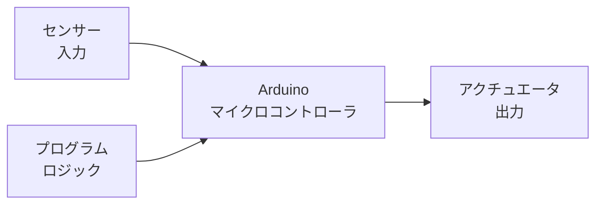
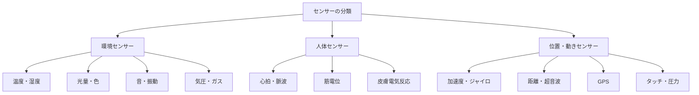
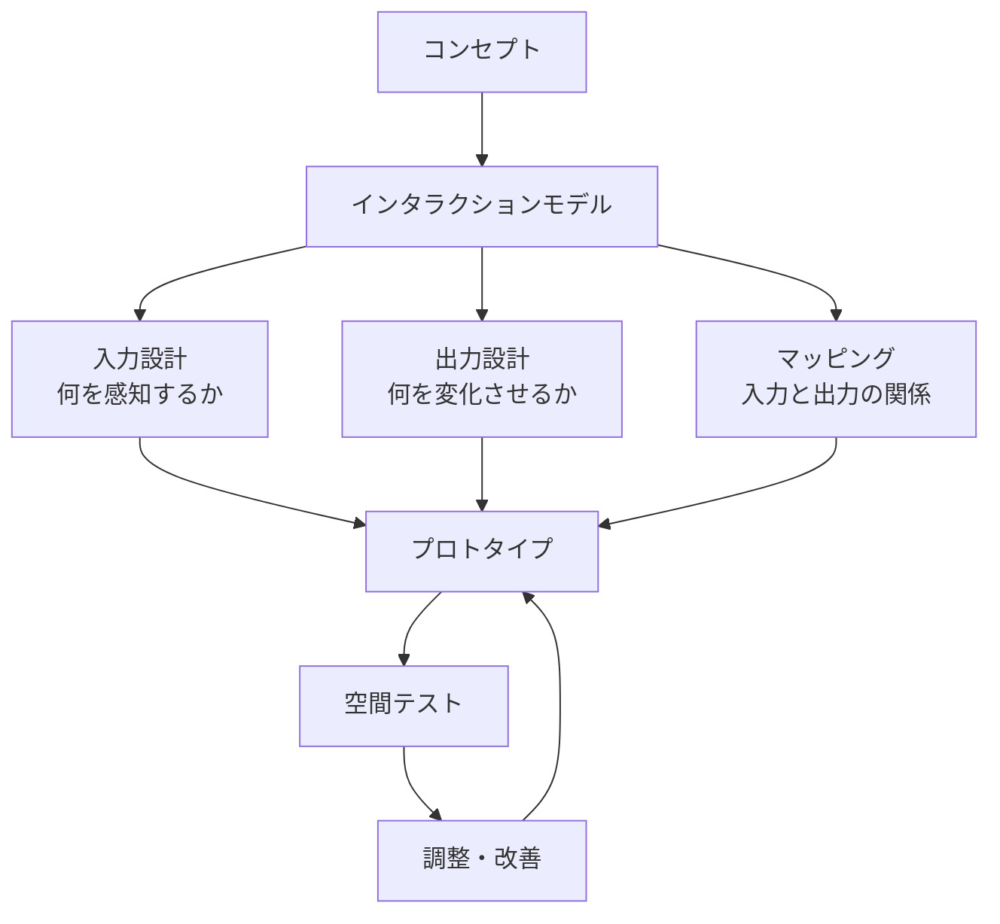

# 第2章: フィジカルコンピューティング

## はじめに：電子を「素材」として扱う

フィジカルコンピューティングとは、人間の身体とデジタル世界をつなぐインターフェースを設計・構築する領域である。マウスやキーボードといった従来の入力装置を超え、**人間の身体的な動き、環境の変化、物質的な操作を通じてコンピュータと対話する**仕組みを創り出す。

RISDの「Design with Electrons（電子を用いたデザイン）」は、この領域を象徴する科目である。ここでは電子回路やプログラミングを「エンジニアリング」として教えるのではなく、粘土やガラスと同列の**「素材」**として扱う。電子が流れる回路には、水が流れる管と同様の物理的なリアリティがあり、その振る舞いを身体的に理解することが出発点となる。

---

## 2.1 マイクロコントローラの基礎

### Arduino

Arduinoは、デザイナーやアーティストがフィジカルコンピューティングに入門するための最も普及したプラットフォームである。



| 項目 | 説明 |
|------|------|
| **基本構成** | ATmegaプロセッサ、デジタル/アナログI/Oピン、USB接続 |
| **プログラミング** | C/C++ベースの簡略化された言語（Arduino IDE） |
| **特徴** | 低コスト、豊富なライブラリ、巨大なコミュニティ |
| **適用範囲** | センサー読取、モーター制御、LED制御、シリアル通信 |
| **制約** | 処理能力が限定的、マルチタスクが困難 |

Arduinoの基本プログラム構造は `setup()`（初期化）と `loop()`（繰り返し実行）の2つの関数で構成される。この単純さが、プログラミング経験の少ないデザイナーにとっての大きな利点である。

```cpp
// 基本的なArduinoスケッチの構造
void setup() {
  pinMode(LED_BUILTIN, OUTPUT);  // LEDピンを出力に設定
}

void loop() {
  digitalWrite(LED_BUILTIN, HIGH);  // LED点灯
  delay(1000);                       // 1秒待機
  digitalWrite(LED_BUILTIN, LOW);   // LED消灯
  delay(1000);                       // 1秒待機
}
```

### Raspberry Pi

Raspberry Piは、Arduinoよりも高い処理能力を持つシングルボードコンピュータである。

| 比較項目 | Arduino | Raspberry Pi |
|----------|---------|-------------|
| **分類** | マイクロコントローラ | シングルボードコンピュータ |
| **OS** | なし | Linux（Raspberry Pi OS） |
| **プログラミング** | C/C++ | Python、JavaScript他多数 |
| **処理能力** | 限定的 | 高い（画像処理、AI推論可能） |
| **リアルタイム制御** | 得意 | 不得意 |
| **適用例** | センサー制御、モーター駆動 | カメラ処理、音声認識、Web連携 |

!!! tip "使い分けの指針"
    **Arduino** = リアルタイムで物理世界と対話するとき（モーター、LED、センサーの即座の反応）。**Raspberry Pi** = 複雑なデータ処理、ネットワーク接続、マルチメディアが必要なとき。両者を組み合わせて使うことも多い。

---

## 2.2 センサーとアクチュエータ

フィジカルコンピューティングの核心は、**環境を感知し（センサー）、環境に働きかける（アクチュエータ）**という入出力のループにある。

### 主要なセンサー



| センサー | 検出対象 | デザイン応用例 |
|----------|----------|----------------|
| 超音波距離センサー | 物体との距離 | 近接によるインタラクション |
| PIRセンサー | 人体の動き | 存在検知、自動応答 |
| 光センサー（CdS） | 光の強さ | 環境応答型照明 |
| 加速度センサー | 動き・傾き | ジェスチャー認識 |
| 静電容量センサー | タッチ・近接 | 非接触インターフェース |
| 温湿度センサー | 温度と湿度 | 環境モニタリング |

### 主要なアクチュエータ

| アクチュエータ | 出力 | デザイン応用例 |
|----------------|------|----------------|
| サーボモーター | 角度制御された回転 | キネティック彫刻、ロボティクス |
| DCモーター | 連続回転 | 回転表示、風力生成 |
| ステッピングモーター | 精密な段階的回転 | CNC、3Dプリンタ |
| LED / NeoPixel | 光 | 情報表示、環境演出 |
| スピーカー / ピエゾ | 音 | サウンドインスタレーション |
| ソレノイド | 直線的な押し引き | 触覚フィードバック |

---

## 2.3 インタラクティブ・インスタレーション

フィジカルコンピューティングの最も豊かな表現形態が、インタラクティブ・インスタレーションである。空間全体をインターフェースとして設計し、人間の存在や行動に応答する環境を創り出す。

!!! example "事例: 呼吸する壁"
    CO2センサーで室内の人数と活動量を検知し、壁面に埋め込まれたアクチュエータがゆっくりと壁面を膨張・収縮させる。空間そのものが「呼吸」しているかのような体験を生み出す。これは建築、テクノロジー、身体感覚の交差点に位置する作品である。

インスタレーション設計のフレームワークは以下の通りである。



---

## 2.4 身体化されたインタラクション

「身体化されたインタラクション（Embodied Interaction）」は、ポール・ドゥリッシュが提唱した概念であり、人間の身体的な経験と社会的な文脈をインタラクションデザインの中核に据える考え方である。

画面上のGUIでは、私たちは「目と指先」だけでコンピュータと対話する。しかし人間は本来、全身で世界を知覚し、世界に働きかける存在である。フィジカルコンピューティングは、この**身体性の回復**を目指す。

!!! info "タンジブル・インターフェース"
    MITメディアラボの石井裕が提唱した「タンジブル・ビット」は、デジタル情報に物理的な形を与えるアプローチである。例えば、テーブル上の物理的なオブジェクトを動かすことでデジタルデータを操作する「tangible user interface（TUI）」は、身体化されたインタラクションの代表的な実装である。

### Design with Electronsの思想

RISDの「Design with Electrons」は、エレクトロニクスを工学的な問題としてではなく、**表現の素材**として位置づける。

| 従来のアプローチ | Design with Electrons |
|------------------|----------------------|
| 回路は「正しく」動くべき | 回路は「面白く」振る舞えるか |
| エラーは排除すべき | エラーは表現の契機 |
| 効率性が最優先 | 詩的な質が重要 |
| 仕様書に基づく開発 | 実験と発見に基づく探索 |

電圧の揺らぎ、センサーのノイズ、タイミングのずれ――エンジニアが「バグ」と呼ぶものを、デザイナーは「表現の素材」として活用する。この視点の転換が、フィジカルコンピューティングをクリティカル・メイキングの重要な柱としている理由である。

---

## 2.5 タンジブル・インターフェースの設計原則

物理的なモノを通じてデジタル世界と対話するタンジブル・インターフェースには、以下の設計原則が存在する。

1. **物理的アフォーダンス**: 物体の形状が操作方法を暗示する（回転させたくなる形、押したくなる形）
2. **両手操作の活用**: 人間は両手を使って世界を操作する。片手だけに限定しない
3. **空間的マッピング**: 物理空間での操作とデジタルな変化が直観的に対応する
4. **フィードバックの多層性**: 視覚だけでなく、触覚、聴覚を通じた応答を返す
5. **社会的透明性**: 周囲の人にもインタラクションの状態が見える

---

## 実践演習

### 演習2-1: センサー探索（所要時間: 3-4時間）

3種類以上のセンサーをArduinoに接続し、それぞれの「個性」を探索する。

**手順:**

1. 以下のセンサーから3つ以上を選び、Arduinoに接続する
    - 光センサー、超音波距離センサー、加速度センサー、温度センサー、タッチセンサー
2. 各センサーの値をシリアルモニタで観察する
3. 日常的な行為（歩く、手を振る、息を吹きかける等）でセンサー値がどう変化するか記録する
4. 各センサーの「性格」を擬人化して説明する短い文章を書く
5. 最も面白いと感じたセンサーの反応を、LED or サーボモーターの動きに変換するスケッチを書く

### 演習2-2: ミニ・インタラクション設計（所要時間: 6-10時間）

「身近な日用品をインタラクティブにする」プロジェクトを実施する。

**手順:**

1. 身の回りの日用品を1つ選ぶ（コップ、本、植木鉢、枕など）
2. その日用品にセンサーとアクチュエータを組み込む計画を立てる
3. 「人間 → 日用品 → 応答」のインタラクションモデルを図で描く
4. Arduinoを使ってプロトタイプを制作する
5. 他者に使ってもらい、その反応を観察・記録する

!!! warning "評価のポイント"
    技術的な精度よりも、インタラクションの「意味」を重視する。その日用品がインタラクティブになることで、人間と物の関係はどう変わるのか。その変化に批判的な視座を持てているかが評価の中心となる。
