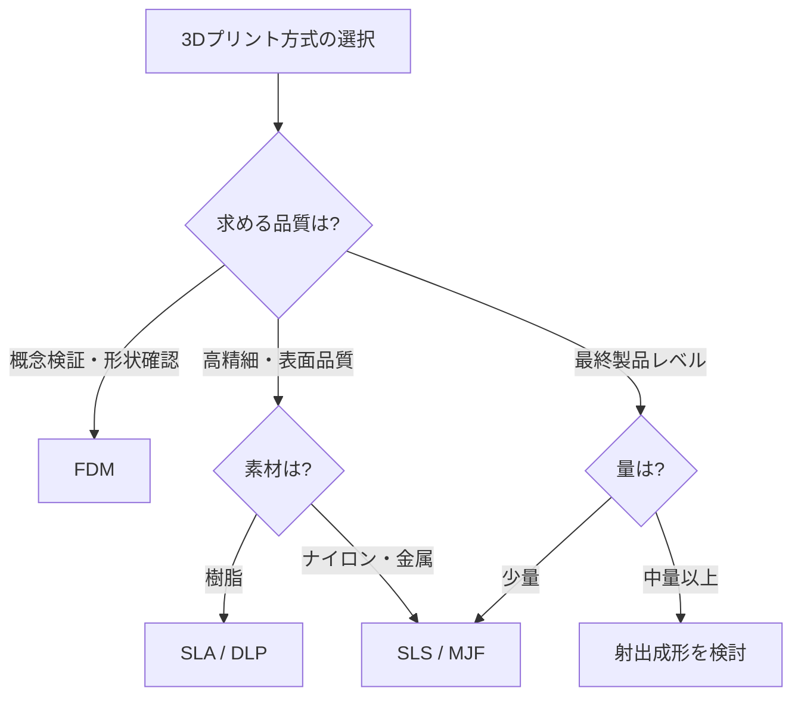
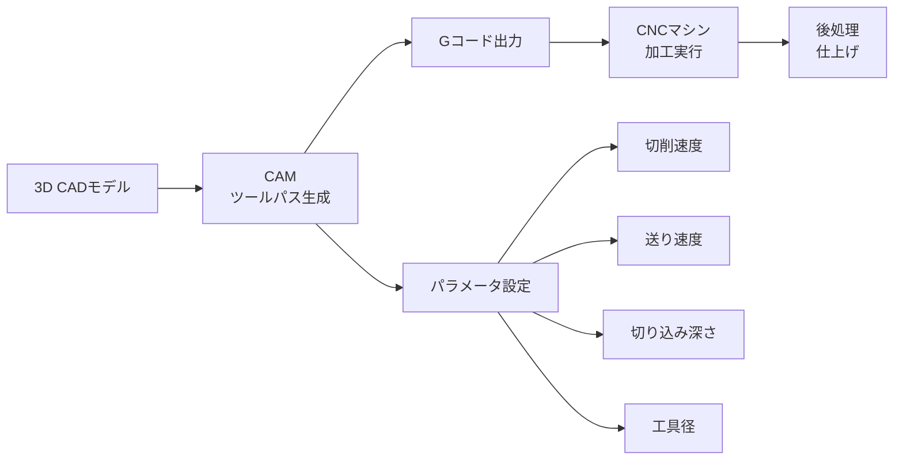
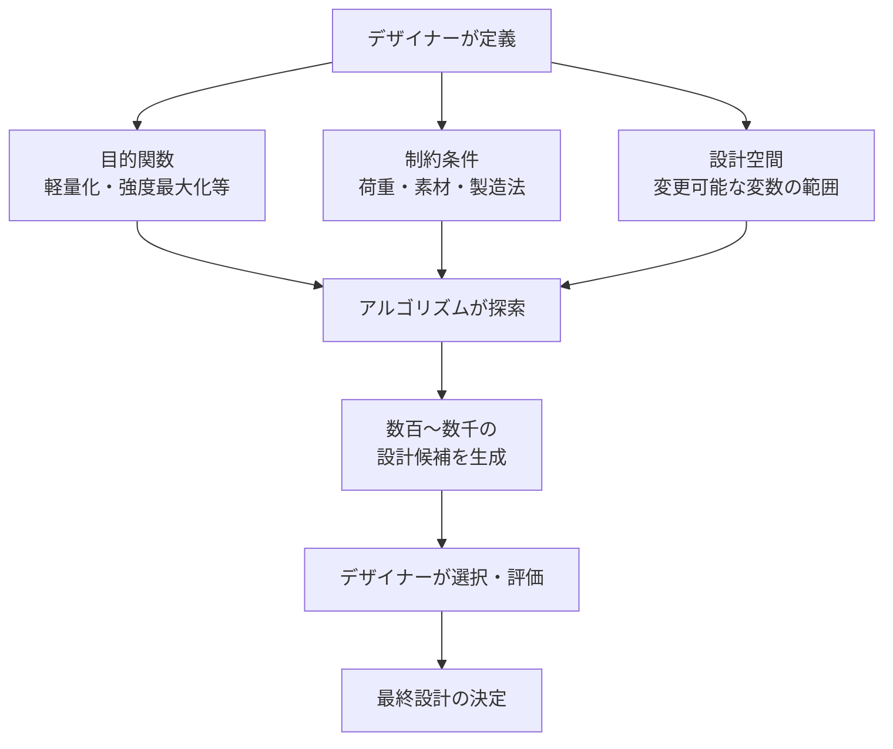

# 第3章：デジタルファブリケーション

## はじめに：第三の産業革命

ニール・ガーシェンフェルドがMITで「（ほぼ）何でも作る方法」講座を開設して以来、デジタルファブリケーションはデザイン教育の不可欠な要素となった。3Dプリンタ、レーザーカッター、CNC加工機は、かつて大規模工場でしか実現できなかった精密な加工を、個人のスタジオやファブラボで可能にした。

しかし本章の目的は、単にこれらの機器の操作方法を学ぶことではない。**デジタルファブリケーションを「考えるための道具」として使いこなし、パラメトリックデザインやジェネラティブデザインといった計算論的思考を制作プロセスに統合する**ことが目標である。

## 3Dプリンティング技術

### 主要方式の比較

3Dプリンティングは「付加製造（Additive Manufacturing）」の総称であり、素材を層状に積み重ねて立体物を形成する。方式によって精度、素材、強度、コストが大きく異なる。

| 方式 | 原理 | 素材 | 精度 | 強度 | コスト | 主な用途 |
|------|------|------|------|------|--------|----------|
| FDM（熱溶解積層） | フィラメントを溶融して積層 | PLA、ABS、PETG、TPU | 中 | 中 | 低 | ラピッドプロトタイピング |
| SLA（光造形） | 紫外線で樹脂を硬化 | 光硬化樹脂 | 高 | 中〜低 | 中 | 精密モデル、ジュエリー |
| SLS（粉末焼結） | レーザーで粉末を焼結 | ナイロン、金属粉末 | 高 | 高 | 高 | 機能部品、最終製品 |
| MJF（マルチジェット） | インクジェット+融合剤 | ナイロン | 高 | 高 | 高 | 量産試作、機能部品 |
| DLP（デジタル光処理） | プロジェクターで一層ごと硬化 | 光硬化樹脂 | 非常に高 | 中 | 中 | 歯科、ジュエリー |

!!! note "3Dプリントの限界を理解する"
    3Dプリントは万能ではない。オーバーハング角度の制約、サポート材の除去、積層方向による強度の異方性、表面の積層痕など、各方式固有の制約がある。これらの制約を「設計パラメータ」として積極的に活用する視点が重要である。

### デザインにおける3Dプリントの活用戦略

3Dプリントの真価は「1個から作れる」ことにある。従来の製造では金型が必要だった複雑な形状を、金型投資なしで実現できる。これにより以下の設計戦略が可能になる。

1. **マスカスタマイゼーション**: 個人に最適化された製品（補装具、イヤホン等）
2. **トポロジー最適化**: 必要な箇所にのみ素材を配置した有機的構造
3. **不可能形状の実現**: 内部構造を持つ一体成形品
4. **反復的改善**: 低コストで高速にプロトタイプを更新

## レーザーカッティング

レーザーカッターは、CO2レーザーやファイバーレーザーを用いて素材を高精度に切断・彫刻する装置である。2次元加工が基本だが、「平面から立体へ」の変換を設計に組み込むことで、驚くほど豊かな三次元構造を生み出せる。

| 加工 | 適した素材 | 注意事項 |
|------|-----------|---------|
| 切断 | アクリル、MDF、合板、紙、布、皮革 | PVCは有毒ガスが発生するため不可 |
| 彫刻 | 上記に加えて石材、ガラス（表面のみ） | 深さの制御はパワーと速度で調整 |
| 曲げ加工 | リビングヒンジパターンによるMDF・アクリル | ヒンジ間隔が曲率を決定 |

!!! tip "リビングヒンジの設計"
    平面素材に一定パターンの切り込み（リビングヒンジ）を入れることで、硬い板材を柔軟に曲げることができる。パターンの種類（直線、波形、十字型等）と間隔により、柔軟性と強度のバランスを制御する。これは「減算加工で柔軟性を生む」という逆説的な設計手法である。

## CNC加工

CNC（Computer Numerical Control）加工は、コンピュータ制御の回転切削工具で素材を削り出す減算製造法である。3Dプリントが「足す」加工であるのに対し、CNCは「引く」加工であり、木材、金属、樹脂など幅広い素材に対応する。

CNC加工の設計上の重要な制約は「工具径」である。工具（エンドミル）の径より小さい内角は加工できない。この制約は、CNC特有の造形言語（丸みを帯びた内角）を生み出し、むしろデザインの特徴として活用できる。

## パラメトリックデザイン

パラメトリックデザインは、設計をパラメータ（変数）とその関係性のシステムとして定義する手法である。寸法や形状を直接描くのではなく、パラメータ間の「ルール」を設計することで、パラメータの変更に応じて全体が自動的に更新される。

主要なパラメトリックデザインツールとして、Grasshopper（Rhinoceros用）とOpenSCADが挙げられる。

| ツール | 特徴 | 適した用途 |
|--------|------|-----------|
| Grasshopper | ビジュアルプログラミング、豊富なプラグイン | 建築、プロダクトの自由曲面 |
| OpenSCAD | テキストベース、プログラマ向け | 精密な機構部品、反復構造 |
| Fusion 360 | パラメトリック+ダイレクトモデリング | プロダクトデザイン全般 |
| Houdini | ノードベース、プロシージャル | 複雑なジェネラティブ形状 |

!!! example "パラメトリックの力"
    椅子の座面高さを1つのパラメータとして定義し、脚の長さ、背もたれの角度、全体のプロポーションをそのパラメータからの関数として設計する。座面高さを40cmから45cmに変更すると、すべての寸法が自動的に整合性を保って更新される。

## ジェネラティブデザイン

ジェネラティブデザインは、パラメトリックデザインをさらに推し進め、アルゴリズムが設計の探索を行う手法である。デザイナーは「目的」と「制約」を定義し、コンピュータが膨大な設計候補を生成・評価する。

トポロジー最適化はジェネラティブデザインの代表的手法であり、荷重条件と制約から最適な素材配置を自動的に導出する。その結果は、骨や樹木の枝分かれのような有機的な形状となることが多く、自然界の構造最適化との類似性は注目に値する。

## ファブラボとメイカースペース

ファブラボ（Fabrication Laboratory）は、MITのニール・ガーシェンフェルドの構想に基づく、地域に開かれたデジタル工房のネットワークである。2026年現在、世界130か国以上に2,500を超えるファブラボが存在する。

ファブラボの基本理念は「（ほぼ）あらゆるものを（ほぼ）あらゆる人が作れるようにする」ことである。3Dプリンタ、レーザーカッター、CNC、電子工作設備を備え、市民が自由にプロトタイピングを行える場を提供する。

## ラピッドプロトタイピング・ワークフロー

デジタルファブリケーションの最大の利点は、アイデアから物理的なプロトタイプまでのサイクルを劇的に短縮できることである。

| フェーズ | 目的 | 精度 | 推奨手法 | 所要時間 |
|----------|------|------|---------|---------|
| スケッチモデル | 形状・サイズの確認 | 低 | 段ボール、粘土 | 数時間 |
| コンセプトモデル | 造形意図の検証 | 中 | FDM 3Dプリント | 1〜2日 |
| 機能プロトタイプ | 動作・操作の検証 | 中〜高 | 3Dプリント+レーザーカット | 3〜5日 |
| プレプロダクション | 最終品質の確認 | 高 | SLA/SLS+CNC仕上げ | 1〜2週間 |

!!! warning "プロトタイプの罠"
    精密な3Dプリントで作られたプロトタイプは「完成品に見えてしまう」という危険がある。関係者がプロトタイプを完成品と誤認し、デザインが凍結されてしまうことがある。プロトタイプの「未完成さ」を意図的に残す工夫も、重要な設計判断である。

## 演習課題

### 演習1：平面から立体へ

レーザーカッター（またはカッターナイフ）を用いて、1枚の平面素材（厚紙、MDF等）から接着剤を使わずに組み立てられる立体構造を設計・制作せよ。嵌合、差し込み、折り曲げなどの手法を駆使すること。

### 演習2：パラメトリック・オブジェクト

Grasshopper、OpenSCAD、またはFusion 360を用いて、3つ以上のパラメータで形状が変化するオブジェクトを設計し、パラメータの異なるバリエーションを3つ以上3Dプリントせよ。パラメータと形態の関係を考察すること。

### 演習3：ラピッドプロトタイピング・スプリント

「片手で操作できるリモコン」をテーマに、4時間以内で3回のプロトタイプイテレーションを行え。各イテレーションで得た知見と改善点を記録し、最終形に至るプロセスをドキュメントすること。

!!! danger "安全に関する重要事項"
    レーザーカッターは高出力レーザーを使用するため、運用中は絶対に目を離さないこと。素材によっては有毒ガスが発生する。CNC加工では切削片の飛散に注意し、保護メガネと防塵マスクを着用すること。初めて使用する場合は、必ず経験者の立ち会いのもとで作業を行うこと。
