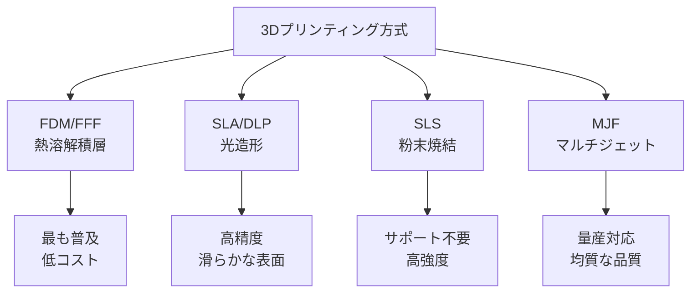
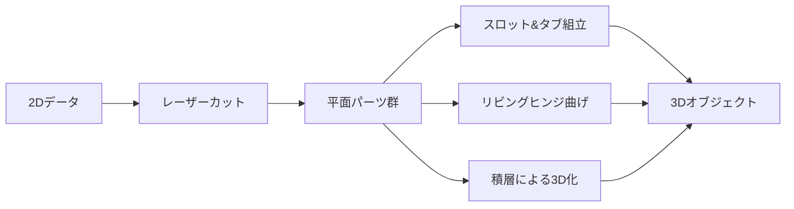
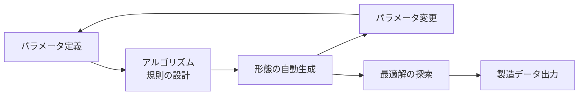
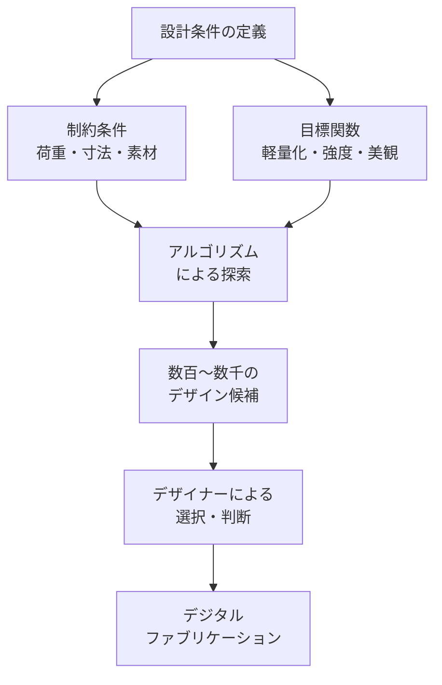
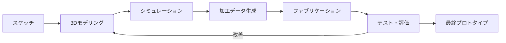

# 第3章: デジタルファブリケーション

## はじめに：「誰もがつくれる」時代の設計能力

デジタルファブリケーションとは、デジタルデータから直接、物理的なオブジェクトを製造する技術群の総称である。3Dプリンタ、レーザーカッター、CNC加工機といったデジタル工作機械は、かつて大規模な工場でしか実現できなかった精密な加工を、個人のスタジオやファブラボへとダウンスケールした。

しかし、本章で伝えたいのは機械の操作方法ではない。**デジタルファブリケーションが可能にする「思考の仕方」**である。パラメトリックデザインやジェネレティブデザインは、デザイナーが個々の形態ではなく**形態を生成するルールやシステム**を設計することを可能にした。この転換は、デザインの根本的な再定義につながる。

---

## 3.1 3Dプリンティング技術

3Dプリンティング（積層造形/Additive Manufacturing）は、デジタルの3Dモデルを薄い層の積み重ねによって物理的な立体に変換する技術である。

### 主要な方式

| 方式 | 原理 | 素材 | 精度 | コスト | 主な用途 |
|------|------|------|------|--------|----------|
| **FDM** | 熱でフィラメントを溶融し積層 | PLA、ABS、PETG、TPU | 中 | 低 | プロトタイプ、治具、教育 |
| **SLA** | 紫外線レーザーで樹脂を硬化 | フォトポリマー樹脂 | 高 | 中 | 精密モデル、ジュエリー原型 |
| **SLS** | レーザーで粉末を焼結 | ナイロン、TPU粉末 | 高 | 高 | 機能部品、最終製品 |
| **金属3DP** | レーザーで金属粉末を溶融 | チタン、ステンレス、アルミ | 高 | 非常に高 | 航空宇宙、医療インプラント |

!!! info "3Dプリントに固有のデザイン制約"
    3Dプリントは「何でも作れる魔法の箱」ではない。オーバーハング角度（サポート材の要否）、最小壁厚、積層方向による強度の異方性など、**方式ごとの制約を理解したうえで設計する**ことが不可欠である。制約を知ることは創造性を制限するのではなく、むしろ方向づける。

---

## 3.2 レーザーカッティング

レーザーカッターは、高出力のレーザー光で素材を切断・彫刻する加工機である。2次元の平面加工に特化しているが、その速度と精度により、デジタルファブリケーションの「主力兵器」とも言える存在である。

### 加工モードと素材適性

| 加工モード | 説明 | 適用素材 |
|------------|------|----------|
| **カット** | 素材を完全に切断 | アクリル、MDF、合板、紙、革、布 |
| **彫刻（ラスター）** | 表面を点状に削る | 木材、アクリル、ガラス、石材 |
| **スコア** | 表面に線を刻む | 紙、段ボール（折り線として） |

レーザーカッターの真価は**2Dから3Dへの変換**にある。リビングヒンジ（薄い切れ込みのパターンで板材に柔軟性を持たせる技法）、スロット&タブ接合（接着剤なしで組み立てる構造）、折り紙的な展開図設計など、平面の加工から立体を生み出すテクニックは、デジタルファブリケーション特有のデザインボキャブラリーを形成する。

---

## 3.3 CNC加工

CNC（Computer Numerical Control）は、コンピュータ制御による切削加工である。回転する工具（エンドミル）で素材を削り出し、高精度な形状を実現する。

3Dプリントが「足す（Additive）」加工であるのに対し、CNCは「引く（Subtractive）」加工である。木材、金属、アクリル、発泡スチロールなど幅広い素材を加工でき、加工面の品質は3Dプリントを大きく上回る。

| 項目 | CNC | 3Dプリント |
|------|-----|-----------|
| **加工原理** | 切削（引き算） | 積層（足し算） |
| **内部構造** | 制約あり（工具がアクセスできる範囲） | 自由度高い |
| **表面品質** | 優秀 | 方式依存 |
| **素材の幅** | 非常に広い | 限定的 |
| **廃材** | 多い | 少ない |
| **速度（大型）** | 速い | 遅い |

!!! warning "安全上の注意"
    CNC加工機は高速回転する刃物を使用するため、安全管理が極めて重要である。必ず指導者の監督下で操作し、保護メガネ、集塵装置、緊急停止ボタンの位置確認を徹底すること。

---

## 3.4 パラメトリックデザイン

パラメトリックデザインとは、形態を直接描くのではなく、**形態を生成するパラメータ（変数）と規則を設計する**アプローチである。

従来のデザイン: 「この椅子の座面は幅45cm、奥行き42cmである」
パラメトリックデザイン: 「座面の幅は使用者の体格に応じて40-50cmの間で変動し、奥行きは幅の0.93倍とする」

### 主要なツール

| ツール | 環境 | 特徴 |
|--------|------|------|
| **Grasshopper** | Rhinoceros上のビジュアルプログラミング | 建築・プロダクトデザインの標準 |
| **OpenSCAD** | スタンドアロン | テキストベース、プログラマ向け |
| **Fusion 360** | Autodesk | パラメトリックCAD + CAM統合 |
| **Houdini** | SideFX | ノードベース、高度なジェネレティブ |

パラメトリックデザインの本質は**「メタデザイン」**にある。デザイナーは個々のモノをデザインするのではなく、モノを生み出すシステムをデザインする。この思考は、マスカスタマイゼーション（大量生産の効率性と個別対応の柔軟性の両立）の基盤技術でもある。

---

## 3.5 ジェネレティブデザイン・アルゴリズム

ジェネレティブデザインは、パラメトリックデザインをさらに発展させ、**アルゴリズムが自律的にデザイン候補を生成・探索する**アプローチである。

### 代表的なアルゴリズム

| アルゴリズム | 原理 | 応用例 |
|-------------|------|--------|
| **遺伝的アルゴリズム** | 生物の進化を模倣。選択・交叉・突然変異 | 構造最適化、レイアウト最適化 |
| **L-system** | 植物の成長規則を形式文法で記述 | 分岐構造、有機的形態 |
| **セルオートマトン** | 格子上の単純な規則から複雑なパターン | テクスチャ、パターン生成 |
| **ボロノイ分割** | 点群から最適な領域分割を生成 | 軽量構造、自然的パターン |
| **トポロジー最適化** | 荷重条件下で最適な材料配置を算出 | 軽量かつ高強度な構造 |

!!! tip "デザイナーの役割は変わる"
    ジェネレティブデザインにおいて、デザイナーの役割は「形を描く人」から「条件を定義し、結果を判断する人」へと変化する。しかし、どの候補が「良い」かを判断する感性と批判力は、依然として人間に固有の能力である。

---

## 3.6 ファブラボとメイカースペース

ファブラボ（Fabrication Laboratory）は、MITのニール・ガーシェンフェルドが提唱した「ほぼあらゆるものをつくれる」市民開放型の工房ネットワークである。

2026年現在、世界には2,500を超えるファブラボが存在し、日本国内にも30以上の拠点がある。ファブラボの価値は機械へのアクセスだけではない。**知識の共有、コミュニティの形成、そして「つくる民主化」の実践**にある。

| 施設タイプ | 特徴 | 典型的な設備 |
|------------|------|-------------|
| **ファブラボ** | MIT基準、世界ネットワーク | レーザー、3DP、CNC、電子工作 |
| **メイカースペース** | 多様な運営形態 | 上記 + 木工、金工、縫製等 |
| **ハッカースペース** | テクノロジーコミュニティ主導 | 電子工作、プログラミング中心 |
| **大学ファブラボ** | 教育研究目的 | 産業用機材を含む高度な設備 |

---

## 3.7 ラピッドプロトタイピング・ワークフロー

デジタルファブリケーションの最大の利点は、アイデアから物理的なプロトタイプまでの時間を劇的に短縮できることである。

効果的なラピッドプロトタイピングの鍵は**解像度の段階的な向上**にある。

| フェーズ | 目的 | 手法 | 時間目安 |
|----------|------|------|----------|
| **Lo-fi** | コンセプト検証 | 段ボール、テープ、紙 | 30分-2時間 |
| **Mid-fi** | 形態・機能検証 | 3Dプリント（FDM）、レーザーカット | 2-8時間 |
| **Hi-fi** | ユーザーテスト | SLA、CNC、複合加工 | 1-3日 |
| **Final** | プレゼンテーション | 最適な方式で仕上げ | 3-7日 |

!!! warning "プロトタイプの罠"
    高品質な3Dプリントは「完成品」のように見えてしまい、フィードバックが表面的になりがちである。意図的にLo-fiなプロトタイプから始め、段階的に解像度を上げることで、本質的なフィードバックを得やすくなる。

---

## 実践演習

### 演習3-1: パラメトリック・オブジェクト（所要時間: 4-6時間）

パラメトリックデザインツール（Grasshopper、OpenSCAD、またはFusion 360）を使い、3つ以上のパラメータで形態が変化するオブジェクトを設計する。

**手順:**

1. 日常的な小物（コースター、花瓶、ペンスタンド等）を題材に選ぶ
2. 形態を定義する3つ以上のパラメータを設定する
3. パラメータを変化させ、10種類以上のバリエーションを生成する
4. 最も魅力的な3つのバリエーションを選び、選択理由を言語化する
5. 1つを3Dプリントまたはレーザーカットで製作する

### 演習3-2: 2Dから3Dへ（所要時間: 3-5時間）

レーザーカッターのみを使用して、接着剤を使わない立体構造物を制作する。

**手順:**

1. 厚さ3mmのMDFまたはアクリルを素材として使用する
2. スロット&タブ接合またはリビングヒンジ技法を活用する
3. 少なくとも20cm立方の空間を囲む構造を目標とする
4. 2Dデータ設計 → カット → 組立 → 評価のサイクルを最低2回繰り返す
5. 初回と最終版の違いと、そこから得た学びを記録する

!!! tip "デジタルとアナログの往復"
    デジタルファブリケーションの演習であっても、最初のスケッチは手描きで行うことを推奨する。手と鉛筆による思考と、コンピュータ上のパラメトリックな思考を往復することで、双方の利点を活かすことができる。
