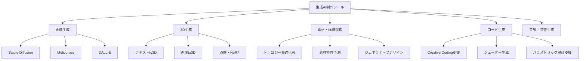
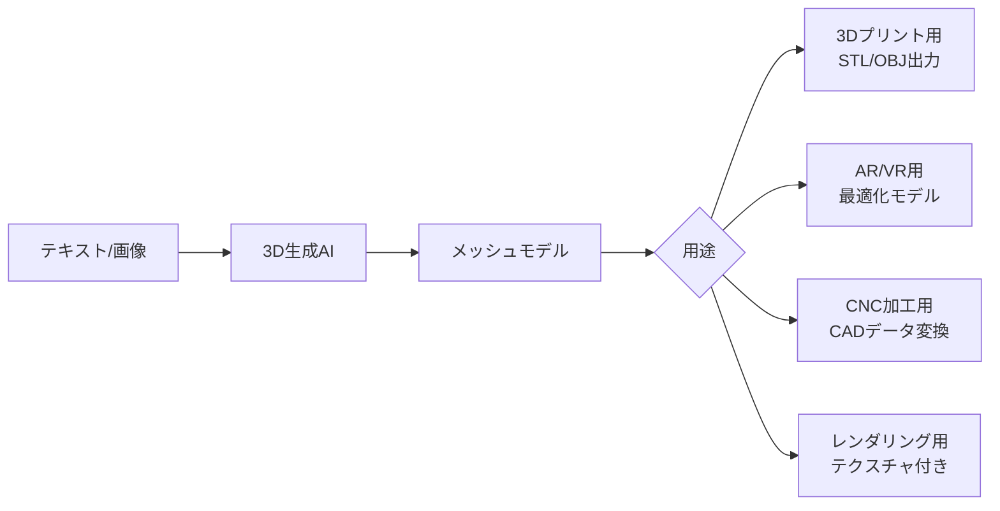
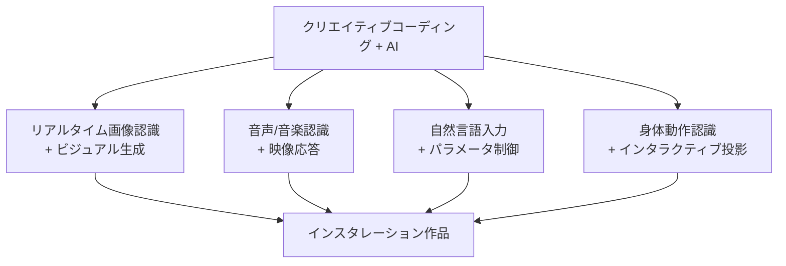

# 第4章：生成AIと制作

## はじめに：AIは道具か、共同制作者か

2026年、生成AI（Generative AI）はデザイナーの制作プロセスに深く浸透している。テキストから画像を生成し、スケッチから3Dモデルを起こし、素材の組み合わせを提案し、構造の最適化を行う。しかし、クリティカル・メイキングの文脈で生成AIを語るとき、最も重要な問いは技術的な操作方法ではない。**AIが生成したものを、自分の「作品」と呼べるのか。手を動かさずに「作った」と言えるのか**。

この問いに対する本章の立場は明確である。AIは「道具」でも「作者」でもなく、**「素材」**である。第1章で木材の異方性と対話したように、第2章で電子部品を表現の素材としたように、AIもまた固有の特性と制約を持つ「創造的素材」として扱う。その特性を理解し、意図を持って使いこなすことが、AIと制作の関係を建設的にする道である。

## AI制作ツールの全体像

## テキストから画像へ：Text-to-Image

テキスト・トゥ・イメージ生成は、自然言語のプロンプトから画像を生成する技術であり、2026年現在、デザインプロセスの初期段階（コンセプト探索、ムードボード作成、ビジュアライゼーション）で広く活用されている。

### プロンプトエンジニアリングの構造

効果的なプロンプトは、以下の要素を構造的に組み合わせる。

| 要素 | 役割 | 例 |
|------|------|-----|
| 主題（Subject） | 何を描くか | ceramic vase with organic form |
| 素材・質感 | 物質的特性 | matte porcelain, rough texture |
| 環境・照明 | 場所と光 | natural daylight, white studio |
| スタイル | 視覚的方向性 | minimalist, wabi-sabi aesthetic |
| 技法参照 | 表現技法 | product photography, 85mm lens |
| ネガティブ | 除外要素 | no glossy finish, no bright colors |

!!! tip "デザイナーのためのプロンプト戦略"
    素材の知識がプロンプトの精度を劇的に向上させる。「陶器」ではなく「還元焼成された志野釉の茶碗」と指定できるデザイナーは、AIから遥かに精緻な出力を引き出せる。第1章で学んだマテリアル・リテラシーは、AI活用の基盤でもある。

### 制作プロセスへの統合

テキスト・トゥ・イメージ生成は、制作プロセスの以下の段階で活用される。

1. **コンセプト探索**: 大量のビジュアルバリエーションを短時間で生成し、方向性を絞る
2. **素材の視覚的シミュレーション**: 異なる素材・仕上げの外観を事前に確認
3. **コンテクストの可視化**: 製品が実際の使用環境に置かれた状態を想像する
4. **クライアント・コミュニケーション**: 抽象的なコンセプトを視覚的に共有する

## テキストから3Dへ：Text-to-3D / Image-to-3D

2026年の3D生成AIは、テキストや画像から三次元モデルを直接生成する段階に達している。NeRF（Neural Radiance Fields）やガウシアンスプラッティングの技術進展により、写真数枚から高品質な3Dモデルを再構成することも可能になった。

!!! warning "3D生成AIの現在の限界"
    2026年時点でも、3D生成AIが出力するモデルは「見た目」は優れていても「製造可能性」は保証されない。壁の厚みが不均一、内部にサポート不可能な形状がある、寸法精度が低いなどの問題が頻出する。生成されたモデルは必ず人間がCAD上で検証・修正する必要がある。

## AI支援による素材探索

機械学習は、膨大な素材データベースから最適な素材の組み合わせを提案する用途でも活用されている。所望の物理特性（強度、重量、熱伝導率、コスト等）を入力すると、条件を満たす素材候補を探索し、ランキング化するシステムが実用化されている。

さらに先進的な研究では、自然界に存在しない新規素材の「発見」にAIが貢献している。深層学習による分子構造の設計は、バイオプラスチックやスマートマテリアルの開発を加速させている。

## コンピュテーショナルデザイン

コンピュテーショナルデザインは、アルゴリズムと計算によってデザインの生成・評価・最適化を行う包括的なアプローチである。生成AIの登場以前から存在する分野だが、AIの統合により新たな次元に到達している。

### 主要手法

| 手法 | 原理 | デザイン応用 |
|------|------|-------------|
| L-System | 形式文法による再帰的パターン生成 | 植物的構造、分岐パターン |
| セルラーオートマトン | 局所規則からの創発 | テキスタイルパターン、タイリング |
| エージェントベースモデル | 自律エージェントの群行動 | 群集シミュレーション、自己組織化 |
| 遺伝的アルゴリズム | 進化的探索 | 形態最適化、多目的最適化 |
| GAN（敵対的生成網） | 生成器と識別器の競合学習 | 新規形態の生成、スタイル変換 |

## ニューラルスタイルトランスファー

ニューラルスタイルトランスファーは、あるアート作品のスタイル（色彩、テクスチャ、筆致）を別の画像のコンテンツに適用する技術である。デザインにおける応用は、単なる「フィルター」にとどまらない。

例えば、建築の3Dレンダリングに特定のアーティストの色彩感覚を適用してファサードの色彩計画を探索する、製品のサーフェスデザインに伝統工芸のテクスチャパターンを学習させてコンテンポラリーな表現に転換するなど、「美的知識の転移」として活用される。

!!! example "スタイルトランスファーの批判的応用"
    民藝運動の陶器のスタイルを現代のプロダクトデザインにトランスファーする実験は、「伝統の継承」か「文化の搾取」か、という根本的な問いを突きつける。技術的に可能であることと、倫理的に妥当であることは別問題である。この批判的な視点を持つことが「クリティカル」・メイキングたるゆえんである。

## クリエイティブコーディングとAI

Processing、p5.js、openFrameworks、TouchDesigner といったクリエイティブコーディング環境は、AIとの統合により新たな表現可能性を獲得している。

特にLLM（大規模言語モデル）のコード生成能力は、「自然言語でスケッチし、AIがコードに変換し、デザイナーが評価・修正する」という新しいワークフローを可能にしている。これは、プログラミング経験の浅いデザイナーにとって、コンピュテーショナルデザインへの参入障壁を大きく下げるものである。

## AIとの協働における倫理と作家性

生成AIを制作に用いる際、避けて通れない問いがある。

1. **著作権**: AIが学習した既存作品の権利をどう扱うか
2. **作家性（Authorship）**: AIが生成に大きく寄与した作品の「作者」は誰か
3. **透明性**: AI使用の開示はどこまで必要か
4. **均質化**: AIの癖（バイアス）がデザインの多様性を損なわないか

!!! info "クリティカル・メイキングの立場"
    本カリキュラムでは、AIを「素材」として位置づけることで、この問いに一つの方向性を示す。陶芸家は粘土の「作者」ではないが、粘土から作品を生み出した「作者」である。同様に、AI生成物そのものは作品ではなく、AIの出力を選択し、編集し、文脈に位置づけ、物理的に具現化するプロセスの全体を通じて、デザイナーの作家性が成立する。

## 演習課題

### 演習1：AIコンセプト・エクスプロレーション

「光を捕まえる器」というテーマで、テキスト・トゥ・イメージAIを用いて50枚以上の画像を生成せよ。プロンプトを段階的に洗練させるプロセスを記録し、最も可能性を感じる5枚を選び、選択の理由を言語化すること。

### 演習2：AI-to-Physical パイプライン

演習1で選んだコンセプトを、3D生成AIでモデル化し、3Dプリントで物理的に出力せよ。AI生成モデルから3Dプリント可能なデータへの変換過程で必要だった修正を詳細に記録し、AIの限界と人間の介入の意義を考察すること。

### 演習3：スタイルトランスファー実験

自分が制作した（または撮影した）オブジェクトの画像に、3つ以上の異なるスタイルをニューラルスタイルトランスファーで適用せよ。結果を比較分析し、「どのスタイルの転移が元のオブジェクトの本質を最も良く引き出すか」を議論すること。
