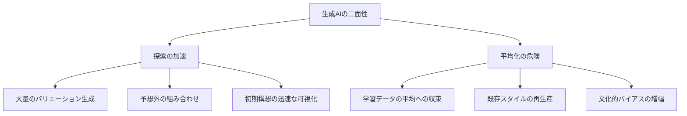
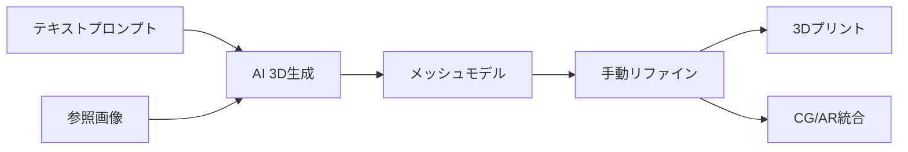
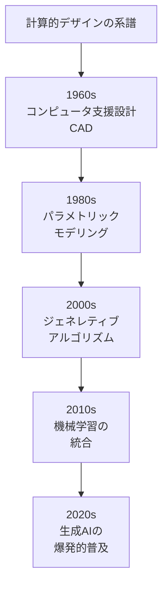
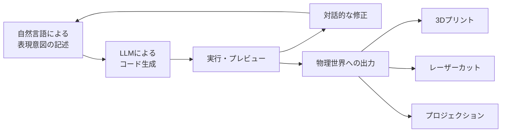

# 第4章: 生成AIと制作

## はじめに：AIは道具か、素材か、共同制作者か

2026年、生成AI（Generative AI）はデザインの制作プロセスに不可逆的に組み込まれつつある。テキストから画像を生成し、スケッチから3Dモデルを立ち上げ、自然言語の指示からプログラムコードを書き出す。この技術的現実を前に、デザイナーは問わなければならない。**AIは単なる効率化ツールなのか、それとも制作における新しい「素材」なのか。**

本章では、生成AIを「批判的に使いこなす」ための知識と実践を扱う。重要なのは、AIの出力をそのまま受け入れるのではなく、**AIとの対話を通じて自らの創造的意図を深化させる**姿勢である。

---

## 4.1 AIを創造的ツールとして捉える

生成AIの本質は**確率的な補間**にある。膨大な学習データの間を補間し、「ありそうなもの」を生成する。この性質は、デザインプロセスにおいて二つの意味を持つ。

!!! warning "AIの出力に対する批判的態度"
    AIが生成するものは常に「過去のデータの再構成」である。真に新しいものを創造するには、AIの出力を出発点として、そこから**人間の批判的判断と身体的な制作行為**を経由させる必要がある。AIをそのまま「作者」にしてはならない。

## 4.2 テキストから画像・3Dへ

### Text-to-Image生成

Midjourney、DALL-E、Stable Diffusionに代表されるテキストから画像を生成するAIは、デザイナーの初期構想プロセスを根本的に変えた。

| 活用フェーズ | 用途 | 注意点 |
|-------------|------|--------|
| **ムードボード** | 世界観の方向性を素早く視覚化 | 最終品質ではなく方向性の確認に使う |
| **コンセプト探索** | 多数のスタイルバリエーションを短時間で比較 | 生成結果に引きずられすぎない |
| **テクスチャ・パターン** | 素材表面のパターンを実験的に生成 | 物理的な再現可能性を常に検証する |
| **プレゼンテーション** | 構想段階のビジュアライゼーション | AI生成であることを明示する |

### Text-to-3D生成

2026年現在、テキストや画像から3Dモデルを直接生成する技術が急速に成熟している。

主要なツールとして以下が挙げられる。

| ツール | 入力 | 出力 | 特徴 |
|--------|------|------|------|
| **Meshy / Tripo3D** | テキスト or 画像 | メッシュ + テクスチャ | 迅速な3D化、低ポリゴン向き |
| **OpenAI Shap-E** | テキスト | NeRF or メッシュ | 研究ベース、実験的 |
| **Nvidia GET3D** | 画像群 | テクスチャ付きメッシュ | 高品質、学習データ依存 |
| **CAD系AI** | スケッチ + 制約 | パラメトリックCAD | 製造可能性を考慮 |

!!! tip "3D生成AIの現実的な活用法"
    現時点の3D生成AIは、完成品の制作には精度が不足する場合が多い。最も効果的な活用法は、**ラフな形態の探索**と**初期プロトタイプの迅速な生成**である。生成されたモデルを手作業でリファインするワークフローが現実的である。

---

## 4.3 AIを活用した素材探索

生成AIは、物理的な素材の新しい組み合わせや加工方法の探索にも活用できる。

### 素材データベースとAI

材料科学の分野では、AIが新素材の発見を加速させている。デザイナーにとってのインパクトは以下の通りである。

| 応用 | 説明 |
|------|------|
| **素材特性の予測** | 組成からの物性予測により、実験前にスクリーニング |
| **素材の組み合わせ探索** | 異なる素材の複合による新特性の発見 |
| **加工条件の最適化** | 焼成温度、混合比率などの最適条件を推定 |
| **バイオ素材の設計** | 微生物が生産する素材の特性予測 |

AIに「柔軟で透明で生分解性のある素材」と問いかければ、候補となる素材群やその合成条件のヒントを得ることができる。ただし、その結果は必ず実験で検証しなければならない。**AIは仮説生成器であり、真理の提供者ではない。**

---

## 4.4 計算的デザイン（Computational Design）

計算的デザインとは、アルゴリズム、データ、シミュレーションを設計プロセスの中核に据えるアプローチの総称である。生成AIはこの領域の最新の展開であるが、計算的デザインの歴史はより長い。

計算的デザインにおいて、デザイナーは以下の3つのレベルで「計算」と関わる。

| レベル | 説明 | 例 |
|--------|------|-----|
| **ツールとして** | 既存のソフトウェアを使用 | Grasshopper、Processing |
| **素材として** | アルゴリズムの振る舞いを造形に活用 | セルオートマトンのパターン |
| **思考として** | 計算論的思考でデザイン問題を構造化 | 問題の分解、抽象化、パターン認識 |

---

## 4.5 ニューラルスタイルトランスファー

ニューラルスタイルトランスファーは、あるイメージの「スタイル」を別のイメージの「内容」に適用する技術である。ゴッホのタッチで自分の写真を再描画するような操作が、この技術の典型的な応用である。

デザインにおける活用は、単なるフィルター的使用を超えて以下のような展開が可能である。

| 応用 | 説明 |
|------|------|
| **素材テクスチャの転写** | 大理石の質感を3Dモデルの表面に適用 |
| **文化的パターンの融合** | 異なる文化圏の装飾パターンを融合 |
| **時代間のスタイル補間** | アールヌーヴォーとバウハウスの「中間」を生成 |
| **自然パターンの抽出** | 生物の表面構造のパターンを抽出し転用 |

!!! info "倫理的配慮"
    スタイルトランスファーは、特定の文化や作家のスタイルを容易に「借用」できるため、文化的な搾取（Cultural Appropriation）のリスクを孕む。どのスタイルを、誰が、何の目的で使用するのか、常に批判的な検討が必要である。

---

## 4.6 クリエイティブ・コーディングとAI

クリエイティブ・コーディングとは、プログラミングを視覚的・音響的・インタラクティブな表現の手段として活用する実践である。Processing、p5.js、openFrameworksといったフレームワークがこの領域を支えてきた。

2026年現在、生成AIはクリエイティブ・コーディングの敷居を劇的に下げている。

### AI支援コーディングの実践的ワークフロー

1. **意図の言語化**: 作りたい表現を自然言語で詳細に記述する
2. **コード生成**: LLM（Claude、GPT等）にコードを生成させる
3. **理解と修正**: 生成されたコードを読み、理解し、意図とのずれを修正する
4. **反復**: 結果を観察し、プロンプトを調整して再生成する
5. **拡張**: 動作するコードを基盤に、手動で独自の要素を追加する

!!! warning "「プロンプトだけ」の限界"
    AIにコードを書かせるだけでは、出力は平凡なものに収束しやすい。プログラミングの基礎を理解し、**AIが生成したコードを読み・改変する能力**が、独自の表現を生み出す鍵となる。プロンプトエンジニアリングは手段であり、目的ではない。

---

## 4.7 AIとの協働における原則

生成AIを制作プロセスに統合する際に守るべき原則を以下に整理する。

| 原則 | 説明 |
|------|------|
| **主体性の保持** | AIの出力に引きずられず、自らの創造的意図を常に確認する |
| **透明性** | AI使用の範囲と方法をドキュメントし、他者に開示する |
| **批判的評価** | AIの出力を無条件に受け入れず、品質・倫理・独自性を評価する |
| **身体性との接続** | AI生成のデジタルデータを、必ず物理的な制作に接続する |
| **学習の意識** | AIを使うプロセス自体から、何を学んでいるかを振り返る |

---

## 実践演習

### 演習4-1: AI素材探索ワークショップ（所要時間: 3-4時間）

生成AIを活用して、「ありえない素材」の探索と視覚化を行う。

**手順:**

1. 2つの相反する素材特性を選ぶ（例: 「硬い + 柔らかい」「透明 + 重い」「冷たい + 有機的」）
2. Text-to-Imageツールで、その特性を持つ架空の素材を100枚以上生成する
3. 生成された画像を分類し、最も興味深い10枚を選出する
4. 選出した画像に基づき、その素材の物性表（想像上のもの）を作成する
5. その架空の素材で作れるプロダクトを3つ提案し、スケッチする

### 演習4-2: AI協働制作（所要時間: 6-10時間）

生成AIとの「対話」を通じて、物理的な成果物を1つ制作する。

**手順:**

1. 制作テーマを1つ設定する（例:「光と影の器」「触れる音楽」等）
2. AIとの対話（テキスト、画像生成、コード生成）を30回以上行い、全てのプロンプトと出力を記録する
3. AIの出力から得たインスピレーションを基に、手作業でプロトタイプを制作する
4. 「AIが提案したもの」と「自分が最終的に作ったもの」の差異を分析する
5. 全プロセスを「AI協働日誌」として記録し、AIとの対話から何を学んだかを言語化する

!!! tip "記録の重要性"
    AIとの協働プロセスは、記録しなければ再現も振り返りもできない。すべてのプロンプト、出力、判断の理由を残すことが、この演習の核心である。
