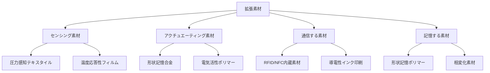
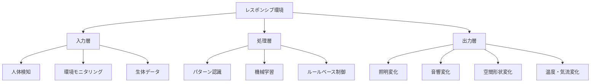
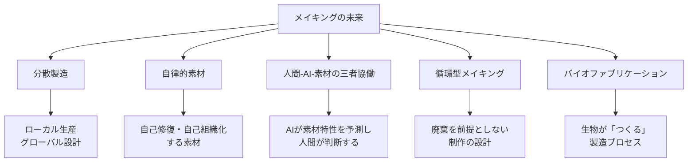

# 第5章: 物質性とデジタルの融合

## はじめに：第三の領域

本書の最終章では、これまでの4章で扱ってきた「素材」「フィジカルコンピューティング」「デジタルファブリケーション」「生成AI」が交差する領域に踏み込む。物質的なものとデジタルなものの境界が溶解し始めた現在、デザイナーには**両方の世界を自在に行き来する能力**が求められている。

RISDが「Critical Making」と呼ぶ実践の最先端は、まさにこの融合地帯にある。木とセンサーが一体化した家具、菌糸体とアルゴリズムが共同設計する建築材料、身体の動きに応じて色が変わるテキスタイル。これらは「物質」でも「デジタル」でもなく、**その間に立ち上がる第三の領域**に属するデザインである。

---

## 5.1 拡張素材（Augmented Materials）

拡張素材とは、従来の物質的素材にデジタル機能を埋め込み、素材の能力を拡張したものを指す。

| 素材カテゴリ | 原理 | デザイン応用 |
|-------------|------|-------------|
| **形状記憶合金（SMA）** | 温度変化で記憶した形状に復元 | 自律的に変形する構造、温度応答型家具 |
| **電気活性ポリマー（EAP）** | 電圧印加で変形 | 人工筋肉、柔軟ロボティクス |
| **フォトクロミック素材** | 紫外線で可逆的に変色 | 環境応答型の表面デザイン |
| **サーモクロミック素材** | 温度で可逆的に変色 | 触れると色が変わるインターフェース |
| **導電性インク** | 印刷可能な電子回路 | 紙・布上の回路、フレキシブル電子機器 |

!!! info "素材とテクノロジーの境界の消失"
    従来、「素材」と「テクノロジー」は明確に区分されていた。木材は素材であり、Arduinoはテクノロジーである。しかし拡張素材の登場により、素材そのものがセンシング、アクチュエーション、通信の機能を持ち始めている。この境界の消失が、デザインの方法論に根本的な変化を迫っている。

---

## 5.2 スマートテキスタイル

テキスタイルは人間の身体に最も近い素材であるがゆえに、デジタル機能との融合が最も大きなインパクトを持つ領域の一つである。

### スマートテキスタイルの階層

| レベル | 定義 | 例 |
|--------|------|-----|
| **パッシブ・スマート** | 環境変化を感知するが応答しない | 紫外線で変色する布 |
| **アクティブ・スマート** | 環境変化を感知し応答する | 温度調節する衣服 |
| **ウルトラ・スマート** | 感知・応答・適応を自律的に行う | 生体データに基づき形状変化する衣服 |

### 制作技法

スマートテキスタイルの制作には、テキスタイルデザインの伝統的技法と電子工学の知識を融合させる必要がある。

| 技法 | 説明 | 必要スキル |
|------|------|-----------|
| **導電糸の刺繍** | 導電性の糸で回路パターンを刺繍 | 刺繍技術 + 回路設計 |
| **導電性布の裁断** | 導電性布をカットし接続部を形成 | パターンメイキング + 電子工学 |
| **織り込み回路** | 織機で導電糸と絶縁糸を交互に織る | 織りの技法 + 回路理論 |
| **プリンテッド回路** | 導電性インクで布に回路を印刷 | スクリーン印刷 + 回路設計 |

!!! example "事例: Google Project Jacquard"
    Googleとリーバイスが共同開発したProject Jacquardは、デニムジャケットの袖にタッチセンサーを織り込み、スマートフォンの操作を可能にした。これは「テキスタイル = インターフェース」という概念の商業的な実現例である。

---

## 5.3 レスポンシブ環境

レスポンシブ環境（Responsive Environment）とは、人間の存在や行動を感知し、リアルタイムに空間そのものが変化する建築・インテリアの概念である。

レスポンシブ環境の設計においては、「何に応答するか」「どのように応答するか」「応答の速度とスケール」の3つの設計変数が重要となる。過剰に反応する空間は不快であり、応答が遅すぎれば意味を失う。**環境と人間の「呼吸」を合わせる**という感性的な調整能力が、テクノロジーの知識以上に求められる。

---

## 5.4 デジタル-フィジカル・インターフェース

物理世界とデジタル世界の接点を設計する「デジタル-フィジカル・インターフェース」は、クリティカル・メイキングの中心的な実践領域である。

### インターフェースの類型

| 類型 | 方向性 | 例 |
|------|--------|-----|
| **物理→デジタル** | 物理的操作がデジタル世界に影響 | タンジブルUI、ジェスチャー操作 |
| **デジタル→物理** | デジタルデータが物質世界に顕現 | データフィジカライゼーション、ロボティクス |
| **双方向** | 物理とデジタルが相互に影響 | AR/MR、サイバーフィジカルシステム |

### データ・フィジカライゼーション

データ・フィジカライゼーションは、データを物理的な形態として具現化する実践である。画面上のグラフでは得られない**身体的な理解**を可能にする。

例えば、気象データを木片の高さと色に変換した「天気の風景」、CO2排出量を粘土の重量で表現した「炭素の重さ」など、データに物理的な存在感を与えることで、抽象的な数値が直感的に理解可能になる。

!!! tip "物理化の利点"
    人間は「重さ」「大きさ」「温度」を直感的に理解できる。10トンのCO2という数字は抽象的だが、10トンの石を目の前にすれば、その意味が身体的に理解できる。データ・フィジカライゼーションはこの身体的理解を設計する手法である。

---

## 5.5 バイオマテリアルと計算

生物学とデジタル技術の融合は、デザインにおける最も先進的なフロンティアの一つである。

### バイオマテリアル

| 素材 | 原料 | 特性 | デザイン応用 |
|------|------|------|-------------|
| **菌糸体（マイコマテリアル）** | キノコの菌糸 | 軽量、断熱、生分解性 | パッケージ、建材、家具 |
| **バクテリアセルロース** | 酢酸菌の代謝物 | 透明、強靭、柔軟 | テキスタイル、包装 |
| **バイオプラスチック** | 藻類、デンプン等 | 成形可能、生分解性 | 容器、フィルム |
| **バイオコンクリート** | 石灰化バクテリア | 自己修復性 | 建築構造 |

バイオマテリアルの最も革命的な点は、**素材が「成長する」**ことにある。工業的な素材は採掘・精製・加工という直線的なプロセスで生産されるが、バイオマテリアルは生物の成長・代謝によって「育てられる」。この根本的な違いは、デザインの時間軸と制御の概念を変える。

デザイナーは最終形態を完全に制御するのではなく、成長の条件（温度、湿度、栄養、形状の型）を設計し、生物の自律的な成長に委ねる。計算的デザインの手法（シミュレーション、パラメータ最適化）をこの成長プロセスに統合することで、「半自律的なデザイン」が可能になる。

---

## 5.6 メイキングの未来

本書全体を通じて見てきたように、「つくる」行為は劇的に変容しつつある。最終節では、メイキングの未来を展望する。

### 5つの方向性

| 方向性 | 現在の状態 | 2030年の予測 |
|--------|-----------|-------------|
| **分散製造** | ファブラボの普及段階 | 家庭用マルチマテリアル製造機 |
| **自律的素材** | 研究段階 | 自己修復コーティングの商用化 |
| **人間-AI-素材の三者協働** | 初期的な実装 | AIが素材の振る舞いをリアルタイム予測 |
| **循環型メイキング** | 概念浸透段階 | 分解・再構成を前提とした設計標準 |
| **バイオファブリケーション** | 実験段階 | 特定用途での商業生産開始 |

!!! quote "クリティカル・メイキングの本質"
    クリティカル・メイキングの「クリティカル」は、単に「批判的」という意味だけではない。それは「重要な、決定的な」という意味も持つ。手を動かしてつくることは、思考の最も決定的な形態であり、世界を理解し変革するための最も直接的な方法である。AIの時代にあっても、この本質は変わらない。

---

## 5.7 統合的実践に向けて

本書で学んだ5つの領域を統合する視座を以下に整理する。

| 章 | 獲得する力 | 統合における役割 |
|----|-----------|-----------------|
| 第1章 素材 | 物質的感性 | デザインの身体的基盤 |
| 第2章 フィジカルコンピューティング | インタラクション構築力 | 物質とデジタルを接続する技術 |
| 第3章 デジタルファブリケーション | 迅速な具現化力 | アイデアを素早く物理化する手段 |
| 第4章 生成AI | 探索と発想の加速力 | 可能性の空間を拡張するパートナー |
| 第5章 融合 | 領域横断的統合力 | すべてを結びつける視座 |

これらの力を個別に持つだけでは不十分である。真のクリティカル・メイカーは、**状況に応じてこれらの力を自在に組み合わせ、既存のカテゴリに収まらない新しいデザインを生み出す**存在である。

---

## 実践演習

### 演習5-1: 拡張オブジェクト（所要時間: 8-12時間）

日常的なオブジェクトに、センシング・応答機能を持つ素材やテクノロジーを統合した「拡張オブジェクト」を制作する。

**手順:**

1. 日常的なオブジェクトを1つ選ぶ
2. そのオブジェクトが「知覚」し「応答」すべき環境情報を定義する
3. 必要なセンサー、アクチュエータ、素材を選定する
4. 素材加工（第1章）、電子回路（第2章）、デジタルファブリケーション（第3章）を組み合わせて制作する
5. 制作過程でAI（第4章）を最低3回活用し、その記録を残す
6. 完成したオブジェクトを他者に体験してもらい、フィードバックを収集する

### 演習5-2: 未来素材のプロトタイプ（所要時間: 10-15時間）

「2035年に存在するかもしれない素材」を想像し、そのプロトタイプを制作する。

**手順:**

1. 生成AIと対話しながら、架空の未来素材のコンセプトを開発する
2. その素材の物性表（想像上のもの）を作成する
3. 現在利用可能な素材とテクノロジーの組み合わせで、その未来素材の「体験」を疑似的に再現するプロトタイプを制作する
4. プロトタイプを用いて、その未来素材が社会に与える影響についてのシナリオを3つ記述する
5. 全プロセスを写真、図、文章で記録したポートフォリオページを作成する

!!! warning "最終演習の意図"
    この演習は、本書全体の統合課題である。素材の知識、電子工学、デジタルファブリケーション、AI活用、そして批判的思考のすべてを動員することが求められる。「完璧なプロトタイプ」ではなく、「豊かなプロセスと深い考察」を目指すこと。
