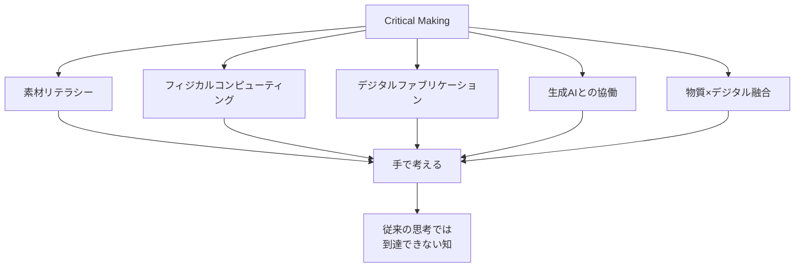
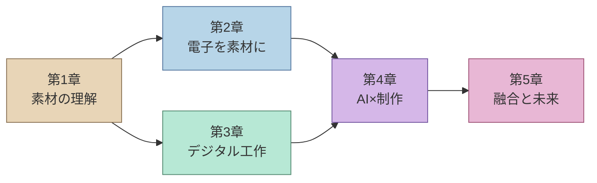

# Book 4: クリティカル・メイキング

**RISD（ロードアイランド・スクール・オブ・デザイン）に学ぶ、「作ることで考える」デザイン教育**

---

## 本書の位置づけ

RISD（Rhode Island School of Design）は、「Making（手を動かすこと）」を教育の根幹に据えてきた世界有数のデザインスクールである。しかし2026年現在、その「Making」の概念は大きく拡張されている。伝統的なガラス工芸や木工のスタジオには Arduino やセンサーが並び、3Dプリンタやレーザーカッターが陶芸窯と共存し、生成AIがスケッチの段階から制作プロセスに介入する。

本書「クリティカル・メイキング」は、この物質性（Materiality）とデジタルテクノロジーの融合を体系的に学ぶためのガイドである。「Critical Making」とは、単に「批判的に作る」ことではない。**作ることそのものを思考の手段とし、手と素材との対話を通じて、概念だけでは到達できない知の領域を切り拓く実践**である。

## RISDアプローチの核心

RISDの教育哲学における最大の特徴は、**「素材を通じた認識論（Material Epistemology）」**にある。これは、木を削り、金属を曲げ、ガラスを吹く過程で得られる身体的な知識が、論理的思考とは異なる形で世界の理解を深めるという考え方である。

2026年のRISDでは、この伝統的な素材感覚に「Design with Electrons（電子を用いたデザイン）」が統合され、テクノロジーを「道具」ではなく「素材」として扱う感覚の養成が行われている。

## 学習目標

本書を通じて、以下の能力を獲得することを目指す。

| 学習目標 | 到達レベル | 対応章 |
|----------|-----------|--------|
| 主要素材の特性を理解し、素材主導の設計ができる | 実践 | 第1章 |
| マイコンとセンサーを用いたインタラクティブ作品を制作できる | 実践 | 第2章 |
| デジタルファブリケーション機器を用いた試作ができる | 実践 | 第3章 |
| 生成AIを制作プロセスに統合できる | 応用 | 第4章 |
| 物質とデジタルを横断する作品を構想・制作できる | 統合 | 第5章 |

## 各章の概要

### 第1章：素材とクラフトマンシップ

RISD伝統のファウンデーション・イヤー（基礎課程）に倣い、木材・金属・ガラス・陶磁器・テキスタイルといった主要素材の特性を学ぶ。素材リテラシーの獲得と、素材主導のデザインプロセスを理解する。

### 第2章：フィジカルコンピューティング

Arduino や Raspberry Pi を「電子素材」として扱い、センサーとアクチュエータを用いたインタラクティブな作品制作を学ぶ。RISDの「Design with Electrons」概念を中心に、身体性のあるインタラクション設計を実践する。

### 第3章：デジタルファブリケーション

3Dプリント、レーザーカット、CNC加工といったデジタル工作機器の原理と活用法を学ぶ。パラメトリックデザインやジェネラティブデザインの手法と、ファブラボにおけるラピッドプロトタイピングのワークフローを理解する。

### 第4章：生成AIと制作

テキストから画像・3Dモデルを生成するAI、素材探索を支援するAI、ニューラルスタイルトランスファーなど、生成AIを制作の各段階に統合する手法を学ぶ。AIを「共同制作者」として位置づける新しい創作観を探る。

### 第5章：物質性とデジタルの融合

スマートテキスタイル、レスポンシブ環境、バイオマテリアルとコンピュテーションの融合など、物質とデジタルの境界を越える最先端の実践を学ぶ。「作ることの未来」を構想する。

## 前提知識と準備

!!! info "必要な前提知識"
    - Book 1「デザイン思考の基礎」の内容を理解していること
    - 基本的なプログラミングの概念（変数、条件分岐、ループ）を理解していること
    - 手を動かすことへの意欲と好奇心

!!! tip "推奨する環境"
    - Arduino Uno または互換ボード
    - 基本的な電子部品キット（LED、抵抗、センサー類）
    - 3Dプリンタへのアクセス（ファブラボ、メイカースペースなど）
    - 生成AIツール（Stable Diffusion、Midjourney など）へのアクセス

## 本書の学習フロー

!!! warning "「作る」ことの不可欠性"
    本書は読むだけでは不十分である。各章末の演習は必ず実際に手を動かして取り組むこと。クリティカル・メイキングの本質は、身体を通じた知の獲得にある。画面上のシミュレーションだけでは得られない学びが、素材との物理的な対話の中にある。
