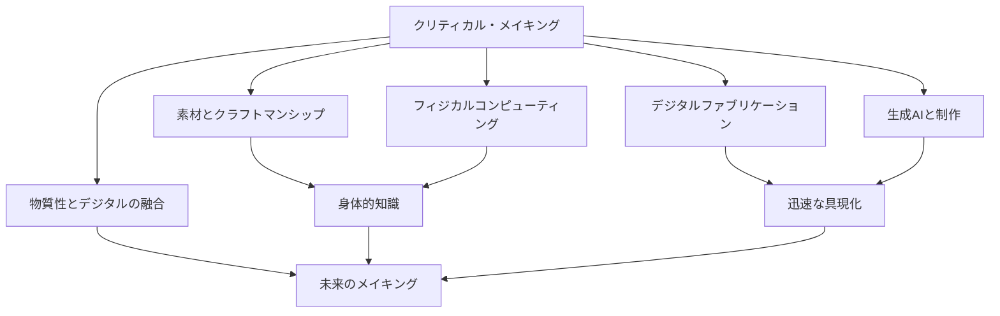
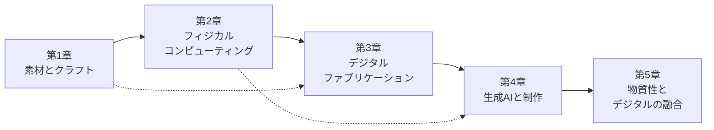

# Book 4: クリティカル・メイキング

**RISD（ロードアイランド・スクール・オブ・デザイン）に学ぶ、「つくること」による思考**

---

## このBookについて

「クリティカル・メイキング（Critical Making）」とは、単なるモノづくりの技術ではない。それは**「手を動かすことで思考する」**という、RISDが長年培ってきたデザイン教育哲学の核心である。

RISDのファウンデーション・イヤー（基礎課程）では、学生はまず素材に触れることから始める。木を削り、金属を曲げ、ガラスを吹き、テキスタイルを織る。この「物質との対話」を通じて、画面上のデザインだけでは決して得られない**身体的な知識（Embodied Knowledge）**を獲得する。

2026年現在、RISDはこの伝統的なクラフトマンシップに**フィジカルコンピューティング**と**デジタルファブリケーション**を高度に融合させている。Arduinoや3Dプリンタは「道具」ではなく「素材」として扱われ、電子回路もまた粘土やガラスと同様に「手で考える」対象となっている。

## 学習目標

本Bookを修了すると、以下の能力を獲得できる。

| # | 学習目標 | 対応章 |
|---|----------|--------|
| 1 | 主要な素材（木材、金属、ガラス、セラミクス、テキスタイル）の特性を理解し、素材主導のデザインプロセスを実践できる | 第1章 |
| 2 | Arduino/Raspberry Piを用いたインタラクティブなプロトタイプを構築できる | 第2章 |
| 3 | 3Dプリンタ、レーザーカッター、CNCを適切に選択し、デジタルファブリケーションのワークフローを設計できる | 第3章 |
| 4 | 生成AIを制作プロセスに統合し、AIとの協働による新しい造形表現を探索できる | 第4章 |
| 5 | 物質的素材とデジタル技術を融合させた、次世代のデザインコンセプトを提案できる | 第5章 |

## RISDのアプローチ：Making as Thinking

!!! info "RISDの教育哲学"
    RISDでは「Making is Thinking（つくることは考えること）」を教育の根幹に据えている。これは、頭の中だけで概念を操作するのではなく、**手と素材の相互作用を通じて知を生成する**というプラグマティズムの伝統に根ざしている。

RISDのクリティカル・メイキングが他校のデザイン教育と一線を画すのは、以下の3つの原則による。

### 1. 素材リテラシー（Material Literacy）

デザイナーは、素材の物理的特性だけでなく、その文化的・歴史的な文脈も理解しなければならない。木材が持つ温かみ、金属が持つ冷たさ、ガラスの脆さと透明性――これらは単なる物性値ではなく、人間の感情や記憶と深く結びついている。

### 2. 技術の脱神話化（Demystifying Technology）

テクノロジーをブラックボックスとして消費するのではなく、**その内部構造を理解し、批判的に再構築する**姿勢を養う。マイクロコントローラの回路を自分の手で組むことは、テクノロジーとの主体的な関係を築く第一歩である。

### 3. プロセスの重視（Process over Product）

完成品の美しさよりも、制作プロセスにおける発見と学びを重視する。失敗した試作品、予期しない素材の反応、偶然の発見――これらすべてがデザイン知識の源泉となる。

## 各章の構成

| 章 | タイトル | キーワード |
|----|----------|------------|
| 第1章 | [素材とクラフトマンシップ](ch01-materials-craft.md) | 素材リテラシー、クラフト、物性、RISD基礎課程 |
| 第2章 | [フィジカルコンピューティング](ch02-physical-computing.md) | Arduino、センサー、アクチュエータ、身体性 |
| 第3章 | [デジタルファブリケーション](ch03-digital-fabrication.md) | 3Dプリント、レーザーカット、パラメトリック |
| 第4章 | [生成AIと制作](ch04-generative-ai-making.md) | AI造形、テキスト生成3D、計算的デザイン |
| 第5章 | [物質性とデジタルの融合](ch05-material-digital-fusion.md) | スマートテキスタイル、バイオマテリアル、未来 |

## 前提知識

!!! tip "推奨される事前学習"
    - Book 1「デザイン思考の基礎」の修了（特に第1章・第3章）
    - 基本的なコンピュータ操作スキル
    - 手を動かすことへの意欲と好奇心

## 評価方法

本Bookでは、以下の3つの軸で学習成果を評価する。

| 評価軸 | 比重 | 内容 |
|--------|------|------|
| **プロセスドキュメンテーション** | 40% | 制作過程の記録、実験ノート、振り返り |
| **プロトタイプ** | 35% | 各章の実践演習で制作した成果物 |
| **クリティカル・リフレクション** | 25% | 制作を通じて得た知見の言語化と批判的考察 |

!!! warning "注意"
    本Bookは「読むだけ」では本質的な学びが得られない。必ず各章末の実践演習に取り組み、**自分の手で素材とテクノロジーに触れる**ことを強く推奨する。
