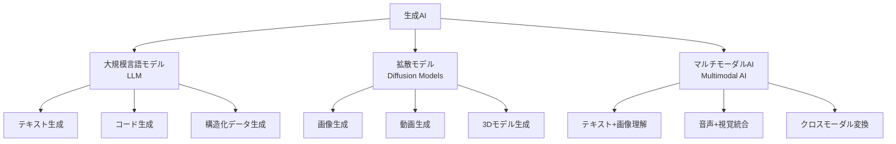
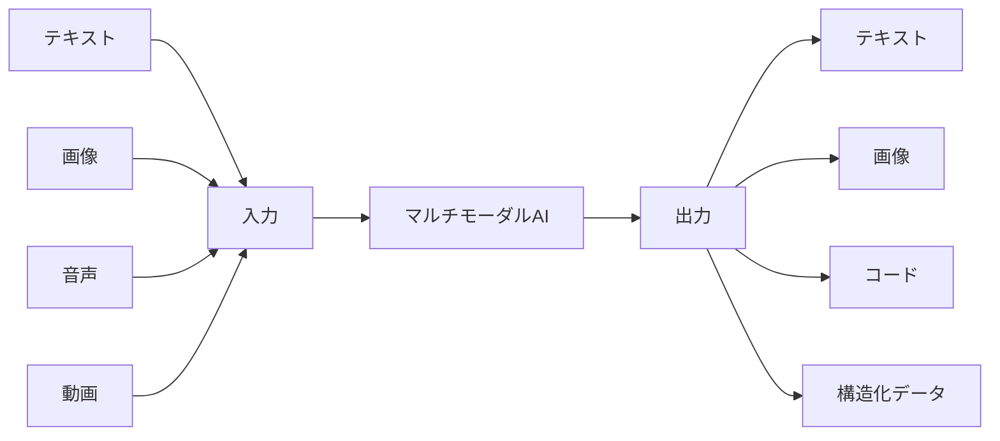
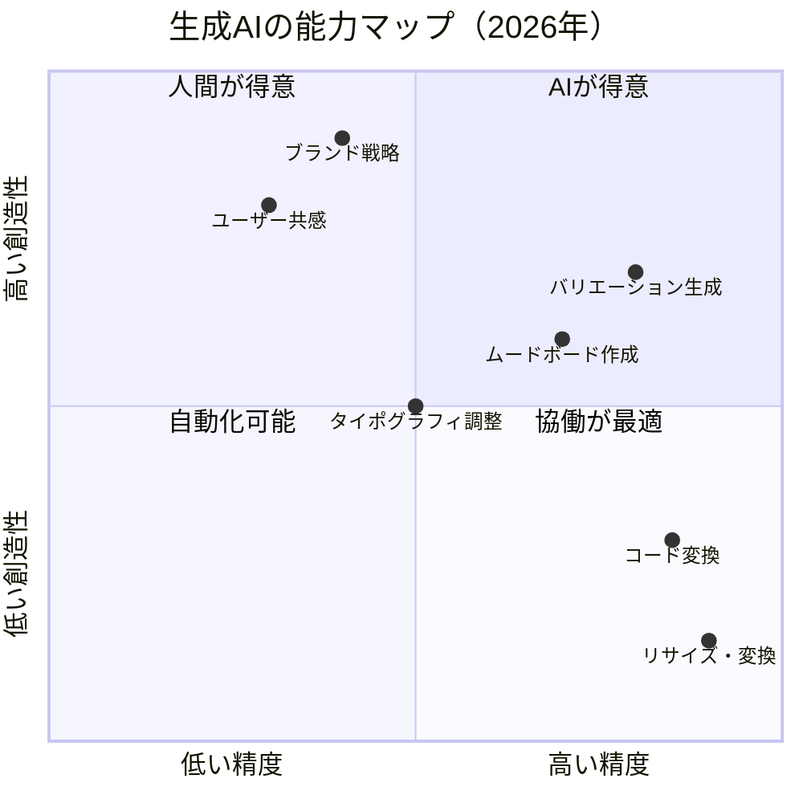

# 第1章：生成AI入門

**デザイナーのための生成AI技術の基礎理解**

---

## はじめに

生成AI（Generative AI）は、2026年のデザイン実務において避けて通れない技術基盤となりました。本章では、エンジニアリングの深い知識を前提とせず、デザイナーが「何ができて、何ができないか」を正確に判断するために必要な技術理解を提供します。

重要なのは、コードを書けるようになることではなく、**AIの能力と限界を正しく把握し、デザインプロセスにおいて適切な判断を下せるようになること**です。

## 生成AIの3つの柱

2026年のデザイナーが理解すべき生成AIの技術は、大きく3つのカテゴリに分類されます。

### 大規模言語モデル（LLM）

LLM（Large Language Model）は、大量のテキストデータから学習し、人間のような自然言語を生成するモデルです。デザイナーにとっての主な活用領域は以下の通りです。

| 活用領域 | 具体例 |
|----------|--------|
| UXライティング | マイクロコピー、エラーメッセージの生成・改善 |
| リサーチ支援 | ユーザーインタビューの要約、ペルソナ草案の作成 |
| コンセプト発想 | ブレインストーミングの壁打ち相手として |
| コード生成 | プロトタイプ用のHTML/CSS/JSコード生成 |
| 情報設計 | サイトマップ、コンテンツ構造の提案 |

!!! note "LLMの動作原理（デザイナー向け簡略版）"
    LLMは「次に来る可能性が最も高い単語を予測する」という仕組みで動作します。膨大なテキストデータのパターンを学習していますが、「理解」しているわけではありません。この点を常に念頭に置くことが、AIとの適切な協働の第一歩です。

### 拡散モデル（Diffusion Models）

拡散モデルは、ノイズからデータを段階的に復元するプロセスを学習することで、画像・動画・3Dモデルなどを生成します。2026年現在、デザイン領域で最も視覚的なインパクトを持つ技術です。

**デザイナーにとっての意義：**

- **コンセプトの可視化速度が劇的に向上** — アイデアを数秒で視覚化
- **イテレーションのコストが激減** — 100のバリエーションを数分で生成
- **クライアントコミュニケーションの変革** — 初期段階からリアルなビジュアルで対話可能

!!! warning "拡散モデルの限界"
    拡散モデルは「パターンの再結合」であり、真に新しいデザインパラダイムを生み出すものではありません。また、細かなピクセル単位のコントロール、一貫したキャラクターデザイン、正確なテキストレンダリングには依然として課題があります。

### マルチモーダルAI

2026年のAIの最大の進化は、テキスト・画像・音声・動画といった**複数のモダリティ（情報の形式）を統合的に処理できる**ようになったことです。

デザイナーにとって、これは革命的です。スケッチの写真を撮ってAIに渡し、「このワイヤーフレームをモバイル向けに再設計して、アクセシビリティを考慮したHTMLコードも生成して」と指示できるようになりました。

## 2026年のAIランドスケープ

### 基盤モデル（Foundation Models）

基盤モデルとは、大規模なデータで事前学習され、様々なタスクに適応可能な汎用AIモデルのことです。2026年のデザイン領域に影響を与える主要な基盤モデルのカテゴリは以下の通りです。

| カテゴリ | 主な用途 | デザイナーへの影響 |
|----------|----------|-------------------|
| テキスト生成モデル | コピー、リサーチ、構造化 | UXライティング、情報設計の効率化 |
| 画像生成モデル | ビジュアルコンセプト | ムードボード、コンセプトアートの高速化 |
| 動画生成モデル | モーション、プロトタイプ | インタラクションデザインの可視化 |
| コード生成モデル | フロントエンド実装 | デザイン→実装の橋渡し |
| 3D生成モデル | 空間デザイン、プロダクト | プロダクトデザインのプロトタイピング |

### デザイナーのためのAI — エンジニアのためのAIとの違い

!!! tip "デザイナーとしてのAI活用視点"
    エンジニアがAIを「最適化」や「自動化」の観点で活用するのに対し、デザイナーは**「探索」と「拡張」**の観点でAIを活用します。正解を求めるのではなく、可能性の空間を広げるためのパートナーとしてAIを位置づけることが重要です。

**デザイナーのAI活用における4つの原則：**

1. **探索優先** — 最適解を求めるのではなく、多様な選択肢を生成する
2. **直感の拡張** — AIの出力を判断するのはデザイナーの美的感覚と経験
3. **文脈の提供** — AIが理解できない「ユーザーの文脈」をデザイナーが橋渡しする
4. **倫理的判断** — AIの出力に対する最終責任はデザイナーにある

## 能力と限界の正確な理解

**AIが得意なこと：**

- 大量のバリエーション生成
- パターン認識と分類
- テキストと画像の変換
- 定型的なコード生成
- データからのインサイト抽出

**AIが苦手なこと（デザイナーの不可欠な役割）：**

- ユーザーへの深い共感と文脈理解
- ブランドの一貫性の維持
- 文化的ニュアンスの判断
- 倫理的判断と責任の引き受け
- 真に革新的なコンセプトの創出

!!! example "実務での判断基準"
    「このタスクは正解が複数あり、多様な選択肢を見たいか？」→ AIが得意。「このタスクは特定の文脈・感情・文化的背景の深い理解が必要か？」→ 人間が主導すべき。この問いを常に自分に投げかけてください。

## まとめ

生成AIは、2026年のデザイナーにとって最も強力なパートナーとなり得る技術です。しかし、その力を適切に引き出すには、技術の仕組みと限界を正しく理解することが不可欠です。LLM、拡散モデル、マルチモーダルAIの基本を押さえた上で、次章ではこれらのAIと効果的にコミュニケーションするための「プロンプトエンジニアリング」を学びます。

---

## 演習課題

!!! example "演習1：AIランドスケープマッピング"
    現在あなたが利用可能なAIツールを5つ以上リストアップし、それぞれを「テキスト生成」「画像生成」「コード生成」「マルチモーダル」のカテゴリに分類してください。各ツールの強みと限界を表にまとめましょう。

!!! example "演習2：能力と限界の実験"
    1つのデザイン課題（例：「カフェのロゴデザイン」）を選び、AIに依頼した場合と自分で作成した場合の成果物を比較してください。AIが優れていた点、人間が優れていた点をそれぞれ3つ以上挙げ、「協働した場合の最適なプロセス」を提案してください。

!!! example "演習3：デザイナーのためのAI用語集"
    本章で登場した技術用語（LLM、拡散モデル、基盤モデル、マルチモーダル等）を、デザイナーの同僚に説明するための「用語集」を作成してください。各用語は2〜3文で、技術的な正確性を保ちつつ、デザインの文脈で理解しやすい説明にしてください。
