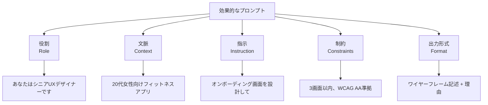
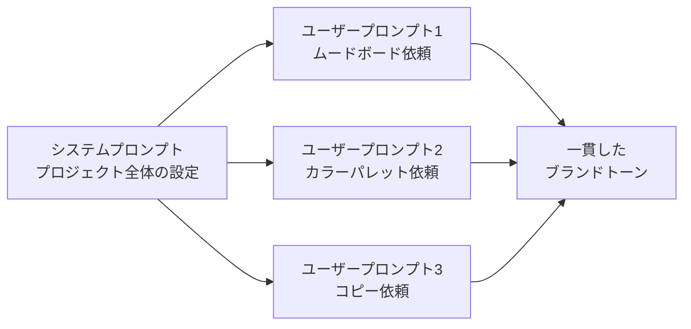
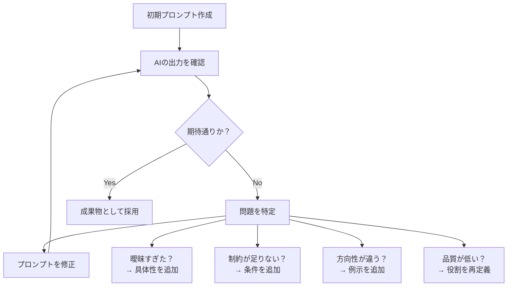

# 第2章：プロンプトエンジニアリング

**デザイン成果を最大化するためのAIとの対話設計**

---

## はじめに

プロンプトエンジニアリングとは、AIに対する指示（プロンプト）を設計・最適化する技術です。2026年のデザイナーにとって、これは単なる「AIの使い方」ではなく、**新しいデザインスキル**そのものです。適切なプロンプトは、AIから引き出す成果の質を劇的に変えます。

本章では、プロンプト設計の基本原則から、デザイン業務に特化したプロンプトパターン、そして反復改善の方法論までを体系的に学びます。

## プロンプト設計の基本原則

効果的なプロンプトには、5つの基本要素があります。



| 要素 | 説明 | デザインでの例 |
|------|------|---------------|
| 役割（Role） | AIに特定の専門家としてふるまうよう指示 | 「経験15年のブランドデザイナーとして」 |
| 文脈（Context） | プロジェクトの背景情報を提供 | ターゲットユーザー、ブランドガイドライン |
| 指示（Instruction） | 具体的に何をすべきかを明示 | 「3つのカラーパレット案を提案して」 |
| 制約（Constraints） | 条件や制限を設定 | 「アクセシビリティ基準を満たすこと」 |
| 出力形式（Format） | 期待する出力の形を指定 | 「表形式で、各案の理由を添えて」 |

!!! tip "プロンプトの黄金律"
    「曖昧な指示からは曖昧な結果が返る」。これはデザインブリーフの作成と同じ原則です。クライアントに不明確なブリーフを渡されたときの困惑を思い出してください。AIに対しても、明確で具体的な「ブリーフ」を渡すことが成功の鍵です。

## 高度なプロンプト技法

### Chain-of-Thought（思考の連鎖）

Chain-of-Thought（CoT）は、AIに段階的な推論を促す技法です。複雑なデザイン判断を求める場合に特に有効です。

**通常のプロンプト：**
> 「ECサイトのチェックアウトフローを改善して」

**CoTプロンプト：**
> 「ECサイトのチェックアウトフローを改善してください。以下のステップで考えてください。
> 1. まず、現在の一般的なチェックアウトフローの問題点を3つ挙げてください
> 2. 次に、各問題点に対する改善案を提案してください
> 3. それぞれの改善案がユーザー体験に与える影響を評価してください
> 4. 最後に、優先度順に並べた改善ロードマップを作成してください」

!!! note "なぜCoTが効果的なのか"
    CoTはAIに「一気に答えを出す」のではなく「段階的に考える」よう促します。これにより、より論理的で包括的な回答が得られます。デザインプロセスそのものが段階的であるため、デザイナーにとってCoTは直感的に理解しやすい技法です。

### Few-shot Prompting（例示プロンプティング）

Few-shot Promptingは、期待する出力の具体例を提示することで、AIの出力品質を向上させる技法です。

```
以下の形式でマイクロコピーを作成してください。

【例1】
場面：パスワード入力エラー
トーン：親しみやすく、非難しない
コピー：「パスワードが一致しませんでした。もう一度お試しください」

【例2】
場面：購入完了
トーン：祝福的、簡潔
コピー：「ご注文ありがとうございます！確認メールをお送りしました」

では、以下の場面のマイクロコピーを作成してください。
場面：アカウント削除確認
トーン：慎重、共感的
```

### システムプロンプト

システムプロンプトは、AIの「基本的なふるまい」を定義するものです。プロジェクト全体を通じて一貫した出力を得るために不可欠です。



!!! example "デザインプロジェクト用システムプロンプトの例"
    ```
    あなたは、サステナブルファッションブランド「TERRA」の
    デザインチームの一員です。

    ブランド特性：
    - トーン：温かみがありつつ洗練された
    - カラー：アースカラー基調（#8B7355, #6B8E23, #D2B48C）
    - ターゲット：25-40歳、環境意識の高い都市生活者
    - 価値観：透明性、持続可能性、ミニマリズム

    すべての提案において、これらのブランドガイドラインに
    準拠してください。
    ```

## デザイン特化のプロンプトパターン

### パターン1：ムードボード生成

```
【目的】新規プロジェクトのビジュアルディレクション探索
【ブランド】高級和菓子ブランドのリブランディング
【キーワード】伝統と革新、ミニマリズム、季節感
【除外要素】過度に伝統的な和風表現、金箔の多用
【参考】北欧デザインの簡潔さ × 日本の余白の美学
【出力】5つの異なるビジュアル方向性を、
       各方向性のキーカラー、フォント傾向、
       イメージキーワードとともに提示してください
```

### パターン2：コンセプト展開

```
【コンテキスト】都市部の高齢者向け健康管理アプリ
【コンセプト案】以下の3つのコンセプトを深掘りしてください
  1.「見守りの輪」— 家族とのつながりを中心にした設計
  2.「マイペース健康」— 自立と自己管理を重視
  3.「まちの保健室」— コミュニティとの接点を重視
【各コンセプトについて】
  - コアバリュー（1文で）
  - ペルソナスケッチ（名前、年齢、利用シーン）
  - 主要画面3つの概要
  - 差別化ポイント
  - リスクと課題
```

### パターン3：UXコピー生成

```
【プロダクト】フリーランス向け請求書管理SaaS
【場面】初回ログイン後のオンボーディング
【ステップ数】5ステップ
【トーン】プロフェッショナルだが堅すぎない、
         フリーランスの苦労に共感する
【制約】各ステップのヘッドラインは15文字以内、
       本文は50文字以内
【言語】日本語
```

## 反復改善（Iterative Refinement）

プロンプトエンジニアリングは、一度で完璧な結果を得る技術ではありません。**反復的な改善プロセス**そのものです。



**反復改善の4つのテクニック：**

1. **具体化** — 「良いデザイン」→「余白を十分に取り、視線の流れがF字パターンに沿ったデザイン」
2. **否定条件の追加** — 「〜しないでください」で望まない方向を排除
3. **評価基準の明示** — 「以下の5つの基準で自己評価して」と求める
4. **段階的な深掘り** — 最初のアウトプットの一部を選び「これをさらに発展させて」

!!! warning "反復改善の落とし穴"
    プロンプトの改善に時間をかけすぎないでください。3〜5回の反復で望む品質に達しない場合、そのタスク自体がAIに適していない可能性があります。その場合は、人間が主導するプロセスに切り替える判断も重要です。

## まとめ

プロンプトエンジニアリングは、AIという新しい「デザインパートナー」との対話言語です。基本原則（役割・文脈・指示・制約・出力形式）を押さえた上で、CoTやFew-shotなどの高度な技法を組み合わせ、デザイン特化のパターンを蓄積していくことが、AIとの協働の質を決定します。

次章では、これらのプロンプト技法を実際のプロトタイピングプロセスに適用する方法を学びます。

---

## 演習課題

!!! example "演習1：プロンプトの改善比較"
    以下の曖昧なプロンプトを、本章で学んだ5要素（役割・文脈・指示・制約・出力形式）を用いて改善してください。改善前と改善後の両方をAIに実行し、出力品質の違いを分析してください。

    曖昧なプロンプト：「アプリのデザインを考えて」

!!! example "演習2：デザインプロンプト集の作成"
    あなたの日常業務で頻繁に発生する5つのデザインタスクを選び、それぞれに最適化されたプロンプトテンプレートを作成してください。各テンプレートにはCoTまたはFew-shotの要素を含めてください。

!!! example "演習3：反復改善の記録"
    1つのデザイン課題（例：「健康アプリのオンボーディング画面のコピー作成」）に対して、プロンプトを5回以上反復改善してください。各反復で何を変更し、出力がどう改善（または悪化）したかを記録し、「効果的だった改善パターン」を3つ以上抽出してください。
