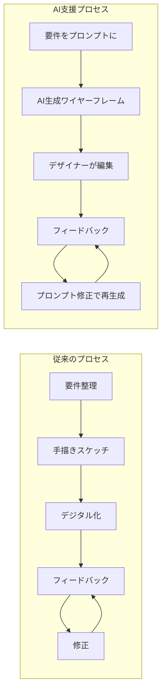
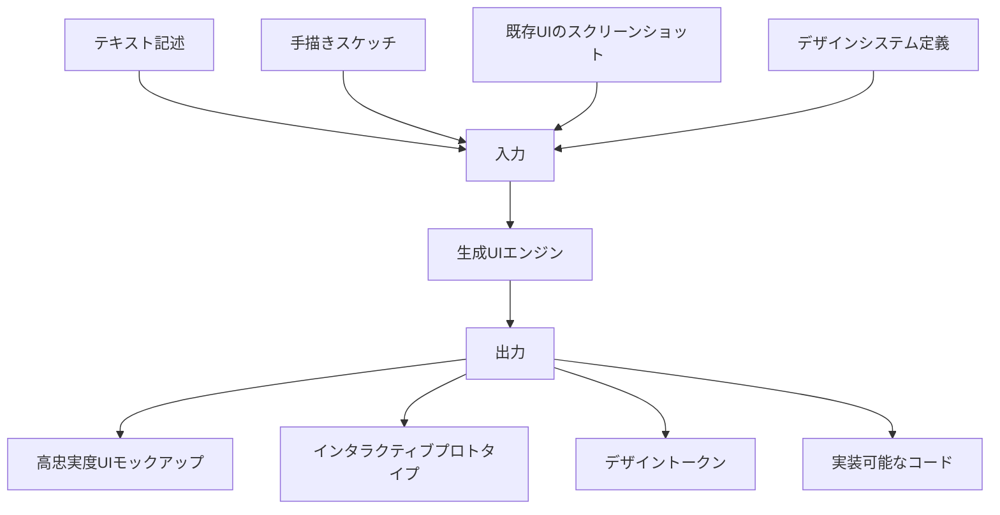
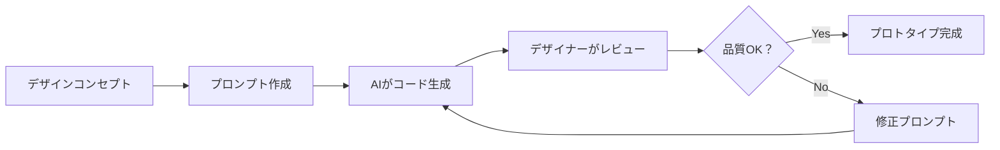
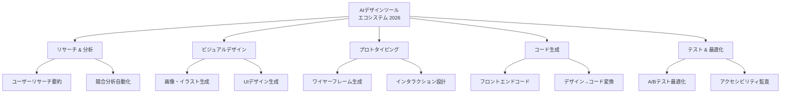
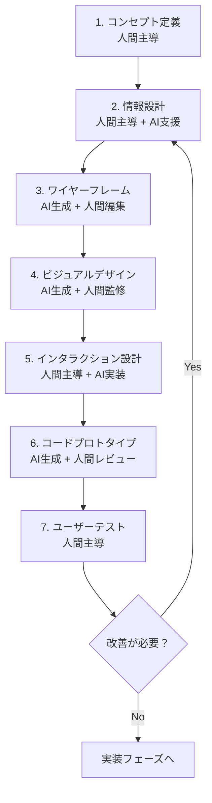

# 第3章：AIプロトタイピング

**AIツールを活用した高速プロトタイプ構築の方法論**

---

## はじめに

プロトタイピングは、デザインプロセスの中でも最も時間とリソースを必要とするフェーズの一つです。2026年、AIツールの進化により、コンセプトから動作するプロトタイプまでの時間は**数週間から数時間**へと短縮されました。本章では、AI支援ワイヤーフレーミングから生成UIデザイン、コード生成によるプロトタイプ構築まで、AIを活用した高速プロトタイピングの方法論を学びます。

ただし、速さだけが目的ではありません。AIプロトタイピングの真の価値は、**より多くのアイデアを、より早くテストできること**にあります。

## AI支援ワイヤーフレーミング

### 従来のプロセスとの比較



AI支援ワイヤーフレーミングでは、自然言語による要件記述からワイヤーフレームの初期案を生成できます。デザイナーの役割は「ゼロから描く」から「AIの出力を編集・洗練する」へとシフトします。

| フェーズ | 従来の所要時間 | AI支援の所要時間 | 効率化率 |
|----------|-------------|----------------|---------|
| 初期ワイヤーフレーム | 2〜3日 | 2〜3時間 | 約10倍 |
| バリエーション展開 | 1〜2日/案 | 数分/案 | 約50倍 |
| レスポンシブ対応 | 1日 | 30分 | 約15倍 |
| コンポーネント設計 | 2〜3日 | 半日 | 約5倍 |

!!! warning "速度の罠"
    AI支援で速度が上がることは、「考える時間を省略してよい」ということではありません。要件定義、ユーザーリサーチ、情報設計の質は、人間の深い思考に依存し続けます。AIは「実行」を加速しますが、「判断」の代替にはなりません。

### 効果的なワイヤーフレーム生成プロンプト

```
【プロダクト】シニア向け料理レシピアプリ
【画面】レシピ検索結果画面
【要件】
- 検索結果はカード形式で表示
- 各カードに：料理名、調理時間、難易度、写真
- フィルター機能：調理時間、カロリー、アレルギー対応
- フォントサイズは通常の1.5倍（アクセシビリティ対応）
- ボトムナビゲーション付き
【出力形式】HTML/CSSによるワイヤーフレーム
【スタイル】モノクロ、構造を重視、装飾は最小限
```

## 生成UIデザイン

### AIによるUIデザインの進化

2026年の生成UIデザインは、ワイヤーフレームから一歩進み、視覚的に完成度の高いUIを直接生成できるレベルに達しています。



**生成UIの3つのアプローチ：**

1. **テキスト to UI** — 自然言語の記述からUIを生成
2. **スケッチ to UI** — 手描きのスケッチを高忠実度UIに変換
3. **UI to UI** — 既存のUIを別のスタイルやプラットフォームに変換

!!! tip "デザインシステムとの統合"
    生成UIの実用性を高める鍵は、自社のデザインシステムをAIに理解させることです。カラートークン、タイポグラフィスケール、スペーシングルール、コンポーネントライブラリをシステムプロンプトに含めることで、ブランドに一貫したUIを生成できます。

### デザインシステムを反映した生成UI

```
【デザインシステム定義】
- プライマリカラー: #2563EB（青）
- セカンダリカラー: #10B981（緑）
- フォント: Noto Sans JP
- 角丸: 8px（小）、12px（中）、16px（大）
- シャドウ: 0 1px 3px rgba(0,0,0,0.1)
- スペーシング: 4pxグリッド基準

【生成依頼】
上記のデザインシステムに厳密に準拠した
ダッシュボード画面を生成してください。
含める要素：KPIカード4枚、折れ線グラフ、
最近のアクティビティリスト、サイドナビゲーション
```

## コード生成によるプロトタイプ構築

### デザイナーのためのコード生成

2026年において、デザイナーがコードを書く必要はほとんどなくなりました。しかし、**コードの構造を理解し、AIが生成したコードを評価・修正できる能力**は依然として重要です。



**コード生成で作れるプロトタイプの種類：**

| 種類 | 技術スタック | 最適な用途 |
|------|------------|-----------|
| 静的モックアップ | HTML/CSS | ビジュアルデザインの確認 |
| インタラクティブプロトタイプ | HTML/CSS/JS | ユーザーフローの検証 |
| データ駆動プロトタイプ | React/Vue + モックAPI | リアルなデータ体験の検証 |
| モバイルプロトタイプ | React Native/Flutter | モバイル特有のインタラクション検証 |

!!! note "コード生成の品質について"
    AIが生成するコードは「動く」ことは多いですが、プロダクション品質であるとは限りません。プロトタイピングの段階では品質よりも速度を優先し、「アイデアを素早く検証する」ことに焦点を当ててください。本番実装はエンジニアチームと協働して行います。

## 2026年のAIデザインツールエコシステム

### ツールカテゴリマップ



### ツール選定の判断基準

| 判断基準 | 質問 |
|----------|------|
| **統合性** | 既存のワークフロー（Figma等）と統合できるか？ |
| **カスタマイズ性** | 自社のデザインシステムを学習させられるか？ |
| **出力品質** | プロトタイプとして十分な品質か？ |
| **データプライバシー** | クライアントのデータは安全に扱われるか？ |
| **チーム協働** | チームメンバーとの共同作業は可能か？ |
| **コスト効率** | 削減される時間に対してコストは見合うか？ |

!!! warning "ツールロックインのリスク"
    AI デザインツールの市場は急速に変化しています。特定のツールに過度に依存するのではなく、**ツールに依存しないスキル（プロンプト設計力、デザイン判断力、品質評価力）**を磨くことが長期的な競争力の源泉です。

## コンセプトからプロトタイプまでの統合ワークフロー



このワークフローのポイントは、各フェーズで**人間とAIの役割が明確に分かれている**ことです。コンセプト定義とユーザーテストは人間が主導し、中間のビジュアル化・実装フェーズでAIが力を発揮します。

## まとめ

AIプロトタイピングは、デザイナーの創造的なビジョンを実現するスピードを劇的に向上させます。しかし、その本質は「速く作ること」ではなく、**「速く学ぶこと」**です。より多くのプロトタイプを、より短い時間で作り、より多くのユーザーテストを実施し、より多くの学びを得る。これが、AIプロトタイピングの真の価値です。

---

## 演習課題

!!! example "演習1：AIワイヤーフレーム生成"
    「大学生向けの時間割管理アプリ」のホーム画面のワイヤーフレームを、AIを使って3つの異なるレイアウトパターンで生成してください。各パターンの長所と短所を評価し、最適な案を選んでその理由を説明してください。

!!! example "演習2：スケッチ to プロトタイプ"
    紙に手描きのワイヤーフレームを3画面分描き、写真に撮ってマルチモーダルAIに入力してください。そこから動作するHTMLプロトタイプを生成し、手描きとAI出力のギャップを分析してください。

!!! example "演習3：AIデザインツール比較レポート"
    現在利用可能なAIデザインツールを3つ以上選び、同じデザイン課題（例：「飲食店の予約アプリのプロフィール画面」）で比較テストしてください。出力品質、操作性、カスタマイズ性、コストを5段階で評価し、用途別の推奨ツールを提案してください。
