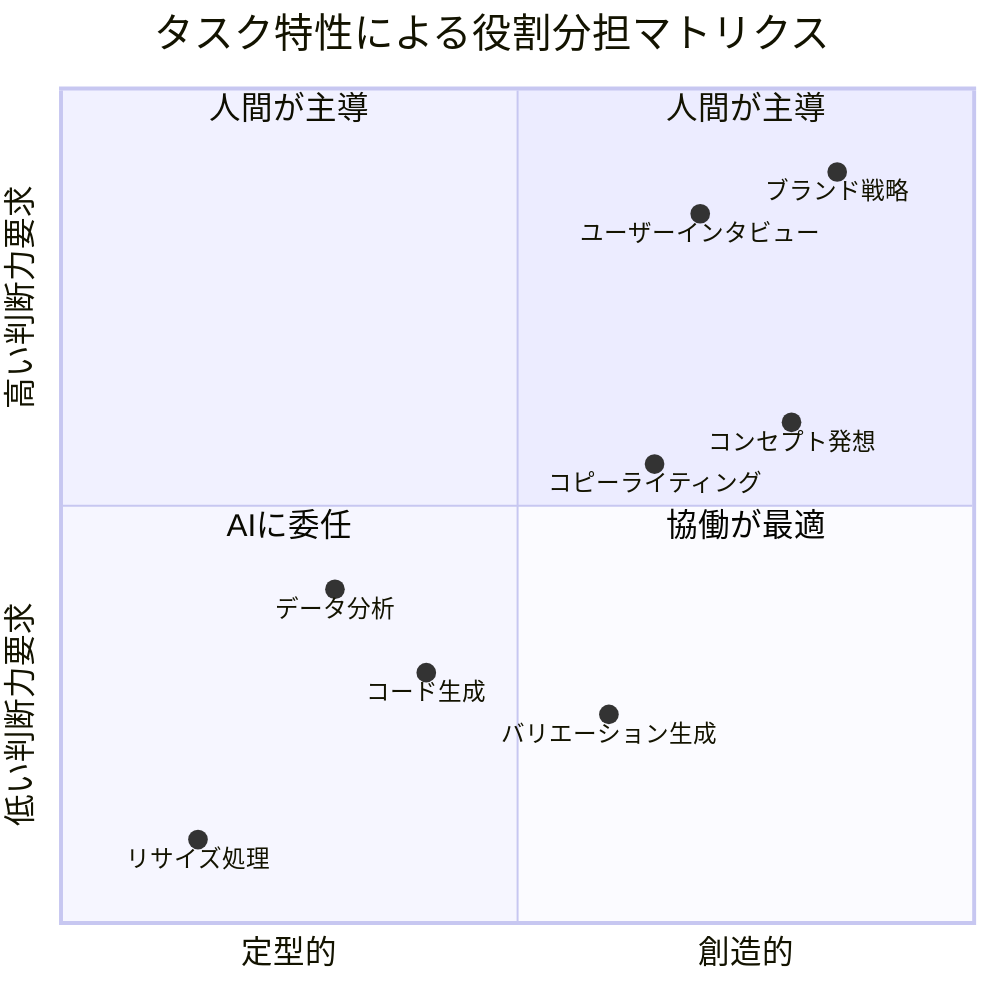
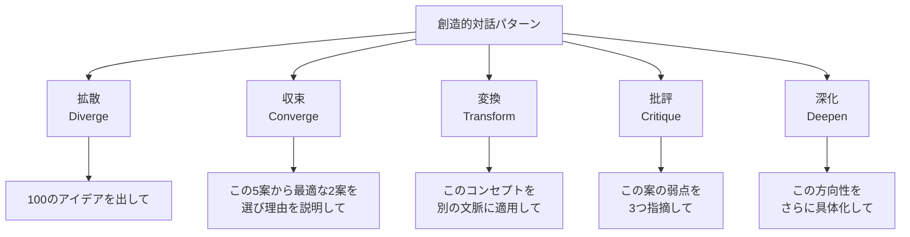
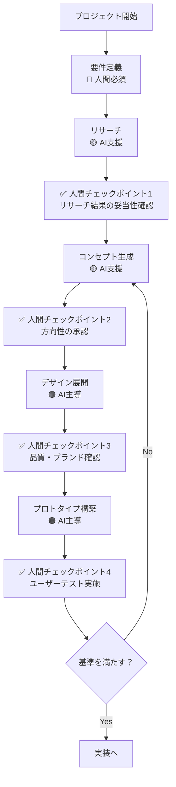
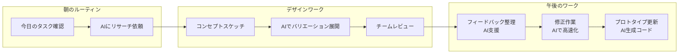

# 第4章：Human-AI協働デザイン

**人間とAIの創造的パートナーシップを設計する**

---

## はじめに

前章までで、生成AIの基礎、プロンプトエンジニアリング、AIプロトタイピングを学びました。本章では、これらの技術を統合し、**人間とAIが持続的に協働するためのフレームワークとワークフロー**を設計します。

AIとの協働は、単に「AIに仕事を投げる」ことではありません。人間の創造性とAIの計算力を最適に組み合わせ、**どちらか一方では到達できない成果**を生み出すことが目標です。

## 協働フレームワーク

### HAIC（Human-AI Collaboration）モデル

Human-AI協働を体系化するために、HAICモデルを提案します。このモデルは、タスクの性質に応じて人間とAIの役割分担を最適化するためのフレームワークです。

### 4つの協働モード

| モード | 人間の役割 | AIの役割 | 適用場面 |
|--------|----------|---------|---------|
| **AI主導** | 監督・承認 | 実行・生成 | リサイズ、フォーマット変換、データ整形 |
| **AI支援** | 主導・判断 | 提案・下書き | ワイヤーフレーム、初期コピー、リサーチ要約 |
| **対等な協働** | 方向性決定 | 探索・拡張 | コンセプト発想、デザインシステム構築 |
| **人間主導** | 全面的に主導 | 参考情報の提供 | ユーザーインタビュー、倫理的判断、最終承認 |

!!! tip "モード選択の判断基準"
    「このタスクで間違いが起きた場合の影響はどの程度か？」を問いかけてください。影響が大きいほど人間の関与度を高め、影響が小さいほどAIに委任できます。ブランドの信頼を左右するコピーは人間主導、内部ブレインストーミングのアイデア出しはAI主導で問題ありません。

## AIをクリエイティブパートナーとして活用する

### 創造的対話のパターン

AIとの創造的協働は、以下の5つの対話パターンに分類できます。

**1. 拡散（Diverge）** — 可能性の空間を広げる

AIの最大の強みは、人間の思考の枠を超えた大量のアイデアを生成できることです。「予想外の組み合わせ」を意図的に求めることで、デザイナーの発想を拡張します。

**2. 収束（Converge）** — 選択肢を絞り込む

多数の選択肢から、特定の基準に基づいて絞り込む際にAIを活用します。ただし、最終的な判断は必ず人間が行います。

**3. 変換（Transform）** — 文脈を横断する

あるドメインのデザインパターンを別のドメインに適用する「アナロジー思考」をAIに支援させます。

**4. 批評（Critique）** — 多角的に検証する

AIに「批評家」の役割を与え、自分のデザインを多角的に検証します。ヒューリスティック評価、アクセシビリティチェック、ブランド一貫性の確認などに有効です。

**5. 深化（Deepen）** — 詳細を掘り下げる

選んだ方向性を具体的な実装レベルまで深掘りする際にAIを活用します。

## Human-in-the-Loopデザイン

### 人間の介入ポイントを設計する

AIを活用したデザインプロセスにおいて、**どの時点で人間が介入すべきか**を事前に設計することが重要です。

!!! warning "自動化のブラックボックス化"
    AIに任せるフェーズが増えると、中間プロセスが見えにくくなります。各チェックポイントで「AIはなぜこの判断をしたのか」を理解し、説明できる状態を維持してください。説明できないデザイン判断は、クライアントやユーザーに対して責任を持てません。

## 拡張された創造性（Augmented Creativity）

AIとの協働は、人間の創造性を**置き換える**のではなく**拡張する**ものです。

| 拡張の種類 | 説明 | 具体例 |
|-----------|------|--------|
| **知識の拡張** | デザイナーが知らない領域の知見を即座に得られる | 「バイオミミクリーの原則をUIデザインに応用する方法は？」 |
| **速度の拡張** | アイデアの可視化速度が飛躍的に向上 | 30秒で10のバリエーションを生成 |
| **視点の拡張** | 異なる文化・年齢層の視点をシミュレート | 「色覚多様性の観点でこのUIを評価して」 |
| **記憶の拡張** | 過去の設計パターンを網羅的に参照 | 「過去5年のダッシュボードデザインのトレンド」 |
| **忍耐の拡張** | 反復的な作業を疲れずに実行 | 100パターンのレイアウトバリエーション生成 |

!!! note "拡張の限界"
    AIは「既存のパターンの再結合」に優れていますが、**パラダイムシフトを起こすような真に革新的なアイデア**は、依然として人間の直感、経験、そして文脈への深い理解から生まれます。AIに拡張された創造性を、人間の判断力で方向づけることが重要です。

## ワークフロー統合

### 日常業務への統合戦略

AIとの協働を持続可能にするためには、既存のワークフローに自然に統合する必要があります。

**段階的な導入を推奨します：**

1. **Week 1-2**: リサーチとブレインストーミングでAIを試用
2. **Week 3-4**: ワイヤーフレームとコピー生成にAIを導入
3. **Month 2**: プロトタイピングにAIコード生成を導入
4. **Month 3**: 全ワークフローを見直し、最適な協働バランスを確立

## 成功事例：Human-AI協働デザイン

### 事例1：多言語アプリのローカライゼーション

あるグローバルフィンテック企業では、12言語対応のアプリUIを設計する際にAI協働を導入しました。AIがテキストの長さに応じたレイアウト調整案を自動生成し、各言語のネイティブデザイナーが文化的適切性を確認するワークフローにより、ローカライゼーション期間を60%短縮しました。

### 事例2：アクセシビリティ監査の自動化

デザインエージェンシーが、WCAG 2.2準拠の監査プロセスにAIを導入。AIがデザインファイルを自動スキャンし、コントラスト比、タッチターゲットサイズ、読み上げ順序の問題を検出。デザイナーは検出された問題の修正と、AIでは判断できないUX上の妥当性評価に集中することで、監査精度を向上させつつ工数を40%削減しました。

### 事例3：生成AIによるデザインスプリント

スタートアップが5日間のデザインスプリントにAIを全面導入。Day 1のユーザーリサーチ分析、Day 2のアイデア生成、Day 3のプロトタイピングでAIを活用し、従来5日かかっていたプロセスを3日に短縮。残り2日をユーザーテストと改善に充て、より多くの反復サイクルを実現しました。

## まとめ

Human-AI協働デザインの本質は、「AIに仕事をさせる」ことではなく、「人間とAIの強みを戦略的に組み合わせる」ことです。HAICモデルによる役割分担、創造的対話パターンの活用、Human-in-the-Loopの設計、そしてワークフローへの段階的統合。これらを実践することで、デザイナーは自身の創造性を拡張し、より高い価値を生み出せるようになります。

---

## 演習課題

!!! example "演習1：HAICモデルの適用"
    あなたの直近のデザインプロジェクトを振り返り、各タスクをHAICモデルの4つの協働モード（AI主導・AI支援・対等な協働・人間主導）に分類してください。AIを導入することで最も効果が見込めるタスクを3つ特定し、具体的な導入計画を作成してください。

!!! example "演習2：創造的対話の実践"
    1つのデザイン課題に対して、5つの対話パターン（拡散・収束・変換・批評・深化）をすべて順番に実践してください。各パターンでのAIとのやり取りを記録し、最も効果的だったパターンとその理由を分析してください。

!!! example "演習3：Human-in-the-Loopの設計"
    架空のプロジェクト（例：「地域コミュニティのためのイベント管理アプリ」）について、AIを最大限活用したデザインプロセスを設計してください。各フェーズでの人間のチェックポイントを明示し、各チェックポイントで「何を確認すべきか」のチェックリストを作成してください。
