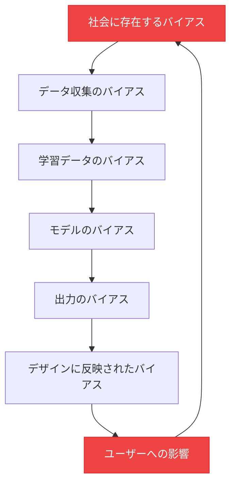
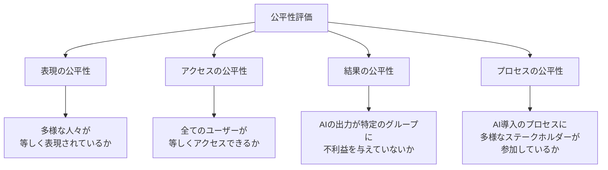
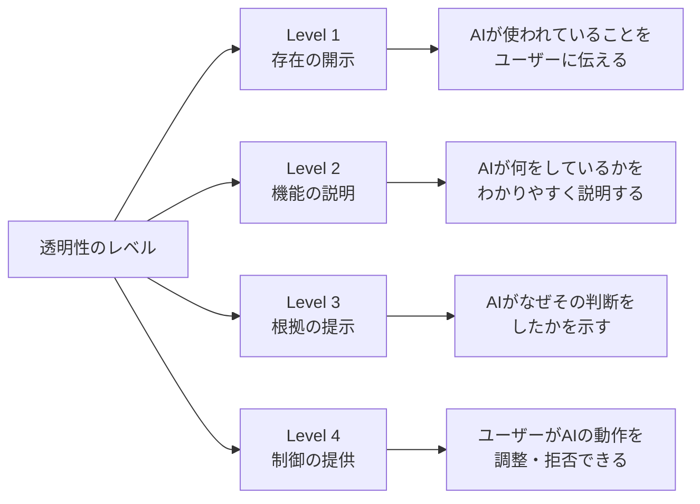
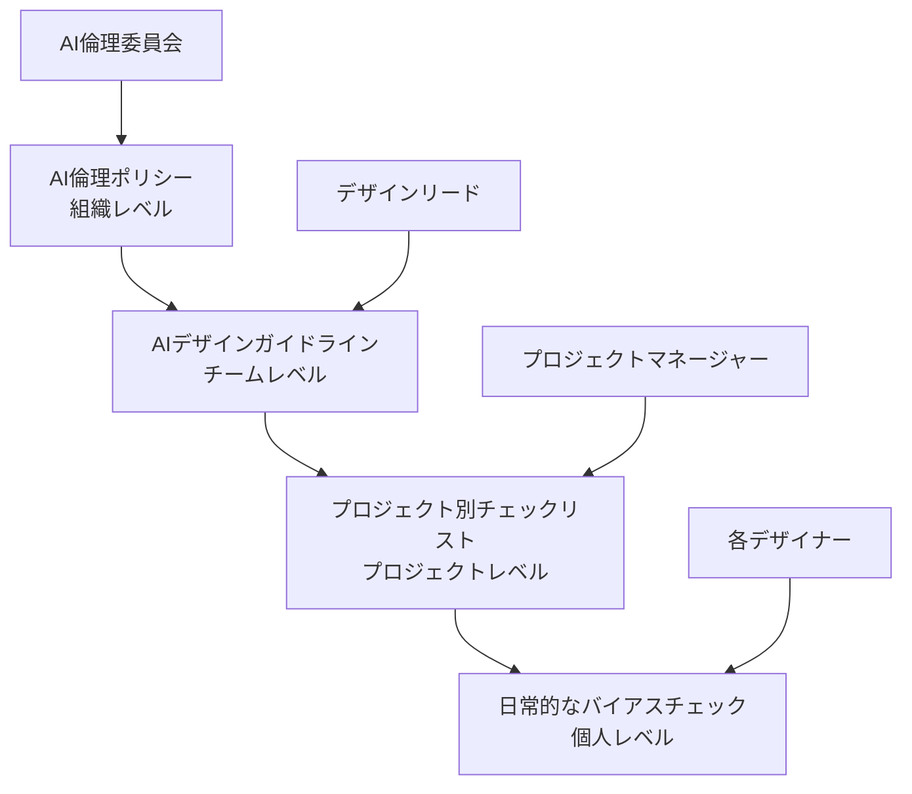

# 第5章：AIの倫理とバイアス

**責任あるAIデザインのための倫理的フレームワーク**

---

## はじめに

AIが生成するデザインは、社会に直接的な影響を与えます。バイアスのあるAIが生成した画像、不公平なアルゴリズムが駆動するUX、透明性を欠くAI意思決定。これらは単なる技術的問題ではなく、**デザイナーが向き合うべき倫理的責任**です。

本章では、AIにおけるバイアスの種類と検出方法、公平性の指標、責任あるAIデザインの原則、そしてデザイナーが果たすべき役割を包括的に学びます。

## アルゴリズムバイアスとデザイン

### バイアスはどこから生まれるか

AIのバイアスは、技術的な問題である以前に、**社会構造の問題がデータとアルゴリズムを通じて増幅される現象**です。

!!! warning "バイアスの循環"
    上の図が示すように、バイアスは循環します。バイアスのあるAI出力がデザインに反映され、そのデザインがユーザーの行動に影響し、その行動データがさらにバイアスを強化する。デザイナーは、この循環を断ち切る最前線に立っています。

### デザインに影響するバイアスの種類

| バイアスの種類 | 説明 | デザインへの影響例 |
|-------------|------|-----------------|
| **表現バイアス** | 特定のグループが過少/過剰に表現される | AI生成画像で特定の人種・性別が偏る |
| **測定バイアス** | 測定方法自体が特定グループに不利 | 音声UIが特定のアクセントを認識しにくい |
| **集約バイアス** | 異なるグループを同一視する | パーソナライゼーションが多様性を無視する |
| **評価バイアス** | 評価基準自体が偏っている | 「良いデザイン」の基準が西洋中心 |
| **歴史的バイアス** | 過去の不平等がデータに反映 | 採用支援AIが過去の差別パターンを学習 |

!!! example "デザイナーが遭遇する具体的なバイアス"
    画像生成AIに「プロフェッショナルなデザイナー」を生成させると、特定の人種・性別・年齢層に偏った画像が生成されることがあります。また、「美しいウェブサイト」と指示すると、西洋的な美意識に基づくデザインが優先的に生成されます。これらは学習データに内在するバイアスの反映です。

## 公平性指標（Fairness Metrics）

バイアスを「感覚的に」判断するだけでは不十分です。定量的な公平性指標を用いて、AIの出力を体系的に評価する必要があります。

### デザイナー向けの公平性チェックリスト

**デザイン文脈での公平性の4つの次元：**

1. **表現の公平性** — AI生成コンテンツが多様な人々を適切に表現しているか
2. **アクセスの公平性** — AI搭載機能がすべてのユーザーに等しく利用可能か
3. **結果の公平性** — AIパーソナライゼーションが特定グループを不当に排除していないか
4. **プロセスの公平性** — AI導入の意思決定に多様な視点が含まれているか

## 責任あるAIデザイン（Responsible AI Design）

### RAIDフレームワーク

Responsible AI in Design（RAID）フレームワークは、デザイナーが責任あるAI活用を実践するための指針です。

| 原則 | 内容 | デザイナーの行動 |
|------|------|----------------|
| **R**espect（尊重） | ユーザーの尊厳と自律性を尊重 | 人間の意思決定権を常に確保する |
| **A**ccountability（説明責任） | AI出力に対する責任を明確に | 「AIが作ったから」を言い訳にしない |
| **I**nclusivity（包摂性） | 多様なユーザーを包摂 | バイアスチェックを設計プロセスに組み込む |
| **D**isclosure（開示） | AI使用の透明性を確保 | AIが関与した部分を適切に開示する |

!!! note "デザイナーの説明責任"
    AIが生成したデザインであっても、それをプロダクトに採用する判断を下したのはデザイナーです。「AIが生成したものだから責任はない」という主張は成り立ちません。AI出力の最終的な品質と倫理性に対する責任は、常にデザイナーにあります。

## 透明性と説明可能性

### AIの透明性をデザインする

ユーザーに対して、AIがどのように関与しているかを適切に伝えることは、信頼構築の基盤です。

**透明性のデザインパターン：**

- **AIラベル** — AI生成コンテンツに明示的なラベルを付与
- **説明カード** — AIの推薦理由をコンパクトに表示
- **信頼度インジケータ** — AIの確信度をビジュアルで伝達
- **オプトアウト** — ユーザーがAI機能を無効化できる選択肢
- **フィードバックループ** — ユーザーがAIの判断を修正できる仕組み

!!! tip "説明可能性のバランス"
    すべてのAI判断を詳細に説明すると、情報過多でユーザー体験を損なります。「ユーザーが知りたいと思う瞬間」に「必要十分な情報」を提供する、段階的な開示（Progressive Disclosure）のアプローチが有効です。

## AIガバナンス

### 組織レベルのAI倫理ガイドライン

デザインチームやプロダクトチームにおけるAIガバナンスの構造を以下に示します。

### プロジェクト開始時のAI倫理チェックリスト

- [ ] このプロジェクトでAIが影響を与えるユーザーグループを特定したか
- [ ] バイアスが発生しうるポイントを洗い出したか
- [ ] 公平性の評価基準を事前に定義したか
- [ ] AI出力のレビュープロセスを設計したか
- [ ] ユーザーへの透明性確保の方法を決定したか
- [ ] 問題発生時のエスカレーションパスを明確にしたか
- [ ] 多様なバックグラウンドを持つレビュアーを確保したか

## デザイナーの役割：倫理的AIの最前線

### なぜデザイナーが倫理の担い手なのか

デザイナーは、AIの技術的な出力とユーザーの体験の**接点**に立つ唯一の職種です。エンジニアがモデルの精度を追求し、ビジネスが効率を追求する中で、**ユーザーの権利と尊厳を守る最後の砦**となるのがデザイナーです。

| 役割 | 具体的な行動 |
|------|------------|
| **バイアスの検出者** | AI出力を多角的にレビューし、偏りを発見する |
| **ユーザーの代弁者** | AI導入がユーザーに与える影響を常に問い続ける |
| **透明性の設計者** | AIの動作をユーザーが理解できる形に翻訳する |
| **倫理的判断者** | 「技術的に可能」と「倫理的に正しい」を区別する |
| **教育者** | チーム内でAI倫理の重要性を啓発する |

!!! warning "「中立」は存在しない"
    デザインは常に価値判断を内包します。AIツールを「そのまま」使うという選択も、一つの価値判断です。デザイナーがバイアスについて積極的に考え、行動しなければ、既存の不平等が再生産されることを理解してください。

## まとめ

AIの倫理とバイアスの問題は、技術の進化とともにますます重要になっています。デザイナーには、バイアスを検出する目、公平性を評価する指標、責任あるAIデザインのフレームワーク、透明性を確保する設計力、そしてAIガバナンスへの参画が求められます。これらは「追加業務」ではなく、**2026年のデザイナーの中核的な専門性**です。

AIパートナーシップデザインの全5章を通じて学んだ技術、スキル、倫理観を統合し、AIと共により良いデザインを、より多くの人のために創造していきましょう。

---

## 演習課題

!!! example "演習1：バイアス検出実験"
    画像生成AIに以下のプロンプトを入力し、生成された画像のバイアスを分析してください。

    - 「成功したビジネスパーソン」
    - 「幸せな家族」
    - 「優秀な学生」
    - 「創造的なアーティスト」

    各プロンプトで生成された10枚の画像について、人種、性別、年齢、体型、障害の有無などの多様性を記録し、検出されたバイアスのパターンを報告してください。

!!! example "演習2：RAIDフレームワークの適用"
    あなたが関わっているまたは関心のあるAI搭載プロダクトを1つ選び、RAIDフレームワーク（尊重・説明責任・包摂性・開示）の4原則に基づいて評価してください。各原則について、現状の課題と改善提案を3つ以上挙げてください。

!!! example "演習3：透明性UIの設計"
    AIがレコメンデーションを行うアプリ（例：音楽、ニュース、商品推薦）の「透明性UI」を設計してください。4つの透明性レベル（存在の開示・機能の説明・根拠の提示・制御の提供）すべてをカバーするUIを、ワイヤーフレームまたはモックアップとして作成し、各レベルのデザイン判断の理由を説明してください。
