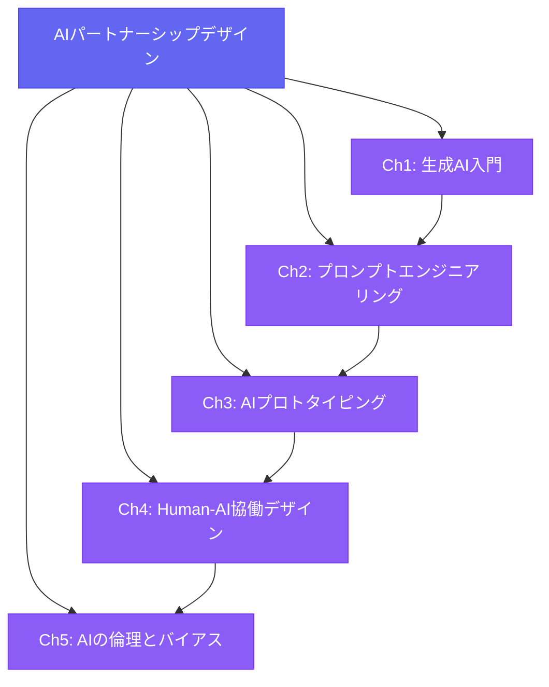
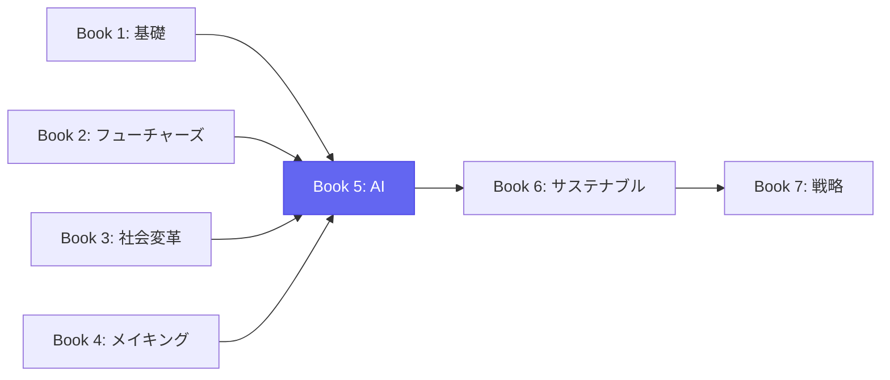

# Book 5: AIパートナーシップデザイン

**生成AIを「ツール」ではなく「デザインパートナー」として活用するための包括的ガイド**

---

## この本について

2026年、生成AIはデザインの世界を根本から変えつつあります。しかし、多くのデザイナーはまだAIを「画像生成ツール」や「テキスト生成ツール」としてしか捉えていません。本書は、AIを**創造的パートナー**として位置づけ、デザインプロセス全体にわたる協働の方法論を体系的に学ぶためのガイドです。

世界のトップデザインスクールでは、プロンプトエンジニアリングはもはや「選択科目」ではなく**前提条件**です。RCAではAIを用いたスペキュラティブデザインが、ParsonsではAI倫理とインクルーシブデザインの交差が、RISDではAIとフィジカルコンピューティングの融合が、それぞれカリキュラムの中核に組み込まれています。

## 学習目標

本書を修了すると、以下の能力を身につけることができます。

| # | 学習目標 | 対応章 |
|---|----------|--------|
| 1 | 生成AIの主要技術（LLM、拡散モデル、マルチモーダルAI）の仕組みと限界を説明できる | Ch1 |
| 2 | デザイン目的に最適化されたプロンプトを設計・反復改善できる | Ch2 |
| 3 | AIツールを活用してコンセプトから動作するプロトタイプまでを迅速に構築できる | Ch3 |
| 4 | Human-AI協働のフレームワークを理解し、自身のワークフローに統合できる | Ch4 |
| 5 | AIにおけるバイアスと倫理的課題を特定し、責任あるAIデザインを実践できる | Ch5 |

## 章構成

### [第1章：生成AI入門](ch01-intro-generative-ai.md)
LLM、拡散モデル、マルチモーダルAIの基礎から、2026年のAIランドスケープ、基盤モデルの能力と限界まで。デザイナーのための技術理解を目指します。

### [第2章：プロンプトエンジニアリング](ch02-prompt-engineering.md)
プロンプト設計の原則、Chain-of-Thought、Few-shot Prompting、デザイン特化のプロンプトパターン（ムードボード、コンセプト、コピー）、反復改善の技法を学びます。

### [第3章：AIプロトタイピング](ch03-ai-prototyping.md)
AI支援ワイヤーフレーミング、生成UIデザイン、コード生成によるプロトタイプ構築、2026年のAIデザインツールエコシステムを体系的に学びます。

### [第4章：Human-AI協働デザイン](ch04-human-ai-collaboration.md)
協働フレームワーク、AIをクリエイティブパートナーとして活用する方法、Human-in-the-Loopデザイン、ワークフロー統合、成功事例を学びます。

### [第5章：AIの倫理とバイアス](ch05-ai-ethics-bias.md)
アルゴリズムバイアス、公平性指標、責任あるAIデザイン、透明性と説明可能性、AIガバナンス、デザイナーの役割を包括的に学びます。

## 前提知識

!!! note "受講に必要な知識"
    - Book 1「デザイン思考の基礎」の修了（デザインプロセスの基本理解）
    - デジタルデザインツール（Figma等）の基本操作
    - プログラミング経験は**不要**（本書はデザイナー向けに設計されています）

## 本書の位置づけ

本書は、Book 1〜4で培った基礎的なデザイン思考、未来予測、社会変革、クリティカルメイキングの知見を、AIという新しいパートナーとの協働に統合するための架け橋です。ここで学んだAI協働スキルは、Book 6のサステナブルデザインやBook 7のデザイン戦略にも直接応用されます。

!!! tip "2026年のデザイナーに求められること"
    AIを「使える」だけでは不十分です。AIと「協働できる」デザイナー、そしてAIの限界と倫理的リスクを理解した上で**責任ある判断を下せる**デザイナーが、これからの時代に求められています。
