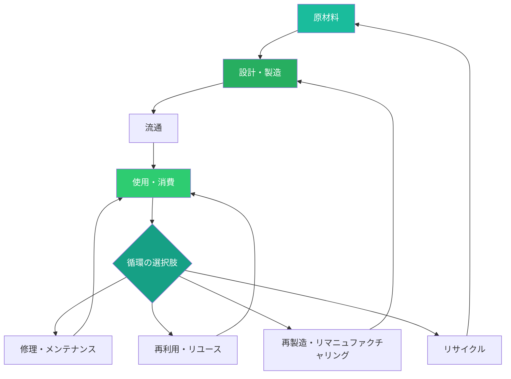
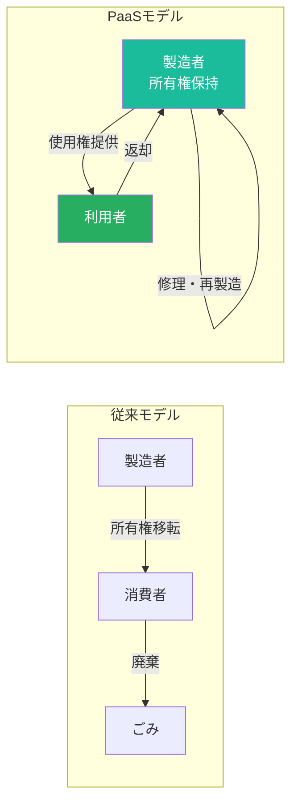

# 第1章 サーキュラーエコノミー入門

**Introduction to the Circular Economy**

## はじめに — 壊れた直線を円に変える

私たちは長い間、「採掘し、作り、捨てる」（Take-Make-Waste）という直線型の経済モデルの中でデザインを行ってきた。しかし、有限な資源を持つ惑星の上で、無限の消費を前提としたシステムは論理的に成立しない。2026年現在、世界の資源循環率（サーキュラリティ・ギャップ）はわずか7.2%にとどまる。つまり、人類が使用する資源の92%以上が、一度使われただけで廃棄されている。

サーキュラーエコノミー（循環型経済）は、この構造的欠陥に対するデザインからの回答である。本章では、循環型経済の基本概念を理解し、デザイナーがどのようにしてこの転換の推進者となれるかを学ぶ。

## 線形経済 vs 循環型経済

### 線形経済の限界

産業革命以降、経済成長は資源消費量の増大と不可分であった。線形経済モデルでは、原材料は製品に加工され、消費者に届けられ、やがて廃棄物となる。この一方通行の流れは、以下の構造的問題を内包している。

| 問題領域 | 線形経済の課題 | 影響 |
|----------|---------------|------|
| 資源枯渇 | 非再生資源の一方的消費 | レアメタル等の供給リスク増大 |
| 廃棄物蓄積 | 年間20億トン以上の固形廃棄物 | 海洋汚染、土壌汚染の深刻化 |
| 気候変動 | 製造・廃棄プロセスからの温室効果ガス | 地球温暖化の加速 |
| 経済的損失 | 素材価値の喪失 | 年間数兆ドルの経済的機会損失 |

### 循環型経済の原則

循環型経済は、廃棄物という概念そのものを設計段階で排除する。「ごみ」は設計の失敗であるという前提に立ち、すべての素材が連続的にシステム内を循環する仕組みを構築する。

## エレン・マッカーサー財団のフレームワーク

サーキュラーエコノミーの理論的基盤として最も広く参照されるのが、エレン・マッカーサー財団（Ellen MacArthur Foundation）が提唱するフレームワークである。このフレームワークは、循環型経済を3つの原則で定義する。

### 3つの基本原則

**原則1：廃棄物と汚染を設計段階で排除する（Eliminate waste and pollution）**

廃棄物は、素材が経済システムから「漏れ出す」ことで生じる。この漏出を防ぐためには、製品の設計段階から素材の行き先を計画する必要がある。分解しやすい構造、有害物質の排除、モジュール化された部品設計がこの原則を実現する。

**原則2：製品と素材を最高の価値で循環させ続ける（Circulate products and materials）**

製品や素材がシステム内で循環し続けることで、その価値が維持される。ここで重要なのは、「ダウンサイクル」（品質の劣化を伴うリサイクル）ではなく、素材の品質と機能を保ったまま循環させることである。

**原則3：自然を再生する（Regenerate nature）**

循環型経済は、自然資本を搾取するのではなく、積極的に再生する方向を目指す。土壌の修復、生物多様性の回復、再生可能エネルギーの活用がこの原則に含まれる。

!!! info "バタフライ・ダイアグラム"
    エレン・マッカーサー財団の「バタフライ・ダイアグラム」は、循環型経済の全体像を視覚化した象徴的な図である。左翼が生物的サイクル、右翼が技術的サイクルを表し、両者が交差しない形でそれぞれの循環を形成する。このダイアグラムを理解することが、循環型デザインの出発点となる。

## サーキュラーデザインの原則

デザイナーが循環型経済に貢献するための具体的な設計原則を以下に示す。

### 1. 長寿命設計（Design for Longevity）

製品の物理的耐久性だけでなく、感情的耐久性（ユーザーが愛着を持ち続ける品質）も含めた長寿命化を追求する。日本の「一生もの」という概念は、この原則の優れた文化的表現である。

### 2. 分解容易性設計（Design for Disassembly）

製品のライフサイクル終了時に、素材ごとに容易に分離・回収できる構造を設計する。接着剤の代わりにスナップフィットを使用する、異種素材の結合を最小化するなどの手法がある。

### 3. 素材選択の最適化（Material Selection）

リサイクル可能な単一素材の使用、有害物質の排除、再生可能素材の優先的採用により、素材レベルでの循環を可能にする。

### 4. モジュール設計（Modular Design）

交換可能な部品で構成することで、部分的な修理・アップグレードを可能にし、製品全体の寿命を延長する。Fairphoneのモジュラースマートフォンは代表的な事例である。

## プロダクト・アズ・ア・サービス（PaaS）

循環型経済において注目されるビジネスモデルが「プロダクト・アズ・ア・サービス」（Product-as-a-Service）である。製品を「売り切る」のではなく、「使用権を提供する」モデルへの転換により、製造者が製品のライフサイクル全体に責任を持つ構造が生まれる。

!!! example "PaaSの実践事例"
    - **Mud Jeans**：ジーンズのリース・モデル。月額料金でジーンズを使用し、返却後は修理・リサイクルされる
    - **Philips Lighting**：照明を「サービス」として提供。顧客は照明器具ではなく「光」を購入する
    - **Interface**：カーペットタイルの回収・再製造プログラム。使用済みタイルを原料に戻し、新しい製品として再生

## 生物的サイクルと技術的サイクル

循環型経済では、素材を2つのカテゴリに明確に分類して管理する。

### 生物的サイクル（Biological Cycle）

生分解可能な素材（食品、木材、綿、天然繊維など）が、使用後に安全に生物圏に還元されるサイクルである。堆肥化、嫌気性消化などのプロセスを通じて、栄養素が土壌に戻り、新たな生物資源の成長を支える。

### 技術的サイクル（Technical Cycle）

生分解されない素材（金属、プラスチック、合成素材など）が、修理、再利用、再製造、リサイクルを通じて経済システム内を循環し続けるサイクルである。技術的サイクルでは、素材の品質を維持しながら循環させることが重要となる。

| 循環の階層 | 生物的サイクル | 技術的サイクル |
|-----------|--------------|--------------|
| 最高価値 | カスケード利用 | メンテナンス・修理 |
| 高価値 | 生化学的抽出 | 再利用・再配布 |
| 中価値 | 嫌気性消化 | 再製造・改修 |
| 基本 | 堆肥化 | リサイクル |

!!! warning "2つのサイクルの混合を避ける"
    生物的素材と技術的素材が混合された製品（例：合成繊維と天然繊維の混紡）は、どちらのサイクルにも適切に乗せることが困難になる。デザイン段階で2つのサイクルの分離を意識することが、循環の質を高める鍵である。

## ケーススタディ

### ケース1：パタゴニア — Worn Wearプログラム

アウトドアブランドのパタゴニアは、「Worn Wear」プログラムを通じて、製品の修理・再販文化を構築した。年間10万件以上の修理を実施し、中古品の再販プラットフォームを運営する。「最もサステナブルな製品は、すでにあなたが持っているもの」というメッセージは、消費の抑制とブランドロイヤルティの両立を実現した。

### ケース2：Loop — リフィルの再発明

TerraCycleが展開するLoopプラットフォームは、使い捨て容器をステンレスやガラスの耐久容器に置き換え、回収・洗浄・再充填のシステムを構築した。P&G、ユニリーバ、ネスレなどの大手ブランドが参画し、日用品の循環モデルを実証している。

### ケース3：Fairphone — モジュラースマートフォン

Fairphoneは、スマートフォンの各部品をユーザー自身が交換可能なモジュール構造で設計した。バッテリー、スクリーン、カメラなどを個別に交換でき、製品全体の寿命を大幅に延長する。公正な素材調達と労働条件の透明性も含めた包括的な循環型アプローチの好例である。

## 演習

!!! success "実践演習"

    **演習1：線形から循環へのリデザイン（60分）**

    自分の身の回りにある使い捨て製品を1つ選び、循環型経済の3原則に基づいて再設計せよ。素材の選択、分解構造、回収の仕組み、ビジネスモデルまでを含むコンセプトを、スケッチとダイアグラムで表現すること。

    **演習2：サーキュラリティ監査（90分）**

    自宅または職場の空間を対象に「サーキュラリティ監査」を実施せよ。以下の項目について各製品を評価し、改善提案をまとめること。

    - 素材は生物的サイクルか技術的サイクルか
    - 修理は可能か
    - 分解は容易か
    - 代替的なPaaSモデルは存在するか

    **演習3：PaaSビジネスモデル設計（120分）**

    特定の製品カテゴリを選び、PaaS（プロダクト・アズ・ア・サービス）モデルへの転換プランを設計せよ。製品の所有・使用・返却・再生のフロー、収益モデル、ユーザー体験をビジネスモデルキャンバスを用いて整理すること。
