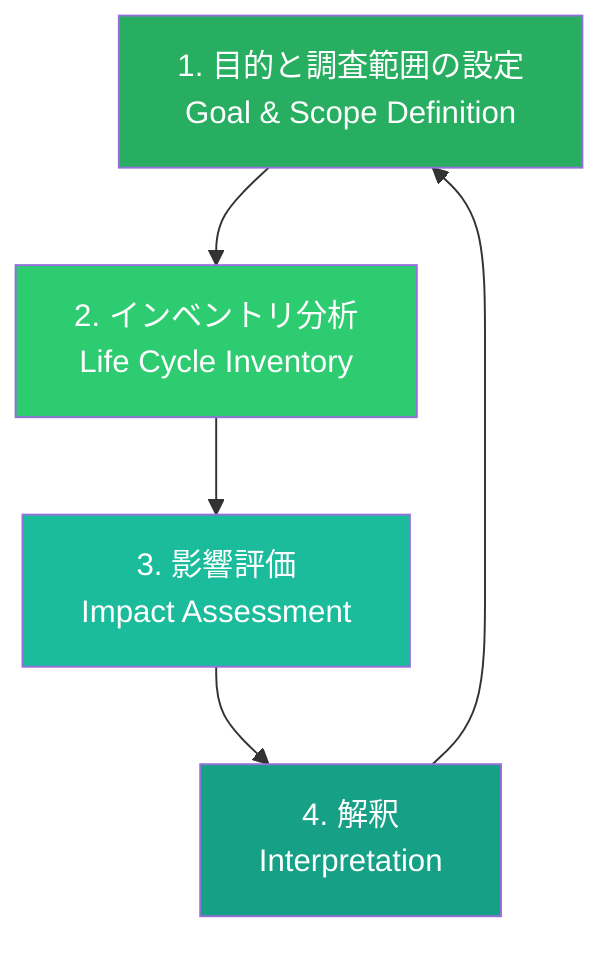
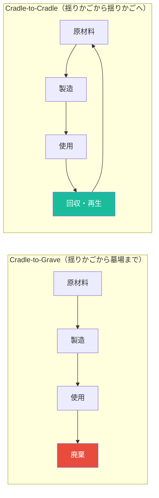
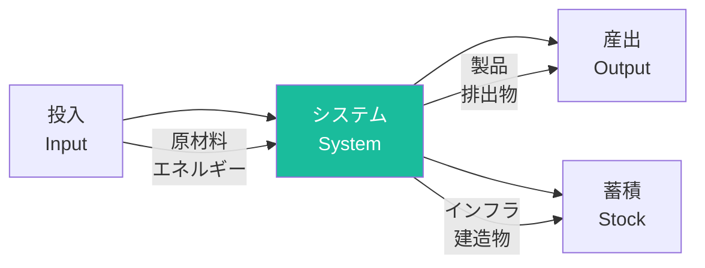

# 第2章 ライフサイクルアセスメント

**Life Cycle Assessment**

## はじめに — 「環境に優しい」を数値で証明する

「この素材はエコです」「サステナブルなパッケージです」。こうした主張は、何をもって裏付けられるのだろうか。感覚や印象に頼った環境配慮は、時としてグリーンウォッシュ（見せかけの環境配慮）に陥る。デザイナーに必要なのは、環境負荷を科学的かつ定量的に評価する方法論である。

ライフサイクルアセスメント（Life Cycle Assessment, LCA）は、製品やサービスが原材料の採取から廃棄に至るまでのライフサイクル全体で環境に与える影響を体系的に評価する手法である。ISO 14040およびISO 14044で国際標準化されたこの方法論は、2026年現在、デザイン意思決定における不可欠なツールとなっている。

## LCA方法論の基本

LCAは、以下の4つのフェーズで構成される。

### フェーズ1：目的と調査範囲の設定

LCAの出発点は、評価の目的を明確に定義することである。「何のために」「何を比較するのか」を決定し、機能単位（Functional Unit）とシステム境界（System Boundary）を設定する。

**機能単位**とは、比較の基準となる製品・サービスの機能を定量化したものである。例えば、紙コップとセラミックカップを比較する場合、「飲料1杯を提供する」という機能単位を設定し、それぞれが何回の使用でどれだけの環境負荷を生むかを評価する。

!!! tip "機能単位の重要性"
    機能単位の設定は、LCA全体の妥当性を左右する。「レジ袋1枚」と「エコバッグ1個」を単純比較するのではなく、「買い物1回分の荷物を運搬する」という機能単位で比較することで、はじめて公正な評価が可能になる。エコバッグが環境面で優位になるには、何百回もの使用が必要になるケースがある。

### フェーズ2：インベントリ分析（LCI）

ライフサイクルインベントリ（LCI）では、製品のライフサイクル各段階で投入される資源（入力）と排出される物質（出力）を網羅的に集計する。原材料の採取量、エネルギー消費量、水使用量、大気への排出量、水域への排出量、固形廃棄物量など、膨大なデータを収集・整理する。

| ライフサイクル段階 | 入力の例 | 出力の例 |
|------------------|---------|---------|
| 原材料採取 | 鉱石、原油、水 | 採掘廃棄物、排水 |
| 製造・加工 | エネルギー、化学物質 | CO₂、VOC、産業廃棄物 |
| 輸送・流通 | 燃料、梱包材 | 排気ガス、梱包廃棄物 |
| 使用段階 | 電力、消耗品 | 排水、排熱 |
| 廃棄・処理 | 処理エネルギー | 焼却灰、浸出水 |

### フェーズ3：影響評価（LCIA）

インベントリデータを環境影響カテゴリに変換する段階である。例えば、CO₂の排出量を「地球温暖化ポテンシャル（GWP）」に、SO₂の排出量を「酸性化ポテンシャル」に変換する。主要な環境影響カテゴリについては後述する。

### フェーズ4：解釈

結果を分析し、結論と改善提案を導く段階である。感度分析（前提条件の変化が結果に与える影響の検証）や不確実性分析を含む。

## クレイドル・トゥ・グレイブ vs クレイドル・トゥ・クレイドル

LCAのシステム境界の設定方法には、複数のアプローチがある。

**クレイドル・トゥ・グレイブ（Cradle-to-Grave）** は、原材料の採取から最終処分までを評価範囲とする従来型のアプローチである。線形経済の枠組みで環境負荷を把握するのに適している。

**クレイドル・トゥ・クレイドル（Cradle-to-Cradle, C2C）** は、ウィリアム・マクドノーとミヒャエル・ブラウンガルトが提唱した概念であり、廃棄物という概念を排除し、すべての素材が次のライフサイクルの「栄養素」となる循環型のシステムを前提とする。

!!! info "その他のシステム境界"
    - **Cradle-to-Gate**：原材料採取から工場出荷まで（使用・廃棄段階を除外）
    - **Gate-to-Gate**：特定の製造プロセスのみを評価
    - **Gate-to-Grave**：製品の使用開始から廃棄まで

## カーボンフットプリントの算出

カーボンフットプリントは、LCAの環境影響カテゴリの中でも最も広く用いられる指標である。製品やサービスのライフサイクル全体で排出される温室効果ガスの総量をCO₂換算（CO₂e）で表す。

### 温室効果ガスの換算係数

異なる温室効果ガスを統一的に比較するために、GWP（地球温暖化ポテンシャル）係数が用いられる。

| 温室効果ガス | GWP（100年値） | 主な発生源 |
|-------------|---------------|-----------|
| CO₂ | 1 | 化石燃料燃焼、製造プロセス |
| CH₄（メタン） | 28 | 畜産、廃棄物処理 |
| N₂O（一酸化二窒素） | 265 | 農業、化学プロセス |
| HFCs | 1,300〜14,800 | 冷媒、発泡剤 |

### デザイン判断とカーボンフットプリント

デザイナーの意思決定が製品のカーボンフットプリントに与える影響は大きい。素材選択で最大80%の環境負荷が決定されるという研究もある。設計段階で以下の点を考慮することが重要である。

- 軽量化による輸送時のCO₂削減
- 長寿命設計による製造回数の低減
- 地域調達による輸送距離の短縮
- エネルギー効率の高い使用段階の設計

## 環境影響カテゴリ

カーボンフットプリント以外にも、LCAでは多様な環境影響を評価する。

| カテゴリ | 指標 | 単位 |
|---------|------|------|
| 地球温暖化 | GWP | kg CO₂e |
| オゾン層破壊 | ODP | kg CFC-11e |
| 酸性化 | AP | kg SO₂e |
| 富栄養化 | EP | kg PO₄³⁻e |
| 光化学オキシダント | POCP | kg C₂H₄e |
| 非生物的資源枯渇 | ADP | kg Sbe |
| 水使用 | WU | m³ |

!!! warning "トレードオフへの注意"
    ある環境影響カテゴリを改善する設計変更が、別のカテゴリを悪化させることがある。例えば、軽量化のためにアルミニウムから複合素材に変更した場合、製造時のCO₂は減少するかもしれないが、リサイクル困難性が増大する。デザイナーはこうしたトレードオフを常に意識する必要がある。

## デザイナーのためのLCAツール

専門的なLCAソフトウェアは操作が複雑だが、デザイナー向けに簡略化されたツールも登場している。

| ツール名 | 特徴 | 対象 |
|---------|------|------|
| **SimaPro** | 包括的なLCAソフトウェア。研究・産業用途 | LCA専門家 |
| **openLCA** | オープンソースの無料LCAツール | 研究者・学生 |
| **Ecochain Helix** | クラウドベースの簡易LCAツール | デザイナー・中小企業 |
| **One Click LCA** | 建築・建設向け特化型 | 建築デザイナー |
| **Sustainable Minds** | プロダクトデザイナー向けLCA | プロダクトデザイナー |

!!! tip "まずはスクリーニングLCAから始めよう"
    完全なLCAは専門家でも数ヶ月を要する大規模な作業である。デザイナーはまず「スクリーニングLCA」（簡易LCA）から始めることを推奨する。主要な素材と製造プロセスに絞った概略的な評価でも、設計上の重要な意思決定に十分な情報を提供できる。

## マテリアルフロー分析

マテリアルフロー分析（Material Flow Analysis, MFA）は、特定のシステム（企業、都市、国家）における物質の流れと蓄積を定量的に把握する手法である。LCAが製品単位の評価であるのに対し、MFAはシステム全体の物質循環を俯瞰する。

MFAの基本原則は質量保存則に基づく。すなわち、システムに投入される物質の総量は、産出される物質の総量と蓄積量の合計に等しい。この原則により、物質フローの「漏れ」や非効率を特定できる。

デザイナーにとってMFAは、自社製品が素材フロー全体のどこに位置し、どこでロスが生じているかを把握するための俯瞰的な視点を提供する。特に、サプライチェーン全体の最適化や、産業共生（ある企業の廃棄物を別の企業の原料として活用する仕組み）の設計に有効である。

## 演習

!!! success "実践演習"

    **演習1：簡易カーボンフットプリント算出（90分）**

    自分が日常的に使用する製品（スマートフォンケース、水筒、ノートなど）を1つ選び、簡易的なカーボンフットプリントを算出せよ。素材の種類と重量を推定し、公開されている排出係数データベースを用いて概算すること。結果をA4用紙1枚にまとめよ。

    **演習2：比較LCA（120分）**

    同一の機能を持つ2つの製品（例：紙コップ vs 再利用カップ、紙袋 vs エコバッグ）について、ライフサイクルの各段階での環境負荷を定性的に比較せよ。どの段階が最も影響が大きいか、損益分岐点（何回の使用で環境負荷が逆転するか）を推定すること。

    **演習3：LCAツールの体験（120分）**

    openLCA（無料）をダウンロードし、簡単な製品のLCAを実施せよ。ツールの操作に慣れることが主な目的であるため、完璧な精度を求める必要はない。操作で得た気づきと、デザインプロセスへの統合可能性について考察をまとめよ。

    **演習4：マテリアルフロー図の作成（60分）**

    自分の学校または職場を対象に、主要な物質（紙、プラスチック、食品）の流入・蓄積・流出を図式化せよ。どこに循環の機会があるかを特定し、改善案を3つ提案すること。
