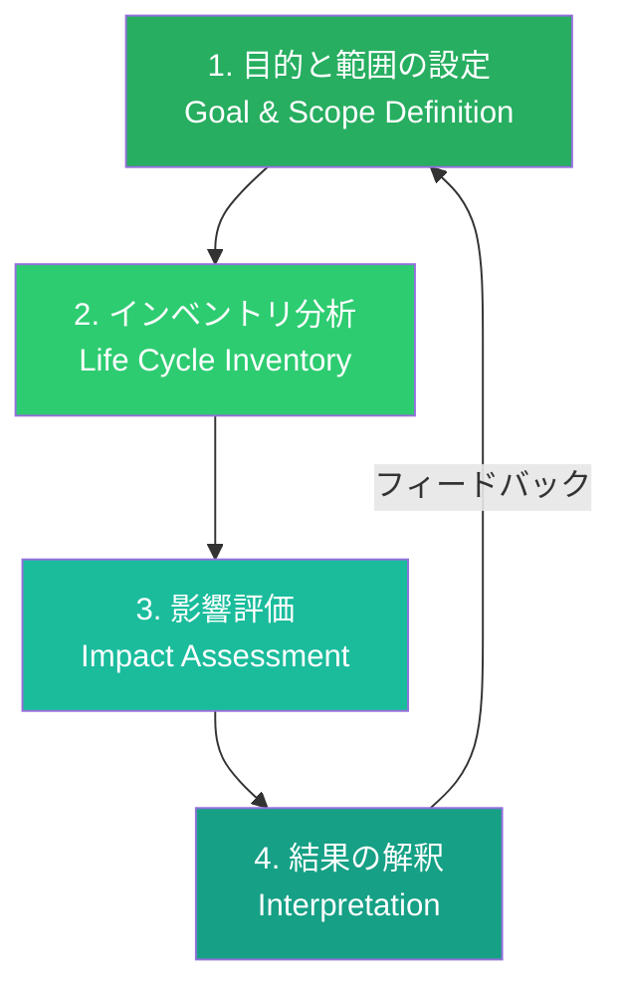
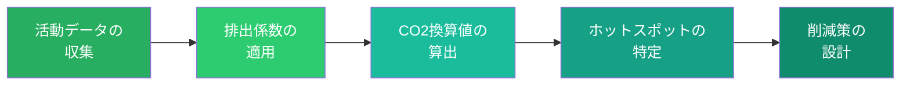
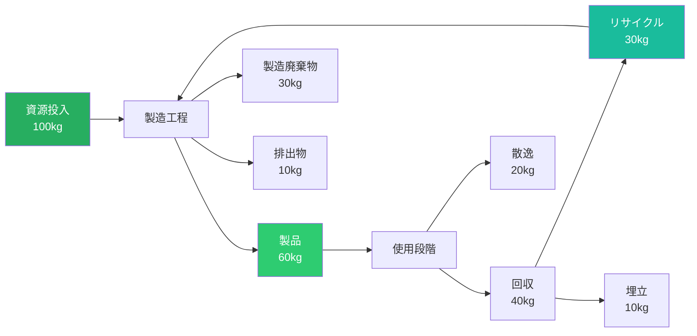

# 第2章 ライフサイクルアセスメント

**Life Cycle Assessment**

## はじめに — 測れないものは改善できない

「この製品はエコフレンドリーです」という主張は、何を根拠にしているのか。紙袋はプラスチック袋より本当に環境に良いのか。電気自動車は製造段階の排出量を含めても優位なのか。こうした問いに科学的に答えるための方法論が、ライフサイクルアセスメント（Life Cycle Assessment、以下LCA）である。

LCAは、製品やサービスの環境負荷を、原材料の採掘から廃棄・リサイクルに至るまでのライフサイクル全体にわたって定量的に評価する手法である。ISO 14040/14044で国際的に標準化されたこの方法論は、デザイナーが直感や印象ではなく、データに基づいた環境配慮の意思決定を行うための基盤を提供する。

## LCA方法論の4つのフェーズ

LCAは、ISO 14040に基づき、4つのフェーズで構成される。

### フェーズ1：目的と範囲の設定

LCAの最初のステップは、評価の目的、対象システムの境界、機能単位を明確に定義することである。

**機能単位**とは、製品が果たす機能を定量的に表現したものである。例えば、飲料容器のLCAでは「1リットルの飲料を消費者に届ける」が機能単位となる。これにより、異なる素材・形態の容器を公平に比較できる。

**システム境界**は、どの範囲のプロセスを評価対象に含めるかを定める。原材料採掘から最終処分までを含む「クレイドル・トゥ・グレイブ」が最も包括的な範囲である。

### フェーズ2：インベントリ分析（LCI）

ライフサイクル全体にわたるすべての投入（原材料、エネルギー、水）と産出（製品、排出物、廃棄物）を定量化するプロセスである。これは最もデータ集約的なフェーズであり、信頼性の高いデータベースの活用が不可欠となる。

### フェーズ3：影響評価（LCIA）

インベントリデータを環境影響カテゴリに変換する。後述の環境影響カテゴリの節で詳しく解説する。

### フェーズ4：結果の解釈

データの感度分析、不確実性評価を行い、結論と改善提案を導出する。このフェーズでは、結果の限界と前提条件を明確に伝えることが求められる。

## クレイドル・トゥ・グレイブ vs クレイドル・トゥ・クレイドル

LCAのシステム境界の設定において、2つの対照的なアプローチが存在する。

| 観点 | クレイドル・トゥ・グレイブ | クレイドル・トゥ・クレイドル |
|------|------------------------|--------------------------|
| 日本語 | 揺りかごから墓場まで | 揺りかごから揺りかごまで |
| 思想 | ライフサイクルの終了を前提 | 廃棄物を次のサイクルの資源と見なす |
| 範囲 | 採掘〜製造〜使用〜廃棄 | 採掘〜製造〜使用〜回収〜再資源化〜再製造 |
| 目標 | 環境負荷の最小化 | 素材の無限循環と正の影響の創出 |
| 提唱者 | ISO標準の伝統的アプローチ | ウィリアム・マクドノー＆ミヒャエル・ブラウンガルト |

!!! info "クレイドル・トゥ・クレイドルの革新"
    マクドノーとブラウンガルトが2002年に著した『Cradle to Cradle: Remaking the Way We Make Things』は、「効率を上げる」（エコ・エフィシエンシー）ではなく「効果を高める」（エコ・エフェクティブネス）という発想の転換を提唱した。桜の木が大量の花びらを「無駄に」散らすように見えて実は生態系全体に栄養を提供しているように、デザインもまた「廃棄物」を「栄養」に変換できるという思想である。

## カーボンフットプリントの算出

カーボンフットプリントは、LCAの環境影響カテゴリの中でも最も広く注目される指標である。製品やサービスのライフサイクル全体で排出される温室効果ガスをCO2換算（CO2e）で表現する。

### 算出の基本ステップ

**活動データ**は、素材の使用量、輸送距離、エネルギー消費量など、具体的な数値データである。**排出係数**は、各活動単位あたりの温室効果ガス排出量を示す変換係数であり、Ecoinventなどのデータベースから取得する。

### スコープ1・2・3

温室効果ガスの排出は、GHGプロトコルに基づき3つのスコープに分類される。

| スコープ | 範囲 | デザインとの関連 |
|---------|------|----------------|
| スコープ1 | 自社の直接排出 | 製造工程の設計 |
| スコープ2 | 購入エネルギーの間接排出 | エネルギー効率の高い設計 |
| スコープ3 | サプライチェーン全体の排出 | 素材選択、輸送設計、使用段階設計 |

デザイナーの意思決定は、特にスコープ3に大きな影響を与える。素材の選択、製品の重量、使用段階のエネルギー消費、ライフサイクル終了時の処理方法は、すべてデザインの段階で決定される。

## 環境影響カテゴリ

LCAでは、カーボンフットプリント以外にも多様な環境影響カテゴリを評価する。デザイナーが特に意識すべき主要カテゴリを以下に示す。

| カテゴリ | 指標 | 単位 | デザインへの示唆 |
|---------|------|------|----------------|
| 地球温暖化 | GWP | kg CO2e | 低炭素素材・プロセスの選択 |
| オゾン層破壊 | ODP | kg CFC-11e | 特定物質の排除 |
| 酸性化 | AP | kg SO2e | 製造工程の最適化 |
| 富栄養化 | EP | kg PO4e | 排水管理の設計 |
| 資源枯渇 | ADP | kg Sbe | 再生可能素材の優先 |
| 水消費 | WF | m³ | 水効率の高い素材・工程 |
| 生態毒性 | — | CTUe | 有害物質の排除 |

!!! warning "トレードオフの認識"
    一つのカテゴリで環境負荷を削減すると、別のカテゴリで負荷が増大することがある。例えば、軽量化のためにアルミニウムを使用するとカーボンフットプリントが増大する場合がある。LCAはこうしたトレードオフを可視化し、総合的な判断を支援する。

## デザイナー向けLCAツール

従来、LCAは専門家が数ヶ月をかけて行う高度な分析であった。しかし近年、デザイナーが設計プロセスの中で簡易的にLCAを実施できるツールが充実してきている。

### 簡易LCAツール

- **Ecochain Helix**：Webベースで直感的なLCAを実行可能。製品カテゴリ別のテンプレートが用意されている
- **Sustainable Minds**：プロダクトデザイナー向けに最適化されたLCAソフトウェア。CADとの連携機能を持つ
- **One Click LCA**：建築・建設分野に特化したLCAツール。BIMモデルとの統合が可能

### 包括的LCAツール

- **openLCA**：オープンソースのLCAソフトウェア。無料で利用可能で、多様なデータベースに対応
- **SimaPro**：研究・産業の両分野で広く使用される専門的LCAソフトウェア
- **GaBi**：自動車・電機産業での実績が豊富な統合型LCAツール

### データベース

- **Ecoinvent**：世界最大のLCAデータベース。18,000以上のプロセスデータを収録
- **IDEA（Inventory Database for Environmental Analysis）**：産業技術総合研究所が提供する日本のLCAデータベース

## マテリアルフロー分析

マテリアルフロー分析（Material Flow Analysis、MFA）は、特定のシステム内における物質の流れを定量的に追跡する手法である。LCAが環境影響を評価するのに対し、MFAは物質の「量」と「経路」に焦点を当てる。

デザイナーにとってMFAの価値は、素材がシステムから「漏れ出す」ポイントを特定できることにある。上の図では、製造段階で40%、使用段階で33%の素材が失われている。こうした「漏出点」を設計で解消することが、循環率の向上に直結する。

!!! tip "デザイナーのためのMFA活用法"
    フルスケールのMFAは専門家の領域だが、デザイナーは「簡易MFA」として自分の製品の素材フローを可視化する習慣を持つべきである。投入される素材の重量、製造時のロス率、使用後の回収率、リサイクル率を概算でも把握することで、設計改善の方向性が明確になる。

## 演習

!!! success "実践演習"

    **演習1：簡易カーボンフットプリント算出（90分）**

    日常的に使用する製品を1つ選び、以下のステップで簡易カーボンフットプリントを算出せよ。

    1. 機能単位を定義する
    2. 素材の種類と重量を調べる（または推定する）
    3. 主要な製造プロセスを特定する
    4. 輸送距離を推定する
    5. 公開されている排出係数を適用して概算値を算出する
    6. 最も大きな排出源（ホットスポット）を特定し、削減策を提案する

    **演習2：LCAツールの体験（120分）**

    openLCA（無料）をダウンロードし、チュートリアルに従って簡単な製品のLCAを実施せよ。結果を環境影響カテゴリ別に整理し、トレードオフが存在する箇所を特定すること。

    **演習3：マテリアルフロー図の作成（60分）**

    自分がデザインした（または身近にある）製品について、原材料から廃棄・リサイクルまでのマテリアルフロー図を作成せよ。各段階での素材のロスを概算し、循環率を改善するための設計変更を3つ以上提案すること。
