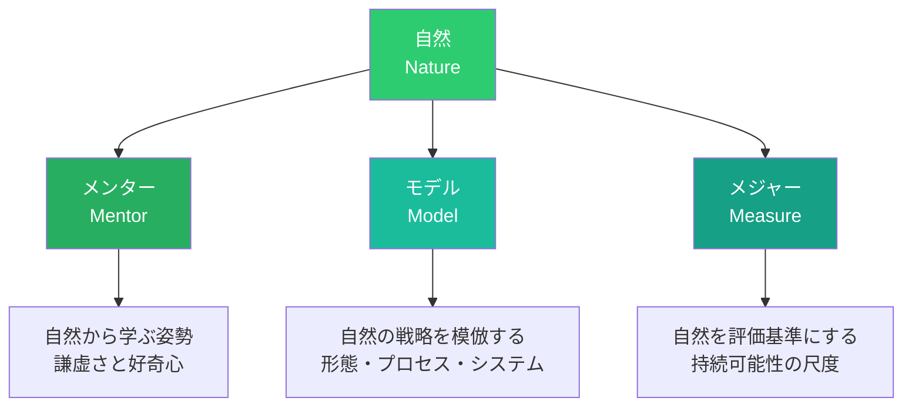
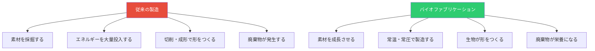

# 第3章 バイオデザイン

**Bio Design**

## はじめに — 38億年のR&Dに学ぶ

自然界は、38億年にわたる進化という途方もない研究開発を経て、驚くべき効率性と適応力を持つ「デザイン」を生み出してきた。蓮の葉は化学薬品なしで自らを清潔に保ち、蜘蛛の糸は鋼鉄より強靭でありながら生分解性を持ち、シロアリの塚は空調設備なしで温度を一定に保つ。

バイオデザインは、こうした自然界の叡智をデザインの源泉として活用するアプローチの総称である。自然を観察して模倣するバイオミミクリーから、生きた生物そのものを素材やプロセスとして組み込むバイオファブリケーションまで、その範囲は広大である。2026年現在、合成生物学と素材科学の急速な進歩により、バイオデザインはかつてないスピードで実用化の段階に入っている。

## バイオミミクリー — 自然に学ぶデザイン

バイオミミクリー（Biomimicry）は、自然界の形態、プロセス、システムを模倣することで、人間の課題を解決するデザインアプローチである。生物学者ジャニン・ベニュスが1997年の著書で体系化したこの概念は、「自然をメンター（Mentor）、モデル（Model）、メジャー（Measure）として活用する」という3つのMで定義される。

### 自然の3つの役割

**メンター（Mentor）としての自然**：自然は38億年の試行錯誤を経た「先輩」であり、私たちはそこから謙虚に学ぶ。うまくいかなかった種は淘汰され、現在存在する生物はすべて「成功例」である。

**モデル（Model）としての自然**：自然界の具体的な構造やプロセスを、デザインの直接的な参照モデルとして活用する。カワセミのくちばしが新幹線の先頭形状に応用された事例は、日本発のバイオミミクリーの代表例である。

**メジャー（Measure）としての自然**：デザインの持続可能性を評価する基準として自然を用いる。「この設計は生態系の中で持続的に機能するか」という問いが、究極の評価尺度となる。

### バイオミミクリーの3つのレベル

| レベル | 対象 | 例 |
|-------|------|-----|
| 形態の模倣 | 自然界の形状・構造 | サメの肌を模した低抵抗表面、ハスの葉を模した撥水コーティング |
| プロセスの模倣 | 自然界の製造・変換プロセス | 光合成を模した太陽光エネルギー変換、貝殻の常温成形プロセス |
| システムの模倣 | 生態系の組織原理 | 工業共生（産業エコロジー）、循環型都市設計 |

!!! info "バイオミミクリーの設計プロセス"
    バイオミミクリー研究所が提唱する設計プロセスには2つのアプローチがある。「課題起点」（Design to Biology）は人間の課題から出発し、その課題を解決している生物を探索する。「生物起点」（Biology to Design）は生物の興味深い戦略から出発し、それが応用できる人間の課題を見出す。

## 菌糸体マテリアル

菌糸体（マイセリウム）は、キノコなどの菌類の根にあたる糸状の構造体であり、近年のバイオデザインにおいて最も注目される素材の一つである。

### 菌糸体素材の特性

菌糸体は、農業廃棄物（わら、おがくず、穀物殻など）を基質として培養され、数日から数週間で成長する。金型に充填して培養することで、任意の形状に成形可能であり、乾燥・熱処理後は軽量で断熱性に優れた素材となる。完全に生分解性であり、ライフサイクル終了後は土壌に還元される。

### 応用分野

- **パッケージング**：Ecovative Design社のMycoCompositeは、発泡スチロールの代替として実用化されている。IKEAがパッケージ素材として採用したことで注目を集めた
- **建築素材**：断熱材、音響パネル、レンガ代替素材としての研究が進む
- **テキスタイル**：Bolt Threads社のMyloは、菌糸体から作られたレザー代替素材であり、Stella McCartneyなどのブランドが採用
- **家具・インテリア**：成形家具、ランプシェード、タイルなどの事例が増加

## 藻類ベースのデザイン

藻類（アルジー）は、光合成によってCO2を吸収しながら急速に成長する生物であり、バイオデザインの文脈で多様な可能性を持つ。

### 藻類の応用可能性

| 応用分野 | 概要 | 事例 |
|---------|------|------|
| バイオプラスチック | 藻類からPHAなどの生分解性ポリマーを生成 | Algix社のSolaplastなど |
| テキスタイル染料 | 合成染料の代替としての藻類色素 | Living Colour Projectなど |
| バイオ燃料 | 藻類由来のバイオディーゼル、バイオエタノール | 航空燃料への応用研究 |
| 建築ファサード | 藻類バイオリアクターを建築外壁に統合 | BIQハウス（ハンブルク） |
| 食品パッケージ | 藻類ベースの食用フィルム | Evowareのシーウィードパッケージ |

!!! example "BIQハウス — 藻類ファサードの実例"
    ドイツ・ハンブルクのBIQハウスは、外壁に藻類バイオリアクターを統合した世界初の建築である。透明パネル内で培養される微細藻類がCO2を吸収してバイオマスを生産し、同時に建物の日射遮蔽と断熱を担う。生産されたバイオマスはバイオガスに変換され、建物のエネルギー供給に貢献する。

## リビングマテリアル（生きた素材）

バイオデザインの最前線では、生物を素材として「使う」のではなく、生物が「生きたまま」機能するマテリアルの研究が進んでいる。

**自己修復コンクリート**：バクテリアをコンクリートに混入し、ひび割れが生じると石灰石を生成して自ら修復する。デルフト工科大学のヘンク・ヨンカース教授の研究が先駆的である。

**バイオルミネッセンス照明**：発光バクテリアや発光藻類を用いた照明の研究が進む。電力を使わず、CO2を吸収しながら光を発するシステムの可能性が模索されている。

**生きた建築外壁**：苔やシアノバクテリアを組み込んだ建築パネルが、空気浄化とCO2吸収を行う。これらは単なる緑化ではなく、素材そのものが生物学的機能を持つ点が革新的である。

## 合成生物学とデザイン

合成生物学（Synthetic Biology）は、生物の遺伝情報を設計・改変することで新たな機能を持つ生物を創出する分野である。デザインとの交差点において、以下の可能性が開かれている。

### デザイナーのための合成生物学

- **遺伝子組み換え微生物による素材生産**：蜘蛛の糸タンパク質を酵母で生産するSpiber社の技術は、日本発の代表的事例である
- **バイオセンサー**：環境汚染物質に反応して色が変わる遺伝子改変バクテリアを組み込んだ製品
- **プログラマブルマテリアル**：環境条件に応じて形状や特性が変化するよう設計された生物素材

!!! warning "倫理的考慮"
    合成生物学をデザインに応用する際には、生態系への影響リスク、バイオセキュリティ、遺伝子改変生物の倫理的問題など、慎重な検討が求められる。「つくれるから」ではなく「つくるべきか」を問う姿勢が、バイオデザイナーには不可欠である。

## バイオファブリケーション

バイオファブリケーションは、生物的プロセスを用いて素材や製品を「成長させる」製造方法である。従来の「削る」「成形する」製造とは根本的に異なり、生物の成長メカニズムを活用する。

### 主要なバイオファブリケーション技術

**バクテリアセルロース**：酢酸菌が培養液の表面に形成するセルロースのシートは、テキスタイルやパッケージの素材として研究されている。スザンヌ・リーの「BioCouture」プロジェクトは、バクテリアセルロースからファッション素材を生産する先駆的な取り組みである。

**3Dバイオプリンティング**：生きた細胞を含む「バイオインク」を用いた3Dプリンティングは、医療分野を越えてデザインの領域にも応用が広がっている。

**発酵デザイン**：微生物の発酵プロセスを活用した素材・染料生産は、テキスタイルデザインの分野で急速に発展している。

## 自然をメンター・モデル・メジャーとして

バイオデザインの実践において、ジャニン・ベニュスの「3つのM」は指針となる統合的なフレームワークである。

**デザインプロセスへの統合**：自然界の戦略を調査する「発見」フェーズ、生物学的原理をデザイン要件に変換する「翻訳」フェーズ、自然界の基準で成果を評価する「評価」フェーズの3段階で、バイオデザインを既存のデザインプロセスに組み込むことができる。

生命の原理（Life's Principles）として、ベニュスは以下の6つを提示している。

| 原理 | 内容 | デザインへの示唆 |
|------|------|----------------|
| 現地の条件に適応する | 環境の変化に対応する | コンテクスト・センシティブな設計 |
| 太陽光を活用する | 再生可能エネルギーを利用する | 化石燃料依存からの脱却 |
| 化学を水ベースで行う | 有害溶剤を使わない | グリーンケミストリーの採用 |
| 形態を機能に適合させる | 最小の素材で最大の効果を得る | マテリアル効率の最大化 |
| リサイクルを前提とする | 廃棄物を栄養として循環させる | 循環型設計 |
| 多様性を重視する | レジリエンスを高める | 冗長性と多様性の設計 |

## 演習

!!! success "実践演習"

    **演習1：バイオミミクリー・デザインチャレンジ（120分）**

    以下の手順でバイオミミクリーを活用したデザインを行え。

    1. 日常生活における課題を1つ特定する（例：室内の温度調節、水の浄化、表面の汚れ防止）
    2. AskNature.org（バイオミミクリー研究所のデータベース）を活用し、その課題を解決している生物の戦略を3つ以上調査する
    3. 選んだ生物戦略の原理を抽出し、デザイン要件に翻訳する
    4. コンセプトをスケッチし、生命の原理に照らして評価する

    **演習2：菌糸体素材の実験（2週間）**

    菌糸体の培養キット（市販品または自作）を用いて、小さなオブジェクトを「成長」させよ。培養条件（温度、湿度、基質の種類）を記録し、素材特性を観察すること。従来の製造方法との比較を考察に含めること。

    **演習3：バイオデザイン倫理マッピング（60分）**

    合成生物学をデザインに応用する架空のプロジェクト（例：自己修復する建材、汚染を検知する生きたパッケージ）を設定し、そのプロジェクトに関わる倫理的論点をステークホルダーマップとして整理せよ。「つくるべきか」の問いに対する自分の立場を、根拠とともに述べよ。
