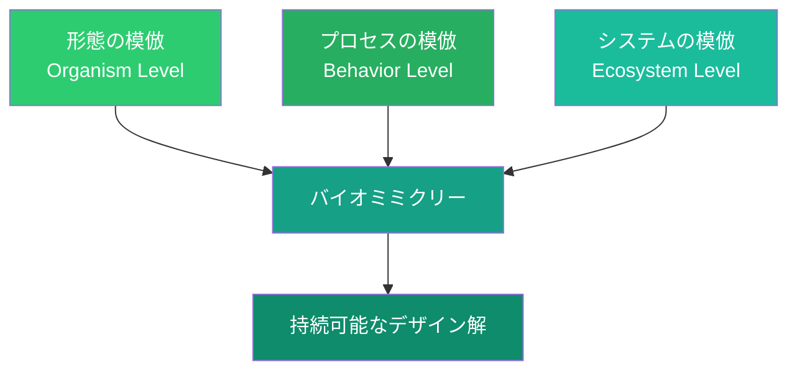
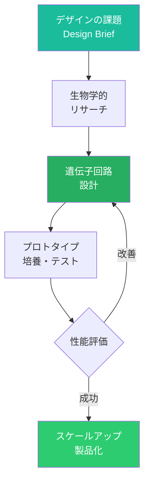

# 第3章 バイオデザイン

**Bio Design**

## はじめに — 38億年の研究開発

自然界は、38億年にわたる進化の過程で、あらゆる環境課題に対する解決策を試行錯誤してきた。極寒の北極から灼熱の砂漠、深海の高圧環境から標高8,000メートルの希薄な大気まで、生物はその多様性をもって地球上のほぼすべての環境に適応してきた。そして、そのすべてが太陽エネルギーと地球上の元素だけで、廃棄物を一切出さずに実現されている。

バイオデザインとは、この自然界の叡智をデザインに応用するアプローチの総称である。生物の形態や機能を模倣するバイオミミクリーから、菌糸体や藻類などの生物そのものを素材として活用するバイオファブリケーション、さらには合成生物学による全く新しい生物機能の設計まで、その範囲は急速に拡大している。

## バイオミミクリー — 自然に学ぶデザイン

バイオミミクリー（Biomimicry）は、ジャニン・ベニュスが1997年の著書で体系化した概念であり、自然界の形態、プロセス、システムを模倣することで持続可能な解決策を生み出すデザイン手法である。

### 自然を3つのレベルで参照する

バイオミミクリーは、自然を以下の3つの異なるレベルで参照する。

**形態レベル**：生物の形状や構造を模倣する。例えば、カワセミのくちばしの形状を新幹線500系の先頭車両に応用した事例、サメの皮膚構造（リブレット）を航空機表面に応用して空気抵抗を減少させた事例がある。

**プロセスレベル**：生物がエネルギーや物質を変換するプロセスを模倣する。蜘蛛が常温常圧で鋼鉄より強い糸を生成するプロセスの研究、光合成を模倣した人工光合成技術の開発などが含まれる。

**システムレベル**：生態系全体の関係性やフィードバックループを模倣する。産業生態学（Industrial Ecology）は、自然生態系における物質循環を工業システムに適用したものである。

!!! example "日本発のバイオミミクリー事例"
    - **新幹線500系**：カワセミのくちばし→トンネル微気圧波の軽減、フクロウの風切羽→パンタグラフの騒音低減
    - **ヨーグルトの蓋**：ハスの葉の撥水構造→ヨーグルトが付着しない蓋の開発
    - **蚊の針を模倣した痛くない注射針**：蚊の口器構造から着想を得た極細注射針

### 自然を「メンター・モデル・メジャー」として

ベニュスは、バイオミミクリーにおける自然の役割を3つの言葉で定義した。

| 役割 | 意味 | 問い |
|------|------|------|
| **メンター（Mentor）** | 自然は私たちが学ぶべき師匠である | 自然はこの問題をどう解決しているか？ |
| **モデル（Model）** | 自然は持続可能なデザインの手本である | 自然のどの仕組みを模倣できるか？ |
| **メジャー（Measure）** | 自然はデザインの持続可能性を測る基準である | このデザインは自然の基準に照らして適切か？ |

## 菌糸体素材 — マイセリウム・マテリアル

菌糸体（マイセリウム）は、キノコの根にあたる糸状の構造体である。農業廃棄物などの基質上で菌糸体を培養し、型に入れて成形・乾燥させることで、軽量で断熱性に優れた素材が生まれる。

### 菌糸体素材の特性

- **100%生分解性**：使用後は堆肥として土壌に還元可能
- **低エネルギー製造**：室温で培養でき、従来素材と比較してエネルギー消費が極めて少ない
- **原料の柔軟性**：農業廃棄物、木質チップ、麻殻など多様な基質を使用可能
- **カスタマイズ性**：培養条件の調整により、密度・強度・質感を制御可能

!!! info "菌糸体素材の応用事例"
    - **Ecovative Design**：発泡スチロール代替の梱包材、建築用断熱材
    - **IKEA**：菌糸体ベースの梱包材への段階的移行
    - **Bolt Threads（Mylo）**：菌糸体由来のレザー代替素材。アディダス、ルルレモンなどが採用
    - **建築素材**：菌糸体レンガ、構造パネルの研究開発

## 藻類ベースのデザイン

藻類（Algae）は、光合成によりCO₂を吸収しながら急速に成長する微生物であり、デザインと素材科学の新たなフロンティアとして注目されている。

### 藻類の可能性

藻類は、バイオプラスチック、バイオ燃料、テキスタイルの染料、食品成分、建築素材など、多様な応用可能性を持つ。特筆すべきは、その成長過程でCO₂を固定する「カーボンネガティブ」な特性である。

| 応用分野 | 藻類の活用方法 | 事例 |
|---------|--------------|------|
| パッケージング | 藻類ベースの生分解性フィルム | Notpla（Ooho） |
| テキスタイル | 藻類由来の繊維・染料 | Algaeing |
| 建築 | 藻類バイオリアクター・ファサード | BIQハウス（ハンブルク） |
| エネルギー | バイオ燃料生産 | 各種研究機関 |
| 食品 | 機能性食品成分 | スピルリナ製品 |

## リビングマテリアル — 生きている素材

従来の素材は「死んだ」状態で使用されるが、バイオデザインの最前線では「生きている」素材の研究が進んでいる。リビングマテリアルは、生物が本来持つ自己修復、環境応答、成長といった機能をデザインに取り込む。

!!! warning "倫理的考慮"
    リビングマテリアルの利用には、生物の道具化に関する倫理的問題が伴う。生物をデザインの素材として利用することの境界線はどこにあるのか。この問いに対する普遍的な回答はまだ存在しないが、デザイナーは常にこの倫理的次元を意識する責任がある。

### 事例：自己修復コンクリート

オランダのデルフト工科大学で開発された自己修復コンクリートは、コンクリート内にバクテリアの胞子と栄養カプセルを埋め込む。ひび割れが生じると、水の浸入により胞子が活性化し、石灰石を生成してひび割れを修復する。構造物の寿命を大幅に延長し、メンテナンスコストを削減する。

### 事例：バイオセメント

微生物誘導型炭�ite沈殿（MICP）を利用したバイオセメントは、バクテリアが砂粒を結合させることで、従来のセメント製造に伴う大量のCO₂排出を回避する。bioMASONなどのスタートアップが商業化を進めている。

## 合成生物学とデザイン

合成生物学（Synthetic Biology）は、生物学的システムを工学的アプローチで設計・構築する分野である。遺伝子レベルで生物の機能をプログラミングし、自然界には存在しない新たな機能を持つ生物を設計する。

### デザインとの交差点

合成生物学は、デザイナーに前例のない素材パレットを提供する可能性を秘めている。

- **バイオルミネッセンス**：発光する微生物による電力不要の照明
- **バイオセンサー**：汚染物質に反応して色が変わる生物素材
- **生分解プログラミング**：特定の期間後に自動分解するパッケージ
- **バイオ製造**：微生物による繊維、色素、接着剤の生産

## バイオファブリケーション

バイオファブリケーションは、生物学的プロセスを活用してものを「育てる」製造手法である。従来の「切る・削る・組み立てる」というサブトラクティブ/アセンブリ製造とは根本的に異なり、生物の成長そのものが製造プロセスとなる。

### 代表的なバイオファブリケーション技術

| 技術 | 原理 | 応用例 |
|------|------|--------|
| 菌糸体培養 | キノコの菌糸を基質上で培養 | 梱包材、レザー代替、建材 |
| 細菌セルロース | 細菌が生成するセルロースシート | テキスタイル、創傷被覆材 |
| 3Dバイオプリンティング | 細胞を含むバイオインクの積層造形 | 医療用組織、食品 |
| 発酵ベース製造 | 微生物の代謝を利用した物質生産 | タンパク質繊維、色素、香料 |

!!! info "Suzanne Leeの「バイオクチュール」"
    デザイナーのスザンヌ・リーは、紅茶キノコ（コンブチャ）の培養過程で生成されるバクテリアセルロースを用いて衣服を制作する「バイオクチュール」プロジェクトを展開した。彼女の研究は、ファッションと生物学の交差点を切り拓き、後のバイオファブリケーション・ムーブメントの先駆けとなった。彼女が設立したBiofabricate会議は、この分野の国際的なプラットフォームとして機能している。

## 自然のデザイン原則

バイオミミクリーを実践する際の指針として、自然界に共通するデザイン原則を整理する。

1. **太陽エネルギーで駆動する** — 自然のプロセスは究極的に太陽エネルギーに依存する
2. **形態は機能に従う** — 自然界の構造はすべて機能的な理由を持つ
3. **すべてを循環させる** — 自然界にごみは存在しない。ある生物の排出物は別の生物の資源となる
4. **多様性を活用する** — 多様性はシステムの回復力を高める
5. **地域の資源を活用する** — 生態系は地域の材料とエネルギーで運営される
6. **自己組織化する** — 単純なルールから複雑な構造が創発する
7. **限界を尊重する** — 成長には常にフィードバックによる制御がかかる

## 演習

!!! success "実践演習"

    **演習1：バイオミミクリー・デザインスプリント（120分）**

    以下の手順でバイオミミクリーを活用したデザインを行え。
    1. 日常の課題を1つ選ぶ（例：「雨天時の歩行者の視認性向上」）
    2. AskNature.orgで関連する自然界の解決策を3つ以上調査する
    3. 最も有望な生物学的戦略をデザインコンセプトに翻訳する
    4. コンセプトスケッチと説明文（300字以上）を作成する

    **演習2：菌糸体素材の試作（2週間プロジェクト）**

    菌糸体培養キット（市販品またはDIY）を用いて、実際にマイセリウム素材を育てよ。基質の種類、培養温度、培養日数を変えた3パターンを試作し、強度・質感・外観を比較評価すること。

    **演習3：バイオデザイン倫理マップ（60分）**

    バイオデザインにおける倫理的課題をマインドマップで整理せよ。以下の観点を含むこと。
    - 生物の道具化の境界
    - 遺伝子操作のリスクと便益
    - 生態系への意図しない影響
    - 知的財産と生物多様性条約
    - 先住民族の伝統知識の保護

    **演習4：自然のデザインレビュー（60分）**

    既存の製品デザインを1つ選び、上記の「自然のデザイン原則」7項目に照らして評価せよ。各項目について現状のスコア（1-5）と改善提案を記述すること。
