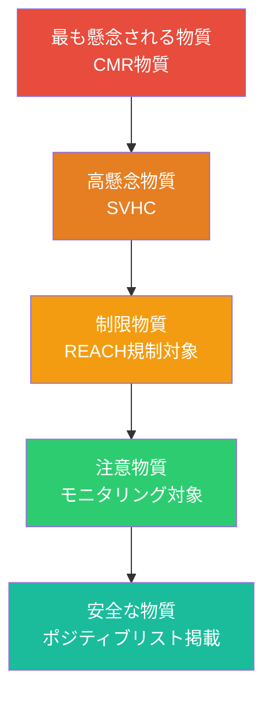
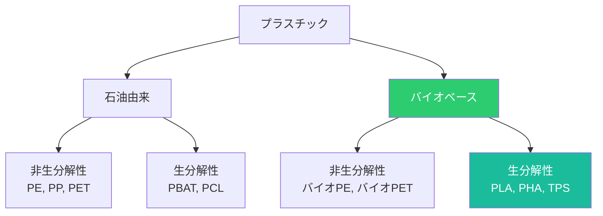
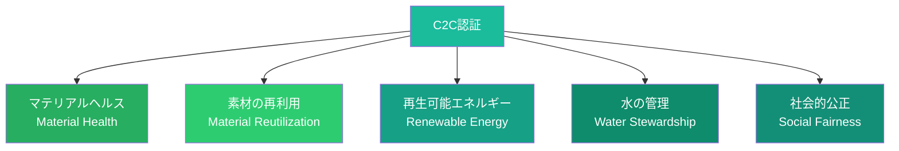

# 第4章 サステナブル素材

**Sustainable Materials**

## はじめに — 素材の選択がすべてを決める

デザイナーが行う無数の意思決定の中で、素材の選択は製品の環境負荷を最も大きく左右する。ある研究によれば、製品の環境影響の80%以上がデザイン段階で決定されるとされ、その中核を成すのが素材の選定である。

2026年現在、EUのデジタルプロダクトパスポート（DPP）制度の拡大、PFAS規制の強化、マイクロプラスチック問題への社会的関心の高まりにより、デザイナーには素材に関するかつてないレベルの知識と判断力が求められている。本章では、素材の健康性評価から認証制度、データベースの活用法まで、サステナブルな素材選定に必要な知識を体系的に学ぶ。

## マテリアルヘルス — 素材の健康性

マテリアルヘルス（Material Health）とは、素材が人間の健康と環境に与える影響を評価する概念である。素材の環境負荷だけでなく、製造者、使用者、そして素材がライフサイクル終了後に還る環境への健康影響を包括的に考慮する。

### 有害化学物質の階層

| 分類 | 説明 | デザイナーの対応 |
|------|------|----------------|
| CMR物質 | 発がん性・変異原性・生殖毒性 | 使用を絶対に避ける |
| SVHC | 高懸念物質（REACH規制） | 代替物質を積極的に探索 |
| 内分泌かく乱物質 | ホルモン系に影響 | BPA、フタル酸エステル等を排除 |
| PBT/vPvB物質 | 難分解性・生体蓄積性・毒性 | PFAS等の使用を回避 |

!!! warning "PFAS問題"
    PFAS（パーフルオロアルキル化合物群）は「永遠の化学物質」と呼ばれ、撥水・撥油性のために広く使用されてきたが、環境中で分解されず生体に蓄積する。2025年以降、EUでは包括的なPFAS規制が進行中であり、デザイナーはPFASフリーの代替素材への移行を急ぐ必要がある。

## リサイクル素材とアップサイクル素材

### リサイクル素材

リサイクル素材の使用は、バージン素材の採掘を削減し、廃棄物を資源に転換する最も直接的な方法である。ただし、すべてのリサイクルが等価ではない。

| リサイクルの種類 | 概要 | 素材品質 | 例 |
|----------------|------|---------|-----|
| メカニカルリサイクル | 物理的に粉砕・溶融して再成形 | 徐々に劣化 | PETボトルからPET繊維 |
| ケミカルリサイクル | 化学的に原料レベルに分解 | バージン同等 | プラスチックの熱分解 |
| クローズドループ | 同等品質の製品に再生 | 維持 | アルミ缶からアルミ缶 |
| オープンループ | 別の製品に転用 | 変動 | タイヤからゴムチップ |

### アップサイクル

アップサイクルは、廃棄物や不要物に新たな価値を付加して、元の素材よりも高い価値を持つ製品に変換するアプローチである。

!!! example "アップサイクルの事例"
    - **Freitag**：トラックの幌（ターポリン）からバッグを製造。廃棄物から一点もののプロダクトを生み出す
    - **Elvis & Kresse**：消防ホースの廃材からラグジュアリーアクセサリーを製造
    - **海洋プラスチック製品**：Parley for the Oceansとadidas の協業による海洋回収プラスチックからのスポーツシューズ

## バイオベースポリマー

バイオベースポリマーは、石油由来ではなく、生物由来の原料（植物、微生物、藻類など）から製造されるプラスチックである。ただし、「バイオベース」と「生分解性」は異なる概念であることに注意が必要である。

### 主要なバイオベースポリマー

| 素材 | 原料 | 生分解性 | 特性 | 用途 |
|------|------|---------|------|------|
| PLA | トウモロコシ、サトウキビ | 産業堆肥化で分解 | 透明、硬質 | パッケージ、3Dプリント |
| PHA | 微生物発酵 | 海洋環境でも分解 | 柔軟〜硬質 | フィルム、容器 |
| TPS | デンプン | 水溶性 | 柔軟 | 緩衝材、フィルム |
| バイオPE | サトウキビエタノール | 非生分解性 | 従来PEと同等 | 容器、フィルム |
| セルロース系 | 木材パルプ | 生分解性 | 透明、柔軟 | テキスタイル、フィルム |

!!! warning "バイオプラスチックの落とし穴"
    バイオベースであることが自動的に「環境に良い」ことを意味するわけではない。原料作物の栽培に伴う土地利用変化、農薬使用、水消費、食料との競合など、ライフサイクル全体での評価が不可欠である。また、PLAは産業堆肥化施設でのみ分解可能であり、自然環境では長期間残留する。

## マテリアルパスポート

マテリアルパスポート（Material Passport）は、製品に含まれるすべての素材の情報を記録・追跡するデジタル文書である。循環型経済において、素材が「どこから来て、何で構成され、どこへ行くべきか」を明確にする仕組みとして注目されている。

### マテリアルパスポートの記録内容

| 情報カテゴリ | 具体的内容 |
|-------------|-----------|
| 素材構成 | 素材の種類、化学組成、重量比率 |
| 原産地 | 原材料の採掘・生産地、サプライチェーン情報 |
| 健康性評価 | 有害物質の有無、安全性データ |
| 循環可能性 | リサイクル方法、分解手順、回収先 |
| 環境負荷 | カーボンフットプリント、LCAデータ |
| 所有・管理情報 | 現在の所有者、メンテナンス履歴 |

EUのデジタルプロダクトパスポート（DPP）制度は、2026年以降、バッテリー、テキスタイル、建設資材など順次対象を拡大し、マテリアルパスポートの提供を法的に義務化していく。デザイナーは、設計段階からこの情報を組み込む習慣を身につける必要がある。

## Cradle to Cradle認証

Cradle to Cradle（C2C）認証は、製品の環境・健康パフォーマンスを5つのカテゴリで総合評価する国際的な認証制度である。

### 5つの評価カテゴリ

認証レベルはBasic、Bronze、Silver、Gold、Platinumの5段階であり、各カテゴリの最低スコアが全体のレベルを決定する（最も低いカテゴリのレベルが全体のレベルとなる）。

!!! info "C2C認証の価値"
    C2C認証は、単なるラベルではなく、製品改善のロードマップとしても機能する。認証取得のプロセスを通じて、サプライチェーン全体の透明性が向上し、具体的な改善目標が明確になる。多くの企業が認証取得を目指す過程で、予想外の有害物質を発見し、代替素材への移行を実現している。

## トキシックフリーデザイン

トキシックフリーデザインは、製品のライフサイクル全体において有害化学物質を排除する設計アプローチである。

### 排除すべき物質群

| 物質群 | 主な用途 | 健康リスク | 代替アプローチ |
|-------|---------|-----------|-------------|
| PFAS | 撥水・撥油加工 | 内分泌かく乱、発がん性 | ワックス系コーティング、シリコーン |
| フタル酸エステル | PVC可塑剤 | 生殖毒性 | クエン酸エステル、バイオベース可塑剤 |
| BPA/BPS | ポリカーボネート、エポキシ | 内分泌かく乱 | トライタン、ガラス |
| 難燃剤（ハロゲン系） | 電子機器、テキスタイル | 発がん性、神経毒性 | リン系難燃剤、構造的防火設計 |
| 重金属（鉛、カドミウム） | 着色、はんだ | 神経毒性、腎臓障害 | 無鉛はんだ、無機顔料 |

### 安全な素材選定のための原則

1. **予防原則**：安全性が確認されるまで、疑わしい物質は使用しない
2. **情報の透明性**：サプライヤーに完全な化学組成の開示を求める
3. **代替物質の評価**：代替物質が「残念な代替」（Regrettable Substitution）にならないよう、代替物質自体のリスク評価も行う
4. **ポジティブリストの活用**：禁止リスト（ネガティブリスト）だけでなく、安全が確認された物質のリスト（ポジティブリスト）を参照する

## 素材データベースの活用

デザイナーがサステナブルな素材選定を行うための実用的なデータベースとリソースを以下に紹介する。

| データベース | 提供元 | 特徴 |
|-------------|-------|------|
| Material ConneXion | Material ConneXion | 8,000以上の先端素材を収録。物理サンプルも閲覧可能 |
| Materiom | Materiom | オープンソースの天然素材レシピ集。自分で素材を作れる |
| Matmatch | Matmatch | 素材のスペック検索と環境データ |
| Granta EduPack | ANSYS | 素材選定のための包括的データベース。教育機関向け |
| Higg MSI | SAC | テキスタイル素材の環境影響を比較するインデックス |
| Pharos | HBN | 建材の化学物質データベース。健康影響情報が充実 |
| HOMOLCA | 産総研 | 日本の素材LCAデータベース |

!!! tip "素材ライブラリーの構築"
    デザイナーは、自分自身の「サステナブル素材ライブラリー」を構築することを推奨する。プロジェクトで検討した素材の物性、環境データ、サプライヤー情報、認証状況を体系的に記録し、蓄積していくことで、素材選定の質と速度が向上する。

## 演習

!!! success "実践演習"

    **演習1：素材の健康性監査（90分）**

    自分の身の回りの製品を5つ選び、各製品に使用されている素材を特定せよ。各素材について以下を調査し、マテリアルヘルス評価表を作成すること。

    - 素材の化学組成（可能な範囲で）
    - 懸念される有害物質の有無
    - リサイクル可能性
    - バイオベース代替素材の存在
    - C2C認証製品での代替の可能性

    **演習2：マテリアルパスポートの作成（120分）**

    自分がデザインした（または身近にある）製品のマテリアルパスポートを作成せよ。素材構成、原産地、健康性評価、循環可能性、環境負荷の各項目について可能な限り詳細に記録すること。情報が不明な箇所は「不明」と記載し、その情報を得るために必要な調査手順も併記すること。

    **演習3：代替素材の比較評価（90分）**

    以下の素材ペアの中から1つを選び、LCAデータ、マテリアルヘルス、循環可能性、機能性の観点で比較評価を行え。

    - 従来PET vs リサイクルPET vs PLA
    - 動物皮革 vs 合成皮革 vs 菌糸体レザー
    - アルミニウム vs バイオプラスチック vs ガラス（飲料容器として）

    単純な「良い/悪い」の二項対立ではなく、用途・コンテクストに応じた最適解を論じること。
