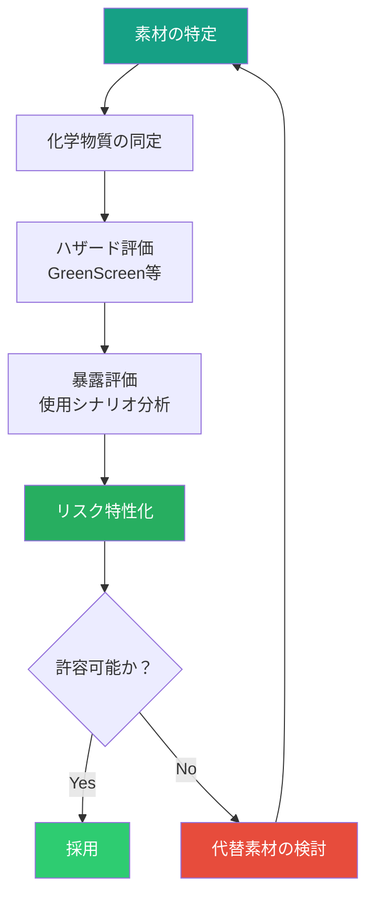
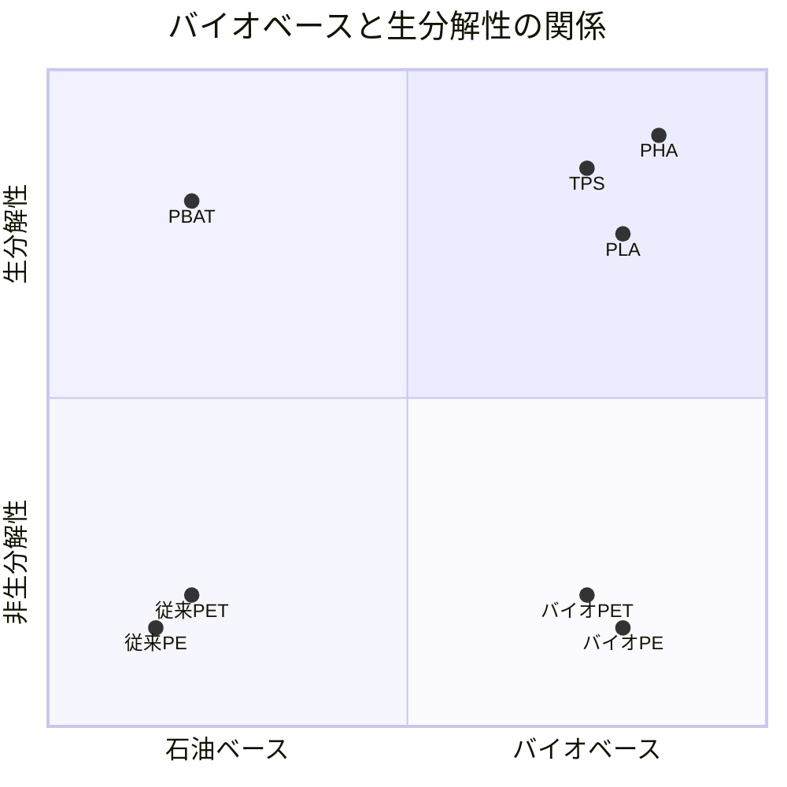
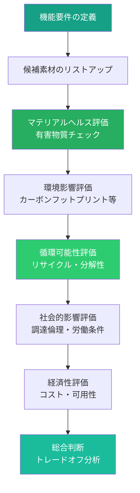

# 第4章 サステナブル素材

**Sustainable Materials**

## はじめに — 素材の選択がすべてを決める

デザインにおいて、素材選択は最も環境影響の大きい意思決定の一つである。ある研究によれば、製品の環境負荷の最大80%が設計段階、とりわけ素材選択の段階で決定されるという。つまり、デザイナーが素材について深い知識を持つことは、サステナブルデザインの実践において決定的に重要である。

本章では、素材の環境・健康影響を評価する方法論から、リサイクル素材・バイオベースポリマーの最新動向、マテリアルパスポートやCradle to Cradle認証の仕組みまで、サステナブルな素材選定に必要な知識を体系的に学ぶ。

## マテリアルヘルス — 素材の健康性

マテリアルヘルスとは、素材が人間の健康と環境の安全性に与える影響を評価する概念である。従来の素材選定が機能性・コスト・審美性を主な基準としていたのに対し、マテリアルヘルスの視点は、素材のライフサイクル全体を通じた毒性・安全性を評価基準に加える。

### 懸念すべき化学物質

デザイナーが特に注意すべき化学物質群を以下に示す。

| 化学物質群 | 用途例 | 健康リスク | 規制動向 |
|-----------|--------|-----------|---------|
| フタル酸エステル | 可塑剤（PVC軟化） | 内分泌かく乱 | REACH規制対象 |
| PFAS（永遠の化学物質） | 撥水加工、防汚加工 | 発がん性、蓄積性 | 各国で規制強化中 |
| 重金属（鉛、カドミウム） | 顔料、安定剤 | 神経毒性、発がん性 | RoHS指令で制限 |
| ホルムアルデヒド | 接着剤、仕上げ材 | 発がん性 | 室内環境基準で規制 |
| BPA/BPS | 樹脂原料、コーティング | 内分泌かく乱 | 食品接触用途で規制 |
| 揮発性有機化合物（VOC） | 塗料、接着剤、溶剤 | 呼吸器への影響 | 排出量規制 |

!!! warning "「BPAフリー」の罠"
    BPAを代替する化学物質（BPS、BPFなど）が、BPAと同等またはそれ以上の内分泌かく乱作用を持つことが研究で示されている。「〇〇フリー」表示に安易に依存せず、代替物質の安全性まで確認する姿勢が重要である。これは「レグレッタブル・サブスティテューション」（後悔する代替）と呼ばれる問題である。

### マテリアルヘルス評価のフレームワーク

## リサイクル素材とアップサイクル素材

### リサイクル素材

リサイクル素材は、使用済み製品や製造工程の端材を再処理して得られる素材である。リサイクル含有率（Recycled Content）は、環境負荷低減の重要な指標となる。

**ポストコンシューマーリサイクル（PCR）** ：消費者が使用した後に回収・再処理された素材。ペットボトルから再生されたrPETなどが代表例。

**ポストインダストリアルリサイクル（PIR）** ：製造工程で発生した端材や不良品を再処理した素材。工場内循環とも呼ばれる。

| 素材タイプ | リサイクル率（世界平均） | 課題 |
|-----------|----------------------|------|
| アルミニウム | 約75% | 品質維持が比較的容易 |
| 鉄鋼 | 約85% | インフラが確立 |
| PETプラスチック | 約30% | ダウンサイクルの問題 |
| 紙・段ボール | 約70% | 繊維の劣化（5-7回が限度） |
| ガラス | 約33% | 色分別の課題 |
| テキスタイル | 約12% | 混紡素材の分離困難 |

### アップサイクル

アップサイクルは、廃棄物や不要物に新たな価値を付与し、元の素材よりも高い価値を持つ製品に変換するプロセスである。リサイクルが素材レベルの再処理であるのに対し、アップサイクルはデザインの力で価値を創造する点が特徴的である。

!!! example "アップサイクルの革新的事例"
    - **Freitag**：トラックの幌、自転車のチューブ、車のシートベルトからメッセンジャーバッグを製造
    - **Elvis & Kresse**：廃棄された消防ホースからラグジュアリーなバッグや財布を製造
    - **Pentatonic**：スマートフォンのスクリーンガラスから家具を製造
    - **海洋プラスチック製品**：海洋回収プラスチックからサングラスフレーム（Norton Point）やスニーカー（Adidas x Parley）を製造

## バイオベースポリマー

バイオベースポリマーは、石油由来ではなく、植物や微生物などの生物資源を原料とするプラスチックである。

### 主要なバイオベースポリマー

| ポリマー | 原料 | 特性 | 用途例 |
|---------|------|------|--------|
| PLA（ポリ乳酸） | トウモロコシ、サトウキビ | 透明、硬質、産業堆肥化可能 | 食品容器、3Dプリント |
| PHA（ポリヒドロキシアルカノエート） | 微生物発酵 | 海洋生分解性 | パッケージ、農業フィルム |
| バイオPE | サトウキビ由来エタノール | 従来PEと同等性能 | 容器、フィルム |
| TPS（熱可塑性でんぷん） | でんぷん | 低コスト、水溶性 | 使い捨て食器、緩衝材 |
| セルロース系 | 木材パルプ | 透明フィルム化可能 | 包装、テキスタイル |

!!! warning "「バイオ」と「生分解性」は同義ではない"
    バイオベースであることと生分解性であることは、全く別の属性である。バイオPEはサトウキビ由来だが、化学構造は石油由来PEと同一であり、自然環境では分解されない。逆に、石油由来のPBATは生分解性を持つ。デザイナーは、この区別を正確に理解した上で素材を選定する必要がある。

## マテリアルパスポート

マテリアルパスポートは、製品に使用されているすべての素材と化学物質の情報を記録したデジタル文書である。「素材の身分証明書」とも呼ばれ、循環型経済の実現に不可欠なインフラとして注目されている。

### マテリアルパスポートの記載事項

- 素材の種類と化学組成
- 原産地とサプライチェーン情報
- 有害物質の有無と含有量
- リサイクル可能性と分解方法
- 環境影響データ（カーボンフットプリント等）
- 認証情報

EUのデジタルプロダクトパスポート（DPP）制度は、2025年から段階的に施行されており、バッテリー、テキスタイル、建設資材などの製品カテゴリにおいて、素材情報の開示が義務化されつつある。デザイナーは、この制度への対応を設計段階から組み込む必要がある。

## Cradle to Cradle認証

Cradle to Cradle（C2C）認証は、製品の循環性と安全性を包括的に評価する国際認証制度である。C2C Products Innovation Instituteが運営し、以下の5つのカテゴリで評価を行う。

| 評価カテゴリ | 評価内容 |
|------------|---------|
| マテリアルヘルス | 使用素材の人体・環境への安全性 |
| マテリアル・リユース | 素材の循環可能性（リサイクル、堆肥化等） |
| 再生可能エネルギーとカーボンマネジメント | 製造時のエネルギー源と気候変動影響 |
| 水スチュワードシップ | 水資源の使用と水質への影響 |
| 社会的公正性 | サプライチェーンにおける労働条件と人権 |

認証レベルはブロンズ、シルバー、ゴールド、プラチナの4段階であり、総合評価は最も低いカテゴリのレベルに準じる。

## トキシックフリーデザイン

トキシックフリーデザインは、製品のライフサイクル全体を通じて有害化学物質を排除する設計アプローチである。

### 有害物質排除の優先順位

1. **排除（Eliminate）**：有害物質を使用しない設計を最優先する
2. **代替（Substitute）**：より安全な代替物質に置き換える
3. **制御（Control）**：使用が不可避な場合、暴露を最小化する仕組みを設計する

!!! tip "グリーンケミストリーの12原則"
    アメリカ化学会が提唱する「グリーンケミストリーの12原則」は、化学物質の設計・製造・使用における環境配慮の指針である。デザイナーが化学者ではなくとも、これらの原則の概要を理解することで、素材選定時の対話力が向上する。特に「予防原則」「原子効率」「低毒性の化学合成」は、デザイン判断に直結する概念である。

## 素材データベースの活用

デザイナーがサステナブルな素材を効率的に探索・評価するためのリソースを以下に紹介する。

| データベース | 特徴 | アクセス |
|------------|------|---------|
| **Material ConneXion** | 8,000以上の先端・サステナブル素材 | 有料会員制 |
| **Materiom** | オープンソースのバイオマテリアル・レシピ | 無料 |
| **HIGG Materials Sustainability Index** | テキスタイル素材の環境影響評価 | SAC会員 |
| **Granta EduPack（Ansys）** | 素材属性の包括的データベース | 教育機関向け |
| **Pharos / Building Product Disclosure** | 建材の化学物質・健康情報 | 無料/有料 |
| **Cradle to Cradle Material Health Database** | C2C評価済み化学物質リスト | 登録制 |

## 素材選定のフレームワーク

サステナブルな素材選定のための統合的な評価フレームワークを提案する。

この評価プロセスにおいて重要なのは、単一の指標に依存しないことである。カーボンフットプリントが低くても有害物質を含む素材、リサイクル可能だが調達過程で人権侵害がある素材など、トレードオフは常に存在する。デザイナーは、複数の評価軸を横断的に検討し、プロジェクトの文脈に応じた最適なバランスを見つける必要がある。

## 演習

!!! success "実践演習"

    **演習1：素材の健康性監査（90分）**

    自分が日常的に使用する製品を5つ選び、それぞれの主要素材を特定せよ。各素材について、懸念すべき化学物質の有無をPharosまたはSkin Deep（EWG）データベースで調査し、リスク評価表を作成すること。

    **演習2：サステナブル素材の比較表（120分）**

    特定の製品カテゴリ（例：飲料容器、スマートフォンケース、椅子）について、従来素材とサステナブル代替素材の比較表を作成せよ。以下の項目を含むこと。
    - 機能性（強度、耐久性、耐熱性等）
    - 環境影響（カーボンフットプリント、水使用量）
    - マテリアルヘルス（有害物質リスク）
    - 循環可能性（リサイクル率、生分解性）
    - コストと可用性

    **演習3：マテリアルパスポートの作成（90分）**

    自分がデザインした（またはデザイン中の）製品について、マテリアルパスポートを作成せよ。素材の種類、化学組成、原産地、分解方法、リサイクル手順を含む文書をまとめること。

    **演習4：素材ライブラリーの構築（継続的プロジェクト）**

    物理的な素材サンプルライブラリーを構築し始めよ。サステナブル素材のサンプルを収集し、各サンプルに素材名、原料、特性、環境影響データのカードを添付すること。Materiomのレシピを用いたバイオマテリアルの自作サンプルも含めること。
