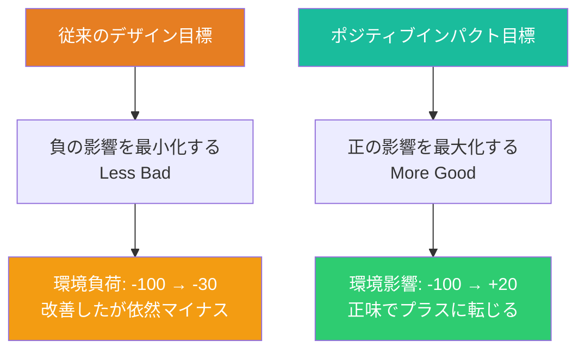
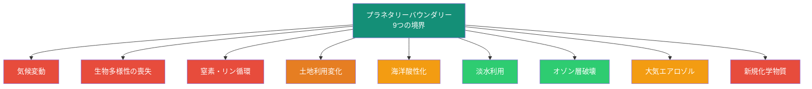

# 第5章 リジェネラティブデザイン

**Regenerative Design**

## はじめに — 「害を減らす」から「積極的に再生する」へ

サステナビリティ（持続可能性）は、本質的には「これ以上悪化させない」という概念である。現状を維持すること、つまり劣化のスピードをゼロにすることが目標となる。しかし、すでに劣化が進行した地球環境において、「現状維持」は十分な目標であろうか。

リジェネラティブデザイン（再生型デザイン）は、この問いに対する回答である。持続可能性の「害を減らす」というアプローチを超えて、「積極的に再生し、修復し、豊かにする」ことを目指す。デザインの成果が、生態系を回復させ、コミュニティを活性化し、土壌を肥沃にし、生物多様性を増大させる。つまり、人間の活動が自然に対してネットポジティブ（正味の正の影響）を生み出す状態を創出することが、リジェネラティブデザインの目標である。

## サステナビリティからリジェネレーションへのスペクトラム

環境に対するデザインの姿勢は、段階的なスペクトラムとして理解できる。

| 段階 | 目標 | デザインの姿勢 |
|------|------|--------------|
| 破壊的 | 利益最大化（外部不経済を無視） | 環境を資源としてのみ扱う |
| 従来型 | 法規制の遵守 | 最低限の環境基準を満たす |
| グリーン | 環境負荷の削減 | エコ効率の改善を追求する |
| サステナブル | 環境負荷をゼロに近づける | 劣化を止める |
| リストラティブ | 過去の損傷を修復する | 失われたものを取り戻す |
| リジェネラティブ | 生命システムを進化・繁栄させる | 共に栄える条件を創出する |

!!! info "ビル・リードのリジェネラティブ開発フレームワーク"
    建築家ビル・リードは、リジェネラティブ開発を「場所と人間の共進化」として定義した。リジェネラティブデザインは技術的な解決策ではなく、人間と自然が相互に利益を得る関係性を設計することである。この視点では、デザイナーの役割は「問題を解決する人」から「生きたシステムの共創者」へと変容する。

## リジェネラティブ建築

建築は、人間活動の中で最大の環境負荷を生み出す分野の一つである。世界のCO2排出量の約40%、資源消費の約50%が建築関連であるとされる。それゆえ、リジェネラティブ建築のインパクトは計り知れない。

### リジェネラティブ建築の原則

1. **場所の固有性**：その土地の気候、生態系、文化、歴史に深く根ざした設計を行う
2. **エネルギーポジティブ**：消費する以上のエネルギーを生産する
3. **ウォーターポジティブ**：使用する以上の水を浄化・涵養する
4. **カーボンネガティブ**：排出する以上のCO2を吸収・固定する
5. **生物多様性の増大**：建設前よりも豊かな生態系を創出する
6. **コミュニティの活性化**：地域の社会的結束と経済的活力を高める

### 事例：リビング・ビルディング・チャレンジ

国際リビングフューチャー研究所が運営する「リビング・ビルディング・チャレンジ」（Living Building Challenge）は、世界で最も厳格な建築環境性能基準である。7つの「花弁」（Petals）で構成される。

| 花弁 | 要件 | 基準 |
|------|------|------|
| 場所 | 生態系の修復 | ブラウンフィールドの再生、生息地の回復 |
| 水 | ネットゼロウォーター | 雨水・排水の100%処理・再利用 |
| エネルギー | ネットゼロエネルギー | 年間消費量の105%以上を再生可能エネルギーで生産 |
| 健康と幸福 | 人間の健康促進 | 自然光、新鮮な空気、バイオフィリックデザイン |
| 素材 | レッドリスト物質の排除 | 有害化学物質を含まない建材の使用 |
| 公正 | 社会的公正 | 万人のアクセス、公平な労働条件 |
| 美 | 美と精神の向上 | 場所の精神を表現する美的品質 |

## ポジティブインパクトデザイン

ポジティブインパクトデザインは、製品・サービス・システムが環境と社会に「正味の正の影響」を生み出すことを目指す設計アプローチである。

### ネットポジティブの考え方

### ポジティブインパクトの設計手法

**カーボンポジティブ設計**：製品のライフサイクルで排出されるCO2より多くのCO2を吸収する設計。例えば、木造建築はCO2を炭素として固定し、コンクリート建築を上回る気候便益を生み出す可能性がある。

**バイオフィリックデザイン**：人間の自然への親和性（バイオフィリア）に基づき、自然の要素を設計に統合する。植生、自然光、水、自然素材の導入により、居住者の健康と幸福を向上させると同時に、都市の生態系サービスを増大させる。

**ソーシャルポジティブ設計**：製品やサービスが、使用されることでコミュニティの社会関係資本を増大させる。共有経済のプラットフォーム、コミュニティガーデンの設計、世代間交流を促す公共空間などが例として挙げられる。

## 生態系の回復を通じたデザイン

デザインは、劣化した生態系を回復する強力なツールとなりうる。

### デザインによるエコシステム・レストレーション

| 分野 | アプローチ | 事例 |
|------|-----------|------|
| 都市緑化 | グリーンインフラの設計 | シンガポールのスーパーツリー（Gardens by the Bay） |
| 水域再生 | 湿地帯の設計・復元 | ニューヨーク市のハンターズポイント・サウスパーク |
| 土壌回復 | コンポスト・システムの設計 | サンフランシスコの都市コンポストプログラム |
| 受粉者支援 | ポリネーター・ガーデンの設計 | 都市養蜂と花粉媒介者回廊の設計 |
| 海洋再生 | 人工リーフの設計 | 3Dプリント珊瑚礁構造体 |

!!! example "Biorock技術 — 電気で珊瑚礁を再生する"
    Biorock技術は、海中に設置した金属構造体に微弱な電流を流すことで、海水中のミネラルが構造体に堆積し、珊瑚の着生と成長を促進する。デザインされた構造体の形状が、海洋生態系の回復を左右する。これは、デザインが生態系再生の直接的手段となる好例である。

## 先住民族のデザイン知恵

リジェネラティブデザインの議論において、先住民族が何千年にもわたって培ってきたデザインの知恵は、見過ごすことのできない知識体系である。西洋近代のデザインが「自然を征服する」パラダイムの中で発展してきたのに対し、先住民族のデザインは「自然の一部として共に生きる」パラダイムに基づいている。

### 先住民族のデザイン原則

**七世代の原則（Seventh Generation Principle）**：北米先住民のハウデノショーニー連邦に由来する意思決定原則。あらゆる決定は、7世代先（約175年後）の子孫への影響を考慮して行うべきとする。この時間軸は、現代のデザインにおける「サステナビリティ」の概念をはるかに超えている。

**相互関係性（Reciprocity）**：自然から何かを受け取る際には、必ず何かを返す。この互恵の原則は、一方的な資源搾取を前提とする近代的生産モデルの根本的な対極にある。

**場所との関係性（Place-based Relationship）**：特定の場所の生態系、季節のリズム、固有の素材と深く結びついたデザイン。グローバルに均質化されたデザインではなく、場所の固有性を尊重するローカルなデザインの源泉となる。

!!! warning "文化的搾取への注意"
    先住民族の知識をデザインに「活用」する際には、文化的搾取（Cultural Appropriation）のリスクに十分な配慮が必要である。知識の出典を明示し、当該コミュニティとの対等なパートナーシップを構築し、利益の公正な分配を確保することが求められる。「インスピレーションを得る」ことと「搾取する」ことの境界を常に意識しなければならない。

## プラネタリーバウンダリー

ストックホルム・レジリエンスセンターのヨハン・ロックストロームらが提唱した「プラネタリーバウンダリー」（惑星の限界）は、地球システムの安定性を維持するための9つの境界線を定義している。

2026年現在、9つの境界のうち6つがすでに超過されている（赤・橙で表示）。特に生物多様性の喪失と窒素・リン循環は安全域を大幅に超えている。

### デザインとプラネタリーバウンダリー

| 境界 | 現状 | デザインの貢献可能性 |
|------|------|-------------------|
| 気候変動 | 超過 | 低炭素素材選択、エネルギー効率設計、カーボンポジティブ設計 |
| 生物多様性 | 大幅超過 | 生息地を創出する設計、生態系回廊の設計 |
| 窒素・リン | 大幅超過 | 閉鎖系栄養循環の設計、コンポスト・システム |
| 土地利用 | 超過 | コンパクトな設計、既存空間の再活用 |
| 新規化学物質 | 超過 | トキシックフリー設計、安全な化学物質の選択 |
| 淡水利用 | 安全域内 | 水効率の高い製品・プロセスの設計 |

!!! tip "ドーナツ経済学との統合"
    経済学者ケイト・ラワースの「ドーナツ経済学」は、プラネタリーバウンダリー（外側の環）と社会的基盤（内側の環）の間にある「安全で公正な空間」で人類が繁栄するモデルを提唱する。リジェネラティブデザインは、このドーナツの内側に人間の活動を収めながら、両方の境界を積極的に改善することを目指す。アムステルダム市が2020年にドーナツ経済学を都市戦略として公式採用し、都市デザインの指針としている事例は参考に値する。

## リジェネラティブ・マインドセット

リジェネラティブデザインは、手法やツールの問題以前に、デザイナーのマインドセット（心の在り方）の変革を求める。

**機械論的世界観から生命論的世界観へ**：世界を部品の集合体（機械）として見るのではなく、相互に依存する生きたシステム（生態系）として見る。デザインの対象も、孤立した製品ではなく、関係性のネットワークとして捉える。

**分離から統合へ**：人間と自然を分離された存在として扱うのではなく、人間を自然の一部として位置づける。デザインは自然の「ためにする」ものではなく、自然の「一部として行う」ものとなる。

**効率から生命力へ**：最小の投入で最大の産出を得る「効率」の追求から、システム全体の生命力（Vitality）と回復力（Resilience）を高める方向へ。冗長性や多様性は「無駄」ではなく、生命システムの本質的な強さである。

## 演習

!!! success "実践演習"

    **演習1：リジェネラティブ評価スペクトラム（60分）**

    自分が関わったデザインプロジェクト（または身近な製品・サービス）を1つ選び、本章冒頭のスペクトラム（破壊的〜リジェネラティブ）上に位置づけよ。現在の位置から「リジェネラティブ」方向へ移動させるために必要な変更を、具体的に5つ以上提案すること。

    **演習2：七世代デザインブリーフ（90分）**

    現在取り組んでいる（または架空の）デザインプロジェクトについて、「七世代の原則」を適用したデザインブリーフを作成せよ。175年後の世界において、そのデザインがどのような影響を残しているかを想像し、それに基づいて現在のデザイン要件を再定義すること。

    **演習3：プラネタリーバウンダリー・デザイン監査（120分）**

    特定の製品カテゴリ（例：衣服、食器、家具、電子機器）を選び、その製品が9つのプラネタリーバウンダリーのそれぞれにどのような影響を与えているかを分析せよ。各境界に対して、「害を減らす」改善と「積極的に再生する」改善の両方を提案し、リジェネラティブデザインの具体的な道筋を示すこと。

    **演習4：地域のリジェネラティブデザイン提案（チームワーク、3時間）**

    自分が住む地域の劣化した場所（空き地、汚染地、衰退した商店街など）を1つ選び、リジェネラティブデザインの原則に基づいた再生提案を作成せよ。生態系の回復、コミュニティの活性化、経済的持続可能性の3つの側面を統合した提案とすること。地域の歴史、文化、固有の生態系についてのリサーチを必ず含めること。
