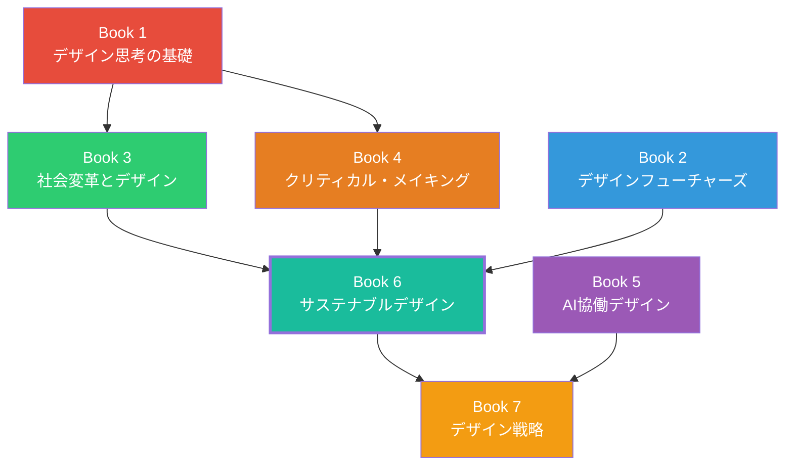

# Book 6: サステナブルデザイン

**Sustainable Design**

## 本書について

気候変動、生物多様性の喪失、資源の枯渇。2026年の今、これらの課題はもはや「将来の懸念」ではなく、デザインの現場が日々直面する現実である。サステナビリティは、デザインにおけるオプションではなく、必須の基準となった。

本書『サステナブルデザイン』は、デザイナーカリキュラム全7巻の第6巻として、環境・社会・経済の持続可能性をデザインプロセスの中核に据える方法論を体系的に学ぶものである。単に「環境に優しい」素材を選ぶという表層的なアプローチではなく、サーキュラーエコノミー、ライフサイクル思考、バイオデザイン、リジェネラティブデザインといった構造的な枠組みを通じて、デザインが地球と社会に与えるインパクトを根本から変革する力を身につける。

2024年のEU企業サステナビリティ報告指令（CSRD）の全面施行、2025年のデジタルプロダクトパスポート制度の拡大を経て、デザイナーにはこれまで以上に環境配慮を定量的に示す能力が求められている。本書は、そうした制度的要請にも応えうる実践的知識を提供する。

## 学習目標

本書を通じて、読者は以下の能力を獲得する。

| 目標 | 内容 | 対応章 |
|------|------|--------|
| **サーキュラーエコノミーの理解** | 線形経済から循環型経済への移行を理解し、循環型デザインの原則を適用できる | 第1章 |
| **ライフサイクル評価の実践** | 製品・サービスの環境負荷をライフサイクル全体で評価し、改善提案ができる | 第2章 |
| **バイオデザインの応用** | 生物に学ぶデザイン手法を理解し、バイオマテリアルの可能性を探索できる | 第3章 |
| **サステナブル素材の選定** | 素材の環境・健康影響を評価し、適切な素材選定ができる | 第4章 |
| **リジェネラティブ思考の獲得** | 持続可能性を超えた再生型デザインの概念を理解し、実践に組み込める | 第5章 |

## 対象読者

- サステナビリティをデザイン実践に統合したいプロダクトデザイナー
- 環境配慮型の設計を学びたい大学生・大学院生
- ESG・サステナビリティ戦略にデザインを活用したいビジネスリーダー
- 素材選定やLCAの基礎を習得したいエンジニア・設計者
- 循環型ビジネスモデルを構築したい起業家

!!! note "前提知識"
    Book 1『デザイン思考の基礎』およびBook 3『社会変革とデザイン』の内容を前提とする。特にBook 1の人間中心設計とBook 3のシステム思考の概念が本書の基盤となる。自然科学の専門知識は不要だが、環境問題への基本的な関心があると学びが深まる。

## 章構成

### [第1章 サーキュラーエコノミー入門](ch01-circular-economy.md)

線形経済（Take-Make-Waste）から循環型経済への転換を理解する。エレン・マッカーサー財団のフレームワークを中心に、循環型デザインの原則、プロダクト・アズ・ア・サービス、生物的・技術的サイクルの概念を学ぶ。

### [第2章 ライフサイクルアセスメント](ch02-lifecycle-assessment.md)

製品やサービスの環境負荷をライフサイクル全体で定量的に評価する方法論を習得する。カーボンフットプリントの算出、環境影響カテゴリの理解、デザイナー向けLCAツールの活用法を学ぶ。

### [第3章 バイオデザイン](ch03-bio-design.md)

自然界の仕組みに学ぶバイオミミクリーから、菌糸体素材、藻類ベースのデザイン、合成生物学まで、生物とデザインの交差点を探索する。自然を「メンター・モデル・メジャー」として活用する方法を学ぶ。

### [第4章 サステナブル素材](ch04-sustainable-materials.md)

素材の健康性評価、リサイクル・アップサイクル素材、バイオベースポリマー、マテリアルパスポート、Cradle to Cradle認証など、サステナブルな素材選定に必要な知識と判断基準を体系的に学ぶ。

### [第5章 リジェネラティブデザイン](ch05-regenerative-design.md)

「害を減らす」持続可能性から「積極的に再生する」リジェネラティブデザインへの進化を探る。生態系の回復、先住民族のデザイン知恵、プラネタリーバウンダリーの概念を通じて、デザインの新たな地平を拓く。

## 学習の進め方

!!! tip "推奨学習ペース"
    各章に1〜2週間をかけ、約2.5ヶ月で本書全体を修了することを推奨する。各章末の演習には実際の素材やツールを使った実践が含まれるため、十分な時間を確保してほしい。

1. **通読** — まず各章を最初から最後まで読み通す
2. **事例の深掘り** — 本文中のケーススタディについて自分で追加調査を行う
3. **演習の実施** — 章末の演習に取り組む（実際のプロジェクトへの適用を強く推奨）
4. **定量化の練習** — LCAやカーボンフットプリントの計算を実際に行う
5. **振り返りと共有** — 学んだ概念をチームメンバーやコミュニティと議論する

## 本書と他巻との関係

本書は、Book 3『社会変革とデザイン』で学んだシステム思考を環境・生態系の文脈に拡張するものである。また、Book 2『デザインフューチャーズ』で培った長期的視野が、ライフサイクル思考やリジェネラティブデザインの理解を深める。本書の知識は、Book 7『デザイン戦略』における統合的なプロジェクト実践の基盤となる。
