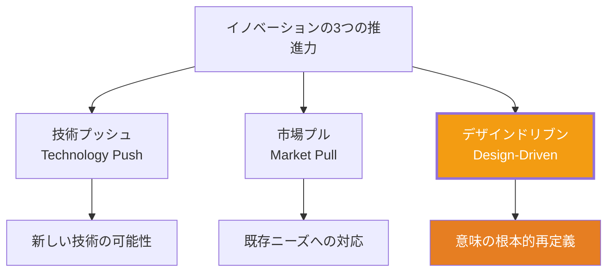
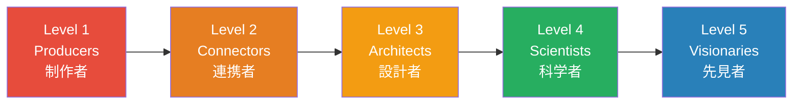
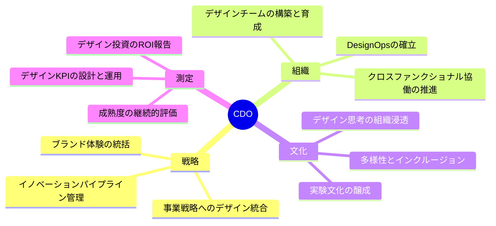

# 第1章 デザイン経営

**Design Management — デザインを経営の中核に据える**

## はじめに

「デザインは経営の問題である」。この命題は、もはや先進的な主張ではなく、グローバルビジネスにおける常識となりつつある。2018年に経済産業省が発表した「デザイン経営宣言」は、日本においてもデザインと経営の統合が国策レベルで推進されるきっかけとなった。2026年現在、デザイン経営の実践は深化し、その成果を定量的に測定するフレームワークも成熟してきている。

本章では、デザインが経営に与えるインパクトを理解し、組織のデザイン成熟度を評価し、デザインの投資対効果を経営層に説明できる能力を養う。

## デザインドリブン・イノベーション

ロベルト・ベルガンティが提唱した「デザインドリブン・イノベーション」は、市場調査や技術主導ではなく、**意味のイノベーション**を中心に据えるアプローチである。

任天堂Wiiは、技術的に劣るハードウェアで市場を席巻した。それは「ゲームとは何か」という意味そのものを再定義したからである。同様に、Appleは製品を通じて「テクノロジーとの関係性」の意味を常に更新し続けている。

!!! example "意味のイノベーションの実例"
    Yankee Candle社は「キャンドルとは照明器具である」という既存の意味を、「キャンドルとは空間の雰囲気を演出するものである」と再定義し、照明としての機能が不要な現代においてもキャンドル市場を拡大させた。これがデザインドリブン・イノベーションの本質である。

## デザイン成熟度モデル

組織のデザイン能力を評価し、成長の方向性を定めるために、デザイン成熟度モデルが活用される。代表的なモデルとして、デンマーク・デザインセンターの「デザインラダー」とInVisionの「デザイン成熟度モデル」がある。

### デザインラダー

| レベル | 名称 | 特徴 |
|--------|------|------|
| **Level 1** | ノンデザイン | デザインが意識的に活用されていない |
| **Level 2** | スタイリングとしてのデザイン | 見た目の装飾に限定 |
| **Level 3** | プロセスとしてのデザイン | 問題解決の方法論として統合 |
| **Level 4** | 戦略としてのデザイン | 経営戦略の中核に位置づけ |

!!! warning "成熟度の罠"
    多くの組織がLevel 2からLevel 3への移行で停滞する。その原因は、デザインプロセスの導入が「手法の導入」に留まり、意思決定プロセスそのものを変革しないためである。デザイン成熟度の向上は、組織文化の変革と不可分である。

### InVision デザイン成熟度モデル

InVisionの調査（2019年、2,200以上の組織対象）は、デザイン成熟度を5段階で定義し、成熟度の高い組織が収益性・市場投入速度・顧客満足度の全てで優位であることを示した。

## デザインのROI（投資対効果）

デザインの価値を経営層に伝えるには、定量的なエビデンスが不可欠である。

### McKinsey Design Index（MDI）

McKinseyが2018年に発表したMDI調査は、300社以上を5年間追跡し、デザインへの投資と企業業績の相関を実証した画期的な研究である。

**主要な発見：**

- 上位25%のMDIスコアを持つ企業は、業界平均を**2倍**上回る収益成長率を達成
- デザイン投資は売上高成長と総株主リターン（TSR）の両方に相関
- 4つのデザインアクション（分析的リーダーシップ、クロスファンクショナルな才能、継続的イテレーション、ユーザー体験）が業績に寄与

| MDIアクション | 内容 | 経営への影響 |
|---------------|------|-------------|
| **分析的リーダーシップ** | デザインを経営指標で測定する | 意思決定の客観性向上 |
| **クロスファンクショナルな才能** | デザインを全部門に浸透させる | サイロの解消 |
| **継続的イテレーション** | ユーザーテストを開発全工程に組み込む | リスク低減・品質向上 |
| **ユーザー体験** | 物理・デジタル・サービスを統合した体験設計 | 顧客ロイヤルティ向上 |

!!! tip "経営層への説得術"
    デザインの価値を経営層に訴求する際は、「デザインは重要です」という抽象的な主張ではなく、MDIのような実証データを提示した上で、**自社における具体的な改善機会**を示すことが効果的である。「競合A社はデザイン成熟度Level 4で、顧客維持率が当社より15%高い」といった比較可能な文脈を構築すべきである。

## CDO（Chief Design Officer）の役割

CDOは、デザインを経営の意思決定に統合する最高責任者である。2026年現在、CDOの役割は以下のように多面的に定義される。

## デザインKPIの設計

デザインの成果を測定するKPI（重要業績評価指標）は、アウトプット指標とアウトカム指標を組み合わせて設計する。

**アウトプット指標（プロセスの効率）：**

- デザインサイクルタイム（コンセプトからリリースまで）
- ユーザーテスト実施回数
- デザインシステムコンポーネントの再利用率
- プロトタイプのイテレーション回数

**アウトカム指標（ビジネスへの影響）：**

- NPS（Net Promoter Score）/ 顧客満足度
- タスク成功率・エラー率
- コンバージョン率の変化
- サポートチケット数の減少
- 顧客生涯価値（CLV）の向上

!!! note "バランススコアカードの活用"
    デザインKPIは、カプラン＆ノートンのバランススコアカード（財務・顧客・内部プロセス・学習と成長の4視点）に沿って構造化することで、経営チームとの共通言語を持ちやすくなる。

## デザイン思考とCスイート

デザイン思考をCスイート（最高経営幹部層）に浸透させるには、以下の3つのアプローチが有効である。

1. **体験型ワークショップ** — 経営幹部が自らユーザーリサーチやプロトタイピングを体験する場を設ける。PepsiCoのCEOインドラ・ヌーイーがデザイン思考を全幹部に体験させた事例は、組織文化変革の好例である。

2. **デザインレビューの制度化** — Appleのように、経営会議にデザインレビューを定例化する。デザインの成果物が経営判断の材料として定期的に可視化される仕組みを作る。

3. **パイロットプロジェクトの成功** — 小規模な成功事例を積み重ね、デザインのビジネスインパクトを実証する。IBMのデザイン思考導入は、最初のパイロットチームの成功が全社展開の起爆剤となった。

## 日本におけるデザイン経営の現在

2018年の「デザイン経営宣言」以降、日本企業のデザイン経営は着実に進展している。

| 企業 | 取り組み | 成果 |
|------|----------|------|
| **ソニー** | クリエイティブセンターの経営直轄化 | ブランド価値の再構築 |
| **メルカリ** | デザイン組織の早期構築 | UXを競争優位の源泉に |
| **パナソニック** | FUTURE LIFE FACTORY設立 | 長期ビジョン駆動型開発 |
| **良品計画** | アドバイザリーボードにデザイナー起用 | 哲学に基づく一貫した体験 |

!!! example "デザイン経営宣言の2つの条件"
    経済産業省・特許庁「デザイン経営宣言」は、デザイン経営の必要条件として以下の2つを定義した。(1) 経営チームにデザイン責任者がいること。(2) 事業戦略の最上流からデザインが関与すること。この2条件を満たすことが、デザイン経営の出発点である。

---

## 演習

### 演習1：自組織のデザイン成熟度評価
デザインラダーまたはInVisionの成熟度モデルを用いて、自分が所属する（またはよく知る）組織のデザイン成熟度を評価せよ。現在のレベルと、次のレベルに到達するための具体的なアクションを3つ以上提案すること。

### 演習2：デザインKPIダッシュボードの設計
架空のSaaS企業のデザインチーム向けに、アウトプット指標3つとアウトカム指標3つを含むKPIダッシュボードを設計せよ。各指標について、測定方法、目標値、報告頻度を定義すること。

### 演習3：経営層向けデザイン投資提案書
McKinsey Design Indexのデータを引用し、自社（または架空の企業）におけるデザイン投資の拡大を提案する1ページの提案書を作成せよ。定量的なエビデンスと期待されるビジネスインパクトを含めること。
