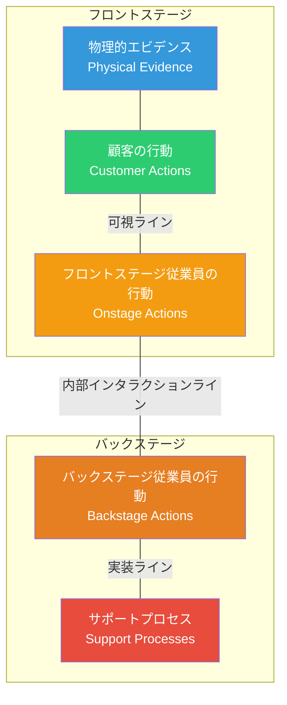
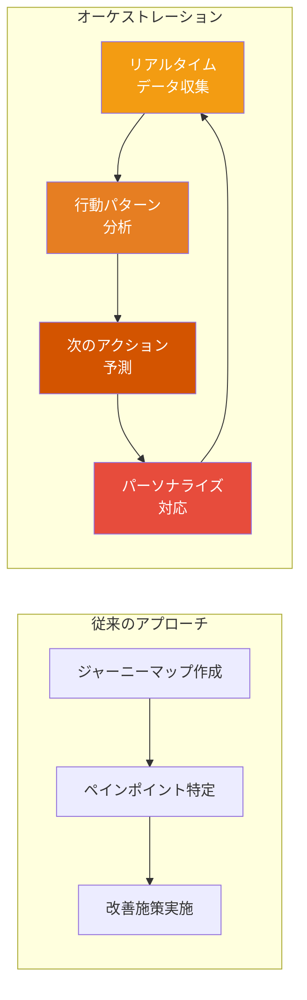
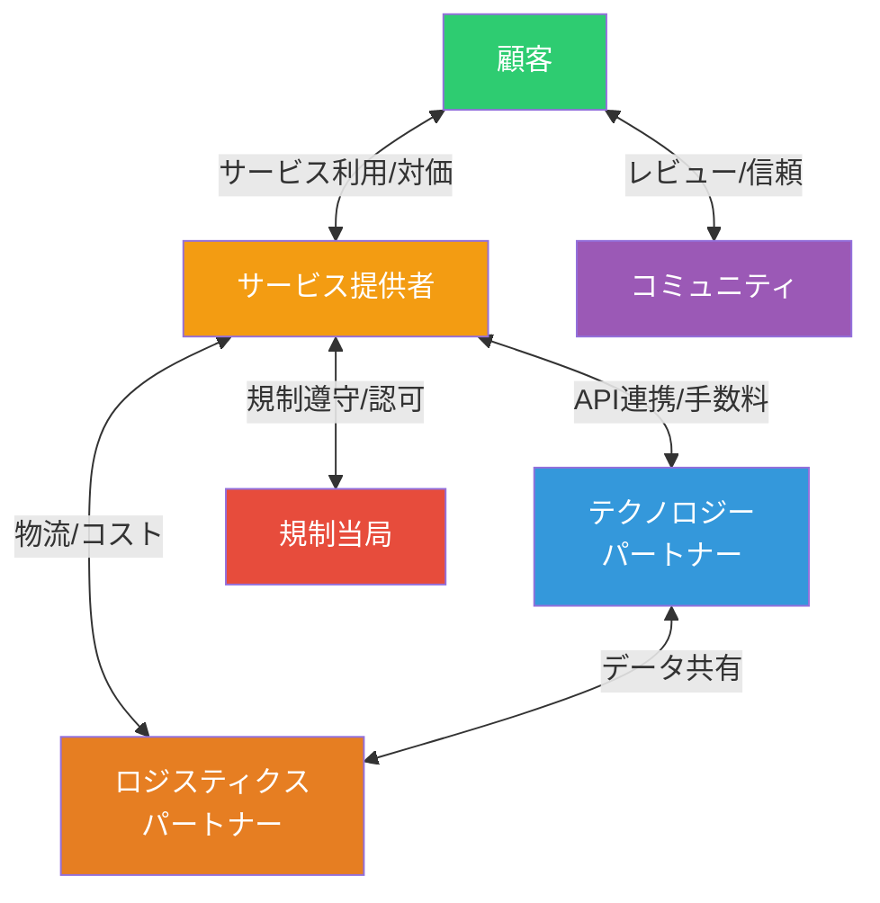

# 第2章 サービスデザイン

**Service Design — 体験の全体像を設計する**

## はじめに

製品とサービスの境界が消滅しつつある現代において、「もの」をデザインするだけでは十分ではない。顧客がサービスと出会い、利用し、離脱するまでの全プロセス、そしてそれを支えるバックステージのオペレーション全体を設計する能力が求められている。これが**サービスデザイン**である。

サービスデザインは、Book 1で学んだ人間中心設計を「点」から「線」へ、さらに「面」へと拡張する方法論である。本章では、サービスブループリントを中心とした実践手法を体系的に習得する。

## サービスデザインの原則

サービスデザインネットワークが定義する5つの原則は、実践の指針となる。

| 原則 | 説明 |
|------|------|
| **人間中心** | 全てのステークホルダーの体験を考慮する |
| **協働的** | 多様な背景を持つステークホルダーと共に設計する |
| **反復的** | 探索・改善・実験のサイクルを繰り返す |
| **連続的** | 相互に関連するアクションの連なりとして可視化する |
| **リアル** | 物理的なエビデンスでリサーチし、プロトタイプで検証する |

!!! note "プロダクトデザインとの違い"
    プロダクトデザインが「もの」の最適化に焦点を当てるのに対し、サービスデザインは「時間軸に沿った体験の連鎖」と「フロントステージとバックステージの統合」を設計対象とする。スマートフォンアプリの画面設計はプロダクトデザインだが、予約から来店、サービス提供、アフターフォローまでの一連の体験設計がサービスデザインである。

## サービスブループリント

サービスブループリントは、サービスデザインの最も重要なツールである。1984年にG. Lynn Shostackが提唱したこの手法は、顧客体験とそれを支える組織プロセスを一枚の図で可視化する。

### ブループリントの5つのレイヤー

**各ラインの意味：**

- **可視ライン（Line of Visibility）** — 顧客に見える部分と見えない部分を区切る境界
- **内部インタラクションライン** — 顧客接点を持つ従業員と持たない従業員の境界
- **実装ライン** — 人的プロセスとシステム・技術基盤の境界

!!! example "病院の外来受診ブループリント"
    物理的エビデンス：病院の外観、待合室、診察室、処方箋。顧客の行動：予約、来院、受付、待機、診察、会計、薬局。フロントステージ：受付係、看護師、医師。バックステージ：カルテ管理、検査技師、薬剤師。サポートプロセス：予約システム、電子カルテ、医療費計算システム。この全体像を一枚で可視化することで、待ち時間の原因や情報連携の断絶が明らかになる。

## カスタマージャーニーオーケストレーション

カスタマージャーニーマップが「現状の可視化」であるのに対し、ジャーニーオーケストレーションは「動的な体験の最適化」を目指す。2026年現在、リアルタイムデータとAIを活用したジャーニーオーケストレーションが主流となりつつある。

### 静的マッピングから動的オーケストレーションへ

オーケストレーションの鍵は、チャネル横断でのデータ統合と、個々の顧客のコンテキストに応じた適応的な体験提供にある。Book 5で学んだAI協働の知見が、ここで直接的に活きる。

## タッチポイントデザイン

タッチポイントとは、顧客とサービスが接触する全ての瞬間を指す。優れたサービスデザインは、個々のタッチポイントの品質だけでなく、タッチポイント間の一貫性と連続性を確保する。

### タッチポイントの分類

| カテゴリ | 例 | 設計上の重点 |
|----------|---|-------------|
| **デジタル** | ウェブサイト、アプリ、メール、チャット | UI/UX一貫性、レスポンシブ |
| **フィジカル** | 店舗、パッケージ、印刷物 | 五感への訴求、空間設計 |
| **ヒューマン** | 対面接客、電話サポート、コンサル | 従業員体験（EX）の設計 |
| **自動化** | 自動返信、IoTデバイス、キオスク | エラーハンドリング、フォールバック |

!!! warning "タッチポイントの孤立化"
    多くの組織で、各タッチポイントは異なる部門が担当し、顧客体験に断絶が生じる。Webチームはアプリのことを知らず、コールセンターは店舗の状況を把握していない。サービスデザインの最大の価値は、この「組織の論理による体験の分断」を顧客視点で統合することにある。

## サービスエコシステムマッピング

サービスは、単一の組織で完結するものではない。パートナー企業、規制当局、コミュニティ、テクノロジープラットフォームなど、複数のアクターが織りなすエコシステムの中で機能する。

エコシステムマップは、アクター間の関係（価値交換、情報フロー、金銭フロー）を可視化し、新たな価値創造の機会やシステムの脆弱性を発見するために活用する。

## デジタルサービスデザイン

デジタルサービスデザインは、テクノロジーを活用してサービス体験を拡張・最適化する領域である。

**主要な設計原則：**

1. **オムニチャネル一貫性** — デバイスやチャネルが変わっても、シームレスな体験を提供する
2. **プログレッシブ・ディスクロージャー** — 必要な情報を必要なタイミングで段階的に提示する
3. **グレースフル・デグラデーション** — 障害発生時もサービスの中核機能は維持する
4. **データ駆動型パーソナライゼーション** — 利用履歴やコンテキストに基づいて体験を最適化する

!!! tip "GDSデザイン原則"
    英国政府デジタルサービス（GDS）が策定した10のデザイン原則は、デジタルサービスデザインの模範として世界中で参照されている。「ユーザーニーズから始める」「少ないほうが良い」「デザインはデータとともに」など、普遍的な指針が含まれている。

## 公共サービスデザイン

公共サービスデザインは、行政サービスの質を市民視点で向上させる実践領域として急速に成長している。

### 民間サービスとの違い

| 観点 | 民間サービス | 公共サービス |
|------|-------------|-------------|
| **利用者** | 選択的な顧客 | 全市民（選択の余地なし） |
| **成功指標** | 収益・顧客満足度 | 社会的公平性・アクセシビリティ |
| **制約** | 市場競争 | 法律・予算・政治的配慮 |
| **設計アプローチ** | ユーザー中心 | 市民参加型（Book 3参照） |

デンマークのMindLab、英国のPolicy Lab、日本のデジタル庁などは、行政にサービスデザインを導入する先進的な取り組みを展開している。Book 3で学んだ参加型デザインの手法が、ここで不可欠となる。

!!! example "デジタル庁のサービスデザイン"
    日本のデジタル庁は、マイナンバーカード関連サービスの改善においてサービスデザインの手法を導入している。市民のジャーニーマップを作成し、申請プロセスの簡素化、窓口とオンラインの連携強化など、体験全体の最適化に取り組んでいる。

---

## 演習

### 演習1：サービスブループリントの作成
自分が日常的に利用するサービス（飲食店、病院、ECサイトなど）を一つ選び、サービスブループリントを作成せよ。5つのレイヤー（物理的エビデンス、顧客行動、フロントステージ、バックステージ、サポートプロセス）を全て含め、ペインポイントを3つ以上特定すること。

### 演習2：タッチポイント統合の提案
上記で作成したブループリント上で、タッチポイント間の断絶を2つ以上特定し、それぞれに対して統合的な改善提案を行え。改善によって期待されるKPIの変化も定量的に見積もること。

### 演習3：公共サービスの再設計
自治体が提供する公共サービス（住民票の取得、図書館利用、ごみ収集の問い合わせなど）を一つ選び、現状のジャーニーマップを作成した上で、デジタルとフィジカルを統合した理想的なサービス体験を設計せよ。アクセシビリティとデジタルデバイドへの配慮を明記すること。
